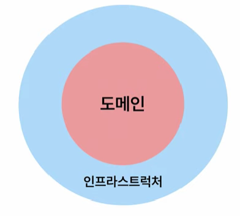
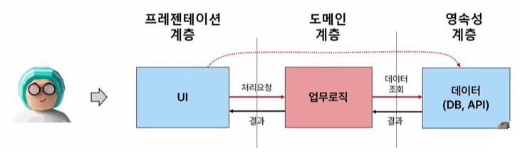
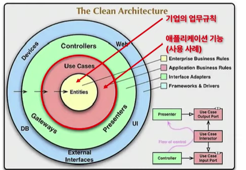
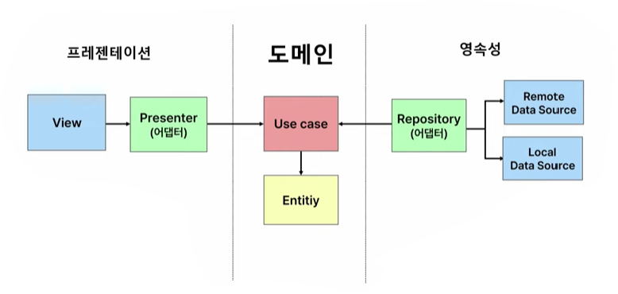
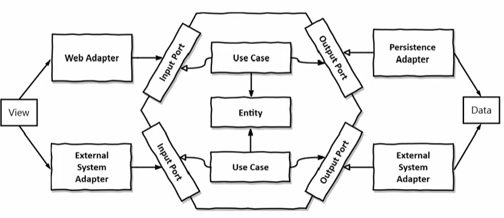

## 서론

---

### 소프트웨어 아키텍처의 목적

소프트웨어는 주기적으로 변경이 필요하다.

소프트웨어 요소 간 의존성이 복잡하게 얽혀있다면, 한 요소를 수정해야 한다면 다른 요소들까지 수정해주어야 한다.

즉, 변경하고자 하는 요소가 그와 연결된 개체에 연쇄적으로 영향을 끼치게 된다.

<aside>

💡 **소프트웨어 아키텍처의 목적**

소프트웨어를 **쉽게 변경할 수 있는 구조**로 설계해 유지보수를 쉽게 하기 위함.

</aside>

소프트웨어의 큰 구성은 다음과 같이 **도메인**과 **인프라 스트럭쳐**로 나눌 수 있다.

- 도메인은 소프트웨어의 소프트웨어를 통해 이루고자 하는 핵심적인 구성요소
  - 주문 접수 서비스라고 하면 주문을 접수하는 프로세스 또는 주문을 접수하는 정책 등이 해당된다.
- 인프라 스트럭쳐는 도메인을 소프트웨어로 제공하기 위한 나머지 구성요소
  - 데이터를 저장할 **DB**, 외부 서비스 **API**, 도메인을 화면에 표시할 **UI** 등이 해당된다.

도메인과 인프라 스트럭쳐 사이에는 많은 의존성이 연결되어 있다.

### 기존 계층형 아키텍처의 한계

- 데이터베이스 주도 설계를 유도함.
  - 영속성 계층에 존재하는 Entity와 Service가 서로 의존하게 되면서 도메인 계층과 영속성 계층이 강하게 결합된다. 결국 영속성 코드와 도메인 코드 둘 중 하나만 바꾸는 것이 어려워진다.
- 지름길을 택하기 쉬워짐.
  - 상위 계층에 접근할 수 없기 때문에, 하위 계층(영속성 계층)에서 어떤 상위 계층으로 접근해야 할 때 그 컴포넌트를 아래 계층으로 끌어내리는 경우가 많다. 이렇게 되면 영속성 계층이 비대해질 수 있다.
- 유스케이스(도메인 로직)을 숨김.
  - 도메인 로직이 계층 여기저기에 퍼져있고, 너무 많은 유스 케이스가 하나의 Service 안에 들어가게 되기 때문.
- 동시 작업이 어려움.
- 연쇄적인 참조관계
  - 영속성 레이어의 데이터를 변경하면 그 변경의 영향이 업무 로직, ui에까지 영향을 미친다.
  - 코드 변경이 어려워진다.
- 테스트하기 어려움
  - 업무로직을 테스트하기 위해서는 데이터(영속성 계층)가 준비되어 있어야 하는데, UI를 테스트하기 위해서는 업무 로직과 데이터가 준비되어 있어야 한다.(의존적) ⇒ **테스트를 위해 많은 준비가 필요하다.**
- 도메인 로직이 수시로 ui와 데이터 변경에 영향을 받는다.
  - 일반적으로 UI와 데이터의 변경이 빈번한데, 이 변경은 업무로직에 영향을 준다.

**우리는 소프트웨어의 가장 핵심적인 업무로직(도메인)을 잘 보호해야 한다.**

## 헥사고날 아키텍처(클린 아키텍처)

---

### 클린 아키텍처

이러한 문제를 해결하기 위해서는, **단일 책임 원칙**, **의존성 역전 원칙**의 2가지 규칙을 보장해야 한다.

1. 단일 책임 원칙 : 특정 컴포넌트를 변경하는 이유가 오직 하나 뿐이다.
2. 의존성 역전 원칙 : 의존 방향을 역전할 수 있다.(`웹 계층 ⇒ 도메인 계층 ⇒ 영속성 계층`의 일방적인 의존성 방향을 `웹 계층 ⇒ 도메인 계층 ⇐ 영속성 계층`으로 바꿀 수 있다.) 의존성을 역전시킨 최종적인 모습은 다음과 같다.

   `웹 계층⇒UseCase(인터페이스)⇐도메인⇒Port(인터페이스)}⇐영속성 계층`

다음 그림은 앞서 언급된 문제가 보완된 **클린 아키텍쳐**의 모습이다.

계층형 아키텍처와의 가장 큰 차이점은 **의존성의 방향**이다. 의존성이 안쪽으로 향하는데, 내부 구성요소 2개의 원은 비즈니스 규칙(도메인)을 정의한다.

- **Entities**는 전사적인 업무 규칙이고,
- **Use Cases**는 사용자가 어플리케이션을 어떻게 사용할 수 있을지 사용 사례를 정의한다.

바깥 2개의 원은 안쪽 요소들에 정의된 업무 규칙을 어떻게 보여주고 저장하는지를 정의한다.(인프라 스트럭쳐)

바깥쪽의 화면/데이터 등 하부 세부사항들이 안쪽의 고수준 정책을 **단방향**으로 의존한다. 이렇게 하면 바깥쪽 요소가 변경되더라도 안쪽의 고수준 정책은 영향을 받지 않게 된다.

소프트웨어의 도메인과 업무 정책을 보호하고 집중할 수 있다는 것이 클린 아키텍처의 핵심.

<aside>

💡 **클린 아키텍처를 적용한 계층형 아키텍처**

인터페이스를 통해 의존성이 역전되었다.

</aside>

### 헥사고날 아키텍처

헥사고날 아키텍처는 클린 아키텍처의 구현 방법을 구체화한 아키텍처로, 핵심 업무 규칙이 육각 구조 내부에 위치한다.(외부의 변화로부터 보호받음)

육각 구조는 포트 인터페이스로 구성되어 있는데, 각각 어댑터에서 들어오는 입력을 받거나 비즈니스 처리 결과를 저장한다.

- 헥사고날 아키텍처의 장점
  - 의존성의 방향이 안쪽으로만 향하고 있기 때문에 외부의 변경에 영향을 받지 않는다.

### 헥사고날 아키텍처의 구성요소

1. Use Case(`OOOService` 클래스)

   **Service 계층**에 속하며, Input Port 인터페이스를 구현한 **Service**.

   Use Case는 각 비즈니스 로직을 가지고 검증한다.

   \*입력 유효성 검증을 하지 않는다. 오직 비즈니스 로직에만 집중한다.

   Web Adaptor에 모든 입력 유효성 검증을 맡기기엔 검증의 신뢰도가 낮아질 수 있기 때문에, 서비스로 전달할 입력 모델을 두는 것이 좋다. 이 입력모델을 통해 입력 유효성 검증을 진행할 수 있다.

2. Input Port(`OOOUseCase` 인터페이스)

   **Service 계층**에 속하며, Web Adaptor가 코어에 진입할 때의 진입점이 되는 **인터페이스**이다.

   여기서 Web Adaptor와 코어 사이에 인터페이스를 두어 의존성 역전을 시키는 데에는 다음의 2가지 이유가 있다.

   - 새로운 개발자가 진입점을 식별하기 쉬워진다.
   - 아키텍처를 강제하기 쉽다.
     - 코어(Service)를 package-private로 설정하면 WebAdaptor에서는 Input Port를 통해서만 코어에 접근할 수 있게 된다.

3. Web Adapter(`OOOController` 클래스)

   **Web 계층**에 속하는 **컨트롤러**다. HTTP 요청을 자바 객체로 매핑하고 유스케이스의 반환 값을 HTTP로 매핑해서 응답을 반환한다.

   어떠한 도메인 로직도 가지고 있지 않으면서, HTTP와 자바 객체의 매핑에 초점을 맞추는 Adaptor 역할에 초점을 맞춰야 한다.

4. Output Port(`OOOPort` 인터페이스)

   Service 계층에 속하며, Persistence Adapter가 구현하는 인터페이스이다.

   도메인과 영속성 간의 의존성 역전을 위해 등장한 인터페이스로, Service는 이 Output Port를 호출하여 Persistence Adapter와 데이터를 주고 받는다.

   Output Port는 원칙적으로 Service 계층이지만 Service 계층과 영속성 계층 사이의 간접 계층으로도 볼 수 있다.

5. Persistence Adapter(`OOOAdaptor` 클래스)

   도메인 데이터(도메인 엔티티 또는 값객체)와 영속성 엔티티를 매핑한다.

### (부록)패키지 분류 방법

헥사고날 아키텍처의 일반적인 패키지 분류 방법은 다음과 같다.

1. 먼저 관심사 별로 크게 패키지를 나눈다.(studylog, roadmap, login 등)
2. adapter와 service 패키지를 분류한다.
3. adapter 패키지를 input/output으로 나누어 Web Adapter와 Persistence를 분류한다.
4. service 패키지를 UseCase/port로 나누고, port는 input과 output으로 다시 나눈다.

## 참고 자료

---

[[우아한테크코스 5기] 레벨2 - 계층형 아키텍처 vs 헥사고날 아키텍처](https://tjdtls690.github.io/studycontents/java/2023-05-22-hexagonal_architecture/)

[기획자님들! 개발자가 아키텍처에 집착하는 이유, 쉽게 알려드립니다 #우아콘2022 #Day1\_일상의행복을배달하기위해](https://www.youtube.com/watch?v=saxHxoUeeSw&list=LL&index=1)
