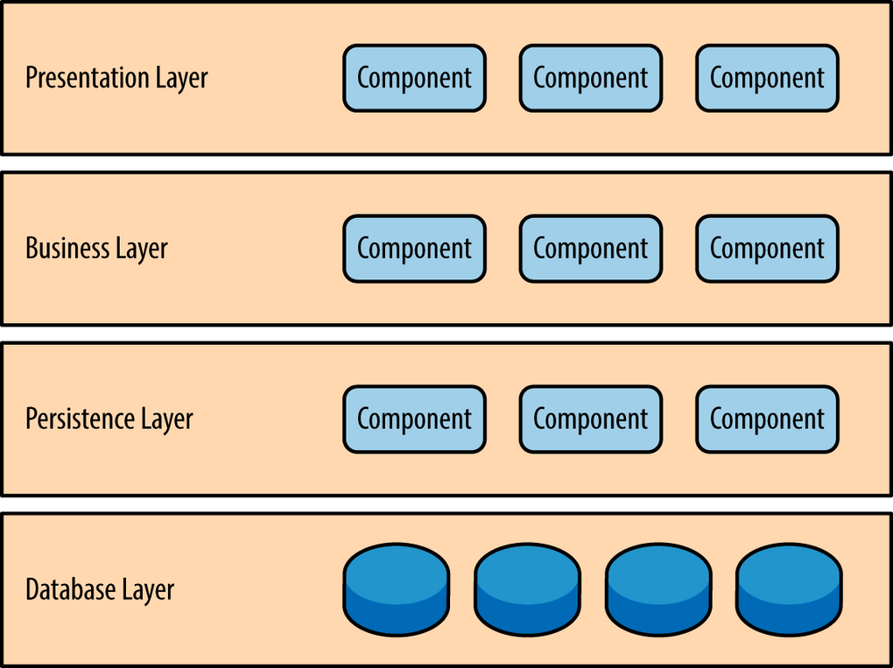

# 기본 개념

---

## Layered Architecture란?

소프트웨어를 여러 개의 계층으로 분리하여 설계하는 방법.

- 소프트웨어 개발에서 가장 일반적으로 널리 사용되는 구조(디자인 패턴)이다.
- 구성하는 계층의 숫자에 따라 N 계층화 구조(N-tier Architecture)라고도 한다.
- 각 계층은 어플리케이션 내에서 가지는 역할과 관심사(화면 표시, 비즈니스 로직 수행, DB 작업 등)별로 구분된다.
  - **관심사의 분리(Seperation of Concern)** : 특정 계층의 구성요소는 해당 계층에 관련된 기능만 수행한다.
    - 장점 : 높은 유지보수성, 쉬운 테스트

## 4-Tier Layered

Layered Architecture 패턴에서 구성 레이어의 개수나 각 레이어의 유형을 지정하고 있지는 않지만 일반적인 경우 다음과 같은 4가지 유형의 레이어로 구분한다.

### Presentation Layer

클라이언트(사용자)가 데이터를 전달하기 위해 **화면에 정보를 표시**하는 것을 주 관심사로 둔다. 해당 레이어는 **비즈니스 로직이 어떻게 수행되는지 알 필요가 없다**.

- 주요 역할 : 사용자의 입력 값 검증, 비즈니스 로직에 따른 결과 표시(로직 처리를 하는 것이 아님)
- 대표적인 구성요소로 `View`와 `Controller`가 있다.

<aside>
🍃 Spring AOP를 사용하여 로깅, 트랜잭션 처리 등의 공통 로직을 처리할 수 있고 Spring Batch를 사용해 대용량 데이터 처리를 수행할 수 있다.

</aside>

### Business Layer

**비즈니스 로직을 수행**하는 것을 주 관심사로 둔다. 마찬가지로 화면에 데이터를 출력하는 방법이나 데이터를 어디서 어떻게 가져오는지에 대한 내용은 알고 있지 않다.

Persistence Layer에서 데이터를 가져와 비즈니스 로직을 수행하고 그 결과를 Presentation Layer로 전달하면 된다.

- 주요 역할 : 데이터의 유효성 검증, 엔티티 간의 관계 처리, 비즈니스 로직 수행
- 대표적으로 `Service`와 `Domain Model` 등이 있다.
- 경우에 따라 Service와 Domain Model을 별개의 계층으로 나누거나, Domain Model을 Layered Architecture와 별개의 것으로 분리하는 경우도 있다.
  
  

<aside>
🍃 Spring Data JPA를 사용해 ORM(Object-Relational Mapping)을 구현할 수 있고 Spring Data Redis를 사용해 Redis와 상호작용할 수 있다.

</aside>

### Persistence Layer

어플리케이션의 영속성을 구현하기 위해, 데이터의 출처와 **그 데이터를 가져오고 다루는 것**을 주 관심사로 둔다.

- 주요 역할 : 시스템의 기술적인 문제 해결, 데이터의 영속성 보장
- 대표적인 구성요소로 `Repository`, `DAO`가 있다.

<aside>
🍃 Spring JDBC를 사용해 JDBC를 쉽게 사용할 수 있고, Spring Messaging을 사용해 메시징 시스템과 상호작용할 수 있다.

</aside>

### Database Layer

MySQL, MariaDB, PostgreSQL, MongoDB 등 **데이터베이스가 위치한 계층**을 의미한다.

---

## 정리

Layered Architecture의 핵심적인 내용 2가지를 정리해보면 다음과 같다.

<aside>
💡 이 구조에서 특정 레이어는 바로 하위 레이어에만 연결되어야 한다.

</aside>

Layered Architecture에서 각각의 나뉘어진 수평 계층은 수직적으로 배치된다.

만약 Presentation Layer에서 바로 Database Layer에 연결해서 정보를 가져오면 어떻게 될까?

Presentation Layer에서 직접 데이터베이스에 접속하여 데이터를 가져오게 되면, SQL에 대한 변경사항이 Presentation Layer에 직접 영향을 미친다. 즉 **과도한 의존성이 발생**하게 되고, 어플리케이션의 변경을 매우 어렵게 만든다.

<aside>
💡 Layered Architecture에서 각 레이어는 격리되어 있다(관심사의 분리).

</aside>

때문에 각 계층은 **캡슐화**되어 있고 **단일 책임을 갖는다**는 장점을 가진다.

# 적용 사례

---

우테코에서 레벨 1 때 진행했던 자동차 경주 미션(자바)의 결과물의 구성 요소들은 다음과 같은 구조를 가진다.(이미지 출처 - 우테코 강의 자료)

> `Application`, `Controller`, `View`, `Domain`

레벨 2에서 진행한 웹 자동차 경주 미션(스프링)은 기존 자동차 미션에 웹 기능이 더해져 다음과 같은 구조가 되었다.

> `(Web)Application`, `(Web)Controller`, `JDBCDao`가 추가되었다.

여기에서 콘솔과 웹의 컨트롤러 코드에서 중복되는 코드가 발생했다.

중복 코드를 제거해주기 위해 DAO 인터페이스를 구현하여 별개의 계층으로 **추상화**했다.

남은 중복코드 역시 제거하기 위해 Service 객체를 만들어 추상화하였다.

최종적으로 객체들을 계층별로 분류하면 다음과 같이 나타낼 수 있다.

## 싱크홀 안티패턴이란?

특정 레이어가 아무런 로직도 수행하지 않고 들어온 요청을 그대로 다시 하위 레이어로 내보내는 경우를 의미.

이러한 흐름은 불필요한 리소스 낭비를 초래한다. 전체 흐름 중 20%정도가 싱크홀이라면 그럭저럭 나쁘지 않은 수준이라고 한다.

# 참고 자료

---

[계층화 아키텍처 (Layered Architecture)](https://hudi.blog/layered-architecture/)

[[Spring] 레이어드 아키텍처(Layered Architecture): 독립적으로 계층을 설계해보자!](https://engineerinsight.tistory.com/63)
