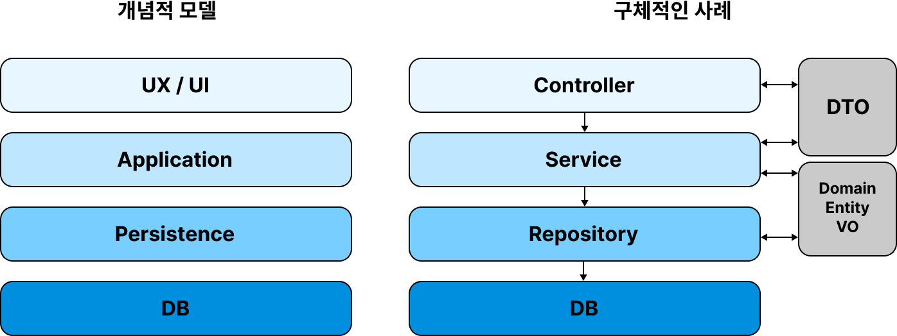
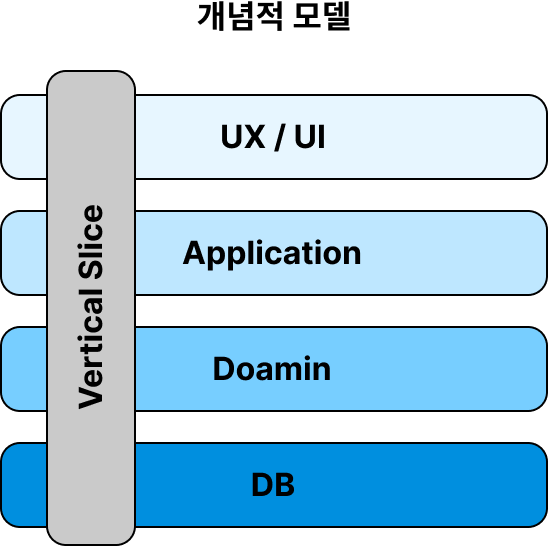

## 들어가며

---

이번에 방문했던 유스콘 2023의 **_“복잡함은 끝, 간결함의 시작: 버티컬 슬라이스 아키텍처”_** 세션에서 버티컬 슬라이스 아키텍처를 처음 접하게 되었다.

레이어드 아키텍처만 사용해온 내가 보기엔 꽤나 흥미로운 아키텍처였기에 더 알아보면서 정리해보기로 하였다.

## 버티컬 슬라이스 아키텍처

---

### 기존의 아키텍처 - 레이어드 아키텍처

기존의 레이어드 아키텍처에서는 다음과 같이 계층이 나누어져 있다.



이 레이어드 아키텍처를 비롯한 Onion, Clean 아키텍처 등은 한 가지 문제점을 가지고 있는데, 바로 서비스의 규모가 커지고 복잡해질 때 유연하게 대처하기 어렵다는 것이다.

그래서 변경이 잦고 안정화되지 않은 서비스에서는 사용하기 어렵다.

### 버티컬 슬라이스 아키텍처

버티컬 슬라이스 아키텍처는 애플리케이션 코드를 계층이 아니라 기능 별로 분리한 아키텍처이다.

기존 레이어드 아키텍처와 비교했을 때, 아래와 같이 모든 계층을 아우르는 버티컬 슬라이스(Feature)를 둔 것으로 이해하면 된다.



각 버티컬 슬라이스는 UI, Application, Persistence 등 특정 기능을 구현하는데 필요한 모든 코드가 포함된 독립적인 모듈이다.

이 버티컬 슬라이스들은 각각 독립적으로 분리된 요소이기 때문에 요구사항에 수정사항이 생겼을 때 변경사항을 반영하기도 용이하다.

실제 버티컬 슬라이스 아키텍처를 도입한 프로젝트의 Feature 클래스의 코드는 다음과 같이 구성이 된다.

코드 참고 - 유스콘 2023 연사 이중석님 Github

```java
@RestController
@RequiredArgsConstructor
public class CreateBook {
		private final BookRepository bookRepository;

		@Transactional
		@PostMapping("/books")
		public void saveBook(@RequestBody Request request) {
				Book book = request.toDomain();
				bookRepository.save(book);
		}

		private record Request(String title, String author){
				public Book toDomain(){
						return new Book(title, author);
				}
		}
}
```

여기서 눈여겨 볼 점은 **컨트롤러와 서비스 계층 로직을 하나의 Feature 클래스에 둔다**는 것이다.

때문에 컨트롤러 메서드에 `@Transactional` 어노테이션이 붙어있다.

이렇게 만든 **Feature 클래스는 Persistence 계층(Repository)과 소통하며 하나의 기능을 수행**한다.

그 다음으로 눈에 들어오는 점은 Feature 클래스 명이 동사라는 것(CreateBook)과, DTO가 이너 클래스로 정의되어 있다는 것이다.

앞서 설명한 대로 하나의 Feature가 하나의 기능을 구현하기 위한 계층 요소를 모두 포함하고 있는 것을 확인할 수 있다.

하지만 꼭 이렇게 하나의 파일에 모아두지 않고 하나의 폴더(패키지)에 모아서 구현해도 된다. 아키텍처가 모두 그렇긴 하지만, 버티컬 슬라이스 아키텍처를 적용한 프로젝트를 찾아 검색해보니 구현 방법이 매우 다양했다.

핵심은 하나의 기능을 구현하기 위한 계층 요소들을 한 데 모아둔다는 것이다.

### 버티컬 슬라이스 아키텍처가 가지는 장/단점

- 장점

  1. 낮은 결합도

     : 하나의 기능을 구현하는 데 하나의 슬라이스에만 초점을 맞추게 되므로 기능 간 결합도를 줄일 수 있다. 이는 요구사항 변경에 유연하게 대처할 수 있다는 의미와 같다.(유지보수성 향상)

  2. 테스트하기 용이하다.

     : 각 슬라이스엔 특정 기능을 구현하는 데 필요한 모든 코드가 포함되어 있기 때문에 기능의 모든 측면을 포괄하는 자동화된 테스트를 더 쉽게 작성할 수 있다.

- 단점

  1. 초기 개발 시간 증가

     : 버티컬 슬라이스 아키텍처를 구현하기 위해선 모든 계층을 아우르는 모듈을 생성하고 나머지 시스템과 연결해야 하기 때문에 사전 설계와 초기 개발에 더 많은 시간이 든다.

  2. 복잡성 증가

     : 관리/유지보수해야 할 모듈이 많아지기 때문에 시스템 전반적인 복잡성이 증가할 수 있다.

### 버티컬 슬라이스 아키텍처를 사용할 때의 주의사항

Controller에서 DB에 바로 접근할 수 있기 때문에, DB 중심 개발이 되지 않도록 주의해야 한다.

DB 중심 개발이 되면 비즈니스 로직이 한 눈에 보이지 않고 테스트하기가 어려워진다.

## 마무리

---

버티컬 슬라이스 아키텍처가 가지는 특징을 살펴보고 정리해보니, 변경이 잦은 레거시 프로젝트나 작은 규모의 조직에 도입하기 적합할 수 있을 것 같다.

추후 작은 개인 프로젝트를 할 때 버티컬 슬라이스 아키텍처를 적용해볼 생각이다.

그 때가 되면 실습편으로 따로 포스팅을 해보겠다.

## 참고 자료

---

[Vertical Slice Architecture in ASP.NET Core - Code Maze](https://code-maze.com/vertical-slice-architecture-aspnet-core/)

[What is Vertical Slice Architecture?](https://www.linkedin.com/pulse/what-vertical-slice-architecture-haider-raza-awan/)
