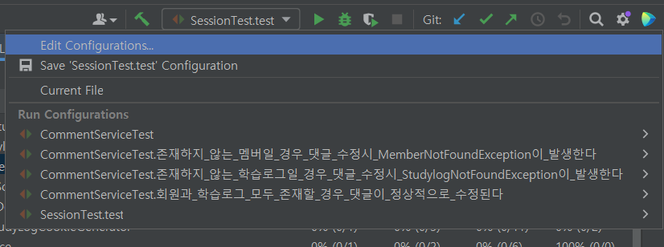
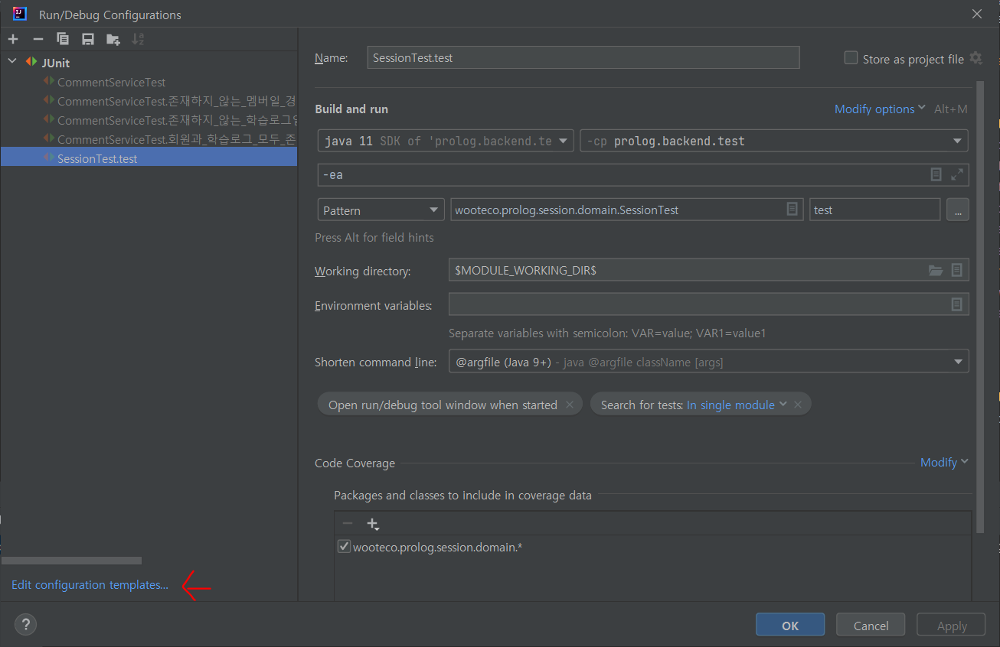
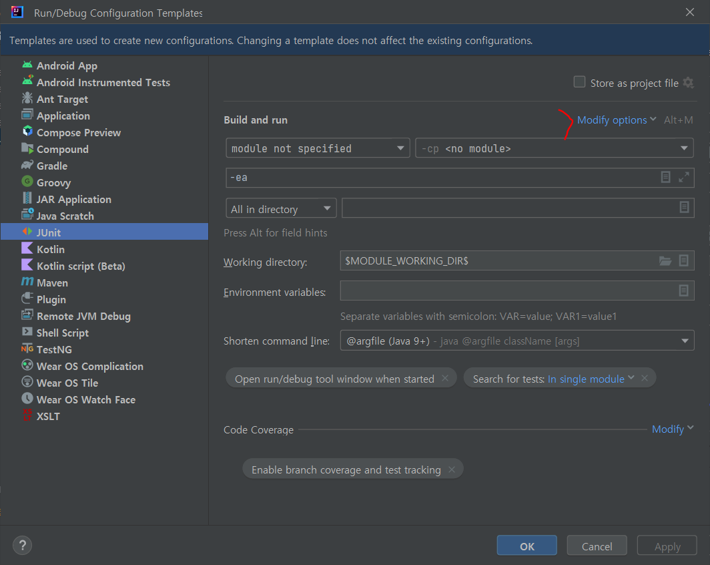
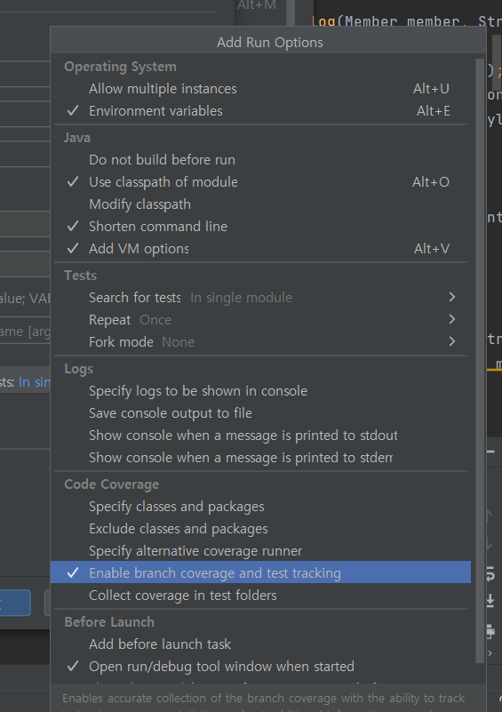
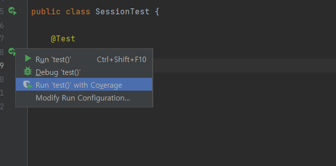
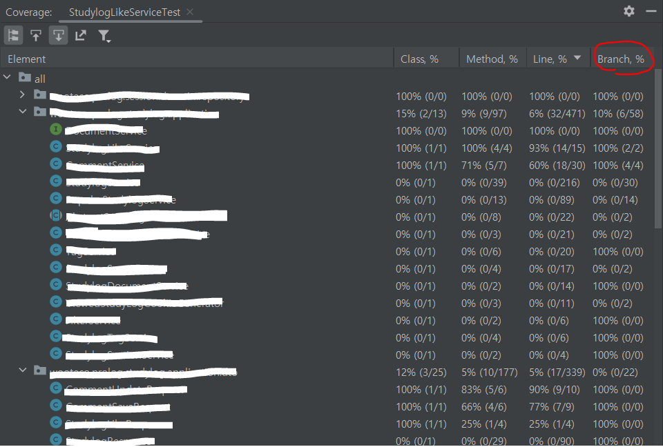

# 코드 커버리지

---

코드 커버리지란 테스트 코드가 프로덕션 코드를 얼마나 실행했는지를 백분율로 나타내는 지표이다.

코드 커버리지를 통해 현재 작성된 테스트 코드의 수가 충분한 것인지 논의할 수 있다. 즉, 코드 커버리지는 테스트의 완전성을 측정할 수 있는 지표라고 볼 수 있다.

## 코드 커버리지의 측정 방법

테스트 방식은 크게 블랙박스 테스트(Blackbox Testing)와 화이트박스 테스트(Whitebox Testing)으로 분류된다.

코드 커버리지는 소스 코드를 기반으로 수행하는 **화이트 박스 테스트**를 통해 측정한다.

<aside>
💡 블랙박스 테스트(Black-box test)

</aside>

- 소프트웨어의 **내부 구조나 작동 원리를 모르는 상태**에서 동작을 검사하는 방식
- 올바른 입력과 올바르지 않은 입력을 입력하여 **올바른 출력이 나오는지 테스트**하는 기법이다.
- **사용자 관점**의 테스트 방법.

<aside>
💡 화이트박스 테스트(White-box test)

</aside>

- 소프트웨어의 내부 구조와 동작을 검사하는 방식
- 소프트웨어 **내부 소스코드를 테스트**하는 기법
- **개발자 관점**의 단위 테스트 방법.

## 코드 커버리지의 측정 기준

코드 커버리지의 측정 기준은 다음과 같은 종류가 있다.

- 함수(Function)
- 구문(Statement)
- 결정(Decision)
- 조건(Condition)
- 조건/결정(Condition/Decision)

### 함수 커버리지(Function Coverage)

함수가 최소 한 번 이상 호출된다면 충족된다.

함수 내부의 모든 코드가 실행되었는지는 판단 기준에서 제외된다.

```java
public void a() {
  // ...
}

public void b() {
  // ...
}

public void c() {
  // ...
}

public void d() {
  // ...
}
```

위와 같이 4개의 함수가 있고, 테스트코드가 `a()`와 `b()`만을 실행한다면 4개 중 2개의 함수를 실행하였으므로 함수 커버리지는 `2/4=50(%)`가 된다.

### 구문 커버리지(Statement Coverage)

<aside>
💡 라인(Line) 커버리지라고도 한다.

</aside>

**코드 한 줄이 한 번 이상 실행**된다면 충족된다. 때문에

```java
void foo (int x) {
    system.out("start line"); // 1번
    if (x > 0) { // 2번
        system.out("middle line"); // 3번
    }
    system.out("last line"); // 4번
}
```

위 프로덕션 코드를 테스트하기 위해 `x=-1`을 테스트 케이스로 사용한다고 하자. 이 경우 3번째 라인의 코드가 실행되지 않기 때문에 총 4개의 라인 중 3개의 라인만 실행되므로 구문 커버리지는 `3/4*100=75(%)`로 계산할 수 있다.

### 결정 커버리지(Decision Coverage)

<aside>
💡 브랜치(Branch) 커버리지라고도 한다.

</aside>

**모든 조건식이 true/false**를 가지게 될 경우 충족된다.

```java
void foo (int x, int y) {
    system.out("start line"); // 1번
    if (x > 0 && y < 0) { // 2번
        system.out("middle line"); // 3번
    }
    system.out("last line"); // 4번
}
```

위 코드에서 true/false를 모두 가질 수 있는 테스트 케이스로 `x=1, y=-1`, `x=-1, y=1`이 있다. 첫번째 테스트 케이스는 if문의 조건에 대해 true를 반환하고, 두 번째 테스트 케이스는 if문의 조건에 대해 false를 반환한다.

### 조건 커버리지(Condition Coverage)

모든 조건식의 **내부 조건이 true/false**를 가지게 될 경우 충족된다.

```java
void foo (int x, int y) {
    system.out("start line"); // 1번
    if (x > 0 && y < 0) { // 2번
        system.out("middle line"); // 3번
    }
    system.out("last line"); // 4번
}
```

위 코드에서 2번째 줄의 조건식에 2개의 내부 조건을 가지고 있기 때문에, 이 코드의 조건 커버리지를 100%로 만들기 위해서는 `x>0`와 `y<0` 각각이 참/거짓이 되는 테스트 케이스를 만들어주어야 한다.

가령 `x = 1, y = 1`, `x = -1, y = -1` 두 개의 테스트 케이스를 만들어주면 `x>0` 내부조건에 대해 true/false를 만족하고, `y<0` 내부 조건에 대해서도 false/true를 만족하기 때문에 조건 커버리지를 100% 만족하게 된다.

조건 커버리지를 기준으로 테스트를 진행할 경우 구문 커버리지와 결정 커버리지를 만족하지 못하는 경우가 존재할 수 있다. 당장 위 예시만 봐도, 2개의 테스트케이스 모두 2번째 줄의 조건식이 false가 되기 때문에(결정 커버리지 불만족) 3번째 줄이 실행되지 않는다(구문 커버리지 불만족).

⚠️조건문이 존재하지 않는 코드의 경우 결정 커버리지와 조건 커버리지의 대상에서 아예 제외된다.(테스트를 하지 않는다)

### 조건/결정 커버리지(Condition/Decision Coverage)

조건 커버리지와 결정 커버리지를 모두 만족할 때 충족되는 조건이다.

즉, 내부 조건과 조건문 자체 모두 한 번씩 true/false가 만족되어야 한다.

```java
void foo (int x, int y) {
    system.out("start line"); // 1번
    if (x > 0 && y < 0) { // 2번
        system.out("middle line"); // 3번
    }
    system.out("last line"); // 4번
}
```

위 코드에서 조건/결정 커버리지를 100% 만족시키기 위해선 다음 2가지의 테스트케이스가 필요하다. `x=1, y=-1`, `x=-1, y=1`

# IntelliJ 세팅하기

---

IntelliJ에서 클래스의 결정 커버리지(이하 브랜치 커버리지로 서술)를 확인하는 방법은 다음과 같다.



아무 테스트를 실행시키고, 화살표를 클릭하여 [Edit Configurations…]를 클릭한다.



나오는 창에서 좌측 하단에 있는 [Edit configuration templates…]를 클릭한다.



자신이 사용하고 있는 테스트 환경을 선택하고, 우측 상단에 있는 [Modify options]를 클릭한다.



그럼 위와 같은 팝업이 뜰텐데, Code Coverage의 Enable branch coverage and test tracking를 클릭해 브랜치 커버리지를 확인할 수 있도록 활성화해주고 Apply를 클릭해 변경사항을 저장해준다.



그리고 테스트를 실행할 때 Run ‘테스트’ with Coverage를 선택해서 테스트를 수행해주면



이렇게 클래스들의 브랜치 커버리지를 포함한 다양한 코드 커버리지 정보를 확인할 수 있다.

## 참고 자료

---

[코드 커버리지(Code Coverage)란?](https://hudi.blog/code-coverage/)

[코드 분석 도구 적용기 - 1편, 코드 커버리지(Code Coverage)가 뭔가요?](https://velog.io/@lxxjn0/코드-분석-도구-적용기-1편-코드-커버리지Code-Coverage가-뭔가요)

[Whitebox Testing 과, Blackbox Testing 차이](https://jwprogramming.tistory.com/281)
