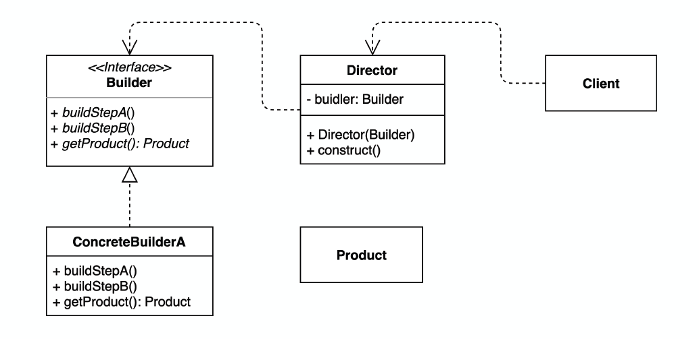

**Builder - 복잡한 인스턴스 조립하기**

building은 구조를 가진 커다란 건축물을 의미한다.

구조를 가지고 있는 커다란 것을 건축하거나 구축하는 것을 build라고 하며, 빌딩을 세울 때 과정은 다음과 같다.

지반을 다진다→골격을 세운다→아래에서부터 위로 조금씩 만들어간다

일반적으로 복잡한 구조물을 세울 때 한 번에 완성하기는 어렵다. 때문에 전체를 구성하고 있는 **각 부분을 만들고 단계를 밟아 만들어나간다.**

빌딩의 건축 과정처럼 **복잡한 구조를 가진 객체를 생성하기 위해** 차츰 쌓아올리는 것이 빌더 패턴의

핵심이다.

디자인 패턴 중 **생성** 패턴에 속하는 패턴이다.

## 정의

---

> 복합 객체의 생성 과정과 표현 방법을 분리하여 동일한 생성 절차에서 서로 다른 표현 결과를 만들 수 있게 하는 패턴
>
> -GoF의 디자인 패턴(144p)

## 활용 예시(feat. [Java 언어로 배우는 디자인패턴 입문] 120p 예제)

---

> **문서**를 작성하는 프로그램을 만들어보자.

문서는 다음과 같은 구조를 가지고 있다.

1. **타이틀**을 한 개 포함한다.
2. **문자열**을 몇 개 포함한다.
3. **개별 항목**을 몇 개 포함한다.

추상 클래스 `Builder`에서는 문서를 구성하기 위한 메소드를 결정하고, `Director` 클래스는 그 메소드를 사용하여 하나의 (구체적인)문서를 만든다.

`Builder`의 하위 클래스들이 문서 작성을 위한 **구체적인 처리**를 결정한다.

- `TextBuilder` : 플랜텍스트(일반적인 문자열)를 사용하여 문서를 만든다.
- `HTMLBuilder` : HTML을 사용해서 문서를 만든다.

Director가 TextBuilder를 사용하면 일반 텍스트의 문서가 만들어지고, HTMLBuilder를 사용하면 HTML 문서가 만들어진다.

- Builder 클래스
  문서를 만들 메소드들을 선언하고 있는 추상 클래스.
  ```java
  public abstract class Builder {
      public abstract void makeTitle(String title);   //문서의 타이틀을 만든다.
      public abstract void makeString(String str);   //문서의 문자열을 만든다.
      public abstract void makeItems(String[] items);   //문서의 개별 항목을 만든다.
      public abstract void close();   //문서를 완성시킨다.
  }
  ```
- Director 클래스
  Builder에 정의된 메서드를 사용해서 문서를 구축한다. Director의 생성자에 주입된 Builder 구현 객체에 따라 Director 클래스가 만들 구체적인 문서의 형식이 결정된다.

  ```java
  public class Director {
      private Builder builder;
      public Director(Builder builder){   //builder 객체 주입
          this.builder=builder;
      }

      public void construct(){    //문서 구축
          builder.makeTitle("Greeting");      //타이틀
          builder.makeString("아침과 낮에");   //문자열
          builder.makeItems(new String[]{     //개별 항목
              "좋은 아침입니다.",
              "안녕하세요.",
          });
          builder.makeString("밤에");       //별도의 문자열
          builder.makeItems(new String[]{ //별도의 개별 항목
              "안녕하세요.",
              "안녕히 주무세요.",
              "안녕히 계세요.",
          });
          builder.close();    //문서 완성
      }
  }
  ```

- TextBuilder 클래스
  Builder 클래스를 상속받는 구현 클래스로, 일반 텍스트를 사용해서 문서를 구축하고 결과는 String으로 반환한다.

  ```java
  public class TextBuilder extends Builder {

      private StringBuffer buffer = new StringBuffer();   //필드의 문서를 구축한다.

      @Override
      public void makeTitle(String title) {
          buffer.append("========================\n");
          buffer.append("<" + title + ">\n");
          buffer.append("\n");
      }

      @Override
      public void makeString(String str) {
          buffer.append("- " + str + ">\n");
          buffer.append("\n");
      }

      @Override
      public void makeItems(String[] items) {
          for (int i = 0; i < items.length; i++) {
              buffer.append("    * " + items[i] + "\n");
          }
          buffer.append("\n");
      }

      @Override
      public void close() {
          buffer.append("========================\n");
      }

      public String getResult() {
          return buffer.toString();
      }
  }
  ```

- HTMLBuilder 클래스
  Builder 클래스를 상속받는 구현 클래스로, HTML 파일로 문서를 구축한다. 구축한 결과는 HTML 파일의 파일명으로 반환한다.

  ```java
  public class HTMLBuilder extends Builder {

      private String filename;
      private PrintWriter writer;

      @Override
      public void makeTitle(String title) {
          filename = title + ".html";
          try {
              writer = new PrintWriter(new FileWriter(filename));
          } catch (IOException e) {
              e.printStackTrace();
          }
          writer.println("<html><head><title>" + title + "</title></head><body>");
          writer.println("<h1>" + title + "</h1>");
      }

      @Override
      public void makeString(String str) {
          writer.println("<p>" + str + "</p>");
      }

      @Override
      public void makeItems(String[] items) {
          writer.println("<ul>");
          for (int i = 0; i < items.length; i++) {
              writer.println("<li>" + items[i] + "</li>");
          }
          writer.println("</ul>");
      }

      @Override
      public void close() {
          writer.println("</body></html>");
          writer.close();
      }
      public String getResult(){
          return filename;
      }
  }
  ```

- Main 클래스
  Builder 패턴의 테스트 프로그램.
  ```java
  Builder builder;
  if(args[0].equals("plain")){
  		builder=new TextBuilder();
  }else if(args[0].equals("html")){
  		builder=new HTMLBuilder();
  ...
  Director director=new Director(builder);
  director.construct();
  String result=builder.getResult();
  System.out.println(result);
  ...
  ```

Director는 실제로 동작하는 것이 TextBuilder인지 HTMLBuilder인지 모른다.

## Builder 패턴의 구성요소

---



**Builder(건축자)**

: 인스턴스 생성을 위한 인터페이스(API)를 결정한다. 인스턴스의 각 부분을 만들기 위한 메서드가 준비되어 있다.

**ConcreteBuilder(구체적인 건축자)**

: Builder 역할의 인터페이스(API)를 실제로 구현하는 역할. 실제 인스턴스를 작성할 때 호출되는 메서드가 여기에서 정의된다.

**Director(감독자)**

: Builder 역할의 인터페이스(API)를 사용해서 인스턴스를 생성한다. **ConcreteBuilder 역할에 의존하지 않는다.** Builder 클래스에 정의된 메서드만을 호출한다.

**Client(의뢰인)**

Builder 패턴을 이용하는 역할. 예제에서는 Main 클래스가 이에 해당한다.

**Product(제품)**

: Builder 패턴을 이용해서 만들고자 하는 복합 객체. 예제의 ‘문서’에 해당하는데, 이해를 위해 따로 객체로서 정의해주진 않았다.

## Builder 패턴의 특징

---

### 누가 무엇을 알고 있어야 하는가?

Director 클래스는 Builder 클래스의 구체적인 하위 클래스에 대해 모른다. 그렇기 때문에 구현 클래스 간 교체가 용이하다.

**\*전략 패턴**에서 보았던 장점과 동일함!\*

### 설계 시에 결정할 수 있는 것과 결정할 수 없는 것

Builder 클래스는 문서를 구축할 때 필요한 메서드들을 선언해야 한다. Builder 클래스는 앞으로 늘어날 수도 있는 Builder 클래스의 하위 클래스들의 요구에도 대응할 수 있어야 하므로, 가까운 미래에 발생할 수 있을 것으로 예상되는 변화에 적응할 수 있도록 설계해야 한다.

### 장점

- 제품에 대한 내부 구현을 다양하게 할 수 있다.
  - Builder 패턴을 사용하면, 객체가 어떤 요소에서 복합되고 각 요소들의 표현 방법이 어떻게 되는지를 가릴 수 있다. 즉, 어떤 요소로 전체 객체를 복합하고 그 요소들이 어떤 타입들로 구현되는지를 알고 있는 것은 Builder 객체 뿐이다.
- 생성과 내부 구현에 필요한 코드를 분리할 수 있다.
  - 복합 객체의 생성 과정과 복합 객체의 내부 구현 방법을 별도의 모듈로 정의할 수 있다. 사용자는 객체의 내부 구조를 정의한 클래스를 모르는 상태에서 Builder 객체와의 상호작용을 통해 필요한 복합 객체를 생성할 수 있다.
- 복합 객체를 생성하는 절차를 좀 더 세밀하게 나눌 수 있다.
  - Builder 클래스의 인터페이스에 복합 객체를 생성하는 과정 자체가 반영되어 있다.

<br/>

- 활용성
  - 복합적인 구조를 가진 객체를 생성하는 알고리즘이 이를 합성하는 방법에 대해 독립적일 때
  - 합성한 객체들의 표현이 서로 다르더라도 생성 과정에서 이를 지원해야 할 때
- 관련 패턴
  - Template Method 패턴 : Builder 패턴에서는 Director 클래스가 Builder 클래스를 제어하는 반면, Template Method 패턴에서 상위 클래스가 하위 클래스를 제어한다.
  - Composite 패턴 : Builder 패턴에 의해 만들어진 생성물이 Composite패턴이 되는 경우가 있다.
  - Abstract Factory 패턴 : Builder 패턴과 Abstract Factory 패턴 모두 복잡한 인스턴스를 생성한다.
  - Facade 패턴 : Builder 패턴의 Director 클래스의 역할은 Builder 클래스의 복잡한 메서드를 조합해서 인스턴스를 구축하는 단순한 인터페이스를 외부에 제공하는 것. Facade 패턴의 Facade는 내부 모듈을 조합해서 작업하기 위한 단순한 인터페이스(API)를 외부에 제공한다.

## 부록

---

앞서 서술한 빌더 패턴 예제는 추상화 계층을 분리해주는 데 초점이 맞춰져 있었다.

좀 더 현실적인 빌더 패턴 적용 예를 봐보자.

일반적으로 자바와 같은 객체 지향 프로그래밍 언어에서 Builder 패턴을 사용한다고 하면, 다음과 같이 메소드 체이닝 기법을 도입하여 복합 객체를 생성한다.

<aside>
📝 <b>메소드 체이닝이란</b>

---

어떤 클래스의 메서드가 자기자신 즉 객체(this)를 반환하게 되면 반환된 그 객체를 통해 동일 클래스 내에 정의된 다른 메서드를 호출할 수 있다. 이런 호출 방식을 메소드 체이닝이라고 한다.

</aside>

- TourPlan(Product)

  ```java
  public class TourPlan {
      private String title; // 여행 제목
      private LocalDate startDate; // 출발 일
      private int nights; // 몇 박
      private int days; // 며칠
      private String whereToStay; // 어디서 머물지
      private List<DetailPlan> plans; // n일차 할 일

  		public TourPlan(String title, LocalDate startDate, int nights, int days,
      String whereToStay, List<DetailPlan> plans) {
  		    this.title = title;
  		    this.nights = nights;
  		    this.days = days;
  		    this.startDate = startDate;
  		    this.whereToStay = whereToStay;
  		    this.plans = plans;
  		}
  }
  ```

- TourPlanBuilder(Builder)

  ```java
  public interface TourPlanBuilder {

      TourPlanBuilder nightsAndDays(int nights, int days);

      TourPlanBuilder title(String title);

      TourPlanBuilder startDate(LocalDate localDate);

      TourPlanBuilder whereToStay(String whereToStay);

      TourPlanBuilder addPlan(int day, String plan);

      TourPlan getPlan();

  }
  ```

- DefaultTourBuilder(ConcreteBuilder)

  ```java
  public class DefaultTourBuilder implements TourPlanBuilder {

      private String title;

      private int nights;

      private int days;

      private LocalDate startDate;

      private String whereToStay;

      private List<DetailPlan> plans;

      @Override
      public TourPlanBuilder nightsAndDays(int nights, int days) {
          this.nights = nights;
          this.days = days;
          return this;
      }

      @Override
      public TourPlanBuilder title(String title) {
          this.title = title;
          return this;
      }

      @Override
      public TourPlanBuilder startDate(LocalDate startDate) {
          this.startDate = startDate;
          return this;
      }

      @Override
      public TourPlanBuilder whereToStay(String whereToStay) {
          this.whereToStay = whereToStay;
          return this;
      }

      @Override
      public TourPlanBuilder addPlan(int day, String plan) {
          if (this.plans == null) {
              this.plans = new ArrayList<>();
          }

          this.plans.add(new DetailPlan(day, plan));
          return this;
      }

      @Override
      public TourPlan getPlan() {
          return new TourPlan(title, startDate, days, nights, whereToStay, plans);
      }
  }
  ```

- TourDirector(Director)

  ```java
  public class TourDirector {

      private TourPlanBuilder tourPlanBuilder;

      public TourDirector(TourPlanBuilder tourPlanBuilder) {
          this.tourPlanBuilder = tourPlanBuilder;
      }

      public TourPlan cancunTrip() {
          return tourPlanBuilder.title("칸쿤 여행")
                  .nightsAndDays(2, 3)
                  .startDate(LocalDate.of(2020, 12, 9))
                  .whereToStay("리조트")
                  .addPlan(0, "체크인하고 짐 풀기")
                  .addPlan(0, "저녁 식사")
                  .getPlan();
      }

      public TourPlan longBeachTrip() {
          return tourPlanBuilder.title("롱비치")
                  .startDate(LocalDate.of(2021, 7, 15))
                  .getPlan();
      }
  }
  ```

- Main
  실제 사용 예시
  ```java
  public Main{
  		public static void main(String[] args) {
  		    TourDirector director = new TourDirector(new DefaultTourBuilder());
  		    TourPlan tourPlan = director.cancunTrip();
  		}
  }
  ```
- 장점
  - 필요한 데이터만 설정해줄 수 있다.
  - 유연성을 확보할 수 있다.(데이터의 순서에 상관없이 객체를 만들 수 있다.)
  - 가독성을 높일 수 있다.(값 설정 과정이 명시적이다)
  - 변경 가능성을 최소화할 수 있다.

<nav>

참고 자료

- Java 언어로 배우는 디자인 패턴 입문(144p)
- [부록의 예제코드 참조](https://dev-youngjun.tistory.com/197)

</nav>
