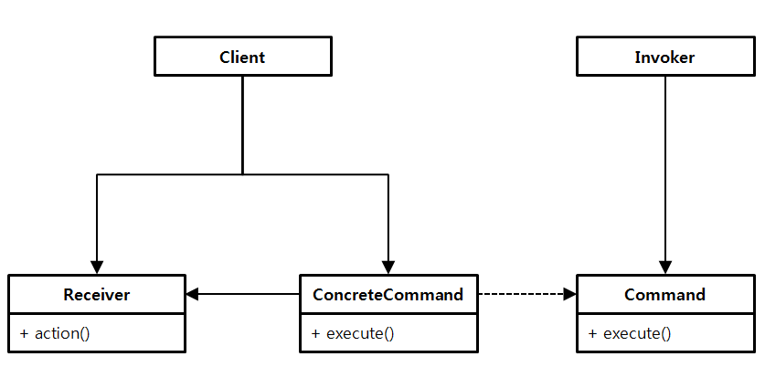

Command - 명령을 클래스로 표현하기

작동(Action), 트랜잭션(Transaction)이라고도 하며, 디자인 패턴 중 **행동** 패턴에 속하는 패턴이다.

## 정의

---

> 요청을 객체의 형태로 **캡슐화**하여 서로 요청이 다른 사용자의 매개변수화, 요청 저장 또는 로깅, 그리고 연산의 취소를 지원하게 만드는 패턴입니다.
>
> -GoF의 디자인 패턴(311p)

‘명령’을 표현하는 클래스가 있으면, **실행하고 싶은 일을** ‘메소드를 호출’하는 동적인 처리로 표현하는 것이 아니라, 명령을 나타내는 클래스의 인스턴스로서 **하나의 물건처럼 표현**할 수 있다.

명령에 대한 이력을 관리하고 싶은 경우 그 인스턴스의 집합을 관리하면 된다.

명령의 집합을 저장해두면 같은 명령을 재실행할 수 있고, 복수의 명령을 모아 새로운 명령으로 재이용할 수도 있다.(매크로나 그림을 그리기 프로그램의 뒤로가기/되돌리기 기능처럼)

**사용자 입력에 따라 어떠한 결과를 기대하는 로직**을 작성할 때 용이하다.

## 활용 예시(feat. 체스 미션)

---

- 수정 전 ChessController 코드
  먼저, 커맨드 패턴을 적용하기 전 사용자의 입력을 조건문을 사용해서 처리한 코드를 보자.

  ```java
  public class ChessController {
      private final ChessGame game;

      public ChessController(ChessGame game) {
          this.game = game;
      }

      public void run() {
          OutputView.printWelcomeMessage();
          while (game.isRunning()){
  						loop();
  				}
      }

      private void loop() {
          String command = InputView.readCommand();
          **if (command.equals("start"))** {
              game.start();
          }
          **if (command.equals("end"))** {
              game.end();
          }
      }
  }
  ```

  위 코드는 다음과 같은 단점이 있다.

  1. 모든 조건에 대해 사용자가 입력한 커맨드에 대해 검사를 해야 하기 때문에 **가독성이 저하**된다.
  2. 새로운 명령어가 추가될 때마다 조건문이 하나 더 늘기 때문에 **유지보수성이 떨어진다**.

- 커맨드 패턴을 사용한 코드
  위 코드에서 중복되는 조건문 코드를 클래스로 바꿔보자.

  ```java
  public abstract class Command {
      protected final ChessGame game;

      protected Command(ChessGame game) {
          this.game = game;
      }

      public abstract void execute();
  }
  ```

  ```java
  public class StartCommand extends Command {

      public StartCommand(ChessGame game) {
          super(game);
      }

      @Override
      public void execute() {
          game.start();
      }
  }
  ```

  ```java
  public class MoveCommand extends Command {

      public MoveCommand(ChessGame game) {
          super(game);
      }

      @Override
      public void execute() {
          game.move();
      }
  }
  ```

  ```java
  public class EndCommand extends Command {

      public EndCommand(ChessGame game) {
          super(game);
      }

      @Override
      public void execute() {
          game.end();
      }
  }
  ```

  ```java
  public class InvalidCommand extends Command {
      public static final InvalidCommand INSTANCE = new InvalidCommand(null);

      private InvalidCommand(ChessGame game) {
          super(game);
      }

      @Override
      public void execute() {
          throw new IllegalArgumentException();
      }
  }
  ```

  이렇게 Command 추상클래스를 구현해주면 해당 Command의 로직에 대한 메소드를 분리할 수 있다.
  이제 분리한 Command들을 Controller 코드에 적용해보자.

  ```java
  public class ChessController {
      private final Map<String, Command> commandMap = new HashMap<>();

      public ChessController(ChessGame game) {
          commandMap.put("start", new StartCommand(game));
          commandMap.put("move", new EndCommand(game));
          commandMap.put("end", new MoveCommand(game));
      }

      public void run() {
          OutputView.printWelcomeMessage();
          while (game.isRunning()){
  						loop();
  				}
      }

      private void loop() {
          String command = InputView.readCommand();
          ommandMap.getOrDefault(command, InvalidCommand.INSTANCE)
                  .execute();
      }
  }
  ```

  위와 같이 커맨드에 따른 동작들이 특정 객체에 대한 메서드 호출로 이루어져 있다면, 커맨드 패턴을 사용하여 가독성, 유지보수 문제를 해결할 수 있다.

## Command 패턴의 구성요소

---



**Command(명령)**

: 명령의 인터페이스(API)를 정의하는 역할. 일반적으로 인터페이스로써 작성된다.

**ConcreteCommand(구체적 명령)**

: Command 역할의 인터페이스(API)를 실제로 구현하는 역할.

**Receiver(수신자)**

: Command 역할이 명령을 실행할 때 대상이 되는 역할. 명령을 받아들이는 수신자라고 부를 수도 있다.

**Invoker(기동자)**

: 명령의 행동을 개시하는 역할. Command 역할에서 정의되는 인터페이스(API를 호출하는 역할이 된다.

**Client(사용자)**

: ConcreteCommand 객체를 생성하고 처리 객체로 정의한다.

## Command 패턴의 특징

---

### 명령은 어떤 정보를 가지고 있어야 하는가?

앞선 예제에서, 과연 Command라는 클래스가 도메인 클래스인 ChessGame을 필드로 들고 있는 게 맞을까?

**함수형 인터페이스**를 사용해서 도메인에 대한 의존을 없앨 수 있다.

함수형 인터페이스를 사용함으로써 Comand 클래스를 구현 클래스로 만들지 않아도 Command 패턴을 활용할 수 있다. 도메인 로직이 Command에 노출되는 것도 막을 수 있다.

```java
public class ChessAction {

    public static final ChessAction INVALID_ACTION = new ChessAction(ignore -> {
        throw new IllegalArgumentException("해당되는 명령어가 없습니다.");
    });

    private final Consumer<List<String>> payload;

    public ChessAction(Consumer<List<String>> payload) {
        this.payload = payload;
    }

    public void execute(List<String> commandAndParameter) {
        payload.accept(commandAndParameter);
    }
}
```

\*함수형 인터페이스 Runnable의 시그니처 : `void→void`

위와 같이 Action이라는 클래스를 작성하고,

```java
public class ChessController {
    ...
    public void run() {
        ChessGame game = ChessGame.createGame();
        outputView.printGameGuide();

				Map<Command, ChessAction> **actionMap** = new HashMap<>();
        actionMap.put(Command.START, new ChessAction(ignore -> startGame(game)));
        actionMap.put(Command.MOVE, new ChessAction(commands -> movePiece(game, commands)));
        actionMap.put(Command.END, new ChessAction(ignore -> finishGame(game)));

        while (!game.isFinished()) {
            gameLoop(actionMap, game);
        }
    }

    private void gameLoop(Map<Command, ChessAction> actionMap, ChessGame game) {
        try {
            List<String> commands = inputView.readCommands();
            Command command = extractCommand(commands);
            actionMap.getOrDefault(command, ChessAction.INVALID_ACTION).execute(commands);
            outputView.printChessBoard(new ChessBoardDto(game.getChessBoard()));
        } catch (IllegalArgumentException e) {
            outputView.printError(e.getMessage());
            gameLoop(actionMap, game);
        }
    }

    private Command extractCommand(List<String> commands) {
        Command command = Command.from(commands.get(COMMAND_INDEX));
        command.validateCommandSize(commands.size());
        return command;
    }

    private void startGame(ChessGame game) {
        game.startGame();
    }

    private void movePiece(ChessGame game, List<String> commands) {
        String source = commands.get(SOURCE_POSITION_INDEX);
        String destination = commands.get(DEST_POSITION_INDEX);
        game.executeMove(source, destination);
        game.checkGameNotFinished();
    }

    private void finishGame(ChessGame game) {
        game.finishGame();
    }
}
```

위와 같이 controller 코드에서 Action 클래스를 활용하도록 만들면, 외부에 도메인 로직의 노출을 최소화시키고 한 곳에서 도메인 로직을 관리할 수 있게 만들 수 있다.

### 이력의 저장

Command 객체에 대한 일급 컬렉션 객체를 만들고 지금까지 실행되었던 명령어를 저장해두면, 필요할 때 일련의 명령어 묶음을 재실행하는 등 다양한 용도로 사용할 수 있다.

### 장점

- Command는 일급 클래스이기 때문에 다른 객체와 같은 방식으로 조작되고 확장할 수 있다.
- 명령 여러 개를 복합해서 복합 명령을 만들 수 있다.→중복 제거
- 새로운 Command 객체를 추가하기 쉽다. 기존 클래스를 변경할 필요 없이 단지 새로운 명령어에 대응하는 클래스만 정의하면 된다.→OCP 준수.

<br/>

- 활용성
  - 수행할 동작을 객체로 매개변수화하고자 할 때, 절차지향 프로그램에서는 이를 콜백함수, 즉 어딘가 등록되었다가 나중에 호출되는 함수를 사용하여 이러한 매개변수화를 표현할 수 있다. 커맨드 패턴은 콜백을 객체지향 방식으로 표현한 것이다.
  - **서로 다른 시간에** 요청을 명시하고, 저장하고, 실행하고 싶을 때 Command 객체는 원래의 요청과 다른 생명 주기를 가지고 있다. 요청을 받아 처리하는 객체가 주소 지정 방식과는 독립적으로 표현될 수 있다면, Command 객체를 다른 프로세스에 넘겨주고 거기서 해당 처리를 진행하도록 할 수 있다.(위임)
- 관련 패턴
  - Composite 패턴 : 명령들을 재실행하고자 할때(매크로) Composite 패턴이 사용되는 경우가 있다.
  - Memento 패턴 : Command 객체의 이력을 저장하는 경우 Memento 패턴이 사용되기도 한다.
  - Prototype 패턴 : 작성된 명령을 복제하는 경우 Prototype 패턴이 사용되기도 한다.

<nav>

참고 자료

- Java 언어로 배우는 디자인 패턴 입문(333p)
- [우테코 백엔드 크루 글렌의 학습로그](https://prolog.techcourse.co.kr/studylogs/2942)

</nav>
