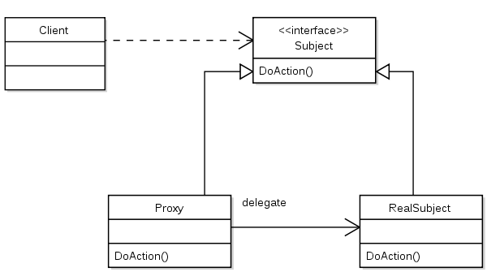

Proxy - 필요해지면 만들기

대리자(Surrogate)라고도 하며, 『GoF의 디자인 패턴』에서 정의한 디자인 패턴 분류 중 **구조** 패턴에 속하는 패턴이다.

## 정의

---

> 어떤 다른 객체로 접근하는 것을 통제하기 위해 그 객체의 대리자(surrogate) 또는 자리 채움자(placeholder)를 제공하는 패턴입니다.
>
> <br/>
> -GoF의 디자인 패턴(279p)

proxy란 사전적 의미로 ‘대리인’이라는 의미를 가지고 있다.

어떤 객체에 가해지는 작업(프로퍼티 읽기/쓰기 등)을 중간에 가로채어 대신 실행하는 객체를 프록시 객체라고 한다. 가로채진 작업은 프록시 객체에서 처리되기도 하고, 원래 객체에게 그대로 위임되기도 한다. 이처럼 프록시 객체는 원래 객체의 대리인 역할을 한다.


『Java 언어로 배우는 디자인 패턴 입문』 도서에서는 프록시 패턴을 ‘정말로 목적한 것이 필요하게 될 때까지 **대리인을 사용해서 처리를 진행시키는 패턴**’이라고 소개하고 있다.

## 활용 예시

---

코드를 통해 구체적인 예시를 들어보겠다.

일련의 결과를 출력하는 기능을 수행하는 Printer 객체가 있다. 이 객체를 생성하는데 많은 시간과 자원이 소요된다고 가정하자.

PrinterProxy는 Printer 클래스의 프록시 객체이다.

PrinterProxy 객체는 Main에서 요청한 작업을 대신 수행하다, 필요한 경우에만 **Printer 객체를 생성**하여 작업을 위임한다.

- Printer 클래스

  ```java
  public class Printer implements Printable {

      private String name;

      public Printer() {
          heavyJob("Printer 인스턴스 생성 중");
      }

      public Printer(String name) {
          this.name = name;
          heavyJob("Printer의 인스턴스 (" + name + ")을 생성 중");
      }

      public void setPrinterName(String name) {
          this.name = name;
      }

      public String getPrinterName() {
          return name;
      }

      public void print(String string) {
          System.out.println("=== " + name + " ===");
          System.out.println(string);
      }

      private void heavyJob(String msg) {
          System.out.println(msg);
          for (int i = 0; i < 5; i++) {
              try {
                  Thread.sleep(1000);
              } catch (InterruptedException e) {
              }
              System.out.print(".");
          }
          System.out.println("완료.");
      }

  }
  ```

  Printer 객체를 생성하는 데 5초의 시간이 걸리게 구현하였다.

- Printable 인터페이스
  ```java
  public interface Printable {
      void setPrinterName(String name);
      String getPrinterName();
      void print(String string);
  }
  ```
- PrinterProxy 클래스

  ```java
  public class PrinterProxy implements Printable {

      private String name;
      private Printer real;

      public PrinterProxy() {
      }

      public PrinterProxy(String name) {
          this.name = name;
      }

      @Override
      public synchronized void setPrinterName(String name) {
          if (real != null) {
              real.setPrinterName(name);
          }
          this.name = name;
      }

      @Override
      public String getPrinterName() {
          return this.name;
      }

      @Override
      public void print(String string) {
          realize();
          real.print(string);
      }

      private synchronized void realize() {
          if (real == null) {
              real = new Printer(name);
          }
      }
  }
  ```

  PrinterProxy의 setPrinterName과 getPrinterName을 여러 차례 호출해도 Printer 객체는 생성되지 않는다.
  실제 Printer 객체가 필요한 상황(print()의 호출)이 되어서야 Printer 객체를 생성한다.

- Main

  ```java
  public class Main {

      public static void main(String[] args) {
          Printable p=new PrinterProxy("Alice");
          System.out.println("이름은 현재 "+p.getPrinterName()+"입니다.");
          p.setPrinterName("Bob");
          System.out.println("이름은 현재 "+p.getPrinterName()+"입니다.");
          p.print("Hello, world.");
      }
  }
  ```

여기서 중요한 것은, 실제 Printer 객체가 생성되었는지 아닌지를 PrinterProxy의 이용자(Main)는 알 수가 없고, Printer 클래스는 PrinterProxy의 존재를 모른다는 것이다.

## Proxy 패턴의 구성요소

---



**Subject(주체)**

: Proxy 객체와 RealSubject 객체를 동일시(추상화)하기 위한 인터페이스.

Subject 인터페이스가 있어서 Client는 Proxy와 RealSubject의 차이를 의식할 필요가 없다. 앞선 예제에서 Printable 인터페이스가 이에 해당한다.

**Proxy(대리인)**

: Proxy는 제 선에서 할 수 있는만큼 RealSubject 대신 Client이 보낸 요청을 처리한다. 만약 자신이 처리할 수 없는 요청이 들어왔을 때 RealSubject 객체를 생성한 뒤 요청을 위임한다.

Proxy 클래스는 Subject 인터페이스를 구현한다. 앞선 예제에서 PrinterProxy 클래스가 이에 해당한다.

**RealSubject(실제의 주체)**

: Proxy 객체만으로 처리할 수 없는 요청이 들어왔을 때 생성되어 요청을 처리한다.

Subject 인터페이스를 구현하며, 앞선 예제에서 Printer 클래스가 이에 해당한다.

**Client(사용자)**

: Proxy 패턴을 이용하는 주체. 예제에서는 Main 클래스가 이에 해당한다.

## Proxy 패턴의 특징

---

### 성능 향상

Proxy 패턴에서는 Proxy 객체가 처리할 수 있는 일을 실제 객체 대신 처리한다.

예제에서도 Proxy 객체를 사용하여 Main이 print 메서드를 호출할 때까지 무거운 처리(무려 5초가 소요되는 Printer 객체 생성)를 지연시킬 수 있었다.

초기화에 시간이 걸리는 기능이 많이 존재하는 큰 규모의 시스템을 생각해보자. 기동 시점에 실제 이용하지 않는 기능까지 전부 초기화하게 되면 어플리케이션을 기동하는 데 시간이 많이 소요된다. 실제로 그 기능을 사용할 단계가 되었을 때 초기화를 하는 편이 사용자의 불편을 줄일 수 있는 방법이다.

### 굳이 원본 클래스로부터 Proxy 클래스를 분리할 필요가 있을까?

Printer에 처음부터 지연 생성 기능(필요하게 되었을 때 인스턴스를 생성하는 기능)을 구현하면 Proxy가 없어도 괜찮지 않을까?

Proxy와 Realsubject 역할을 분리해서 프로그램을 모듈화하면 개별적으로 수정이 가능하다.

PrintProxy 클래스의 구현을 수정함으로써 Printable 인터페이스에 선언된 추상메서드 중에서 무엇을 Proxy가 처리하고, 무엇을 RealSubject가 처리하게 할 것인지를 수정할 수 있다.

이 과정에서 Printer 클래스는 수정할 필요가 전혀 없다.

### ‘투과적’이라는 것의 의미

PrintProxy 클래스와 Printer 클래스는 동일한 Printable을 갖기 때문에 Main 클래스는 PrintProxy, Printer 중 어느 클래스를 사용해도 문제가 없다.

즉, Printer를 바로 사용하든, 사이에 PrinterProxy를 두고 사용하든 Main 클래스가 Printer의 기능을 이용하는 데에는 별반 차이가 없다.

때문에 PrinterProxy 클래스를 ‘투과적’이라고 표현한다.

### HTTP Proxy

**HTTP Proxy**란 HTTP 서버(웹 서버)와 HTTP 클라이언트(브라우저) 사이에서 웹 페이지의 캐싱을 실행하는 소프트웨어이다.

HTTP Proxy의 구조도 Proxy 디자인 패턴이 적용된 사례라고 볼 수 있다.

HTTP Proxy가 가진 기능 중 캐싱에 한해서 설명하도록 하겠다.

웹 브라우저가 어떤 리소스를 요청할 때, 일일이 원격에 있는 웹 서버에 액세스해서 리소스를 취득하지 않고 HTTP Proxy가 리소스를 대신 취득한다.(캐싱)

만일 최신 정보가 필요하거나 리소스의 유효기간이 지났을 때 브라우저는 웹 서버에 직접 액세스한다.

여기에서는 웹 브라우저는 Client, HTTP Proxy는 Proxy, 웹 서버는 RealSubject로 비유할 수 있다.

### Proxy의 종류

- Virtual Proxy(가상 프록시)

  : 지금까지 소개했던 Proxy 패턴. 정말로 인스턴스 객체가 필요한 시점에서 원본 객체를 생성/초기화하는 프록시이다.

- Remote Proxy(원격 프록시)

  : 원격 프록시는 RealSubject가 네트워크의 상대 쪽에 있음에도 마치 자신의 옆에 있는 것처럼(투과적으로) 메서드를 호출할 수 있다. Java의 RMI 등이 여기에 해당한다.

- Access Proxy

  : RealSubject 역할의 기능에 대해 액세스 제한을 설정한 것. 정해진 사용자에 한해서만 메서드 호출을 허용하고 그 외의 접근은 에러처리한다.

<br/>

- 관련 패턴
  - Adapter 패턴 : 어댑터 패턴에서 Adapter는 인터페이스가 서로 다른 오브젝트 사이를 연결하는 역할을 한다. 반면 Proxy 패턴에서 Proxy와 RealSubject의 인터페이스는 동일하다.
  - Decorator 패턴 : 구현은 비슷하지만 목적이 다르다. Decorator 패턴의 목적은 새로운 기능을 추가하는 것인 반면, Proxy 패턴의 목적은 본인의 작업을 Proxy에게 위임하여 본인에 대한 접근을 줄이는 것이다.

### 참고 자료

- Java 언어로 배우는 디자인 패턴 입문
