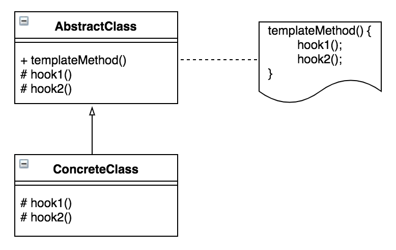

Template Method

디자인 패턴 중 **행동** 패턴에 속하는 패턴이다.

## 정의

---

> 객체의 연산에는 알고리즘의 뼈대만을 정의하고 각 단계에서 수행할 구체적 처리는 **서브클래스** 쪽으로 미루는 패턴입니다. 알고리즘의 구조 자체는 그대로 놔둔 채 알고리즘 각 단계의 처리를 서브클래스에서 **재정의**할 수 있게 합니다.

-GoF의 디자인 패턴(419p)

>

상위 클래스에서 처리의 뼈대를 결정하고 하위 클래스에서 그 구체적인 내용을 결정하는 디자인 패턴.

## Template Method 패턴의 구성요소

---

**AbstractClass(추상 클래스)**

: **템플릿 메소드를 구현**하고, 템플릿 메소드에서 사용하고 있는 추상 메소드를 **선언**한다. 이 추상 메소드는 하위 클래스인 ConcreteClass 역할에 의해 구현된다.

**ConcreteClass(구현 클래스)**

: Abstract Class 에서 정의되어 있는 **추상 메소드를 구체적으로 구현**. 여기에서 구현한 메소드는 AbstractClass의 템플릿 메소드에서 호출된다.

### Template Method 패턴의 특징

1. 로직을 공통화할 수 있다.

   상위 클래스의 템플릿 메소드에서 알고리즘이 기술되어 있으므로 하위 클래스측에서는 알고리즘을 일일이 기술할 필요가 없다.

   또한, 템플릿 메소드에 오류가 발견되더라도 하위 클래스를 일일이 수정할 필요 없이 템플릿 메소드만 수정하면 된다.

2. 상위 클래스와 하위 클래스의 연계

   상위 클래스에서 선언된 추상 메소드를 실제로 하위 클래스에 구현할 때에는 그 메소드가 어느 타이밍에서 호출되는지 이해해야 한다. 상위 클래스의 소스 프로그램이 없으면 하위 클래스의 구현이 어려울 수도 있다.

3. 하위 클래스를 상위 클래스와 동일시한다.

   상위 클래스형의 변수에 하위 클래스의 어떠한 인스턴스를 대입해도 제대로 작동할 수 있도록 한다.(feat. LSP)

- 관련 패턴
  - Factory Method 패턴 : Template Method 패턴을 인스턴스 생성에 응용한 전형적인 예가 Factory Method 패턴이다.
  - Strategy 패턴
    - Factory Method 패턴 : **상속**을 이용해서 프로그램의 동작을 변경할 수 있다. 상위 클래스에서 프로그램 동작의 큰 흐름을 결정하고 하위 클래스에서 구체적인 흐름을 결정하고 있기 때문.
    - Strategy 패턴 : **위임**을 이용해서 프로그램의 동작을 변경할 수 있다. 프로그램의 일부분을 변경하기보다는 알고리즘 전체를 완전히 바꾸고 있다.

<nav>

참고 도서

- Java 언어로 배우는 디자인 패턴 입문(69p)

</nav>
