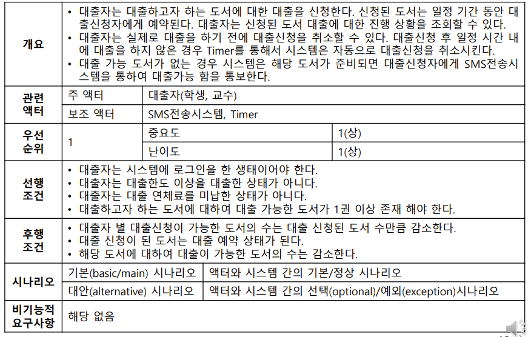

# 들어가며

---

이번에 우테코에서 협업 미션을 진행하면서 프론트엔드 팀과 함께 기획도 해보고, 다이어그램도 많이 그리게 됐다.

그러면서 작년 소프트웨어 공학 전공시간에 배운 지식들이 새록새록 떠올랐는데 당시 정말 중요한 내용을 배운 것이었다는 생각이 들었다.

가장 기억에 남는 커리큘럼이 ‘요구 공학 프로세스’인데, 기억을 되살리고자 여기에 정리해보기로 했다.

# 요구 공학 프로세스란?

---

요구 공학(Requirements Engineering)이란 요구사항을 정의하고 문서화하고 관리하는 일련의 프로세스를 일컫는다.

요구 공학은 크게 요구사항을 정의하고 문서화하는 **요구사항 개발**(Requirements Development)과 **요구사항 관리**(Requirements Management)로 구성된다.

일반적인 형태의 소프트웨어/시스템 개발 프로세스는 다음과 같이 `요구사항 정립`>`분석 및 설계`>`구현`>`테스트`의 순서로 이루어진다.

요구사항 개발은 요구사항 정립 단계에 해당하고 요구사항 관리는 나머지 절차 전반에서수행된다.

## 요구사항 개발

---

요구사항을 개발하고 검증하는 과정으로, 이 과정을 간단히 요약하면 다음과 같다.

1. 이해관계자들로부터 요구사항을 추출한다. ⇒ **Requirement Elicitation**
2. 모호하거나 잘못된 요구사항을 수정하며 일관성 있게 요구사항을 정비한다. ⇒ **Requirement Analysis**
3. 최종적인 요구사항을 정의한다. ⇒ **Requirement Specification**
4. 완성된 요구사항이 올바른지 검증한다. ⇒ **Verification**

이 과정들은 단방향으로만 진행되는 것이 아니라, 필요에 따라 이전 단계로 돌아가 일련의 과정을 여러차례 반복한다.

### 1. 요구사항 도출(Requirement Elicitation)

: 이해관계자들로부터 시스템이 제공할 기능에 대한 요구사항들을 추출하는 단계이다. 다른 표현으로는, 소프트웨어가 해결해야 할 문제를 이해하는 단계이다.

<aside>
💡 여기서 <b>이해관계자(Statkeholder)</b>란 일반적으로 비즈니스 고객을 의미한다. 프로젝트의 기획자가 될 수도 있고, 외주를 맡긴 고객이 될 수도 있다.

</aside>

이 단계에서 하는 작업은 다음과 같다.

- 프로젝트의 **이해관계자가 누구인지** 이해해야 한다.
- 이해관계자들이 프로젝트로부터 **무엇을 원하는지** 식별해야 한다.
- 수집된 요구사항들에 대해 **우선순위를 부여**한다.

<aside>
💡 <b>Statkeholder Requirements</b>
이 단계에서 추출한 요구사항을 Stakeholder Requirement라고하는데, 이를 나타내는 문서의 양식은 다음과 같다.

예시)

</aside>

### 2. 요구사항 분석(Requirement Analysis)

: 실제 시스템이 갖춰야 할 핵심적인 **기능**에 대해 분석하는 단계이다.

- 이해관계자들의 핵심 니즈를 충족시키기 위해 시스템이 제공해야 할 기능이 무엇인지 결정한다.

  ⇒이렇게 도출된 요구사항을 core requirement라고 한다.

- 이 단계에서 도출되는 요구사항 문서를 <b>Requirement Document(Vision)</b>라고 한다.
- 이 단계는 다음의 세 과정으로 한 번 더 세분화된다.
  - 시스템에 대한 개요(overview) 정의
  - 시스템의 바운더리(boundaries) 정의
  - 시스템의 기능(feature)을 정의

**1) System Overview**

<aside>
💡 <b>Problem Statement</b>

: Stakeholder requirements에 기반하여 프로젝트의 산출물로 해결될 수 있는 <b>문제</b>를 요약한 것.
구성 요소는 다음과 같다.

- 문제가 무엇인지
- 문제가 누구(이해관계자)에게 영향을 줄 수 있는지
- 문제 자체가 무엇인지
- 문제의 해결책이 무엇인지.

</aside>

<aside>
💡 <b>System Position Statement(시스템 위치 정의)</b>

: 시스템이 시장에서 가질 수 있는 고유한 입지(position)를 하나의 문장으로 정리한 것.

시스템의 목표가 무엇인지, 프로젝트가 얼마나 중요한지 어필할 때 사용할 수 있다.

예시)

<aside>
📝 <b>[어떤 고객]</b>들을 위한 이 <b>[시스템 이름]</b>은 <b>[어떤 기능/이익]</b>을 제공하겠다. <b>[기존에 존재하던 타 시스템]</b>과 달리, <b>[차별화된 기능]</b>을 제공할 수 있다.

</aside>

</aside>

<aside>
💡 <b>Summary of Features(시스템의 기능 구체화)</b>

이해관계자에게 어떤 이익을 제공해줄 수 있는지, 그 이익을 위해 시스템이 어떤 기능을 제공할 수 있을지 작성한다.

다음과 같은 양식으로 이해관계자들이 원하는 이익을 나열하고 그 이익을 제공할 기능들을 서술한다.

</aside>

**2) System Context(시스템의 바운더리)**

개발하고자 하는 시스템이 무엇인지, 누가 이용할 것인지 시스템과 상호작용하는 또다른 기기(device)는 무엇이 있는지. 그리고 그 대상들과 시스템 간의 입력과 출력을 표현하는 단계.

주로 **DFD(Data Flow Diagram**)라는 UML을 사용하여 시각화한다.

이름 그대로 **데이터의 흐름**으로 표현된다.

**3) Functional Features**

시스템의 기능적인 요구사항

작성 예시)

<aside>
⚠️ 이 단계에서의 서술로 모호성의 문제가 완전히 해결되는 것은 아니다.
단지 이해관계자와 의사소통할 수단으로서 작성하는 것.

</aside>

**4) Quality Features**

시스템의 성능, 품질적인 요구사항.

- 가용성, 사용성, 확장성, 성능 등이 있다.

작성 예시)

### 3. 요구사항 구체화(Requirement Specification)

: 상세하고 누락 없이 완전한 요구사항 문서를 작성하는 단계.

이 단계에서 구체화하는 요구사항은 세 가지 종류로 분류된다.

1. 기능 요구사항
2. 품질 요구사항
3. 제약 사항

**1) Functional Requirements(기능 요구사항)**

이 단계에서 기능 요구사항을 구체화하기 위해 **Use Case Model**이라는 UML을 사용한다.

- Use Case Model
  - 기능의 단위를 `Use Case`로 표현하고 해당 기능과 상호작용 하는 대상을 `Actor`로 규정한다.
  - 각 `Use Case`에 대한 상세는 `Use Case 명세서`로 정의한다.

<aside>
💡 <b>Use Case 명세서</b>

: Use Case 명세서에 포함되는 요소는 다음과 같다.

- `관련 액터`
  - 주 액터 : 해당 Use case를 트리거시키는 액터
  - 보조 액터 : use case가 동작하는 과정에서 필요한, 또는 관련된 액터
- `우선순위`
  - 중요도 : 사용자 입장에서의 중요도.
  - 난이도 : 개발자 입장에서의 난이도
- `선행 조건` : 시스템이 use case의 기능을 제공하기 위해 선행되어야 하는 조건
- `후행 조건` : use case가 성공적으로 수행되었을 때 시스템의 상태를 use case 수행 전과 비교하여 기술하는 것.
- **`시나리오`** : use case를 가장 상세하게 기술하는 부분.
  - **기본 시나리오** : 액터와 시스템간의 **입력**과 **출력**을 시간 순서대로 기술하는 것. 하나의 use case는 하나의 기본 시나리오를 가짐.
    
    - 특징
      - 액터와 시스템의 동작은 해당 대상이 주어로 기술되는 능동태 문장이어야 한다.
      - 액터와 시스템의 동작은 번갈아가며 기술된다.
  - **대안 시나리오** : 기본 시나리오와 달리 여러 개가 존재할 수 있고, 대안 시나리오는 다시 **optional 시나리오**와 **exception 시나리오**로 나뉜다.
    
- `비기능적 요구사항` : 성능, 신뢰성 등 품질 요구사항을 기술

작성 예시)

</aside>

<aside>

💡 Use Case 명세서에 대한 부수적인 산출물로서 **개념적 UI 모델**(유저 인터페이스), **개념적 데이터 모델**을 추가적으로 작성할 수 있다.

</aside>

**2) Quality Requirements(품질 요구사항)**

**Quality Feature**를 구체화한 것

각 요구사항은 `식별자-품질 유형-상세 설명`으로 구성된다.

작성 예시)

<aside>

💡 **Quality Attribute Scenario**
품질 요구사항을 분석하고 기록하기 위한 과정(기능 요구사항에 Use Case Model이 있다면 품질 요구사항엔 Quality Attribute Scenario가 있다.)
크게 6가지 항목으로 구성된다.

- **Stimulus** : 사용자가 가하는 입력
- **Source** of the stimulus :입력을 가하는 사용자
- **Artifact** : 대상이 되는 시스템
- **Environment** : 시스템이 동작하게 된 상황
- **Response** : 시스템의 처리 결과
- **Response** Measure : response 처리에 대한 정량적인 기준

작성 예시)

<aside>

⭐ 사용자(**Source**)가 어떤 처리를 시작했을 때(**Stimulus**) 시스템은 일반적인 연산 중이었다.(**Environment**)

</aside>

<aside>

⭐ 시스템은 처리를 할 때(**Response**) 평균적으로 2초 이내에 처리되어야한다.(**Response** **Measure**)

</aside>

</aside>

**3) Constraints(제약 사항)**

크게 두 가지로 나뉜다.

- **Business Constraints** : 인력, 비용, 일정에 관련된 것.
- **Technical constraint** : 시스템을 운영하는 데 요구되는 기술적 측면의 제약. 요구사항, 설계, 구현, 개발 프로세스에 전반적으로 영향을 미칠 수 있다.

작성 예시)

### 4. Verification and Validation

정립된 요구사항이 올바른지 검증하는 단계

‘올바른 요구사항’을 정의하는 기준은 다음과 같다.

즉 요구사항 개발을 통해 도출된 요구사항은 명확해야하고, 완전해야 하며, 일관성 있고 구현 가능성과 검증 가능성이 검증되어야 한다.
