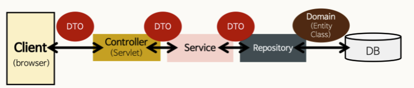

## 코드 리뷰

---

### **체스 미션 1, 2단계(1)**

- 매개 변수를 네이밍할 때, 객체로부터 의미를 유추할 수 있는 경우 객체 타입명은 생략하는 편이 나을 수 있다.
  - 예시
    ```java
    //수정 전
    public abstract boolean canAttack(Position startPosition, Position endPosition);
    //수정 후
    public abstract boolean canAttack(Position start, Position end);
    ```
- Command 명령 처리 관련 코드는 domain보다 controller 또는 view에 구현해주는 편이 책임 분담 면에서 더 적절하다.
- 네이밍은 규칙(형식)보다 가독성을 우선시하자
- 일련의 알고리즘 연산이 들어갈 때, 명시적으로 표현해주면 더 좋을 것 같다.
  - enum을 사용하여 구현할 수 있다.
- 읽는 사람이 혼동할 법한 명칭은 README.md 용어 사전에 추가해두는 게 좋다.
- instanceOf을 사용하지 말자
  - 다형성을 활용할 수 있도록 수정

### **체스 미션 1, 2단계(2)**

- 체스 게임의 상태에 따라 컨트롤러의 행위가 달라지므로 상태 패턴을 적용하는 것도 좋은 방법이다.
- ❓instanceOf를 쓰지 않기 위해 다형성을 활용했는데, 타입 확인 메서드를 오버라이딩하는 과정에서 중복 코드가 발생한다. 이를 해결하는 방법은 없을까?

### **체스 미션 1, 2단계(페어)**

- 정적 메서드로만 이루어진 클래스는 생성자를 막는 것이 좋다.
  [book-effective-java/4*인스턴스화를*막으려거든*private*생성자를*사용하라*이호빈.md at main · Meet-Coder-Study/book-effective-java](https://github.com/Meet-Coder-Study/book-effective-java/blob/main/2장/4_인스턴스화를_막으려거든_private_생성자를_사용하라_이호빈.md)
- 조건문은 가능한 긍정문으로 바꾸는 것이 좋다.(isNotFinished→isRunning)
- 자바 컨벤션 상 생성자는 메서드 중 가장 앞으로 와야 한다.
- 수학 연산 시 나누기를 할 땐 0에 대한 방어를 하는 게 좋다.

## 학습로그 학습하기

---

### 컬렉션의 방어적 복사

[우아한테크코스 학습로그 저장소](https://prolog.techcourse.co.kr/studylogs/2603)

- 컬렉션을 복사하는 방법에는 `new` 키워드를 사용한 객체 초기화, `copyOf()` 메서드, `Collections.unmodifiable()` 3가지가 있다.

- **방어적 복사** : 객체를 복사하여 새로운 객체를 만들 때, 기존 객체의 변경이 새로운 객체에 영향을 주지 않도록 하는 방법.
  컬렉션은 원본 컬렉션을 그대로 사용하면 다른 스레드나 객체에서 컬렉션을 공유할 때 동기화 문제가 발생할 수 있다.
  방어적 복사를 사용하면 컬렉션의 요소를 안전하게 공유할 수 있다.

1. **`new` 키워드를 사용한 객체 초기화**

   `new ArrayList()`는 원본 컬렉션의 모든 요소를 가진 새로운 컬렉션을 만든다. 다른 두 방법과의 차이는 복사한 컬렉션은 `add()`, `set()` 등의 메소드를 통해 컬렉션의 요소들을 변경할 수 있는 **가변 컬렉션**이라는 것이다. 때문에 다른 스레드나 객체에서 컬렉션을 공유하는 경우 동기화 문제를 고려해야 한다.

   ```java
   import ...

   class CopyTest {

       List<String> list = new ArrayList();

       @Nested
       class new_키워드를_사용하여_컬렉션을_복사할_때 {

           @Test
           @DisplayName("복사된 컬렉션에 원소를 추가할 수 있다.")
           void should_changeCopy_when_AddElementToCopy() {
               List<String> copy = new ArrayList<>(list);
               final Executable addElementToCopy = () -> copy.add("amaranth");

               Assertions.assertDoesNotThrow(addElementToCopy);
               assertThat(copy).contains("amaranth");
           }

           @Test
           @DisplayName("복사된 컬렉션에 원소를 추가할 때 원본 컬렉션에 변화가 없어야 한다.")
           void should_NotChangeOrigin_when_addElementToCopy() {
               List<String> copy = new ArrayList<>(list);
               final Executable addElementToCopy = () -> copy.add("amaranth");

               Assertions.assertDoesNotThrow(addElementToCopy);
               assertThat(list).doesNotContain("amaranth");
           }
       }
   }
   ```

2. **`copyOf()` 메서드를 사용하는 방법**

   읽기 전용의 컬렉션을 만든다. 첫 번째 방법과 달리 copyOf()으로 반환한 컬렉션은 수정 작업 시 예외가 발생한다.

   ```java
   ...
   		@Nested
       class copyOf_메서드를_사용하여_컬렉션을_복사할_때 {

           @Test
           @DisplayName("복사된 컬렉션에 원소를 추가할 수 없다.")
           void should_notChangeCopy_when_AddElementToCopy() {
               List<String> copy = List.copyOf(list);
               final ThrowingCallable addElementToCopy = () -> copy.add("amaranth");

               assertThatThrownBy(addElementToCopy).isInstanceOf(UnsupportedOperationException.class);
           }
       }
   ```

3. **`Collections.unmodifiableList()`**

   두 번째 방법과 마찬가지로 읽기 전용인 새로운 컬렉션(불변 객체)을 만든다.

   ```java
   		@Nested
       class Collections_unmodifiableList_메서드를_사용하여_컬렉션을_복사할_때 {

           @Test
           @DisplayName("복사된 컬렉션에 원소를 추가할 수 없다.")
           void should_notChangeCopy_when_AddElementToCopy() {
               List<String> copy = Collections.unmodifiableList(list);
               final ThrowingCallable addElementToCopy = () -> copy.add("amaranth");

               assertThatThrownBy(addElementToCopy).isInstanceOf(UnsupportedOperationException.class);
           }
       }
   ```

   ❓ **`copyOf()` 메서드와 `Collections.unmodifiableList()`의 차이**

   `copyOf()` 메서드는 컬렉션을 복사한 후 원본 컬렉션과의 참조관계를 끊지만, `unmodifiable()`은 원본 컬렉션의 참조 값을 그대로 가지고 있다.
   `unmodifiable()` 메서드를 사용하면 만일 원본 컬렉션에 변경사항이 생기면 불변 컬렉션도 함께 변경된다.

```java
@Nested
class copyOf_메서드를_사용하여_컬렉션을_복사할_때 {
		@Test
		@DisplayName("원본 컬렉션에 원소를 추가할 때 복사된 컬렉션에 변화가 없어야 한다.")
    void should_NotChangeCopy_when_addElementToOrigin() {
        List<String> copy = List.copyOf(list);
        final Executable addElementToCopy = () -> list.add("amaranth");

        Assertions.assertDoesNotThrow(addElementToCopy);
        assertThat(copy).doesNotContain("amaranth");
    }
}

@Nested
class Collections_unmodifiableList_메서드를_사용하여_컬렉션을_복사할_때 {

		@Test
    @DisplayName("원본 컬렉션에 원소를 추가할 때 복사된 컬렉션도 함께 변경된다.")
    void should_changeCopy_when_addElementToOrigin() {
        List<String> copy = Collections.unmodifiableList(list);
        final Executable addElementToCopy = () -> list.add("amaranth");

        Assertions.assertDoesNotThrow(addElementToCopy);
        assertThat(copy).contains("amaranth");
    }
}
```

때문에 unmodifiable() 메소드를 사용할 때에는 다른 스레드나 객체에서 컬렉션을 공유할 때 발생할 수 있는 동기화 문제를 고려해야 한다.
위 세가지 방법 모두 **얕은 복사**에 해당하기 때문에 내부에 있는 요소는 수정될 수 있다.
완전한 불변 컬렉션을 만들기 위해선 직접 하나하나 요소를 순회하며 복사를 해서 깊은 복사를 해주거나, 컬렉션 안의 객체를 불변으로 만들어야 한다.

```java
@Nested
    class 얕은_복사 {

        List<Dog> dogs;

        @BeforeEach
        void init() {
            dogs = new ArrayList<>();
            dogs.add(new Dog("밀크"));
        }

        @Test
        @DisplayName("컬렉션의 원소 객체를 변경하면 원본과 복사된 컬렉션 모두의 객체에도 변화가 적용된다.")
        void should_changeElementOfOriginAndCopy_when_changeElementInCollection() {
            List<Dog> copy = List.copyOf(dogs);

            Dog milkInCopy = copy.get(0);
            assertThat(milkInCopy.getName()).isEqualTo("밀크");

            Dog milkInOrigin = dogs.get(0);  // 원본 컬렉션에서 객체를 꺼냄
            milkInOrigin.setName("초코");

            assertThat(milkInCopy.getName()).isEqualTo("초코");  // 복사한 컬렉션의 내부 객체 변경됨
            assertThat(milkInOrigin.getName()).isEqualTo("초코");  // 원본 컬렉션의 내부 객체도 변경됨
        }
    }
```

### 추상 클래스 vs 인터페이스

[우아한테크코스 학습로그 저장소](https://prolog.techcourse.co.kr/studylogs/2930)

- **추상 클래스**

  - 클래스 내 추상 메서드가 하나 이상 포함되어 있다.
  - `abstract` / `extends` 키워드 사용

- **인터페이스**

  - 모든 메서드가 추상 메서드이다.
  - `interface` / `implements` 키워드 사용

- 공통점

  - 추상 메서드를 가지고 있어야 한다.
  - 인스턴스화 할 수 없다.(구현체의 인스턴스를 사용해야 한다.)
  - 인터페이스 혹은 추상 클래스를 구현/상속한 클래스는 반드시 추상메서드를 구현해주어야 한다.(overriding)

- 차이점
  - 구성
    - 추상 클래스 : 추상 메서드 외 일반적인 **필드**, **생성자** 사용 가능
    - 인터페이스 : 상수와 추상 메서드만 사용 가능
  - 다중 상속
    - 추상 클래스 : 불가능
    - 인터페이스 : **가능**
- 사용 목적에 따른 구분
  

  - 추상 클래스
    - **하위 클래스가 기능을 이용하고 확장시키기 위해**
    - 상속 받을 클래스들이 공통으로 가지는 메소드와 필드가 많아 **중복 멤버 통합**을 할 때
    - **클래스 간의 연관관계**를 구축하는 것에 초점을 맞춘다.
      (추상 클래스는 이를 상속할 각 객체들의 **공통점을 찾아 추상화**시켜 놓은 것이다.
    - 추상 클래스는 상속을 위한 클래스이기 때문에, 상위 추상클래스에서 선언된 추상 메서드를 하위 클래스에 위임할 수 있다.
    - **같은** **조상 클래스를 상속 받는 구현 클래스들이 같은 기능을 가질 때 사용할 수 있다.**
  - 인터페이스

    - **함수의 구현을 강제함으로써 구현 객체의 같은 동작을 보장하기 위해**
    - 서로 관련성이 없는 클래스들을 묶어주고 싶을 때
    - 추상 클래스에 비해 자유롭게 붙였다 떼었다 사용 가능.
    - **다중 상속**을 통한 추상화 설계를 해야 할 때
    - **서로 다른 조상 클래스를 상속 받는 구현 클래스들이 같은 기능을 가질 때 사용할 수 있다.**

    [[JAVA] 추상클래스 VS 인터페이스 왜 사용할까? 차이점, 예제로 확인 :: 마이자몽](https://myjamong.tistory.com/150)

### Command Pattern(커맨드 패턴)

[우아한테크코스 학습로그 저장소](https://prolog.techcourse.co.kr/studylogs/2942)

**사용자 입력에 따라 어떠한 결과를 기대하는 로직**을 작성할 때 용이하다.
사용자 입력에 따라 조건문을 사용하면 모든 조건에 대해 사용자가 입력한 커맨드에 대해 검사를 해야한다는 단점이 있다.(가독성 저하)
또한, 새로운 명령어가 추가될 때마다 조건문이 하나 더 늘기 때문에 유지보수성이 떨어진다.

```java
public class Controller {
    private final Game game;

    public Controller(Game game) {
        this.game = game;
    }

    public void run() {
        OutputView.printWelcomeMessage();
        while (!loop());
    }

    private boolean loop() {
        String command = InputView.readCommand();
        **if (command.equals("start"))** {
            OutputView.printStartMessage();
            game.start();
        }
        **if (command.equals("end"))** {
            OutputView.printEndMessage();
            game.end();
            return true;
        }
        return false;
    }
}
```

- 커맨드 패턴

위 코드에서 중복되는 부분은, 조건문이 어떠한 입력에 대해 game의 로직을 실행시키고 boolean 값을 반환하는 부분이다.
커맨드 패턴을 적용하기 위해 Command라는 추상 클래스를 만들고 StartCommand, MoveCommand, EndCommand라는 구현 클래스로 분리해보자.

```java
public abstract class Command {
    protected final Game game;

    protected Command(Game game) {
        this.game = game;
    }

    public abstract boolean execute();
}
```

```java
public class StartCommand extends Command {

    public StartCommand(Game game) {
        super(game);
    }

    @Override
    public boolean execute() {
        OutputView.printStartMessage();
        game.start();
        return false;
    }
}
```

```java
public class MoveCommand extends Command {

    public MoveCommand(Game game) {
        super(game);
    }

    @Override
    public boolean execute() {
        OutputView.printMoveMessage();
        game.move();
        return false;
    }
}
```

```java
public class EndCommand extends Command {

    public EndCommand(Game game) {
        super(game);
    }

    @Override
    public boolean execute() {
        OutputView.printEndMessage();
        game.end();
        return true;
    }
}
```

```java
public class InvalidCommand extends Command {
    public static final InvalidCommand INSTANCE = new InvalidCommand(null);

    private InvalidCommand(Game game) {
        super(game);
    }

    @Override
    public boolean execute() {
        throw new IllegalArgumentException();
    }
}
```

이렇게 Command 추상클래스를 구현해주면 해당 Command의 로직에 대한 메소드를 분리할 수 있다.
이제 분리한 Command들을 Controller 코드에 적용해보자.

```java
public class Controller {
    private final Map<String, Command> commandMap = new HashMap<>();

    public Controller(Game game) {
        commandMap.put("start", new StartCommand(game));
        commandMap.put("move", new EndCommand(game));
        commandMap.put("end", new MoveCommand(game));
    }

    public void run() {
        OutputView.printWelcomeMessage();
        while (!loop());
    }

    private boolean loop() {
        String command = InputView.readCommand();
        return commandMap.getOrDefault(command, InvalidCommand.INSTANCE)
                .execute();
    }
}
```

위와 같이 커맨드에 따른 동작들이 특정 객체에 대한 메서드 호출로 이루어져 있다면, 커맨드 패턴을 사용하여 가독성 문제를 해결할 수 있다.

---

하지만, Command라는 클래스가 도메인 클래스인 Game을 필드로 들고 있는 게 맞을까?
**함수형 인터페이스**를 사용해서 도메인에 대한 의존을 없앨 수 있다.
함수형 인터페이스를 사용함으로써 Comand 클래스를 구현 클래스로 만들지 않아도 Command 패턴을 활용할 수 있다. 도메인 로직이 Command에 노출되는 것도 막을 수 있다.

```java
public class Action {
    public static final Action INVALID_ACTION = new Action(() -> {
        throw new IllegalArgumentException();
    });

    private final BooleanSupplier payload;

    public Action(BooleanSupplier payload) {
        this.payload = payload;
    }

    public boolean execute() {
        return payload.getAsBoolean();
    }
}
```

\*함수형 인터페이스 BooleanSupplier의 시그니처 : `void→boolean`
위와 같이 Action이라는 클래스를 작성하고,

```java
public class Controller {
    private final Map<String, Action> commandMap = new HashMap<>();
    private final Game game;

    public Controller(Game game) {
        this.game = game;
        commandMap.put("start", new Action(this::gameStart));
        commandMap.put("move", new Action(this::gameMove));
        commandMap.put("end", new Action(this::gameEnd));
    }

    public void run() {
        OutputView.printWelcomeMessage();
        while (!loop());
    }

    private boolean loop() {
        String command = InputView.readCommand();
        return commandMap.getOrDefault(command, Action.INVALID_ACTION).execute();
    }

    private boolean gameStart() {
        game.start();
        return false;
    }

    private boolean gameMove() {
        game.move();
        return false;
    }

    private boolean gameEnd() {
        game.end();
        return true;
    }
}
```

위와 같이 controller 코드에서 Action 클래스를 활용하도록 만들면, 외부에 도메인 로직의 노출을 최소화시키고 한 곳에서 도메인 로직을 관리할 수 있게 만들 수 있다.

## 자잘한 기술부채

---

### ✅mvc 패턴의 구성 요소


- 개발을 할 때 **Model(Data), View(UI), Controller(Mediator)** 3가지 형태로 역할을 나누어 개발하는 방법론.
- **Model**
  - 어플리케이션이 무엇을 할 것인지 정의하는 부분.
  - DB와 연동하여 사용자가 입력한 데이터 또는 사용자에게 출력할 데이터를 다룬다.
  - Model은 매우 방대한 양이기 때문에, 하나의 구조로 때려박으면 매우 곤란하다.
    ⇒Model에서도 크게 3가지로 역할이 나눠진다.
    - **repository** : **데이터베이스에 접근**하는 클래스를 명시하며, 인터페이스와 함께 사용된다.
    - **domain** : 하나의 객체의 **DTO**. 클래스를 만들고 이 객체를 담기 위한 그릇으로 사용된다.
    - **service** : repository가 데이터베이스로부터 가져온 데이터를 컨트롤러에게 전달해준다.
      
- **View**
  - 사용자에게 시각적으로 보여주는 부분
- **Controller**(View와 Model 사이의 중간 제어자 역할)
  - Model이 데이터를 어떻게 처리할지 알려주는 역할.
  - 사용자에 의해 클라이언트가 보낸 데이터가 있으면 적절히 **가공**을 하고 **Model을 호출**한다. 그 다음 모델이 수행한 **결과를 View에게 전달**한다.

⚠️Model과 View는 서로 알고 있어선 안된다.(종속x)

[Controller, Service, Repository 가 무엇일까?](https://velog.io/@jybin96/Controller-Service-Repository-가-무엇일까)

### ✅캐싱

Cache(캐시)란 자주 사용하는 데이터를 복사해놓은 임시 장소를 의미한다.

반복적으로 사용되는 인스턴스의 경우 캐싱하여 사용하면 **메모리 낭비를 줄일 수 있다**.

키/값 형태의 캐시를 구현할 때, 크게 두 가지 동작이 필요하다.

- **데이터 질의** : 키를 받아 대응되는 데이터를 반환하는 것
- **캐시 적재** : 데이터베이스에서 데이터 로딩 or 일련의 조건에 따른 생성

[자바에서 데이터 캐시 구현하기](https://feeva.github.io/posts/자바에서-데이터-캐시-구현하기/)

### ✅DDL과 DML, DCL이란?

- **DDL**(**D**ata **D**efinition **L**anguage) : SQL의 하위 집합으로, 데이터베이스의 구조, 테이블, 뷰, 인덱스, 프로시저 등의 객체를 **정의**하는 데 사용된다.

  - 일반적인 DDL문 : `CREATE`, `ALTER`, `DROP`, `TRUNCATE`, `RENAME`
  - 예시(ddl.sql)

    ```java
    CREATE TABLE game(
      `game_id` INT NOT NULL AUTO_INCREMENT,
      `winner` VARCHAR(12) NOT NULL,
      `state` VARCHAR(12) NOT NULL,
      PRIMARY KEY(game_id)
    );

    CREATE TABLE moveHistory(
      `move_history_id` INT NOT NULL AUTO_INCREMENT,
      `game_id` INT NOT NULL,
      `source` VARCHAR(12) NOT NULL,
      `destination` VARCHAR(12) NOT NULL,
      FOREIGN KEY(game_id) REFERENCES `game`(game_id),
      PRIMARY KEY(move_history_id)
    );
    ```

- **DML**(**D**ata **M**anipulation **L**anguage) : SQL의 하위 집합으로, 데이터베이스 내의 데이터를 **조작**하는 데 사용된다.
  - 일반적인 DML문 : `SELECT`, `INSERT`, `UPDATE`, `DELETE`
- **DCL**(**D**ata **C**ontrol **L**anguage) : SQL의 하위 집합으로, 데이터베이스에 접근하거나 객체에 권한을 주는 등 데이터를 **제어**하는 데 사용된다.
  💡데이터의 보안, 무결성, 회복 등을 정의하는 데 사용한다.
  - 일반적인 DCL문 : `GRANT`, `REVOKE`, `COMMIT`, `ROLLBACK`

### ✅dao란?(Data Access Object)

: 데이터 베이스의 데이터에 접근하기 위한 객체.

- 데이터 베이스 접근 로직과 비즈니스 로직(domain)을 분리하기 위해 사용한다.
- 구체적으로 말하면, **직접** DB에 접근하여 데이터에 대한 CRUD(삽입/조회/갱신/삭제) 동작을 수행하는 객체이다.
- MVC 패턴에서 **Model**에 속한다.
- DAO에서 데이터베이스와 연결할 Connection까지 설정되어 있는 경우가 많다.
- 일반적인 활용 흐름
  main 코드(Controller)에서 **DAO** 호출→**DAO**에서 DB에 접근하여 데이터를 가져온다.(Read)→**(비즈니스 로직)**→DTO에서 데이터를 받아서 저장하기 위한 테이블을 만든다.→**DAO**에서 전달받은 DTO를 사용해 DB로 저장한다.(Create)

[JDBC - DAO, DTO 구현](https://structuring.tistory.com/159)

### ✅자바에서 DB 테스트 코드 롤백하기(학습로그 주제)

[https://amaran-th.github.io/Java/[Java] DB 변경사항 롤백하기/](https://amaran-th.github.io/Java/%5BJava%5D%20DB%20%EB%B3%80%EA%B2%BD%EC%82%AC%ED%95%AD%20%EB%A1%A4%EB%B0%B1%ED%95%98%EA%B8%B0/)
