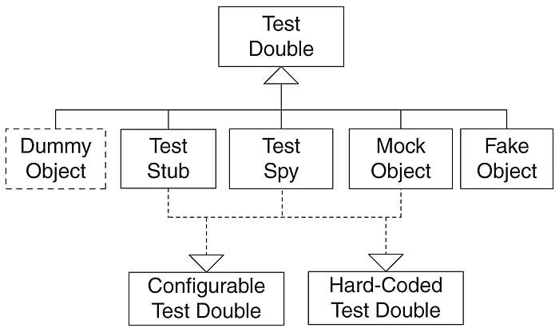
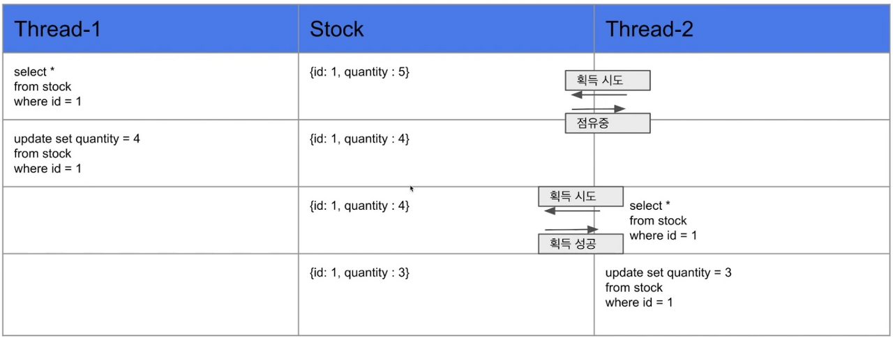
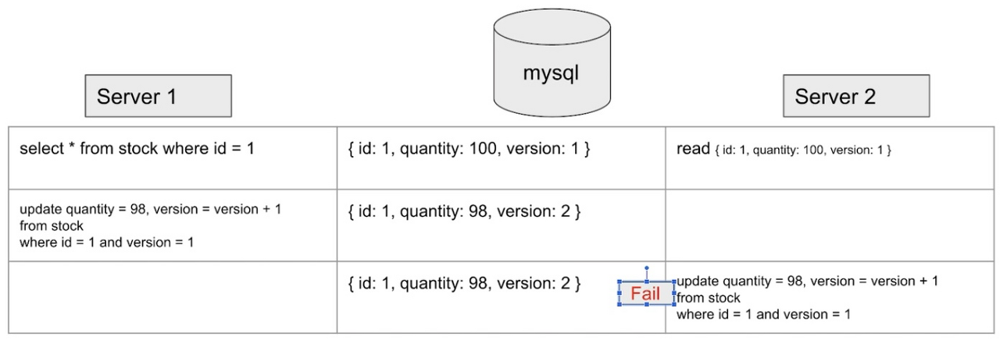
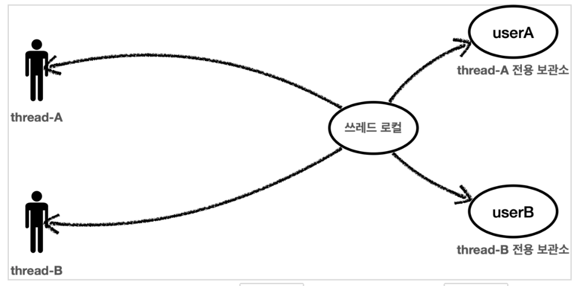

<nav>

목차

- 코드 리뷰
  - 코드 리뷰(체스 3, 4단계)(1)
  - 코드 리뷰(체스 3, 4단계)(2)
- 학습로그 학습하기
  - 방금 저장한 데이터의 ID 불러오기
  - 테스트 더블
- 레벨 인터뷰 공통 피드백
- 자잘한 기술부채
  - 동시성 이슈(Concurrency Issue)
  - 커넥션 풀(Connection Pool)
  - 생성자 체이닝(Constructor Chaining)
  - Junit5과 AssertJ의 차이
  - System.lineSeperator()(Java 1.7 이상)
  - EnumMap
  - length와 size()의 차이(=자바에서 길이와 크기의 차이)
  - 롬복(Lombok)

</nav>

## 코드 리뷰

---

### 코드 리뷰(체스 3, 4단계)(1)

- 패키지를 분리하는 기준에 대한 가이드가 있을까?

  [Spring Guide - Directory - Yun Blog | 기술 블로그](https://cheese10yun.github.io/spring-guide-directory/)

  패키지 구조 가이드는 크게 **레이어 계층형**과 **도메인형** 2가지로 분류된다.

  - 레이어 계층형

  ```
  └── src
      ├── main
      │   ├── java
      │   │   └── com
      │   │       └── example
      │   │           └── demo
      │   │               ├── DemoApplication.java
      │   │               ├── config
      │   │               ├── controller
      │   │               ├── dao
      │   │               ├── domain
      │   │               ├── exception
      │   │               └── service
      │   └── resources
      │       └── application.properties
  ```

  각 계층을 대표하는 디렉토리를 기준으로 코드들이 구성된다.
  장 : 전체적인 구조를 빠르게 파악할 수 있다.
  단 : 디렉터리에 클래스가 너무 많이 모이게 된다.

  - 도메인형

  ```
  └── src
      ├── main
      │   ├── java
      │   │   └── com
      │   │       └── example
      │   │           └── demo
      │   │               ├── DemoApplication.java
      │   │               ├── coupon
      │   │               │   ├── controller
      │   │               │   ├── domain
      │   │               │   ├── exception
      │   │               │   ├── repository
      │   │               │   └── service
      │   │               ├── member
      │   │               │   ├── controller
      │   │               │   ├── domain
      │   │               │   ├── exception
      │   │               │   ├── repository
      │   │               │   └── service
      │   │               └── order
      │   │                   ├── controller
      │   │                   ├── domain
      │   │                   ├── exception
      │   │                   ├── repository
      │   │                   └── service
      │   └── resources
      │       └── application.properties
  ```

  도메인 디렉터리를 기준으로 코드를 구성한다.
  장 : 관련된 코드들의 응집도가 높다.
  단 : 프로젝트에 대한 이해도가 낮을 경우 전체적인 구조를 파악하기 어렵다.

  - 도메인형 디렉터리 구조

    ⇒관련 코드들이 응집되어 있어 자연스레 개발 컨텍스트가 제공된다.

    도메인을 담당하는 디렉터리 `domain`, 전체적인 설정을 관리하는 `global`, 외부 인프라스트럭쳐를 관리하는 `infra`

    ```
    └── src
        ├── main
        │   ├── java
        │   │   └── com
        │   │       └── spring
        │   │           └── guide
        │   │               ├── ApiApp.java
        │   │               ├── SampleApi.java
        │   │               ├── **domain**
        │   │               │   ├── coupon
        │   │               │   │   ├── api
        │   │               │   │   ├── application
        │   │               │   │   ├── dao
        │   │               │   │   ├── domain
        │   │               │   │   ├── dto
        │   │               │   │   └── exception
        │   │               │   ├── member
        │   │               │   │   ├── api
        │   │               │   │   ├── application
        │   │               │   │   ├── dao
        │   │               │   │   ├── domain
        │   │               │   │   ├── dto
        │   │               │   │   └── exception
        │   │               │   └── model
        │   │               │       ├── Address.java
        │   │               │       ├── Email.java
        │   │               │       └── Name.java
        │   │               ├── **global**
        │   │               │   ├── common
        │   │               │   │   ├── request
        │   │               │   │   └── response
        │   │               │   ├── config
        │   │               │   │   ├── SwaggerConfig.java
        │   │               │   │   ├── properties
        │   │               │   │   ├── resttemplate
        │   │               │   │   └── security
        │   │               │   ├── error
        │   │               │   │   ├── ErrorResponse.java
        │   │               │   │   ├── GlobalExceptionHandler.java
        │   │               │   │   └── exception
        │   │               │   └── util
        │   │               └── **infra**
        │   │                   ├── email
        │   │                   └── sms
        │   │                       ├── AmazonSmsClient.java
        │   │                       ├── SmsClient.java
        │   │                       └── dto
        │   └── resources
        │       ├── application-dev.yml
        │       ├── application-local.yml
        │       ├── application-prod.yml
        │       └── application.yml
    ```

    1. domain 디렉터리

       ```
       ├── domain
       │   ├── member
       │   │   ├── api
       │   │   │   └── MemberApi.java
       │   │   ├── application
       │   │   │   ├── MemberProfileService.java
       │   │   │   ├── MemberSearchService.java
       │   │   │   ├── MemberSignUpRestService.java
       │   │   │   └── MemberSignUpService.java
       │   │   ├── dao
       │   │   │   ├── MemberFindDao.java
       │   │   │   ├── MemberPredicateExecutor.java
       │   │   │   ├── MemberRepository.java
       │   │   │   ├── MemberSupportRepository.java
       │   │   │   └── MemberSupportRepositoryImpl.java
       │   │   ├── domain
       │   │   │   ├── Member.java
       │   │   │   └── ReferralCode.java
       │   │   ├── dto
       │   │   │   ├── MemberExistenceType.java
       │   │   │   ├── MemberProfileUpdate.java
       │   │   │   ├── MemberResponse.java
       │   │   │   └── SignUpRequest.java
       │   │   └── exception
       │   │       ├── EmailDuplicateException.java
       │   │       ├── EmailNotFoundException.java
       │   │       └── MemberNotFoundException.java
       │   └── model
       │       ├── Address.java
       │       ├── Email.java
       │       └── Name.java
       ```

       - member 디렉터리
         - api : **컨트롤러** 클래스(외부 rest api로 프로젝트를 구성하는 경우가 많기 때문에 api라고 지칭함.)
         - application : 도메인 객체와 외부 영역을 연결해주는 파사드와 같은 역할을 주로 담당하는 클래스. service 계층과 유사.
           ex : _데이터베이스 트랜잭션 처리_
         - dao : repository와 유사. 조회 전용 구현체들이 많이 작성된다.
         - domain : **도메인 엔티티**에 대한 클래스. 특정 도메인에만 속하는 `embeddable`, `enum` 등의 클래스를 포함.
         - dto : 주로 Request, Response 객체들로 구성
         - exception : 도메인이 발생시키는 Exception
       - model 디렉터리
         - 도메인 엔티티 객체들이 공통적으로 사용할 객체들로 구성.(eembeddable, enum 등)

    2. global 디렉터리
       - common : 공통으로 사용되는 Value 객체들로 구성.
         ex : 페이징 처리를 위한 Request, 공통된 응답을 주는 Response 객체
       - config : 스프링 각종 설정들로 구성
       - error : 예외 핸들링을 담당하는 클래스.
       - util : 유틸성 클래스들이 위치.
    3. infra 디렉터리

       인프라 스트럭쳐와 관련된 코드.

       이메일 알림, SMS 알림 등 **외부 서비스**에 대한 코드.

- Controller 코드가 변할 수 있는 ‘상태’를 필드로 가지게 되면 컨트롤러 자체의 역할에서 벗어난 책임을 가지게 된다.

  [https://hsik0225.github.io/design pattern/2021/03/06/MVC-Pattern/](https://hsik0225.github.io/design%20pattern/2021/03/06/MVC-Pattern/)

- 하나의 connection을 프로그램이 종료될 때까지 사용했을 때 발생할 수 있는 문제점?
  - 한 커넥션을 오래 사용하게 되면 여러 스레드를 사용할 때 동시성 이슈가 있을 수 있고, 한 게임이 오래 걸릴 경우 커넥션 리소스가 부족해질 수 있다.
  - 필요할 때마다 커넥션을 열고 닫아주는 경우 새로 연결을 만들때마다 리소스가 많이 든다.
    - 이 문제를 해결하기 위해 커넥션 풀(Connection pool)을 두고 비용을 절약하기도 한다고 합니다!
- catch문에서 `Exception`을 받도록 하면 생길 수 있는 문제?

  사용자의 실수나 db관련 문제가 아닌, 다른 치명적인 오류가 반복적으로 발생하는 경우 문제를 파악하기 힘들 수 있다.

### 코드 리뷰(체스 3, 4단계)(2)

- Piece가 Trace에 의존하고 Trace는 Position에 의존하고 있기 때문에 Piece는 Position에 간접적으로 의존하고 있는 구조라고 할 수 있다.
  - 객체 간 협력이 필요없는 경우 최대한 의존성을 제거해주는 것이 좋다.
- 인터페이스에 매 객체를 판별하는 메서드를 추가하거나 enum 객체를 사용하는 것 중 어느 방법이 적절할까.

## 학습로그 학습하기

---

### 방금 저장한 데이터의 ID 불러오기

[우아한테크코스 학습로그 저장소](https://prolog.techcourse.co.kr/studylogs/2975)

DB에 방금 저장한 데이터의 Primary Key를 어플리케이션에서 불러오는 방법은 3가지가 있다.

전제 : Primary Key의 생성 전략은 `Auto_Increment`이다.

총 4가지 방법이 있다.

- Max를 이용한 방법

  Auto_Increment 전략으로 인해 방금 저장한 데이터의 Primary Key는 DB에 저장된 데이터 중 최댓값이 된다.
  때문에 해당 테이블의 Primary Key(예시에서는 id)의 MAX값을 조회하는 쿼리를 날려 방금 저장한 Primary Key 값을 가져올 수 있다.

  ```sql
  SELECT MAX(id) AS id FROM chess_game
  ```

- Last_Insert_Id()를 이용한 방법

  `Last_Insert_Id()` : MySQL에서 제공하는 함수로, 마지막에 저장한 데이터의 Primary Key를 반환한다.

  ```sql
  SELECT LAST_INSERT_ID() AS id FROM chess_game
  ```

- 테이블의 Auto_Increment 값을 가져오는 방법

  앞의 두 방법은 모두 save하기 전의 Auto_Increment 값을 가져오는 방법이다.
  테이블에서 바로 Auto_Increment 값을 가져올 수도 있다.

  ```sql
  SHOW TABLE STATUS WHERE name='테이블명'
  ```

- Statement.RETURN_GENERATED_KEYS를 사용한 방법

  앞의 세 방법들은 모두 데이터베이스를 다시 조회하면서 Primary Key 값을 가져오는 방법이다.
  반면 이 방법은 쿼리문 없이 자바에서 제공하는 메서드만으로 방금 저장한 데이터의 Primary Key 값을 불러올 수 있다.

  ```java
  private String saveChessGame(Connection connection, Color color) throws SQLException {
      PreparedStatement chessGameSave = connection.prepareStatement(
              "INSERT INTO chess_game(turn) VALUES(?)", Statement.RETURN_GENERATED_KEYS
      );

      chessGameSave.setString(1, color.name());
      chessGameSave.executeUpdate();
      return getSaveId(chessGameSave);
  }

  private String getSaveId(PreparedStatement chessGameSave) throws SQLException {
      ResultSet generatedKeys = chessGameSave.getGeneratedKeys();
      String saveId = null;

      if (generatedKeys.next()) {
          saveId = generatedKeys.getString(1);
      }

      return saveId;
  }
  ```

  connection.prepareStatement()의 두번째 인자에 Statement.RETURN_GENERATED_KEYS를 넣어주고, executeUpdate()를 호출하여 쿼리문을 실행한 뒤 getGeneratedKeys() 메서드를 사용해 ResultSet을 받아오면 된다.

  그리고 불러온 ResultSet에 대해 getString()을 사용해 방금 저장한 데이터의 Primary Key 값을 불러올 수 있다.

### 테스트 더블

[우아한테크코스 학습로그 저장소](https://prolog.techcourse.co.kr/studylogs/3094)

- 테스트 더블이란?
  
  : 영화 촬영에서 위험한 역할을 대신 해주는 스턴트 더블에서 유래된 용어로, 테스트하기 어려운 객체가 있을 때 해당 객체를 대신해 테스트를 진행할 수 있게 해주는 객체를 의미한다.

  - 이 외에도 성능 개선, 예측 불가능한 요소 제거, 감춰진 정보를 얻는 등의 목적으로도 사용된다.

- 테스트 더블을 사용하는 이유

  1. **테스트 대상 코드를 격리하기 위해**

     외부 시스템에 연결되는 의존성 문제를 해결할 수 있다.

     테스트의 초점이 분명해지고 이해하기 쉬운 테스트를 만들 수 있음.

  2. **예측 불가능한 실행 요소를 제거하기 위해**

     테스트는 몇 번의 수행을 하더라도 항상 같은 결과를 도출하도록 해야한다. 데이터베이스 등 상태에 따라 다른 결과가 도출될 수 있는 경우, 테스트 더블을 사용하여 예측할 수 없는 요소를 다룰 수 있다.

  3. **테스트 성능(속도) 향상**

     의존하는 객체의 로직 연산 없이 바로 수행되기 때문에 속도를 향상시킬 수 있다.

     데이터베이스 연결 등과 같은 부가적인 작업이 필요x

  4. **특정 상황에 대한 시뮬레이션을 위해**

     네트워크가 끊겼을 때 등 실제 객체를 사용했을 때 재현하기 어려운 상황을 테스트 더블을 사용해 쉽게 구현할 수 있다.

- 테스트 더블의 종류 - Dummy, Stub, Fake, Spy, Mock
- **Dummy**

  : **구현이 포함되어있지 않기** 때문에 아무런 동작을 수행하지 않는다.

  - 가장 기본적인 테스트 더블의 유형
  - null 값이나 기본 값과 같이 단순하고 하드코딩된 값으로 메서드 시그니처를 만족하기 위해 사용되며, 최종 결과를 만드는데 영향을 주지 않는다.
  - 인스턴스화된 객체만 필요하고 기능까지는 필요하지 않은 경우 사용된다.
  - 주로 파라미터로 전달되기 위해 사용된다.

  ```java
  public interface PringWarning {
      void print();
  }
  ```

  ```java
  public class PrintWarningDummy implements PrintWarning {
      @Override
      public void print() {
          // 아무런 동작을 하지 않는다.
      }
  }
  ```

- **Stub**

  : 인터페이스 or 기본 클래스가 **최소한으로 구현**되어 있는 상태의 객체

  - Dummy보다 더 정교한 테스트 더블의 유형
  - 특정 입력에 대해 고정된 출력(하드코딩한 값)을 반환하는 더미 객체로, Dummy 객체가 실제로 동작하는 것처럼 보이게 만든다.
  - 반환할 데이터들을 미리 정의해두어 메서드 호출 시 정의해둔 데이터를 그대로 반환만 한다.
  - 실제 코드나 아직 준비하지 못한 코드의 행동을 가장하는 행위를 수행한다.

  ```java
  public class StubUserRepository implements UserRepository {
      // ...
      @Override
      public User findById(long id) {
          return new User(id, "Test User");
      }
  }
  ```

  ```java
  public class StubUserRepository implements UserRepository {
      // ...
      @Override
      public User findById(long id) {
          return new User(id, "Test User");
      }
  }
  ```

  ⭐Mock 프레임워크를 사용할 수도 있다.(Mockito)
    <aside>
    ⚠️ build.gradle에 라이브러리를 추가해야 사용할 수 있다.
    
    ```
    dependencies {
    	testImplementation 'org.mockito:mockito-core:4.8.0'
    }
    ```
    
    </aside>

- **Fake**

  : 아직 존재하지 않는 의존성을 대체하기 위해 구현된 객체

  - 프로덕션에서 실제로 사용되는 객체는 아니지만 원본 객체와 같은 동작을 구현한 객체로, 원래 객체의 단순화된 버전이다.
  - stub은 파라미터를 통해 무슨 값을 받아도 하드코딩된 값이 전달되는 반면 fake는 실제 객체처럼 때에 따라 다른 결과 값을 반환할 수 있다.
  - 예제 - 실제 데이터베이스에 연결하지 않고 가짜 데이터베이스처럼 동작하는 Fake 객체를 만든다.

  ```java
  @Entity
  public class User {
      @Id
      private Long id;
      private String name;

      protected User() {}

      public User(Long id, String name) {
          this.id = id;
          this.name = name;
      }

      public Long getId() {
          return this.id;
      }

      public String getName() {
          return this.name;
      }
  }
  ```

  ```java
  public interface UserRepository {
      void save(User user);
      User findById(long id);
  }
  ```

  ```java
  public class FakeUserRepository implements UserRepository {
      private Collection<User> users = new ArrayList<>();

      @Override
      public void save(User user) {
          if (findById(user.getId()) == null) {
              user.add(user);
          }
      }

      @Override
      public User findById(long id) {
          for (User user : users) {
              if (user.getId() == id) {
                  return user;
              }
          }
          return null;
      }
  }
  ```

- **Spy**

  : 실제 객체처럼 동작하면서 객체의 메서드 호출 정보를 저장하거나 특정 로직을 수행한다.

  - Stub과 유사하나 호출된 메소드나 함수의 인자값, 반환값, 호출 횟수 등을 모니터링하거나 기록할 수 있어 호출 이력을 통해 기록하고 분석할 수 있다.
    Stub의 경우 상태에 대한 검증을 진행하지만 Spy는 Mock과 함께 행위(기능)에 대한 검증을 수행한다.
  - 예제
    : MailingService는 sendMail을 호출할 때마다 보낸 메일을 저장하고 몇 번 보냈는지를 체크한다.
    ⇒자기 자신이 호출된 상황을 확인할 수 있음

    ```java
    public class MailingService {
        private int sendMailCount = 0;
        private Collection<Mail> mails = new ArrayList<>();

        public void sendMail(Mail mail) {
            sendMailCount++;
            mails.add(mail);
        }

        public long getSendMailCount() {
            return sendMailCount;
        }
    }
    ```

    ⭐Mockito 프레임워크의 `verify()` 메서드가 같은 역할을 한다.

- **Mock**

  : 호출에 대한 기대를 명세하고 내용에 따라 동작하도록 프로그래밍된 객체

  - 복잡도나 정확성 등이 상태 기반 테스트에 비해 어렵다.
  - Dummy, Stub, Spy처럼 동작할 수 있다.
  - Spy와의 차이점
    - 실제 객체에서 부분적으로만 Stub으로서 기능하는 spy와 달리 Mock은 가짜 오브젝트다.
  - 예제
    : UserService 인터페이스의 구현체가 `findById()` 메서드를 동작했을 때 어떤 결과를 반환할 지 결정할 수 있다.

  ```java
  @ExtendWith(MockitoExtension.class)
  public class UserServiceTest {
      @Mock
      private UserRepository userRepository;

      @Test
      void test() {
          when(userRepository.findById(anyLong())).thenReturn(new User(1, "Test User"));

          User actual = userService.findById(1);
          assertThat(actual.getId()).isEqualTo(1);
          assertThat(actual.getName()).isEqualTo("Test User");
      }
  }
  ```

- 상태 기반 테스트 vs. 행위 기반 테스트
  | 상태 기반 테스트 | 행위 기반 테스트 |
  | ----------------- | ---------------- |
  | Dummy, Stub, Fake | Spy, Mock |

  - **상태 기반 테스트란?**

    : 특정 메서드를 거친 후 객체의 상태에 대해 **예상 값과 비교**하는 방식

  - **행위 기반 테스트란?**

    : 올바른 로직 수행에 대한 판단의 근거로 **특정 동작을 수행했는지**의 여부를 확인한다.

    - 메서드의 리턴 값이 없거나 리턴 값만으로 검증이 어려운 경우 수행한다.

📎코드 참조

[https://tecoble.techcourse.co.kr/post/2020-09-19-what-is-test-double/](https://tecoble.techcourse.co.kr/post/2020-09-19-what-is-test-double/)

## 레벨 인터뷰 공통 피드백

---

- 학습 관련
  - 규칙을 지키는 사례/위반되는 사례를 코드와 함께 학습하는 것이 좋다.
  - 주제에 관련된 키워드들에 대해 질문이 들어올거다 생각하고 다 공부하는 것이 좋다.
  - 글로 쓴 것을 한 번 말로 해보는 것이 좋다.
  - 구체적인 수치를 들어 설명하는 것이 좋다.
- 소프트스킬
  - 두괄식/양괄식으로
  - 질문에 대한 결론->근거(듣는 사람이 편하고, 말하는 사람은 포인트를 크게 벗어나지 않을 수 있다.)
  - 표현을 명확하게(답이 있는 질문->이거다, 저거다. 생각을 물어본 질문->동의한다/아니다/이렇게 생각한다) '~라고 알고 있다, ~인 것 같다' 지양
  - 쿠션어는 지양(좋지 않은 인상)
  - 칠판을 쓸 때, 코드를 쓴다면 설명하면서 한 줄씩 쓰는 것이 좋다.
- 페어활동 커뮤니케이션을 돌아보라

## 자잘한 기술부채

---

### ✅동시성 이슈(Concurrency Issue)

: 동일한 **하나의 데이터에 2개 이상의 스레드 또는 세션에서 가변 데이터를 동시에 제어할 때** 나타나는 문제로, 하나의 세션에서 해당 데이터를 수정 중일 때, 다른 세션에서 수정 전의 데이터를 조회해 로직을 처리함으로써 데이터의 정합성이 깨지는 문제.

- 가변 데이터에 **순차적으로 접근하게** 만듦으로써 해결할 수 있다.

  1. 데이터베이스의 lock을 활용한다.(feat. MySQL)

     1. 데이터에 Lock을 거는 방법(Pessimistic Lock)

        - exclusive lock(배타적 잠금)을 걸게 되면 해당 lock이 해제되기 전까지 다른 트랜잭션에서 데이터에 접근할 수 없게 된다.

        ⚠️데드락(DeadLock)이 걸릴 수 있기 때문에 주의해야 한다.

        

     2. 버전을 이용해 정합성을 맞추는 방법(Optimistic Lock)

        - 데이터를 읽은 후 update를 수행하기 전에 내가 읽은 버전이 맞는지 확인하며 업데이트한다.
        - 자원에 lock을 걸어 선점하는 것이 아니라 동시성 문제가 발생하면 그때가서 처리하는 방식
        - 실제 락을 사용하는 것이 아니라 버전을 활용한 **논리적 락**이라고 할 수 있다.
        - 절차
          - Server1이 version1임을 조건절에 명시하고 업데이트 쿼리를 날린다.
          - version1 쿼리가 업데이트되면서 DB는 version2가 된다.
          - Server2가 version1으로 업데이트 쿼리를 날리면 버전이 맞지 않아 실패한다.
          - 쿼리가 실패하면 server2에서 다시 조회하여 버전을 맞춘 후 업데이트 쿼리를 다시 날린다.

        

  2. 프레임워크 혹은 언어 단에서의 Synchronized 사용(동기)

     - 메소드에 Synchronized를 명시해주면 하나의 스레드만 접근이 가능하다.
     - 멀티 스레드 환경에서 스레드 간 데이터를 동기화시켜주기 위해 자바에서 제공되는 키워드이다.

     ```java
     /**
      * 재고 감소
      */
     @Transactional
     public synchronized void decrease(final Long id, final Long quantity) {
         Stock stock = stockRepository.findById(id).orElseThrow();
         stock.decrease(quantity);
         stockRepository.saveAndFlush(stock);
     }
     ```

     - 단점

       - 자바의 Syncronized는 하나의 프로세스 안에서만 보장된다.

         ⇒서버가 1대일 때는 문제가 없지만 서버가 2대 이상일 경우 데이터에 대한 접근을 막을 수 없다.

  3. 큐 등의 자료구조를 활용(네트워크처럼)

- 데이터베이스 외 케이스) 자바에서 멀티 스레드를 구현할 때 동시성 이슈가 발생하는 경우, ThreadLocal을 사용하여 해결할 수 있다.

  [Java - 동시성 문제와 해결책](https://backtony.github.io/java/2021-12-24-java-41/)
  

  - ThreadLocal : 해당 스레드만 접근할 수 있는 개인 저장소.
  - 사용법
    - 동시에 접근하는 자원의 타입을 ThreadLocal로 선언하고 기존의 타입을 제네릭 타입으로 선언해준다.
    - new ThreadLocal로 생성한다.
    - `ThreadLocal.set()` : 값을 저장
    - `ThreadLocal.get()` : 값을 조회
    - `ThreadLocal.remove()` : 값을 제거 \*스레드 사용 후 반드시 remove로 값을 제거해주어야 한다.

### ✅커넥션 풀(Connection Pool)

: 미리 여러 개의 데이터베이스 커넥션을 생성해놓고 필요할 때마다 꺼내쓰는 방법.

- 특징
  - 커넥션 풀 안의 커넥션들은 데이터베이스 요청이 들어올 때마다 새롭게 연결을 수립하고 닫는 대신 항상 **연결을 열린 상태로 유지**한다.
- 장점

  - 데이터베이스 요청이 들어올 때마다 데이터베이스 연결을 수립하고, 통신한 뒤 닫는 과정을 거치지 않아도 된다.

    ⇒데이터베이스 연결을 열고 닫는 비용을 절약할 수 있다.

- 데이터베이스 커넥션 풀 프레임워크
  `Apache Commons DBCP`, `Tomcat DBCP`, `HikariCP`, `Oracle UCP`
  - `HikariCP` : 스프링부트에 **기본으로 내장**되어 있는 JDBC 데이터베이스 커넥션 풀링 프레임워크
    - 성능이 매우 좋다.
  - HikariCP deadlock
    - 교착상태(deadlock) : 스레드가 서로의 DB Connection이 반납되기만을 무한정 대기하는 상황.
  - 커넥션 개수와 메모리는 trade-off 관계이므로 성능 테스트를 통해 최적의 알파 값을 찾아야 한다.

[데이터베이스 커넥션 풀 (Connection Pool)과 HikariCP](https://hudi.blog/dbcp-and-hikaricp/)

### ✅생성자 체이닝(Constructor Chaining)

: this 또는 super 키워드를 사용하여 생성자에서 다른 생성자를 호출하는 기술

- this : 동일한 클래스의 생성자에서 다른 생성자를 호출할 때 사용
- super : 자식 클래스 생성자에서 부모 클래스 생성자를 호출할 때 사용

### ✅Junit5과 AssertJ의 차이

- JUnit5(Java8 이상)
  ```java
  import org.junit.jupiter.api.Test;
  ...
    @Test
    void addition() {
      ...
    }
  ...
  ```
  ```java
  import static org.junit.jupiter.api.Assertions.*;
  ...
  assertEquals(expected, actual)
  ```
  - 장점
    - 테스트 메서드를 정의하는 다양한 어노테이션 제공
      `@Test`, `@RepeatedTest`, `@ParameterizedTest`, `@TestFactory`, `@TestTemplate`
      `@BeforeAll`, `@AfterAll`, `@BeforeEach`, `@AfterEach` 등등
- AssertJ
  ```java
  import static org.assertj.core.api.Assertions.*;
  ...
  assertThat(actual).isEqualTo(expected)
  ```
  - 장점
    - **메소드 체이닝**을 지원하기 때문에 좀 더 깔끔하고 읽기 쉬운 테스트 코드를 작성할 수 있다.
    - 개발자가 테스트를 하면서 필요하다고 상상할 수 있는 **거의 모든 메소드를 제공**

[[우테코] JUnit 5와 AssertJ로 테스트코드 작성하기](https://velog.io/@woonyumnyum/우코테-JUnit-5와-AssertJ로-테스트코드-작성하기)

[자바 테스트 라이브러리 - JUnit5, AssertJ](https://jiwondev.tistory.com/186)

### ✅System.lineSeperator()(Java 1.7 이상)

: OS에 맞는 줄바꿈(개행) 문자를 리턴

- OS에 따라 String의 줄바꿈(개행) 문자는 다르게 표현된다.
  - **Window** : `\r\n`
  - **Liniux** : `\n`

해당 문자를 직접 입력해 넣을 경우 서로 다른 OS에서 동작하는 프로그램에서 문제가 발생할 수 있다. 때문에 `System.lineSeperator()`를 사용한다.

- 이 외에 형식문자열 `%n`도 같은 용도로 사용할 수 있다.

```java
System.out.println("Hello" + System.lineSeparator() + "World");
System.out.print(String.format("%s%n%s", "Hello", "World"));
```

[Java - 줄바꿈(개행), OS에 맞게 처리하는 방법](https://codechacha.com/ko/java-line-separator/)

### ✅EnumMap

: Map 인터페이스에서 키를 특정 enum 타입만을 사용하도록 하는 구현체

- 장점
  - 특정 enum 타입만을 키로 받기 때문에 인터페이스가 명확해진다.
  - enum은 ordinal이라는 순차적인 정수값을 가지고 있기 때문에 HashMap처럼 충돌에 대응하는 작업을 할 필요가 없어진다.
- 단점
  - 시작부터 데이터의 사이즈가 enum으로 제한되기 때문에 문제가 발생할 수 있다.
- 사용법
  - 3개의 생성자를 가지고 있다.(key로 사용하고자 하는 Enum타입을 인자로 넘겨주어야 한다.)
  ```java
  //1
  final Map<TestEnum, Integer> map = new EnumMap<>(TestEnum.class);
  //2 (Copy)
  final Map<TestEnum, Integer> copiedMap = new EnumMap<>(map);
  //3 (Copy)
  final Map<TestEnum, Integer> hashMap = new HashMap<>();
  final Map<TestEnum, Integer> copiedHashMap = new EnumMap<>(hashMap);
  ```

[[JAVA] EnumMap 을 사용합시다.](https://www.manty.co.kr/bbs/detail/develop?id=61)

### ✅length와 size()의 차이(=자바에서 길이와 크기의 차이)

- 배열-length 속성
  ⭐배열은 **정렬**된 방식으로 동일한 유형의 **고정된 수**의 데이터를 저장한다.
  length - 배열에 있는 요소의 수가 아닌 **저장할 수 있는 요소의 최대 개수(최대 용량)**
- 컬렉션 - size() 메서드
  ⭐컬렉션 프레임워크의 모든 컬렉션은 동적으로 할당되므로 요소의 개수가 달라질 수 있다.
  size() - 컬렉션에 **현재 존재하는 요소의 수**를 반환한다.(요소 개수)

### ✅롬복(Lombok)

: Java 라이브러리의 일종으로, 반복되는 `getter`, `setter`, `toString` 등의 메서드 작성 코드를 줄여주는 코드 다이어트 라이브러리이다.

- Lombok은 여러가지 어노테이션을 제공하고 이를 기반으로 코드를 컴파일 과정에서 생성하는 식으로 동작한다.
- 장점
  - 복잡하고 반복되는 코드를 줄여줌으로써 코드의 가독성과 코딩 생산성을 높인다.
- 단점
  - 직관성의 문제로 개발자마다 호불호가 갈릴 수 있다.
  - API 설명과 내부 동작을 어느정도 숙지하고 사용해야 한다.
- 사용 예시

  - 기존 Java 코드

    ```java
    public class CategoryModel {
          private String id;
          private String parentId;
          private String name;
          private Long depthLevel;
          private Long seq;
          private String userYn;

          public CategoryModel() {}

          public CategoryModel(String id, String parentId, String name, Long  depthLevel, Long seq, String userYn) {
                super();
                this.id = id;
                this.parentId = parentId;
                this.name = name;
                this.depthLevel = depthLevel;
                this.seq = seq;
                this.userYn = userYn;
          }

          public String getId() {
                return id;
          }

          public void setId(String id) {
                this.id = id;
          }

          public String getParentId() {
                return parentId;
          }

          public void setParentId(String parentId) {
                this.parentId = parentId;
          }

          public String getName() {
                return name;
          }

          public void setName(String name) {
                this.name = name;
          }

          public Long getDepthLevel() {
                return depthLevel;
          }

          public void setDepthLevel(Long depthLevel) {
                this.depthLevel = depthLevel;
          }

          public Long getSeq() {
                return seq;
          }

          public void setSeq(Long seq) {
                this.seq = seq;
          }

          public String getUserYn() {
                return userYn;
          }

          public void setUserYn(String userYn) {
                this.userYn = userYn;
          }
          @Override
          public String toString() {
                return "CategoryModel [id=" + id + ", parentId=" + parentId  + ", name=" + name + ", depthLevel=" + depthLevel
                            + ", seq=" + seq + ", userYn=" + userYn + "]";
          }

    }
    ```

  - Lombok을 사용한 코드

    ```java
    @Getter
    @Setter
    @ToString
    @NoArgsConstructor
    @AllArgsConstructor
    public class CategoryModel {
          private String id;
          private String parentId;
          private String name;
          private Long depthLevel;
          private Long seq;
          private String userYn;

    }
    ```

    ⭐위 5개의 어노테이션은 `@Data` 어노테이션 하나만 붙여 사용할 수도 있다.

    ```java
    @Data
    public class CategoryModel {
          private String id;
          private String parentId;
          private String name;
          private Long depthLevel;
          private Long seq;
          private String userYn;
    }
    ```

➕`@Builder` 사용하기

클래스 또는 생성자에 붙여주면 파라미터를 활용하여 **빌더 패턴**을 자동으로 생성해준다.

- 예시

  ```java
  @Builder
  public class BuildMe {
      private String username;
      private int age;
  }
  ```

  위와 같은 코드는 컴파일 과정에서 다음과 같이 변환된다.

  ```java
  public class BuildMe {
      private String username;
      private int age;

      BuildMe(String username, int age) {
          this.username = username;
          this.age = age;
      }

      public static BuildMe.BuildMeBuilder builder() {
          return new BuildMe.BuildMeBuilder();
      }

      public static class BuildMeBuilder {
          private String username;
          private int age;

          BuildMeBuilder() {
          }

          public BuildMe.BuildMeBuilder username(String username) {
              this.username = username;
              return this;
          }

          public BuildMe.BuildMeBuilder age(int age) {
              this.age = age;
              return this;
          }

          public BuildMe build() {
              return new BuildMe(this.username, this.age);
          }

          public String toString() {
              return "BuildMe.BuildMeBuilder(username=" + this.username + ", age=" + this.age + ")";
          }
      }
  }
  ```

  빌더 클래스(BuildMeBuilder)가 자동으로 생성되었다.

[[JAVA] Lombok이란? Lombok 적용하는 방법](https://dololak.tistory.com/783)

[Lombok @Builder의 동작 원리](https://velog.io/@park2348190/Lombok-Builder의-동작-원리)
