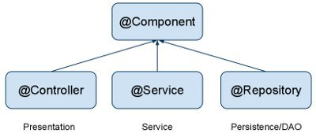

## 코드 리뷰

---

### 웹 자동차 경주 1단계(1)

- **Repository와 DAO의 차이는?**
  - **Repository** : 엔티티 객체를 보관하고 관리하는 저장소
  - **DAO** : 데이터에 접근할 수 있도록 DB 접근 관련 로직을 모아둔 객체
  - Repository에서 DB에 접근하기 위해 DAO를 사용할 수 있는 반면 DAO는 Repository를 사용할 수 없다.
- **RestController 와 Controller의 차이는?**
  - `@Controller` : 클라이언트의 요청에 대해 View를 반환하기 위해 사용한다.
    - 컨트롤러가 반환한 뷰의 이름으로 view 파일(일반적으로 html)를 찾아 렌더링한다.
  - `@RestController` : view가 아니라 Data를 반환할 때, 즉 RestAPI의 응답을 보내기 위해 사용한다.
    메서드 차원에서 `@ResponseBody` 어노테이션을 사용한 것과 동일한 기능을 한다.
    [[Spring] @Controller와 @RestController 차이](https://mangkyu.tistory.com/49)
- **VO와 Domain을 분리하지x(VO가 Domain에 포함되는 관계임)**
- **properties 와 yml의 차이는?**
  : 둘 다 프로젝트의 외부 속성을 설정하는 파일이다. Spring Boot을 사용할 때 application.properties(또는 application.yml)을 작성하게 되는데, properties 파일과 yml 파일의 차이점은 무엇일까?
  - .properties 파일
    - 문법적 특징
      - key-value 형식을 사용한다.
      - `${ }` 구문을 사용하여 다른 키, 시스템 속성 또는 환경 변수의 내용을 참조할 수 있다.
        ```java
        app.name=MyApp
        app.description=${app.name} is a Spring Boot application
        ```
      - List 표현 시 다음과 같이 배열 인덱스로 일일이 지정해주어야 한다.
        ```java
        application.servers[0].ip=127.0.0.1
        application.servers[0].path=/path1
        application.servers[1].ip=127.0.0.2
        application.servers[1].path=/path2
        application.servers[2].ip=127.0.0.3
        application.servers[2].path=/path3
        ```
  - .yml 파일
    - 문법적 특징
      - 계층적인 구성의 데이터를 지정하기 편리하다.
      - List를 표현하기 위해 다음과 같이 표현할 수 있다.
        ```java
        application:
            servers:
            -   ip: '127.0.0.1'
                path: '/path1'
            -   ip: '127.0.0.2'
                path: '/path2'
            -   ip: '127.0.0.3'
                path: '/path3'
        ```
      - 반복되는 접두사가 없어 properties에 비해 가독성이 좋다.
- **의존성 옵션 implementation, api, compileOnly, runtimeOnly 의 차이점?**

  - `ClassPath` : 클래스나 jar 파일이 존재하는 위치
    - `Compile-time classpath` : 에러 없이 컴파일을 하기 위해 필요한 클래스와 jar들의 위치
    - `Run-time classpath` : 애플리케이션이 정상적으로 실행되기 위해 필요한 클래스들과 jar들의 위치

  ```java
  class A{
    public static void main(String[] args){
      B b = new B();
    }
  }

  class B {
    public B() {
      return new C().sum();
    }
  }

  class C {
    public int sum(){
      return 5;
    }
  }
  ```

  위와 같은 코드가 있을 때, 의존성 방향은 `A→B→C`로 흐른다.
  여기서 컴파일 시점에서는 A와 B만 알고 있으면 오류가 발생하지 않으나, 런타임을 위해서는 C에 대한 정보도 가지고 있어야 한다. 이를 A와 B가 컴파일 타임 의존성을 가지고, A, B, C가 런타임 의존성을 가지고 있다고 할 수 있다.

  - `implementation` : 의존성을 compile classPath, runtime classPath 두 곳에 모두 추가한다. 라이브러리가 수정될 경우 직접적으로 의존관계에 있는 라이브러리만 rebuild된다.
  - `testImplementation` : \*\*\*\*테스트 코드를 수행할 때만 적용.
  - `api` : implementation과 유사하나, 라이브러리가 수정이 될 때 해당 라이브러리를 의존하고 있는 다른 라이브러리들도 모두 rebuild가 일어난다는 특징이 있다.
    - 속도 면에서 문제가 있다.
  - `compileOnly` : 의존성을 compileClassPath에만 추가한다.
    - 빌드 결과물의 사이즈가 줄어든다.
  - `runtimeOnly` : 의존성을 runtimeClassPath에만 추가한다.
    - 해당 클래스에서 코드 변경이 발생해도 컴파일을 다시 할 필요가 없다.
      [[Spring] Gradle 파일 implementation, api, runtimeOnly, compileOnly... 등에 대해](https://bepoz-study-diary.tistory.com/372)

- **dto는 계층간 데이터 교환을 위한 객체이므로 로직이 있어선 안된다.**
- **ExceptionHandler와 ControllerAdvice**
  - `@ExceptionHandler` : Controller, RestController 빈에서만 적용 가능
    - 파라미터/반환 타입은 아무거나 사용해도 된다.
    - @ExceptionHandler를 등록한 컨트롤러(컴포넌트)에 한해서만 적용된다.
  - `@ControllerAdvice` : 모든 @Controller, 즉 전역에서 발생할 수 있는 예외를 잡아 처리해준다.
    ```java
    @RestControllerAdvice
    public class MyAdvice {
        @ExceptionHandler(CustomException.class)
        public String custom() {
            return "hello custom";
        }
    }
    ```
    이와 같이 새로운 클래스를 만들어 어노테이션을 붙여주면 된다.
    - 예외를 감지하고자 하는 클래스를 패키지 단위로 제한할 수도 있다.
      `java @RestControllerAdvice("com.example.demo.login.controller") `
      [@ControllerAdvice, @ExceptionHandler를 이용한 예외처리 분리, 통합하기(Spring에서 예외 관리하는 방법, 실무에서는 어떻게?)](https://jeong-pro.tistory.com/195)

## 자잘한 기술부채

---

### ✅@ResponseBody

`@ResponseBody` 어노테이션을 사용하면 자바 객체를 **HTTP 응답 바디**로 변환해준다.

```java
@ResponseBody
@RequestMapping("/message")
public String string() {
		return "message";
}
```

위 예제 코드에서 `@ResponseBody` 어노테이션이 없으면 기본적으로 message 문자열이 응답 바디로 들어가는 것이 아니라 resources 레포에서 message.html 문서를 찾아 반환한다.

💡반대로 `@RequestBody` 어노테이션은 Http 요청의 본문(body)의 내용을 자바 객체로 매핑하여 가져올 수 있게 해준다.

```java
@PostMapping("/users/body")
public ResponseEntity requestBody(@RequestBody User user) {
		User newUser = new User(1L, user.getName(), user.getEmail());
    return ResponseEntity.created(URI.create("/users/" + newUser.getId())).body(newUser);
}
```

다만 GET 요청의 경우 요청 데이터가 URI/URL의 파라미터로 전달되기 떄문에 `@RequestBody` 어노테이션이 아니라 `@PathVariable`, `@RequestParam` 등의 어노테이션을 사용해야 한다.

### ✅Mapping

아래 어노테이션들은 HTTP Method에 매핑된다.

- `@RequestMapping` - 파라미터에 따라 매핑할 요청 Method를 설정해줄 수 있다.(GET이 기본)
- `@GetMapping` - GET 요청에 매핑된다.
- `@PostMapping` - POST 요청에 매핑된다.
- ...

원래 `@RequestMapping` 어노테이션만 있었고 `@GetMapping`, `@PostMapping` 등은 나중에 추가된 어노테이션이다.

아래 두 어노테이션은 같은 기능을 한다.

```java
@RequestMapping(value = "/mainBanner", method= {RequestMethod.POST} )
```

```java
@PostMapping("/mainBanner")
```

### ✅ResponseEntity

: 반환되는 HTTP 응답의 데이터와 응답 상태를 직접 정의해줄 수 있다.

- 구조
  - HttpStatus
  - HttpHeaders
  - HttpBody
    위 세가지 정보를 포함하고 있다.

```java
@ResponseBody
@GetMapping("/users/{id}")
public ResponseEntity responseEntity(@PathVariable Long id) {
		return ResponseEntity.ok(new User("name", "email"));
}

@ResponseBody
@GetMapping("/members")
public ResponseEntity responseEntityFor400() {
    return ResponseEntity.badRequest().build();
}
```

ResponseEntity 객체는 팩토리 메서드가 정의되어 있어서, 위와 같이 사용할 수 있다.

```java
ResponseEntity.ok(new User("name", "email"));
```

이 코드는 상술된 User 객체를 ResponseBody로 가지고, OK(상태코드 200) 상태를 가지는 응답객체를 생성한다.

### ✅@PathVariable

```java
@ResponseBody
@GetMapping("/users/{id}")
public ResponseEntity responseEntity(@PathVariable Long id) {
		return ResponseEntity.ok(new User("name", "email"));
}
```

URI에 들어간 변수명을 그대로 매개변수로 가져오고 `@PathVariable` 어노테이션을 붙여준다.

### ✅Media Types produces/consumes?

요청을 Mapping할 때 우리는 받고 싶은 데이터를 강제함으로써 오류 상황을 줄일 수 있다.

Media Types를 사용하면 들어오는 데이터와 나가는 데이터를 정해 처리할 수 있다.

- consumes는 들어오는 타입을 정의할 때 이용한다.(주로 POST Method에서 사용)
  만약 내가 json 유형의 데이터를 받고 싶다면 아래와 같이 처리할 수 있다.
  ```java
  @PostMapping(path = "/pets", consumes = MediaType.APPLICATION_JSON_VALUE)
  public void addPet(@RequestBody Pet pet) {
      // ...
  }
  ```
  이 경우 해당 uri를 호출하는 쪽에서(=요청을 보내는 쪽에서) 보내는 데이터가 json 형식이라는 것을 헤더에 명시해주어야 한다.
  즉, 해당 API는 uri가 /pets이며 `Content-Type:application/json`으로 설정된 요청만 받을 수 있다.
- produces는 반환하는 데이터 타입을 정의한다.(주로 GET Method에서 사용)
  ```java
  @GetMapping(path = "/pets/{petId}", produces = MediaType.APPLICATION_JSON_VALUE)
  @ResponseBody
  public Pet getPet(@PathVariable String petId) {
      // ...
  }
  ```
  요청하는 입장에서 특정 타입의 데이터를 원할 경우 해당 사항을 헤더에 명시해주어야 한다.`Accept:application/json`
- 요약
  - consumes는 클라이언트가 서버에게 보내는 데이터 타입을 명시한다.
  - produces는 서버가 클라이언트에게 반환하는 데이터 타입을 명시한다.

### ✅@RequestParam @RequestHeader

- @RequestParam
  파라미터 데이터로 name=hello라는 정보가 들어올 때, 다음과 같이 params 파라미터를 설정해줌으로서 해당 요청을 받게 할 수 있다.
  ```java
  @GetMapping(path="/message", params="name=hello")
  public ResponseEntity<String> messageForParam() {
      return ResponseEntity.ok().body("hello");
  }
  ```
  `@RequestParams` 어노테이션을 사용하여 아래와 같이 처리할 수도 있다.
  ```java
  @GetMapping(path = "/message")
  public ResponseEntity<String> messageForParam(@RequestParam("name") String name) {
  		return ResponseEntity.ok().body("hello");
  }
  ```
  ⇒요청 파라미터에서 “name”을 키로 갖는 값을 조회한다.
  ```java
  ...@RequestParams String name
  ```
  ⇒파라미터 이름과 변수 이름이 같다면 (”xxx”)을 생략할 수 있다.
  ```java
  public ResponseEntity<String> messageForParam(@RequestParam(required=false) String name) {
  		return ResponseEntity.ok().body("hello");
  }
  ```
  ⇒**required** 속성을 추가하여 필수 여부를 설정할 수 있다.(기본값은 true)
- @RequestHeader
  요청 헤더의 HEADER 정보가 hi인 요청을 받고자 할 때, 다음과 같이 Mapping 어노테이션의 headers 파라미터를 설정해줄 수 있다.
  ```java
  @GetMapping(path = "/message", headers = "HEADER=hi")
  public ResponseEntity<String> messageForHeader() {
  		return ResponseEntity.ok().body("hi");
  }
  ```
  `@RequestHeader` 어노테이션을 사용하여 아래와 같이 처리할 수도 있다.
  ```java
  @GetMapping(path = "/message")
  public ResponseEntity<String> messageForHeader(@RequestHeader("HEADER") String header) {
  		return ResponseEntity.ok().body("hi");
  }
  ```
  ⇒요청 헤더에서 “HEADER”를 키로 갖는 값을 조회한다.
  ```java
  ...@RequestHeader MultiValueMap<String, String> headerMap
  ```
  ⇒모든 HTTP 헤더를 MultiValueMap 형식으로 조회한다.

---

### ✅MySQL 쿼리 실행 메서드

JdbcTemplate 객체에서 제공하는 조회 쿼리문 실행 메서드는 `queryForObject()`, `query()` 2가지가 있다.

- queryForObject
  - 쿼리문 수행 결과가 **한 개**인 경우 객체 그대로를 반환한다.
  - 선택되는 컬럼 개수에 따라 두 가지 유형으로 사용되는 듯 하다.
    - 한 개의 컬럼이 선택될 때
      - 매개변수로 `String sql`, `Class<T> requiredType`, `@Nullable Object... args`를 받는다.
        - `sql` : 실행하려는 sql문
        - `requiredType` : Column을 읽어올 떄 사용할 타입
        - `args` : sql의 바인딩변수(’?’)에 셋팅될 값(가변 인자)
      - 사용 예시
        ```java
        public String getLastName(Long id) {
            String sql = "select last_name from customers where id = ?";
            return jdbcTemplate.queryForObject(sql, String.class, id);
        }
        ```
    - 여러 개의 컬럼이 선택될 때
      - 매개변수로 `String sql`, `RowMapper<T> rowMapper`, `@Nullable Object... args`를 받는다.
        - `sql` : 실행하려는 sql문
        - `rowMapper` : DB에서 조회한 데이터를 받아 setter()를 통해 VO에 저장해주는 역할을 수행해줄 함수형 인터페이스 구현체
        - `args` : sql의 바인딩변수(’?’)에 셋팅될 값(가변 인자)
      - 사용 예시
        ```java
        public Customer findCustomerById(Long id) {
            String sql = "select id, first_name, last_name from customers where id = ?";
            return jdbcTemplate.queryForObject(sql, (resultSet, rowNum)->
                            new Customer(resultSet.getLong("id"),
                                    resultSet.getString("first_name"),
                                    resultSet.getString("last_name")
                            )
                    , id);
        }
        ```
- query
  - 쿼리문 수행 결과가 **한 개 이상**인 경우 List로 반환한다.
  - 매개변수로 `String sql`, `RowMapper<T> rowMapper`, `@Nullable Object... args`을 받는다.
    - `sql` : 실행하려는 sql문
    - `rowMapper` : DB에서 조회한 데이터를 받아 setter()를 통해 VO에 저장해주는 역할을 수행해줄 함수형 인터페이스 구현체
    - `args` : sql의 바인딩변수(’?’)에 셋팅될 값(가변 인자)
  - 사용 예시
    ```java
    public List<Customer> findCustomerByFirstName(String firstName) {
        String sql = "select id, first_name, last_name from customers where first_name = ?";
        return jdbcTemplate.query(sql, (rs, rowNum) -> new Customer(
                rs.getLong("id"),
                rs.getString("first_name"),
                rs.getString("last_name")
        ),firstName);
    }
    ```

조회를 제외한 삽입, 수정, 삭제 쿼리문을 실행하는 메서드는 `update()`가 있다.

- 매개변수로 `String sql`, `@Nullable Object... args`를 받는다.
  - `sql` : 실행하려는 sql문
  - `args` : sql의 바인딩변수(’?’)에 셋팅될 값(가변 인자)
- 사용 예시
  ```java
  public void insert(Customer customer) {
          String sql = "insert into customers (first_name, last_name) values (?, ?)";
          jdbcTemplate.update(sql, customer.getFirstName(), customer.getLastName());
      }
  ```

### ✅KeyHolder

: insert 쿼리 실행 후 추가된 데이터의 primary key를 가져오고자 할 때 사용된다.

PreparedStatement와 함께 사용된다.

- 사용법
  : Connection 객체의 prepareStatement() 메서드에서 두번째 인자로 new String[]{”primaryKey 컬럼명”}을 넣어주고 update 메서드의 2번째 인자로 KeyHolder 객체를 넣어주면 쿼리문 실행 후 KeyHolder 객체에 primary key가 저장된다.
- 사용 예시

  ```java
  public Long insertWithKeyHolder(Customer customer) {
          final String sql = "insert into customers (first_name, last_name) values (?, ?)";
          KeyHolder keyHolder = new GeneratedKeyHolder();
          jdbcTemplate.update(
                  con -> {
                      PreparedStatement preparedStatement = con.prepareStatement(sql, new String[] {"id"});
                      preparedStatement.setString(1, customer.getFirstName());
                      preparedStatement.setString(2, customer.getLastName());
                      return preparedStatement;
                  },
                  keyHolder
          );

          return keyHolder.getKey().longValue();
      }
  ```

💡굳이 KeyHolder 객체를 사용하지 않을 경우, primary key와 동일한 타입의 변수를 선언하고 PreparedStatement 객체에 대해 직접 executeUpdate() 메서드를 호출함으로써 primary key를 가져올 수 있다.

```java
public Long insertWithKeyHolder(Customer customer) {
    final String sql = "insert into customers (first_name, last_name) values (?, ?)";
    int id;

		try {
				pstmt = conn.prepareStatement(sql, new String[] {"id"});
        preparedStatement.setString(1, customer.getFirstName());
        preparedStatement.setString(2, customer.getLastName());
        int count = pstmt.executeUpdate();
        if (count > 0) {
	        	resultSet = pstmt.getGeneratedKeys();
            if (resultSet .next()) {
            	id = resultSet .getInt(1);
            }
        }
    } finally {
    	close();
    }

    return id;
}
```

### ✅SqlParameterSource

`NamedParameterJdbcTemplate`를 사용하면 SQL 쿼리 안에서 `?`로 표현되는 바인딩 변수를 `:product`와 같이 이름을 붙여서 지정할 수 있다. 이 때 파라미터의 값을 지정하기 위해 SqlParameterSource를 사용할 수 있다.

- BeanPropertySqlParameterSource
  : 기본적인 구현체로, getter/setter가 있는 객체로부터 파라미터를 추출한다.
  - 사용 예시
    ```java
    public int useBeanPropertySqlParameterSource(Customer customer) {
            String sql = "select count(*) from customers where first_name = :firstName";
            SqlParameterSource parameterSource = new BeanPropertySqlParameterSource(customer);
            return namedParameterJdbcTemplate.queryForObject(sql, parameterSource, Integer.class);
        }
    ```
- MapSqlParameterSource
  key-value 형식으로 값을 지정해줄 수 있다.
  그냥 Map<String, Object> 객체를 사용할 수도 있지만, 비교되는 장점은 메서드 체인 형식으로 파라미터를 정의할 수 있다는 것이다.
  ```java
  SqlParameterSource params = new MapSqlParameterSource()
      .addValue("name", "판매자1")
      .addValue("address", "마포구 용강동");
  ```
  - 사용 예시
    ```java
    public int useMapSqlParameterSource(String firstName) {
            String sql = "select count(*) from customers where first_name = :first_name";
            SqlParameterSource namedParameters = new MapSqlParameterSource("first_name", firstName);
            return namedParameterJdbcTemplate.queryForObject(sql, namedParameters, Integer.class);
        }
    ```

### ✅자바 클래스를 스프링 빈으로 등록하는 방법

`@Component` , `@Service` 등의 어노테이션을 붙여주면 스프링이 해당 클래스를 스프링 빈으로 보고 자체적으로 처리한다.

- `@Service`, `@Component`의 차이점?
  
  - `@Component` : Spring에서 관리되는 객체임을 표시하기 위해 사용된다.
    | Annotation | Layer | UseCase |
    | ----------- | ------------------ | ---------------------------------------------------------------------------------------------------------------------------- |
    | @Repository | Persistence Layer | DB에 접근하는 코드 |
    | @Service | Business Layer | DB에 접근하는 코드는 repository에 위임비즈니스 로직과 관련된 모든 코드 |
    | @Controller | Presentation Layer | 클라이언트로 부터 요청이 왔을 때,dispatcherservlet이 handleradapter를 통해 컨트롤러를 찾기 위해'컨트롤러' 역할을 한다고 명시 |
  - 컴포넌트 클래스들에 모두 Component를 붙일 수 있지만, 역할을 명시적으로 구분해주기 위해 분리해서 사용한다.

### ✅의존성 주입(DI)

> **프로그램 디자인이 결합도를 느슨하게 되도록하고 의존관계 역전 원칙과 단일 책임 원칙을 따르도록 클라이언트의 생성에 대한 의존성을 클라이언트의 행위로부터 분리하는 것**
>
> _- 위키백과_

```java
import org.springframework.stereotype.Service;

@Service
public class BookService {

    private BookRepository bookRepository;

    public BookService(BookRepository bookRepository) {
        this.bookRepository = bookRepository;
    }
}
```

BoookService 클래스 객체를 만들기 위해서는 BookRepository 클래스를 필요로 하는데, 이를 **BookService 클래스는 BookRepository 클래스의 의존성을 가진다**고 한다. 즉, 두 클래스 간 **결합도가 높다**고 할 수 있다.

- 객체 내부에서 다른 객체를 직접 생성할 경우
  : A 클래스 내부에서 B 객체를 직접 생성하고 있는 경우, B 객체를 C 객체로 바꾸고 싶을 때 A 클래스도 함께 수정해야 한다.
  → 강한 결합
- 객체를 외부로부터 주입받을 경우
  : 런타임 시에 의존 관계가 결정되기 때문에 유연한 구조를 갖는다.
  →느슨한 결합
- `@Autowired`
  : 필요한 의존객체의 ‘타입’에 해당하는 빈을 찾아 주입하는 어노테이션
- **생성자 주입**

  ```java
  @Controller
  public class CocoController {
      private final CocoService cocoService;
    
      public CocoController(CocoService cocoService) {
          this.cocoService = cocoService;
      }
  }
  ```

  위 코드처럼 CocoService 객체를 CocoController 클래스 내에서 직접 생성하지 않고 생성자를 사용해 외부로부터 주입받는 것을 생성자 주입이라고 한다.
    <aside>
    💡 스프링 4.3 이후부터 클래스의 생성자가 하나이고, 그 생성자로 주입받을 객체가 Bean으로 등록되어 있다면 @Autowired 어노테이션을 생략할 수 있다.
    
    </aside>

- **필드 주입**

  ```java
  @Controller
  public class CocoController {

      @Autowired
      private CocoService cocoService;
  }
  ```

  - 필드에 `@Autowired` 어노테이션을 붙여주면 자동으로 의존성 주입이 된다.
  - 단점
    - 코드가 간결하지만 외부에서 변경하기가 힘들다.
    - 프레임워크에 의존적이고 객체지향적으로 좋지 않다.

- **수정자** **주입**
  ```java
  @Controller
  public class CocoController {
      private CocoService cocoService;
      
      @Autowired
      public void setCocoService(CocoService cocoService) {
      	this.cocoService = cocoService;
      }
  }
  ```
  - Setter 메소드에 `@Autowired` 어노테이션을 붙여주면 자동으로 의존성 주입이 된다.
  - 단점
    - 수정자 주입을 사용하면 setXXX 메서드를 public으로 열어두어야 하기 때문에 언제 어디서든 변경이 가능하다.
- 결론
  Spring 프레임워크 레퍼런스에서 권장하는 방법은 **생성자를 통한 주입**이다.
  - 이유
    - 순환 참조를 방지할 수 있다.
    - 불변성(필드를 final로 선언할 수 있기 때문)
    - 테스트에 용이하다.
- 참고 문서

[[Spring] 스프링 의존성 주입(DI) 이란?](https://devlog-wjdrbs96.tistory.com/165)

### ✅.gitkeep

: Git 사용자가 만든 **빈 파일**

- Git 저장소가 **빈 프로젝트 디렉토리를 유지**할 수 있도록 한다. 일반적으로 A라는 빈폴더를 생성하고 커밋을 하려고 하면 Git 저장소에 A폴더가 커밋되지 않는다.
  이럴 때 gitkeep파일을 A라는 폴더에 넣으면 A폴더가 커밋이 된다. 또 만일 B라는 폴더에 있던 다른 파일들이 모두 삭제되더라도 gitkeep 파일이 있으면 B폴더는 커밋할 때 없어지지 않고 유지된다.
