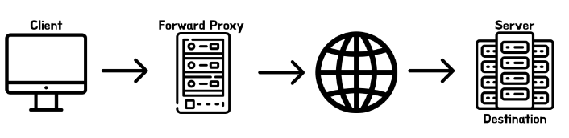

## 코드 리뷰

---

### 장바구니 1단계(1)

- service 계층을 만들지 않고 controller에서 조회하는 이유는?
- package를 계층적으로 잘 분류하자.
- dto의 형변환이 필요할 경우 별도의 util 클래스를 만들기보단 정적 팩토리 메서드를 활용하자.
- 다른 DB 라이브러리를 사용하게 될 것을 고려해서 테이블 명칭을 interface에 명시하고 구현체들에 라이브러리 명을 붙여주는 것이 좋다
  - 예 ) 인터페이스 ProductDao → 구현체 MySQLProductDao
- 페이지에 대해서도 테스트가 필요할까?
  - 이왕 테스트 하려면 전체 화면 구성이 제대로 되는지 확인하는 것이 더 중요할 것
- 프로덕션 DB와 테스트용 DB를 분리하자.
- 테이블 생성이나 초기 데이터를 추가할 때 코드에서 일일이 추가해주기보다 .sql파일에 sql문을 정의해주는 편이 편리하다.

### 장바구니 1단계(2)

- 수정/삭제 API의 반환 데이터는 일반적으로 어떻게 설계되어 있을까요?
- DTO에서 어디까지 검증을 해야하고, 도메인에서는 어느 부분을 검증해야할까요?

### 장바구니 1단계(페어)

- API의 반환값(컨벤션은 아니지만 어느정도의 룰은 존재함)
  - Post로 생성을 해주거나 Put으로 수정을 해줄 때, 반환값으로 변경된 데이터 또는 변경된 데이터의 id를 전달해주는 경우가 있다.
  - 굳이 필요하지 않다면 void로 사용하기도 한다.
- [Tip] controller에 요청을 보내는 방법
  - intelliJ에서 .http 파일을 만들어서 요청 목록을 저장해두고, 정해진 경로로 직접 요청을 보내볼 수 있다.
  - README에 request/response의 양식을 적는 것보다 명확하게 문서화가 가능하다.
- 서비스 레이어가 존재할 때 가질 수 있는 장점
  - 컨트롤러는 요청을 매핑해 적절한 서비스를 통해 DTO를 받아 반환하는 식으로 로직을 간단하게 관리할 수 있다.
  - 서비스에서는 엔티티를 직접 다루면서 DAO 조작을 수행하고, 연관관계 등으로 인해 **여러 DAO를 조작해야 할 때** 적절하게 순서를 조작하고 복잡한 로직을 모아 작성해줄 수 있다.
  - DAO 조작 시에 트랜잭션을 적절히 설정할 수 있음
- DB 조회 메서드에서 반환값은 Optional로 감싸주는 것이 좋다
  - 그렇게 하지 않았을 때 null이 반환되거나 예외가 발생해 해당 메소드를 사용하는 다른 로직에 영향을 줄 수 있기 때문

## 자잘한 기술부채

---

### ✅MockMvc와 RestAssured

- MockMvc

  - 웹 API를 테스트할 때 사용한다.
  - 스프링 MVC 테스트의 시작점이다.
  - 이 클래스를 통해 HTTP GET, POST 등에 대한 API 테스트를 할 수 있다.
  - **제공 메서드 이해하기**

  ```java
  @SpringBootTest
  @AutoConfigureMockMvc
  class PageControllerTest {

      @Autowired
      private MockMvc mockMvc;

      @Test
      @DisplayName("/로 get 요청을 보내면 상품목록에 대한 html 파일을 응답한다")
      void loadHome() throws Exception {
          MvcResult result = mockMvc.perform(MockMvcRequestBuilders.get("/"))
              .andExpect(MockMvcResultMatchers.status().isOk())
              .andReturn();
          String content = result.getResponse().getContentAsString();

          Assertions.assertThat(content).contains("<p class=\"product-name\">샐러드</p>", "<p class=\"product-price\">9500</p>");
      }
  ```

  - `perform(RequestBuilder mockMvcRequestBuilder)`

    - 브라우저에서 서버에 URL 요청을 하듯 컨트롤러를 실행시킬 수 있다.
    - 인자로 받게되는 MockMvcRequestBuilder객체의 정적 메소드들은 GET, POST, PUT, DELETE 요청 방식과 매핑되는 get(), post(), put(), delete() 가 있다.
    - url 뿐만 아니라 그 외 HTTP 요청 관련 정보들(파라미터, 헤더, 쿠키 등)도 설정할 수 있다.

  - `andExpect(ResultMatcher mockMvcResultMatchers)`

    - perform() 메서드는 요청의 결과로 리턴되는 **ResultActions** 객체가 제공하는 메서드로, 응답 결과를 검증할 수 있다.
    - MockMvcResultMatchers 객체의 메소드를 이용하여 검증할 수 있다.
    - `status()` : 응답 상태 코드 검증

      | 메소드                  | 설명                                                                                      |
      | ----------------------- | ----------------------------------------------------------------------------------------- |
      | isOK()                  |  응답 상태 코드가 정상 처리에 해당하는 200인지 확인한다.                                  |
      | isNotFound()            |  응답 상태 코드가 404 Not Found인지 확인한다.                                             |
      | isMethodNotAllowed()    |  응답 상태 코드가 메소드 불일치에 해당하는 405인지 확인한다.                              |
      | isInternalServerError() |  응답 상태 코드가 예외 발생에 해당하는 500인지 확인한다.                                  |
      | is(int status)          |  몇 번 응답 상태 코드가 설정되어 있는지 확인한다. 예 : is(200), is(404), is(405), is(500) |

    - `view()` : 뷰/리다이렉트 검증
    - `model()` : 모델 정보 검증 |
      | 메소드 | 설명 |
      | ------------------------------------ | ---------------------------------------------------------- |
      | attributeExists(String name) |  name에 해당하는 데이터가 Model에 포함되어있는지 검증한다. |
      | attribute(String name, Object value) |  name에 해당하는 데이터가 value 객체인지 검증한다. |

    - `andDo(ResultHandler handler)` : 요청/응답 전체 메시지 확인하기 - 실제로 생성된 요청과 응답 메세지를 모두 확인할 수 있다.
      - MockMvcResultHandlers.print() 메서드는 ResultHandler를 구현한 ConsolePrintingResultHandler 객체를 반환한다.
      - ConsolePrintingResultHandler를 andDo() 메소드 인자로 넘겨주면 콘솔에 요청/응답과 관련된 정보를 모두 출력한다. |

    [[SpringBoot] Test(2) MockMvc를 이용해서 테스트하기(@WebMvcTest, @AutoConfigureMockMvc)](https://elevatingcodingclub.tistory.com/61)

- RestAssured

  - REST API를 단순히 테스트하는 Java DSL(Domain-specific language)
  - POST, GET, PUT, DELETE, PATCH 및 HEAD Request를 지원하며, 요청과 응답을 검증하는 데 사용
  - given-when-then 패턴을 사용해 가독성이 좋다.
  - 응답된 json, xml을 손쉽게 검증할 수 있다.
  - 블랙박스 테스트이다.(요청과 응답으로 결과를 확인)
  - **제공 메서드 이해하기**

    ```java
    @SpringBootTest(webEnvironment = SpringBootTest.WebEnvironment.RANDOM_PORT)
    class CartControllerTest {

        private static final String EMAIL = "songsy405@naver.com";
        private static final String PASSWORD = "abcd";

        @LocalServerPort
        int port;

        @Autowired
        private JdbcTemplate jdbcTemplate;

        @BeforeEach
        void setUp() {
            RestAssured.port = port;
        }

    		@Test
        @DisplayName("/cart로 잘못된 형식의 post 요청을 보내면 상태코드 400(BadRequest)을 응답한다")
        void addCart_fail() {
            RestAssured
                .given().contentType(ContentType.JSON)
                .auth().preemptive().basic(EMAIL, PASSWORD)
                .when().post("/cart/2")
                .then().statusCode(400).body(Matchers.containsString("장바구니에 해당 제품이 이미 존재합니다."));
        }

    		...

    }
    ```

    - `given()` : RequestSpecification 객체가 생성된다. 여기서 다양한 요청 값을 세팅할 수 있다.
    - `when()` : HTTP Resource를 지정한다. 여기서 HTTP Method와 path를 지정하면 요청이 보내진다. 만약 잘못된 요청 값이나 path가 잘못되면 요청은 실패하고 error를 확인할 수 있다.
    - `then()` : 응답을 확인할 수 있다. 검증은 RestAssured에서 제공하는 메서드를 사용하거나, 응답만 추출하여 AssertJ로 검증하는 방법이 있다.

[https://loopstudy.tistory.com/427](https://loopstudy.tistory.com/427)

- MockMvc VS RestAssured
  - `MockMvc` : 스프링 MVC의 동작을 재현할 수 있는 라이브러리
    - Controller 수준의 단위 테스트에 사용된다.
    - @WebMvcTest를 통해 Presentation Layer의 Bean들만 불러온다.(그 외의 Bean은 Mocking된 Beand을 가져온다.)
  - `RestAssurred` : REST 웹 서비스를 검증하기 위한 라이브러리
    - E2E 테스트에 사용된다.
    - @SpringBootTest로 **실제 요청**을 보내서 전체적인 로직을 테스트한다.
      [MockMvc VS RestAssured](https://tecoble.techcourse.co.kr/post/2020-08-19-rest-assured-vs-mock-mvc/)

### ✅Model과 ModelAndView의 차이

- Model

  ```java
  @GetMapping("/apple")
  public String test(@ModelAttribute Member member,HttpServletRequest request, Model model){

      model.addAttribute("Member", member);

      return "home";
  }
  ```

  요청 시 params 값으로 들어온 데이터를 Member 객체에 파싱하고, 해당 객체를 model에 담은 뒤 view(home.html)를 반환한다.

  ```html
  <!DOCTYPE html>
  <html th:replace="~{layouts/base :: layout(~{::title},~{::section})}"
        xmlns:th="http://www.thymeleaf.org">
  <head>
      <title>홈 입니다.</title>
  </head>
  <body>

  <section th:object="${member}">

      <button type="button" onclick="location.href='/modify'" th:if="${member.memberId != null}">회원수정</button>

      </section>
  </section>
  </body>
  </html>
  ```

  앞서 controller의 api 메서드에서 model에 담아준 데이터를 반환된 html에서 사용할 수 있다.

  - 제공 기능
    | Method | 설명 |
    | ------------------ | --------------------------------- |
    | addAttribute | Model에 속성추가 |
    | getAttribute | Model에 있는 속성을 조회 |
    | addAttributes | Model에 속성을 여러개 추가 |
    | getAttributes | Model에 속성을 여러개 조회 |
    | containsAttributes | Model에 특정한 속성이 있는지 확인 |
    | mergeAttributes | Model 두개를 합침 |

- ModelAndView
  - Model과 비슷하지만 Model에 비해 더 확장성 있다.
  - Model은 속성을 추가/삭제만 할 수 있지만 ModelAndView는 view 설정, model 설정, 상태 설정, 기타 기능까지 많이 가지고 있다.
  - 제공 기능
    | Method | 설명 |
    | ----------- | ------------------------------- |
    | setViewName | view 이름을 설정 |
    | getViewName | view 이름을 조회 |
    | setView | view 설정 |
    | getView | view 조회 |
    | hasView | 설정되어있는 view가 있는지 확인 |
    | getModelMap | 내부의 모델 Map 조회 |
    | getModel | 내부 모델 조회 |
    | getStatus | 상태 설정 |

[[Spring Boot] Model 과 ModelAndView 차이.](https://bestkingit.tistory.com/155)

### ✅Repository와 DAO

- DAO는 **테이블 당 하나**(Entity 중심으로)를 만들어야 한다.
- Repository는 **Domain 객체 당 하나**를 만든다.
  - Repository로 다루는 객체를 다루기 위해 여러 테이블에 접근해야 한다면 여러 DAO를 사용할 수 있다.

[DAO와 Repository의 차이점](https://isaac56.github.io/etc/2021/08/29/difference_DAO_Repository/)

### ✅@ModelAttribute와 @RequestBody 차이

- `@ModelAttribute`
  - **파라미터**로 전달된 데이터를 처리한다.
- `@RequestBody`
  - **request body**를 통해 전달된 내용을 처리한다.

### ✅PRG 패턴(Post-Redirect-Get)

: HTTP POST 요청에 대한 응답이 또 다른 URL로의 GET 요청을 위한 리다이렉트(응답 코드 3XX)여야 한다.

- PRG 패턴을 사용하지 않았을 때의 문제

  - 새로고침으로 인한 동일한 요청이 연속적으로 보내지는 이슈가 발생할 수 있다.
  - POST 요청은 URL을 복사하더라도 다른 사람과 공유할 수 없다.

    : POST 요청을 보내게 되면 URL에 파라미터 값들이 남아있지 않으므로 특정 파라미터가 필요한 POST 요청의 경우 URL을 복붙하더라도 에러 페이지만 로드된다.

- PRG 패턴 적용 전 코드

  - MainController.java

    ```java
    @Controller
    class MainController {

        @GetMapping
        public String loadMain(){
            return "main";
        }

        @PostMapping("/menu")
        public String addMenu(){
            // 메뉴 로직
            return "success";
        }
    }
    ```

  - main.html
    ```html
    <!DOCTYPE html>
    <html lang="en">
      <head>
        <meta charset="UTF-8" />
      </head>
      <body>
        <form action="/menu" method="post">
          <button>메뉴 등록</button>
        </form>
      </body>
    </html>
    ```
  - success.html
    ```html
    <!DOCTYPE html>
    <html lang="en">
      <head>
        <meta charset="UTF-8" />
      </head>
      <body>
        <p>메뉴가 성공적으로 등록되었습니다.</p>
      </body>
    </html>
    ```
    이 경우, [메뉴 등록] 버튼을 클릭하고 성공 시 정상적으로 성공 페이지로 이동하지만, 해당 페이지에서 새로고침을 하게 되면 똑같은 POST 요청이 반복적으로 보내진다.

- PRG 패턴 적용 후 코드
  Post 요청이 들어온 경우 /success 페이지로 리다이렉트한다.

  ```java
  @Controller
  class MainController {

      @GetMapping
      public String loadMain(){
          return "main";
      }

      @PostMapping("/menu")
      public String addMenu(){
          // 메뉴 등록 로직
          return "redirect:/success";
      }

      @GetMapping("/success")
      public String loadSuccess(){
          return "success";
      }
  }
  ```

  이 경우, 브라우저에서는 `/menu` 라는 POST 요청이 오게 되면 302 응답코드를 받게 되고, 302 응답코드를 받은 브라우저는 `/success`라는 곳으로 리다이렉트시킨다.

  브라우저는 `/success`로 이동했으므로 새로고침을 하더라도 `GET /success`로 새로고침을 하는 것이라 메뉴 등록 로직이 중복으로 발생하지 않고, 3XX 응답 코드를 받은 페이지에 대해서는 브라우저에서는 저장하고 있지 않으므로 뒤로가기를 하더라도 해당 페이지(`/menu`)가 나오지 않게 된다.

  [PRG 패턴 (Post-Redirect-Get) - 삽질중인 개발자](https://programmer93.tistory.com/76)

### ✅테스트 코드의 Fixture

중복 발생되는 무언가(행위)를 고정시켜 한 곳에 관리하겠다는 개념.

동일하거나 유사한 개체 집합에 대해 작동하는 두 개 이상의 테스트가 있는 경우 테스트 Fixture를 사용하는 것이 좋다.

| Annotation  | Description                    |
| ----------- | ------------------------------ |
| @BeforeAll  | 테스트 메소드 시작 전 1번 실행 |
| @AfterAll   | 테스트 메서드 종료 후 1번 실행 |
| @BeforeEach | 각 테스트 메소드 시작 전 실행  |
| @AfterEach  | 각 테스트 메소드 종료 후 실행  |

- 예시

  - 서로 다른 테스트 메서드에서 동일한 객체를 생성해야 하는 상황에서, 다음과 같이 중복된 객체를 미리 정의해서 고정해두는 방식으로 Fixture를 구성할 수 있다.

    ```java
    private Money f12CHF_fixture;
    private Money f14CHF_fixture;
    private Money f28USD_fixture;

    @BeforeAll
    public void setUp() {
        f12CHF_fixture= new Money(12, "CHF");
        f14CHF_fixture= new Money(14, "CHF");
        f28USD_fixture= new Money(28, "USD");
    }
    ```

  - 객체가 생성될 경우를 별도의 클래스에 미리 정의해두어서(ex : utils) 테스트에서 가져다 쓰도록 한다.

    - Fixtures

      ```java
      public class MoneyFixtures {
          public static Money createMoney(final int money) {
              return new Money(money, "default");
          }

          public static Money createMoney(final String country) {
              return new Money(10000, country);
          }

          public static Money createMoney(final int money, final String country) {
              return new Money(money, country);
          }
      }
      ```

    - Test

      ````java
      public class MoneyFixtureTest {
      private Money m12CHF = MoneyFixtures.createMoney(12);
      private Money m14CHF = MoneyFixtures.createMoney(14);

              @Test
              public void simpleAdd() {
                  Money expected = MoneyFixtures.createMoney(26);
                  Money result= m12CHF.add(m14CHF);

                  Assertions.assertThat(expected).isEqualTo(result);
              }
          }
          ```

      이처럼 테스트 Fixture는 일종의 ‘개념’이기 때문에 구성하는 방법은 다양하다.
      ````

[[Junit] Test Fixture 란 ❓](https://thalals.tistory.com/375)

### ✅@Transactional의 readOnly 속성

`@Transactional(readOnly=true)`로 해두고 변경이 필요한 메서드에만 `@Transactional`을 붙여주면 예상치 못한 변경을 어느정도 방지할 수 있다.

```java
@Transactional(readOnly=true)
@SpringBootTest
public class Test{

	...
		@Transactional
		@Test
		public void test(){
				...
		}

```

### ✅Controller의 분류 기준은 어떻게?

페이지별로 vs 도메인별로 vs RestController&Controller

⇒일반적으로 도메인 별로 controller를 나눈다.

### ✅Proxy Server

> 클라이언트가 자신을 통해 다른 네트워크 서비스에 간접적으로 접속할 수 있게 해주는 컴퓨터 시스템이나 응용 프로그램
>
> -위키 백과

- **Forward Proxy**
  : 클라이언트 호스트들과 접근하고자 하는 원격 리소스 사이에 위치시키는 프록시 서버
  
  - Forward Proxy Server를 사용했을 때의 장점
    - **익명성** : 개인 정보를 보호할 수 있다.
    - **캐싱** : 인터넷 속도를 향상시킬 수 있다.
      - 프록시 서버가 웹 페이지를 가져올 때 자신의 데이터베이스에 최근 데이터를 저장해놓는다.(cache)
    - **콘텐츠 필터, 로그 기록 관리**
      - 서버에게 개인 정보가 보호되지만 프록시 서버에는 클라이언트의 기록이 남아있다. 이 기록을 보면 어떤 IP에서 어디에 얼마나 오래 접속했는지 기록을 확인할 수 있다.
      - 이를 활용해 프록시 서버가 방문할 수 있는 웹사이트를 제한할 수 있다.
    - **접근 제한(방화벽)**
      - 프록시 서버와 방화벽은 다른 것이지만 일반적으로 보안을 위해 함께 사용된다.
      - 요청에포함된 네트워크 패킷을 제어할 수 있다.
- **Reverse Proxy**
  : 프록시 서버를 인터넷 리소스 또는 인트라넷 리소스 앞에 위치시키는 방식
  
  사용자가 웹 서비스에 데이터를 **요청**하면 Reverse 프록시가 이 요청을 받아 내부 서버에서 데이터를 받은 후에 이 데이터를 사용자에게 전달한다.
  - 해당 프록시 서버를 사용하면 클라이언트들이 프록시 서버에 연결되었다는 것을 인식하지 못한다.
  - 장점
    - **캐싱**
      - 한국에 있는 유저가 미국에 웹 서버를 두고 있는 사이트에 접속할 때, 리버스 프록시 서버가 한국에 있다고 하자. 리버스 프록시 서버에 캐싱되어 있는 데이터를 사용할 경우 더 빠른 성능을 보여줄 수 있다.(forward proxy 캐싱과 비슷함)
    - **보안**
      - 본래 서버의 IP 주소를 노출시키지 않을 수 있어 해커들의 디도스 공격 등을 막을 수 있다.
      - 요청이 서버에 직접 접근하는 것을 1차적으로 막을 수 있다.
    - **SSL 중앙화 관리**
      - 리버스 프록시 서버가 들어오는 요청을 복호화하고 나가는 응답을 암호화해줌으로서 본래 서버의 부담을 줄여줄 수 있다.
    - **로드 밸런싱**
      - 리버스 프록시 뒤에 여러 개의 WAS를 둠으로써 사용자 요청을 **분산**시킬 수 있다.
- **Load Balancer**
  : 서버에 가해지는 부사를 분산해주는 장치 또는 기술을 통칭한다.
  클라이언트와 서버 풀 사이에 존재하며, 한 대의 서버로 부하가 집중되지 않도록 트래픽을 관리해 각각의 서버가 최적의 성능을 보일 수 있게 한다.
  
  - scale-up, scale-out
    
    - Scale-up : 서버 자체의 성능을 확장하는 것
    - Scale-out : 기존 서버와 동일하거나 낮은 성능의 서버를 두 대 이상 증설하여 운영하는 것.
      ⇒Scale-out의 방식으로 서버를 증설할 경우 로드 밸런싱이 반드시 필요하다.
- 이미지 출처 - 우테코 크루 ‘폴로’의 테코톡 발표자료

[🌐 Reverse Proxy / Forward Proxy 정의 & 차이 정리](https://inpa.tistory.com/entry/NETWORK-📡-Reverse-Proxy-Forward-Proxy-정의-차이-정리#서버_보안_security)

[로드밸런서(Load Balancer)의 개념과 특징](https://m.post.naver.com/viewer/postView.naver?volumeNo=27046347&memberNo=2521903)

### ✅Interface Injection(인터페이스 주입)

인터페이스를 자동 주입할 때 주입할 객체의 클래스를 지정하는 방법?

- 객체 변수명으로 구분
  해당 인터페이스를 사용하는 코드에서 객체의 변수명에 해당하는 의존성이 있다면 주입해준다.

  ```java
  @Autowired
  private ShopRepository jdbcShopRepository;

  @Autowired
  private ShopRepository HibernateShopRepository;
  ```

- 이름이 인터페이스와 같다면 @Primary를 사용
  `@Primary` 어노테이션을 사용하여 어느 구현체를 우선적으로 주입할지 우선순위를 정해줄 수 있다.
  ```java
  @Autowired
  private ShopRepository shopRepository;
  ```
  ```java
  @Primary
  @Repository
  public class jdbcShopRepository implements ShopRepository {
      ...
  }
  ```
  ```java
  @Repository
  public class HibernateShopRepository implements ShopRepository {
      ...
  }
  ```
  이와 같은 경우 ShopRepository 객체를 주입할 시 jdbcShopRepository 클래스 객체가 우선적으로 주입된다.
- @Qualifier
  구현체를 직접 지정해주고 싶은 경우 `@Qualifier` 어노테이션을 사용할 수 있다.

  ```java
  @Autowired
  @Qualifier("JdbcShopRepository")
  private ShopRepository shopRepository1;

  @Autowired
  @Qualifier("HibernateShopRepository")
  private ShopRepository shopRepository2;
  ```

[interface 란? spring interface injection - interface의 구현체 주입](https://hyeonguj.github.io/2020/02/07/java-interface-1/)

### ✅MockMvc을 사용할 때 페이지 내의 여러 문자열의 포함 여부를 확인하는 방법

```java
@Test
    @DisplayName("/admin로 get 요청을 보내면 관리자 페이지에 대한 html 파일을 응답한다")
    void loadAdmin() throws Exception {
        mockMvc.perform(MockMvcRequestBuilders.get("/admin"))
            .andExpect(MockMvcResultMatchers.status().isOk())
            .andExpect(MockMvcResultMatchers.content()
                .string(Matchers.containsString("<title>관리자 페이지</title>")));
    }
```

위 방식대로 andExpect() 메서드로 문자열 포함 여부를 검증하는 경우 한 개의 문자열만 검증할 수 있다.(방법을 아무리 찾아봐도 보이지 않았다…)

여러 개의 문자열의 포함 여부를 한 번에 검증하고 싶은 경우 아래 코드처럼 결과 content를 추출하고 `Assertions.assertThat().contains()` 메서드를 사용하면 된다.

```java
@Test
    @DisplayName("/로 get 요청을 보내면 상품목록에 대한 html 파일을 응답한다")
    void loadHome() throws Exception {
        MvcResult result = mockMvc.perform(MockMvcRequestBuilders.get("/"))
            .andExpect(MockMvcResultMatchers.status().isOk())
            .andReturn();
        String content = result.getResponse().getContentAsString();

        Assertions.assertThat(content).contains(
            "",
            "<p class=\"product-name\">피자</p>", "<p class=\"product-price\">13000</p>",
            "",
            "<p class=\"product-name\">치킨</p>", "<p class=\"product-price\">27000</p>",
            "",
            "<p class=\"product-name\">샐러드</p>", "<p class=\"product-price\">9500</p>");
    }
```

[How to check String in response body with mockMvc](https://stackoverflow.com/questions/18336277/how-to-check-string-in-response-body-with-mockmvc)

### ✅sql 스크립트 파일로 DB 정의하기

resources 폴더의 application.properties 파일에 다음과 같은 코드를 작성해주면 test_shopping_cart라는 데이터베이스를 만들고 사용하게 된다.

```java
spring.h2.console.enabled=true
spring.datasource.url=jdbc:h2:mem:test_shopping_cart;MODE=MySQL
spring.datasource.driver-class-name=org.h2.Driver
```

이후 sql 스크립트 파일(.sql)을 작성하면 코드가 실행되기 전에 해당 쿼리문들이 적용된다.

```java
DROP TABLE product IF EXISTS;

CREATE TABLE product(
    `id` BIGINT NOT NULL AUTO_INCREMENT,
    `name` VARCHAR(20) NOT NULL,
    `price` INT NOT NULL,
    `image_url` TEXT NOT NULL,
    PRIMARY KEY(id)
);

INSERT INTO product(name, price, image_url) VALUES ('피자', 13000, 'https://...');
INSERT INTO product(name, price, image_url) VALUES ('치킨', 27000, 'https://...');
INSERT INTO product(name, price, image_url) VALUES ('샐러드', 9500, 'https://...');
```

테스트 코드의 경우에도 동일하게 resources>application.properties, data.sql 파일들 만들어주면 프로덕션 코드와 별개로 DB의 초기 상태를 설정해줄 수 있다.


