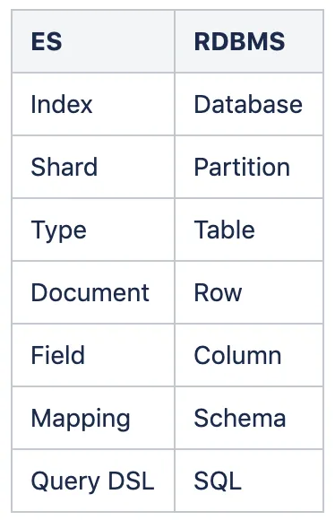
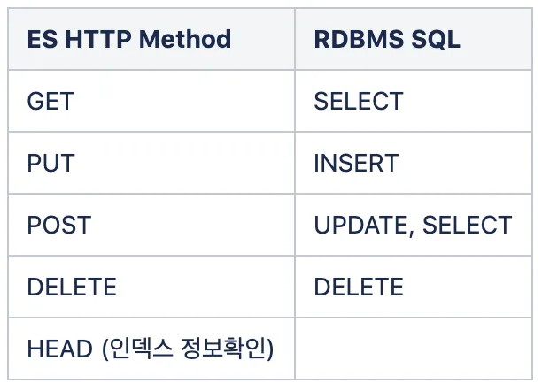

## 자잘한 기술부채

---

### ✅@ExtendWith(MockitoExtension.class)

테스트 코드에서 **Mock 어노테이션**을 사용하기 위해 테스트 class에 붙여주는 어노테이션

<aside>
💡 Junit4의 경우 `@RunWith(MockitoJUnitRunner.class)`을 사용한다.

</aside>

- 예시 코드

  ```java
  @ExtendWith(MockitoExtension.class)
  class StudylogSessionServiceTest {

      @Mock(answer = Answers.CALLS_REAL_METHODS)
      private StudylogRepository studylogRepository;
      @InjectMocks
      private StudylogSessionService sessionService;
  		...
  ```

### ✅엘라스틱 서치(elasticsearch)

분산형 RESTful 검색 엔진

- NoSQL의 일종
- 기존 RDBMS와의 비교
  - 데이터 구조
    
  - 데이터 조작법(SQL)
    

<aside>
💡 **역색인(inverted index)**
: 일반적인 색인 방법은 ‘문서의 위치’에 대한 index를 만들어서 그 문서에 접근하고자 하는 것인 반면, 역색인은 반대로 ‘문서 내의 문자와 같은 내용물’의 맵핑 정보를 색인해 놓는 것이다.
쉬운 예시로, 일반 색인(forward index)은 책의 목차와 같은 의미이고 역색인은 책 가장 뒤의 단어 별 색인 페이지와 같다.

</aside>

- 장점
  - 분산 처리를 통해 실시간성으로 **빠른 검색**이 가능하다.
  - 대량의 비정형 데이터 검색이 가능.(Schemaless)
  - HTTP 기반의 RESTful을 활용하고 요청/응답에 JSON을 사용해 개발 언어, 운영체제, 시스템에 관계 없이 다양한 플랫폼에서 활용이 가능하다.(Restful API)
  - 여러 계층구조의 문서로 저장이 가능하며, 계층 구조로 된 문서도 한 번의 쿼리로 쉽게 조회할 수 있다.(Document-Oriented)
- 단점
  - Transaction Rollback을 지원하지 않는다.
  - 데이터의 업데이트를 제공하지 않는다.(불변성)

[[Elastic Search] 기본 개념과 특징(장단점)](https://jaemunbro.medium.com/elastic-search-기초-스터디-ff01870094f0)

### ✅동적 쿼리(Dynamic Query)

정적 쿼리는 쿼리의 형태가 동일한 반면, 동적 쿼리는 파라미터에 따라 달라질 수 있는 (동적으로 바뀌는) 쿼리.

```sql
SELECT * FROM EMP E, DEPT D
WHERE E.DEPTNO = D.DEPTNO
AND E.JOB = NVL(:P_JOB, E.JOB);
```

```sql
SELECT * FROM EMP E, DEPT D
WHERE E.DEPTNO = D.DEPTNO
IF(:P_JOB IS NOT NULL) THEN
	AND E.JOB = :P_JOB;
END IF;
```

+) QueryDsl 기술은 복잡한 쿼리를 작성할 떄나 동적 쿼리를 쉽게 작성할 때 큰 강점을 가지고 있음.

### ✅Mockito의 Answer

Mock 객체에서 Stubbing 하지 않은 메서드의 동작 방식을 구현할 때 사용한다.

@Mock 어노테이션의 answer 속성을 설정해줌으로써 사용한다.

```java
@Mock(answer = Answers.RETURNS_MOCKS)
private TestService testService;

TestService testService = mock(TestService.class RETURNS_DEEP_STUBS);
```

- **RETURNS_DEFAULTS**(기본)
  Stubbing하지 않은 메서드가 호출되면 빈 값(null)을 반환한다.
- **RETURNS_SMART_NULLS**
  Stubbing하지 않은 메서드가 호출되면 null 대신 SmartNull을 반환한다.
    <aside>
    💡 SmartNull : NPE 대신 SmartNullPointerException을 발생시킨다. stack trace에서 탐색하기 좀 더 용이하다.
    
    </aside>

- **RETURNS_MOCKS**
  Stubbing되지 않은 메서드가 호출되면 Mockito가 응답을 감지하고 그에 맞는 응답을 만든다.
    <aside>
    💡 RETURNS_MOCKS를 사용하면 내부 변수들까지 자동으로 stub된다.
    
    </aside>

- **RETURNS_DEEP_STUBS**
  중첩된 클래스들이 있는 경우, 중간 단계에 속한 모든 mock method가 필요하다. RETURNS_DEEP_STUBS를 설정해주면 내부적으로 중간 단계의 객체들을 모킹해줄 수 있다.
- **CALLS_REAL_METHODS**
  Stubbing되지 않은 메서드에 대해 **실제 메서드를 호출**하는 partial mock 객체를 생성한다.

당연하지만, stubbing된 메서드라면 stub된 결과가 반환된다.

[[Mockito] Answer를 알아보자](https://velog.io/@syeeuns/Mockito-Answer)

### ✅MockHttpServletResponse

HttpServletResponse 객체를 테스트 코드에서 사용하고 싶은 경우 MockHttpServletResponse 객체를 사용할 수 있다.

- 사용 예시

```java
@DisplayName("setViewedStudyLogCookie()를 호출할 때 올바른 형식의 studyLogId를 입력하면 response 객체에 쿠키 정보를 추가한다")
@Test
void setViewedStudyLogCookie_apply() {
		//given
    MockHttpServletResponse response = new MockHttpServletResponse();
    String studyLogIds = "/208/";
    String studyLogId = "2080";

    //when
    viewedStudyLogCookieGenerator.setViewedStudyLogCookie(studyLogIds, studyLogId,
        response);
    String cookieValue = response.getHeader(HttpHeaders.SET_COOKIE);

    //then
    assertThat(cookieValue).contains("viewed=" + studyLogIds + studyLogId);
}
```

[스프링 컨트롤러 테스트(MockHttpServletRequest, MockHttpServletResponse)](https://honeyinfo7.tistory.com/134)
