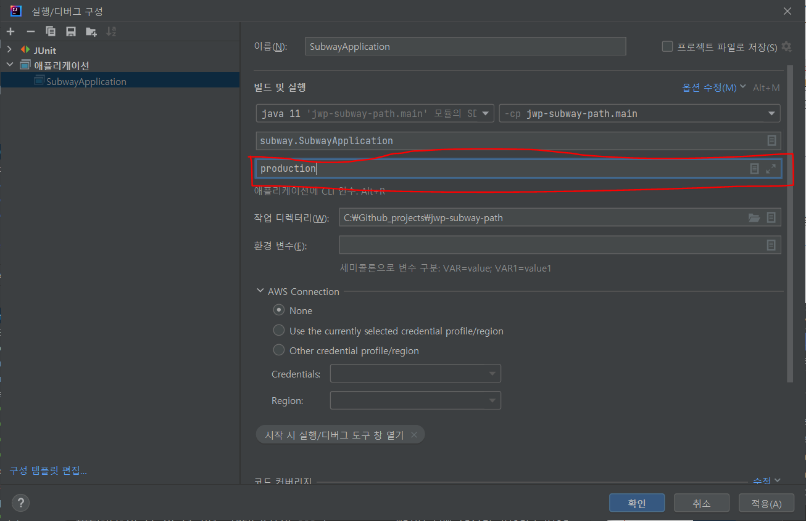
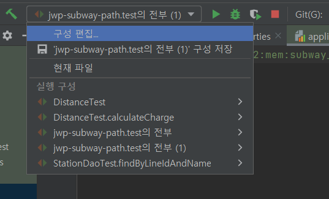

## 코드 리뷰

---

### 지하철 미션 1단계

- default 값이 있거나 null(빈 값)이 들어올 수 있는 값의 경우, 해당 값이 없는 경우에 대한 생성자를 선언해줘도 좋다.

  ```java
  //LineService.java
  LineEntity newLine = new LineEntity(request.getName(), request.getColor(), null);
  ```

  ```java
  //LineService.java
  LineEntity newLine = new LineEntity(request.getName(), request.getColor());

  ...
  //LineEntity.java
  public LineEntity(String name, String color, int extraCharge) {
          this(0L, name, color, extraCharge,null);
      }
  ```

- api의 URI를 지을 때는 리소스 간의 관계가 잘 드러나도록 순서를 고려해주어야 한다.

  [REST API 설계 가이드](https://meetup.nhncloud.com/posts/92)

- 필드들을 일일이 추출하여 비교하거나 equals를 따로 구현해주지 않고도 [usingRecursiveComparison()](https://tecoble.techcourse.co.kr/post/2020-11-03-assertJ_methods/)을 사용해 객체의 필드 전체를 비교할 수 있다.

  - id처럼 비교 대상에서 제외하고 싶은 필드의 경우 `ignoringFields()`를 사용하면 된다.

  ```java
  LineResponse expected=new LineResponse(1L, "1호선","파란색",0);

  LineResponse actual = lineService.findLineResponseById(lineId);

  Assertions.assertThat(actual).usingRecursiveComparison().isEqualTo(expected);
  ```

### 지하철 2단계(1)

- 조회 쿼리의 경우 Transactional을 적용해줄 필요가 없다.

  - 트랜잭션을 적용해야 하는 기준에 대해 생각해보자.
  - +) Transactional은 Dao, Repository, Service 중 어디에 붙이는 게 좋을까?

    =>**Service**

    [Where should "@Transactional" be placed Service Layer or DAO](https://stackoverflow.com/questions/3886909/where-should-transactional-be-placed-service-layer-or-dao)

  - 클래스에 `@Transactional`을 적용해줬을 때, 특정 메서드만 해당 설정을 제외시키고 싶다면 `@Transactional(propagation = Propagation.NOT_SUPPORTED)`를 붙여주면 된다.
    ```java
    @Transactional
    public class MyTransactionalClass {
    		@Transactional(propagation = Propagation.NOT_SUPPORTED)
    		public void nonTransactionalMethod() {...}
    }
    ```

- 체이닝이 길어지면 가독성이 떨어질 수 있으니, 아래와 같은 경우 더해주는 값을 변수로 분리 시켜주는 것이 좋다.

  ```java
  charge
  		.add(calculateOverCharge(SECOND_CHARGE_BOUND.substract(FIRST_CHARGE_BOUND),
  				DISTANCE_FIVE_UNIT))
  		.add(calculateOverCharge(distance.substract(SECOND_CHARGE_BOUND), DISTANCE_EIGHT_UNIT));
  ```

  ```java
  final Charge tenToFiftyExtraCharge = calculateOverCharge(
  				SECOND_CHARGE_BOUND.substract(FIRST_CHARGE_BOUND), DISTANCE_FIVE_UNIT);
  final Charge overFiftyExtraCharge = calculateOverCharge(
  				distance.substract(SECOND_CHARGE_BOUND), DISTANCE_EIGHT_UNIT);

  return charge.add(tenToFiftyExtraCharge).add(overFiftyExtraCharge);
  ```

- 계산 로직이 복잡한 경우, 경곗값 테스트를 해주면 좋다.
- 핸들러에서 예외의 최상위 구현체인 Exception.class를 잡게 하면 안된다.

  - 의도하지 못한 예외까지 전부 잡혀서 장애가 발생했을 때 디버깅하기 어려워진다.

    ⇒특정 예외를 핸들링하게 해야 함.

  - 의도한 예외에 대해서는 정해진 응답 코드를 내려주고, 의도하지 못한 예외는 500으로 보내 장애 상황을 파악할 수 있게 하는 것이 일반적이다.
  - 의도한 예외도 전부 400으로 보내기보다 어떤 예외인지에 따라 400번대에서 응답코드를 정의해줄 수 있다.

    [상태 코드, 뭘 줘야할까?](https://tecoble.techcourse.co.kr/post/2020-08-31-http-status-code/)

- uri를 설계할 때 리소스 간의 관계가 드러나도록 '순서'를 잘 배치하는 것이 좋다.

  →관계가 있는 하위 리소스를 뒤에 배치

  - 특정 노선에 해당하는 역의 목록을 불러오는 api의 경우, `/stations/lines/{lineId}`보단 `/lines/{lineId}/stations`이 관계가 더 잘 드러난다.

- 만약 존재하지 않은 객체에 대해 update 쿼리를 날려도(이미 삭제한 데이터에 대해 한 번 더 삭제 요청을 보내거나 존재하지 않는 id를 담아 요청을 보내는 등) sql 상 오류는 아니기 때문에 예외가 발생하지 않는데, 서비스 계층에서 이에 대해 확인할 수 있도록 설계하는 것이 좋다.
  - ex) dao, service 메서드에서 update의 결과(=변경된 row의 개수)를 반환하게 한다던지

## 자잘한 기술부채

---

### ✅returnAnswer(Answer<T>)

`public interface Answer<T>`

임의의 응답을 구성하는 데 사용되는 인터페이스. mock 객체와 상호작용할 때 실행되는 동작과 반환 값을 지정할 수 있다.

```java
when(mock.someMethod(anyString())).thenAnswer(
     new Answer() {
         public Object answer(InvocationOnMock invocation) {
             Object[] args = invocation.getArguments();
             Object mock = invocation.getMock();
             return "called with arguments: " + Arrays.toString(args);
         }
 });

 //Following prints "called with arguments: [foo]"
 System.out.println(mock.someMethod("foo"));
```

위와 같이 Answer 인터페이스를 구현하여 thenAnswer() 메서드의 인자로 넣어준다고 하자. `mock`에 대해 임의의 문자열 인자를 가지고 `someMethod()` 메서드가 호출되면 answer 메서드가 호출된다.

- `invocation.getArguments()`를 통해 **입력받은 인자를 불러올 수 있으며**,
- `invocation.getMock()`을 통해 mock 객체 자체를 불러올 수도 있다.

결과적으로 mock.someMethod(”foo”)는 **“called with arguments: foo”**를 반환한다.

[Answer (Mockito 3.2.4 API)](https://javadoc.io/static/org.mockito/mockito-core/3.2.4/org/mockito/stubbing/Answer.html)

### ✅LocalDate, LocalTime

각각 날짜, 시간을 표현하는 데 사용되는 클래스.

java.time 패키지에 포함된 대부분의 클래스는 이 두 클래스의 확장체인 경우가 많다.

- 객체 생성하기

  객체 생성을 위한 정적 팩토리 메서드로 `now()`, `of()`를 제공한다.

  - `now()` : 현재의 날짜와 시간을 이용해 새로운 객체를 생성하여 반환한다.

    ```java
    LocalDate today = LocalDate.now();
    LocalTime present = LocalTime.now();

    System.out.println(today + " " + present);
    //2023-05-22 21:37:50.634
    ```

  - `of()` : 전달된 인수를 가지고 특정 날짜와 시간을 표현하는 새로운 객체를 생성하여 반환한다.

    ```java
    // static LocalDate of(int year, int month, int dayOfMonth)
    LocalDate birthDay = LocalDate.of(1982, 02, 19);

    // static LocalTime of(int hour, int minute, int second, int nanoOfSecond)
    LocalTime birthTime = LocalTime.of(02, 02, 00, 100000000);

    System.out.println(birthDay + " " + birthTime);
    //1982-02-19 02:02:00.100
    ```

      <aside>
      💡 of() 메서드는 위 예제에서 사용된 메서드 시그니처 외에도 다양한 형태가 오버로딩되어 제공된다.
      
      </aside>

- 객체 접근하기

  LocalDate와 LocalTime 클래스는 다양한 getter 메서드를 제공하고 있다.

  - LocalDate
    | 메서드 | 설명 |
    | ------------------------------------------------------------- | ---------------------------------------------------------------------------------- |
    | int get(TemporalField field)long getLong(TemporalField field) | 해당 날짜 객체의 명시된 필드의 값을 int형이나 long형으로 반환함. |
    | int getYear() | 해당 날짜 객체의 연도(YEAR) 필드의 값을 반환함. |
    | Month getMonth() | 해당 날짜 객체의 월(MONTH_OF_YEAR) 필드의 값을 Month 열거체를 이용하여 반환함. |
    | int getMonthValue() | 해당 날짜 객체의 월(MONTH_OF_YEAR) 필드의 값을 반환함. (1~12) |
    | int getDayOfMonth() | 해당 날짜 객체의 일(DAY_OF_MONTH) 필드의 값을 반환함. (1~31) |
    | int getDayOfYear() | 해당 날짜 객체의 일(DAY_OF_YEAR) 필드의 값을 반환함. (1~365, 윤년이면 366) |
    | DayOfWeek getDayOfWeek() | 해당 날짜 객체의 요일(DAY_OF_WEEK) 필드의 값을 DayOfWeek 열거체를 이용하여 반환함. |

      <aside>      💡 1월을 1로 표현하고, 요일은 월요일부터 1이다.      </aside>

  - LocalTime
    | 메서드 | 설명 |
    | ------------------------------------------------------------- | ---------------------------------------------------------------- |
    | int get(TemporalField field)long getLong(TemporalField field) | 해당 시간 객체의 명시된 필드의 값을 int형이나 long형으로 반환함. |
    | int getHour() | 해당 시간 객체의 시(HOUR_OF_DAY) 필드의 값을 반환함. |
    | int getMinute() | 해당 시간 객체의 분(MINUTE_OF_HOUR) 필드의 값을 반환함. |
    | int getSecond() | 해당 시간 객체의 초(SECOND_OF_MINUTE) 필드의 값을 반환함. |
    | int getNano() | 해당 시간 객체의 나노초(NANO_OF_SECOND) 필드의 값을 반환함. |

- TemporalField 인터페이스

  : 월(month), 시(hour)과 같이 날짜/시간에 관련된 필드를 정의해둔 인터페이스

  - ChronoField 열거체에 정의된 열거체 상수
    | 열거체 상수 | 설명 |
    | ------------------ | -------------------------------------------- |
    | ERA | 시대 |
    | YEAR | 연도 |
    | MONTH_OF_YEAR | 월 |
    | DAY_OF_MONTH | 일 |
    | DAY_OF_WEEK | 요일 (월요일:1, 화요일:2, ..., 일요일:7) |
    | AMPM_OF_DAY | 오전/오후 |
    | HOUR_OF_DAY | 시(0~23) |
    | CLOCK_HOUR_OF_DAY | 시(1~24) |
    | HOUR_OF_AMPM | 시(0~11) |
    | CLOCK_HOUR_OF_AMPM | 시(1~12) |
    | MINUTE_OF_HOUR | 분 |
    | SECOND_OF_MINUTE | 초 |
    | DAY_OF_YEAR | 해당 연도의 몇 번째 날 (1~365, 윤년이면 366) |
    | EPOCH_DAY | EPOCH(1970년 1월 1일)을 기준으로 몇 번째 날 |

  ```java
  LocalTime present = LocalTime.now();

  String ampm;

  if(present.get(ChronoField.AMPM_OF_DAY) == 0) {
      ampm = "오전";
  } else {
      ampm = "오후";
  }

  System.out.println("지금은 " + ampm + " " + present.get(ChronoField.HOUR_OF_AMPM) + "시입니다.");
  // 지금은 오전 9시입니다.
  ```

- 비교 메서드
  - isEqual() : (LocalDate에서만 제공) 날짜 비교
  - isBefore() : 두 날짜/시간 객체를 비교하여 현재 객체가 명시된 객체보다 앞선 시간인지를 비교한다.
  - isAfter() : 두 날짜/시간 객체를 비교하여 현재 객체가 명시된 객체보다 늦은 시간인지를 비교한다.

[코딩교육 티씨피스쿨](http://www.tcpschool.com/java/java_time_localDateTime)

### ✅Profile

: 환경에 맞게 deploy하기

- Profile 설정하기

  - 방법1. `@Profile` 어노테이션 사용하기

    `@Configuration` 클래스에 `@Profile`어노테이션을 붙여주면 Profile이 지정된다.

    - production 환경에 대해 로컬 MySQL DB로 DataSource Bean 설정

      ```java
      @Profile("production")
      @Configuration
      public class ProductionDBConfig {

          @Bean
          public DataSource dataSource() {
              HikariDataSource dataSource = new HikariDataSource();
              dataSource.setJdbcUrl("jdbc:mysql://localhost:13306/subway-path?serverTimezone=UTC&characterEncoding=UTF-8");
              dataSource.setUsername("sa");
              dataSource.setPassword("password");
              return dataSource;
          }
      }
      ```

    - Test 환경에 대해 In-Memory DB로 DataSource Bean 설정

      ```java
      @Profile("test")
      @Configuration
      public class TestDBConfig {

          @Bean
          public DataSource dataSource() {
              HikariDataSource dataSource = new HikariDataSource();
              dataSource.setJdbcUrl("jdbc:h2:mem:testdb;MODE=MySQL");
              dataSource.setUsername("sa");
              dataSource.setPassword("password");
              return dataSource;
          }
      }
      ```

  - 방법2. application-{profile name}.properties 파일을 생성하면 해당 파일이 환경 프로필의 설정 파일이 된다.

    resources 경로에 `application-prod.properties`, `application-test.properties` 파일들을 생성하면 ‘prod’, ‘test’ 프로필이 생성된다. 해당 properties 파일 내에 DB 설정을 작성해주면 된다.

- 생성한 프로필 활성화하기

  : 위의 두 가지 방법으로 프로필을 생성하면, 프로필을 활성화해서 사용하면 된다.

  - 프로덕션 코드의 경우

    - 방법1. 커맨드 인자 설정

      IntelliJ에서 실행버튼 좌측의 셀렉트 바를 클릭하고 **구성편집(Edit Configurations…)**를 클릭한다.
      프로그램 인수로 전 단계에서 설정한 Profile의 이름을 입력해주면 된다.

      
      

    - 방법2. application-properties에서 프로필 활성화
      다음과 같이 `spring.profiles.active`로 profile의 이름을 적어주면 활성화시킬 수 있다.
      ```java
      spring.profiles.active=prod
      ```

  - 테스트 코드

    - `@ActiveProfiles` 어노테이션으로 프로필을 활성화할 수 있다.

      ```java
      @SpringBootTest(webEnvironment = SpringBootTest.WebEnvironment.RANDOM_PORT)
      @ActiveProfiles("test")
      public class ProfileTest {

          @Autowired
          private DataSource dataSource;

          @Test
          void profileTest() throws SQLException {
              System.out.println(dataSource.getConnection());
          }
      }
      ```

[[Spring] 환경별 구성 다르게 하기 : 환경별 프로필 설정하기 & 프로필 활성화 하기(@Profile, @ActiveProfiles, application-properties 설정)](https://ksh-coding.tistory.com/98#%25E-%25-C%25--%25--prod%25--%ED%25--%25--%EA%25B-%BD%25--DataSource%25--Bean%25--%EC%25--%25A-%EC%25A-%25--)

### ✅@Deprecated

: Spring Boot에서 사용하지 않을 클래스/메서드를 지정해줄 때 사용하는 어노테이션이다.

리팩토링 과정에서 기존에 사용되고 있던 클래스와 메서드를 삭제하지 않고 사용금지할 때 사용한다.(바로 삭제했을 때 발생할 수 있는 사이드 이펙트를 방지하기 위해)

이 어노테이션이 붙은 클래스/메서드를 다른 클래스에서 사용하려 하면 코드에 경고가 뜬다.

```java
public class Worker {
    @Deprecated
    public int calculate(Machine machine) {
        return machine.exportVersions().size() * 10;
    }
}
```

- Javadoc 문법에도 `@deprecated` 태그가 존재한다. 같은 맥락으로 더이상 사용하지 않을 클래스/메서드에 달아준다. 일반적으로 사용되지 않는 이유를 함께 작성해준다.
  @link 태그를 함께 사용하여 대체 클래스/메서드를 지정해주기도 한다.

  ```java
  public class Sample {

      /**
       * 사이즈 설정
       *
       * @param width 폭
       * @param height 높이
       * @see Sample08_02#getWidth()
       * @see Sample08_02#getHeight()
       * @deprecated 다른 메소드로 대체되었다 {@link #setScale(int, int)}
       */
      public void setSize(int width, int height) {
  				...
      }

  		/**
       * 사이즈 설정
       *
       * @param width 폭
       * @param height 높이
       */
      public void setScale(int width, int height){

      }
  }
  ```

[[Javadoc] @deprecated 태그](https://araikuma.tistory.com/659)

[[SpringBoot] @Deprecated 어노테이션으로 해당 클래스 및 메서드 은퇴시키기](https://inseok9068.github.io/springboot/springboot-deprecated/)

### ✅@ManyToOne, @OneToMany

학생(Student)과 교실(ClassRoom)이 있다고 하고, 학생의 Primary Key를 교실 테이블이 Foreign Key로 가지고 있다.

이 경우, 교실은 여러 명의 학생을 가지고 있을 수 있고, 학생은 하나의 교실에만 소속될 수 있으니 두 테이블은 1:n 관계를 가진다.

이는 Student 입장에서 보면 OneToMany 관계이고, ClassRoom 입장에서 보면 ManyToOne 관계이다.

이를 Java Entity 클래스로 매핑해보자.

1. `@ManyToOne`을 사용하는 경우

```java
@Entity
@Table(name = "Student")
public class Student{

		@Id
		@GeneratedValue
		@Column(name = "student_id")
		private Long id;

		@Column(name = "name")
		private String className;

		@ManyToOne
		@JoinColumn(name = "class_id")
		private ClassRoom classRoom;
		...
}
```

```java
@Entity
@Table(name = "ClassRoom")
public class ClassRoom {

		@Id
		@GeneratedValue
		@Column(name = "class_id")
		private Long id;

		@Column(name = "name")
		private String className;
		...
}
```

이렇게 하면 Student 테이블을 조회할 때 class_id를 join key로 사용해 ClassRoom 테이블에 있는 교실 정보를 함께 불러온다.

- 양방향 매핑

  - Student Entity의 classRoom 필드가 관계의 주인이고, ClassRoom Entity에서 Student Entity 정보를 조회할 수 있도록 하는 양방향 매핑 코드를 작성해보자.
  - 양방향 매핑을 위해 ClassRoom Entity에 다음 코드를 추가하면 된다.

    - ClassRoom Entity는 다수의 Student Entity를 가질 수 있으므로 List<Student> 형으로 객체를 정의한다.
    - 교실 하나가 여러 명의 학생을 가질 수 있으므로 @OneToMany 어노테이션을 추가한다.
    - 조회하려는 정보는 Student Entity의 classRoom 정보를 참고할 것이기 때문에 mappedBy를 통해 연관관계를 매핑한다.(이를 생략하면 로직 실행 시 중간 테이블이 생성된다.)

    ```java
    @Entity
    @Table(name = "ClassRoom")
    public class ClassRoom {

    		@Id
    		@GeneratedValue
    		@Column(name = "class_id")
    		private Long id;

    		@Column(name = "name")
    		private String className;

    		@OneToMany(mappedBy = "classRoom")
    		private List<Student> students = new ArrayList<>();
    		...
    }
    ```

1. `@OneToMany`를 사용하는 경우

```java
@Entity
@Table(name = "ClassRoom")
public class ClassRoom {

		@Id
		@GeneratedValue
		@Column(name = "class_id")
		private Long id;

		@Column(name = "name")
		private String className;

		@OneToMany
		@JoinColumn(name="student_id")
		private List<Student> students = new ArrayList<>();
}
```

```java
@Entity
@Table(name = "Student")
public class Student{

		@Id
		@GeneratedValue
		@Column(name = "id")
		private Long id;

		@Column(name = "name")
		private String studentName;

		...
}
```

<aside>
⚠️ @ManyToOne에는 mappedBy 옵션이 없기 때문에 @OneToMany가 연관관계의 주인일 경우 양방향 매핑이 불가능하다.

</aside>

연관관계의 주인이 @ManyToOne가 되도록 하는 것이 의미가 명확하고 이해하기 쉽다.

[[JPA] @ManyToOne, @OneToMany 이해하기](https://soojong.tistory.com/entry/JPA-ManyToOne-OneToMany-이해하기)

### ✅로컬에서 DB 셋팅하는 방법(mysql)

(MySQL을 실행시킬 수 있는 환경이 조성되어 있는 것을 전제한다.)

build.gradle에 다음 의존성을 추가해준다.

```java
runtimeOnly 'mysql:mysql-connector-java:8.0.28'
```

<aside>
💡 jdbc를 사용할 경우 다음 의존성도 함께 필요하다.

```
compile "org.springframework.boot:spring-boot-starter-jdbc"
```

</aside>

application.properties를 다음과 같이 작성한다.

```
spring.datasource.url=jdbc:mysql://localhost:[포트(기본 3306)]/[table이름]?useSSL=false&useUnicode=true&serverTimezone=Asia/Seoul&allowPublicKeyRetrieval=true
spring.datasource.username=[설정한유저네임(기본 root)]
spring.datasource.password=[설정한비밀번호]
spring.datasource.driver-class-name=com.mysql.cj.jdbc.Driver
logging.level.org.springframework.jdbc.core=TRACE
```

- `logging.level.org.springframework.jdbc.core` 속성 : 실행되는 쿼리 문구를 로그에 보여준다.

[Spring에 MySQL 연동하기](https://velog.io/@ddusi/Spring-1)

### ✅@DirtiesContext

스프링 테스트에서 애플리케이션 컨텍스트는 딱 한 개만 만들어지고 모든 테스트에서 공유해서 사용한다.(이를 Context Caching이라고 함)

애플리케이션 컨텍스트의 구성이나 상태를 테스트 내에서 변경해야 하는 경우, 여러 테스트에서 해당 컨텍스트를 일관성 있게 사용하는 것이 어려워진다.

테스트 클래스/메서드에 `@DirtiesContext` 어노테이션을 추가하면 해당 테스트를 수행하기 전/후에 Context를 새로 생성하게 할 수 있다.

- 클래스에 붙여주는 경우
  - 클래스의 테스트가 모두 끝난 후 context를 재생성한다(default)
    ```java
    @DirtiesContext
    public class ContextDirtyingTests {
     // 테스트 케이스가 context의 @Bean의 상태에 영향을 끼침
    }
    ```
  - 클래스의 테스트가 시작하기 전에 context 재생성
    ```java
    @DirtiesContext(classMode = BEFORE_CLASS)
    ```
  - 클래스의 매 테스트가 시작하기 전에 context 재생성
    ```java
    @DirtiesContext(classMode = BEFORE_EACH_TEST_METHOD)
    ```
  - 클래스의 매 테스트가 끝날 때마다 context 재생성
    ```java
    @DirtiesContext(classMode = AFTER_EACH_TEST_METHOD)
    ```
- 메서드에 붙여주는 경우
  - 특정 테스트 케이스(메서드)를 시작하기 전에 context 재생성
    ```java
    @DirtiesContext(methodMode = BEFORE_METHOD)
    @Test
    public void testProcessWhichRequiresFreshAppCtx() {
     // 새로운 context가 필요한 어떤 로직
    }
    ```
  - 특정 테스트 케이스를 시작한 이후 context 재생성
    ```java
    @DirtiesContext
    @Test
    public void testProcessWhichDirtiesAppCtx() {
     // context의 상태를 변경하는 어떤 로직
    }
    ```

[참고 링크](https://shortstories.gitbooks.io/studybook/content/dirtiescontext.html)
