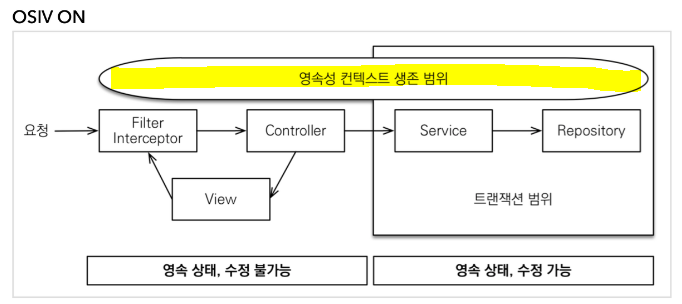
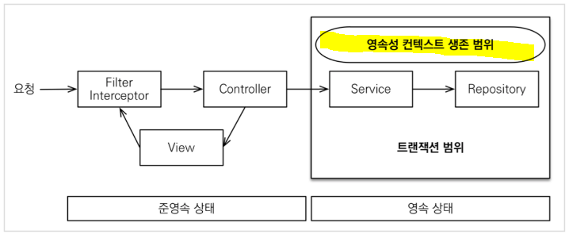

## 코드 리뷰

---

### 지하철 미션 2단계(2)

- DELETE 쿼리는 없는 데이터에 대한 삭제 요청을 보내도 예외를 던지지 않기 때문에 삭제하려는 데이터의 존재 여부를 삭제 로직 **이전 또는 이후**에 확인해주어야 한다.
  ```java
  public void deleteStation(Long lineId, String name) {
      validateCanDelete(lineId, name);    //삭제 로직 이전에 존재 여부 확인
      ...
      rowNumber = deleteMiddleStation(deleteStation, upStation);
      validateDeleteSuccess(rowNumber);   //삭제 로직 이후 삭제 여부 확인
  }
  ```
- Test 코드에서 리스트의 크기를 확인할 때 크기를 직접 추출하여 `isEqualTo()`로 비교하는 것보다 `hasSize()`를 사용하면 더 간결하게 짤 수 있다.

  ```java
  // given
  int expected = 6;

  // when
  List<StationEntity> entities = stationDao.findByLineId(lineId);
  int actual = entities.size();

   // then
   Assertions.assertThat(actual).isEqualTo(expected);
  ```

  ```java
  // given
  int expected = 6;

  // when
  List<StationEntity> entities = stationDao.findByLineId(lineId);
  int actual = entities.size();

   // then
   Assertions.assertThat(actual).isEqualTo(expected);
  ```

- 클라이언트는 조회된 데이터를 통해 구성된 화면에서 다음 요청을 보내기 때문에, 없는 데이터를 요청할 경우 **요청의 실수**인 경우가 대부분이다.(상태코드 4xx)

  서버의 문제로 판단되는 경우, 즉 상태코드 5xx를 반환하는 경우는 보통 DB 자체의 연결에 문제가 있는 경우이다.

- 예외 핸들링 시 일반 예외에 대한 핸들링도 별도로 해주는 것이 좋다. (개발자가 미처 처리하지 못한 예외를 캐치하기 위해)

### 지하철 미션 2단계(3)

- 조회 쿼리만 수행하는 메서드에 한해 부분적으로 트랜잭션을 적용시키지 않는 것도 방법이 될 수 있지만,

  ```java
  @Transactional(propagation = Propagation.NOT_SUPPORTED)
  ```

  readOnly 옵션을 사용해 공유 잠금(S락)을 적용시킬 수도 있다.

  - 해당 메서드가 읽기 전용이라는 것을 명시하여 영속성 컨텍스트의 관리를 받지 않게 된다.

    ⇒성능 향상을 기대할 수 있다.

  ```java
  @Transactional(readOnly=true)
  ```

  [@Transactional 옵션을 사용하지 않는다면?](https://cupeanimus.tistory.com/102?category=868009)

  [[Java] @Transaction(readOnly=true)을 사용하면 성능이 향상되는 이유](https://jaehhh.tistory.com/69)

  [Transaction & Lock (트랜잭션과 잠금)](https://elanddba.tistory.com/13)

## 자잘한 기술부채

---

### ✅hibernate osiv?(feat. JPA)

OSIV는 `open-session-in-view`의 약자로, DB 설정 파일에서 설정할 수 있는 속성 중 하나이다. `true` 또는 `false` 값을 가진다.

- `true`(default)
  - 영속성 컨텍스트가 트랜잭션 범위를 넘어선 레이어까지 살아있게 된다.
    
    ex) API라면 클라이언트에게 응답될 때까지, View라면 View가 렌더링될 때까지 영속성 컨텍스트가 살아있다.
- `false`
  - 트랜잭션 종료 시 영속성 컨텍스트 또한 닫히게 된다.
    

<aside>

⚠️ 영속성 컨텍스트를 오래 유지한다는 것은 DB Connection을 오래 가지고 있다는 뜻이므로 성능이 중요한 상황에서는 OSIV를 `false`로 설정하는 것이 좋다.

</aside>

[[JPA]open-session-in-view 를 알아보자](https://gracelove91.tistory.com/100)

### ✅S3, EC2, RDS

\*셋 다 AWS에서 제공하는 서비스

- S3(Simple Stroage Service)

  : 데이터를 저장하거나 추출하게 해주는 온라인 스토리지 웹 서비스

  - **파일 서버**의 역할을 한다.
  - 하나의 저장 공간을 구성하고 그 공간에서 자유롭게 데이터를 업로드/다운로드할 수 있다.
  - HTTP 프로토콜을 통해 파일에 접근할 수 있다.
  - `파일 이름-파일 자체`를 key-value 형태로 저장한다.
  - 저장할 수 있는 파일 수 및 **용량 제한이 없다**.

- EC2(Elastic Compute Cloud)

  : 클라우드에서 컴퓨팅 파워를 제공하는 웹 서비스(=가상의 컴퓨터를 빌려주는 것이라고 이해하면 편함.)

  - 인터넷을 통해서만 접속을 할 수 있다.

- RDS(Relational Database Service)

  : RDB(관계형 데이터베이스)를 간편하게 운영할 수 있게 해주는 서비스

  - DB를 설치하고 관리할 필요가 없고 백업/복구가 편리하다.
  - API 호출을 통해 쉽게 처리할 수 있다.
  - 키를 이용해 DB를 암호화하기 때문에 보안성이 뛰어나다.

### ✅영속성 컨텍스트(JPA)

엔티티를 영구 저장하는 환경.

애플리케이션과 데이터베이스 사이에서 객체를 보관하는 **가상의 데이터베이스** 같은 역할을 한다.

엔티티 매니저를 통해 엔티티를 저장/조회하면 엔티티 매니저는 영속성 컨텍스트에 엔티티를 보관하고 관리한다.

- 특징
  - 엔티티 매니저를 생성할 때 하나가 만들어진다.
  - 엔티티 매니저를 통해 영속성 컨텍스트에 접근하고 관리할 수 있다.
- 엔티티의 생명 주기
  - 비영속(new/transient) : 영속성 컨텍스트와 전혀 관계가 없는 상태
  - 영속(managed): 영속성 컨텍스트에 저장된 상태.
  - 준영속(detached): 영속성 컨텍스트에 저장되었다가 분리된 상태
    - 1차 캐시, 쓰기 지연, 변경 감지, 지연 로딩을 포함한 영속성 컨텍스트가 제공하는 어떠한 기능도 동작하지 않는다.
    - **식별자 값**을 가지고 있다.
  - 삭제(removed): 삭제된 상태
    
- 영속성 컨텍스트의 특징

  - 영속성 컨텍스트의 식별자 값
    - 영속성 컨텍스트는 엔티티를 식별자 값으로 구분한다.
  - JPA는 보통 트랜잭션을 커밋하는 순간 영속성 컨텍스트에 새로 저장된 엔티티를 데이터 베이스에 반영하는데 이를 `flush`라 한다.

    ⇒ 때문에 영속성 컨텍스트에 들어간 엔티티 객체를 수정하면 DB 직접 쿼리를 날리지 않고도 DB 레코드를 수정할 수 있다.

  - 영속성 컨텍스트가 엔티티에 제공하는 기능은 다음과 같다.
    - 1차 캐시
    - 동일성 보장
    - 트랜잭션을 지원하는 쓰기 지연
    - 변경 감지
    - 지연 로딩

### ✅Elastic Beanstalk(엘라스틱 빈스토크, EB)

EC2가 확장 가능한 서버(컴퓨터)를 제공한다면 EB는 PaaS 형태의 서비스를 제공한다.

<aside>

💡 **PaaS**

---

클라우드 컴퓨팅의 일종으로, IaaS(Infrastructure as a Service)를 기반으로 애플리케이션 개발에 필요한 환경을 얹어 제공하는 서비스 모델이다.

(다르게 표현하면)IaaS 형태의 가상화된 클라우드 위에 사용자가 원하는 서비스를 개발할 수 있도록 **개발 환경(Platform)을 미리 구축해, 이를 서비스 형태로 제공**하는 것.

**IaaS**는 인프라 수준의 클라우드 컴퓨팅을 제공하는 서비스로, EC2가 이에 해당한다.

[가비아 라이브러리](https://library.gabia.com/contents/infrahosting/9105/)

</aside>

Paas 자체라기보단 EC2와 연동해서 어플리케이션을 배포하고 관리하는 **배포 관리 툴**에 가깝다.

- 용량 프로비저닝, 로드 밸런싱, 오토 스케일링, 애플리케이션 상태 모니터링, 배포를 자동화시킬 수 있다.

### ✅[CORS] withCredentials 옵션

클라이언트 측에서 서로 다른 도메인(cross domain)에 요청을 보낼 때 요청에 credential 정보를 담아서 보낼지 결정하는 항목.

이 때 credential 정보가 포함되어 있는 요청은 **1. 쿠키를 첨부한 요청**과 **2. 헤더에 `Authorization` 속성을 포함한 요청**이 있다.

### ✅allowCredentials(true);

Credential 요청을 허용할지 여부를 설정하는 메서드.

응답 헤더의 `Access-Control-Allow-Credentials` 속성에 해당한다.

### ✅빌드 시 test를 생략한다.

```java
./gradlew bootJar -x test
```

### ✅@SuppressWarnings

: 컴파일러 경고를 무시할 수 있게 해주는 어노테이션

```java
@SuppressWarnings({"rawtypes", "unchecked"})
public static List makePjtCreateIconMenu(boolean bomAuth) throws Exception{
		List list = new ArrayList<Map>();
		list.add(makeMenuInfo("...", "CREATE_ECR"));
		if(bomAuth){
				list.add(makeMenuInfo("...", "CREATE_ECO"));
		}
		return list;
}
```

### ✅@CheckReturnValue

: 메서드의 반환값을 호출부에서 무시하지 못하게 한다.

(feat. `javax.annotation` 패키지)

```java
@CheckReturnValue
bool sendMessage(Channel channel, String message){
		...
}
```

```java
void sayHello(Channel channel){
		sendMessage();    //반환값에 대해 처리해주지 않아 경고가 발생한다.
}
```
