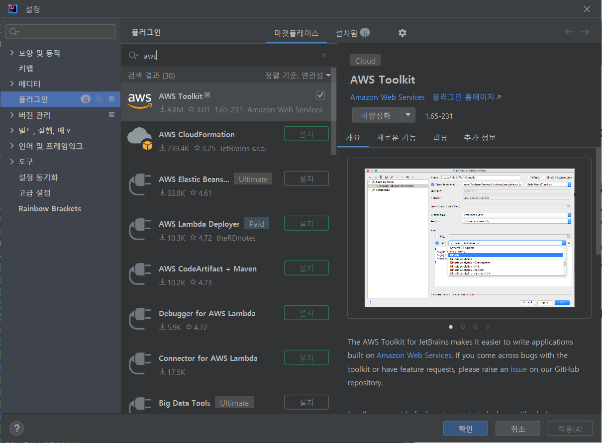
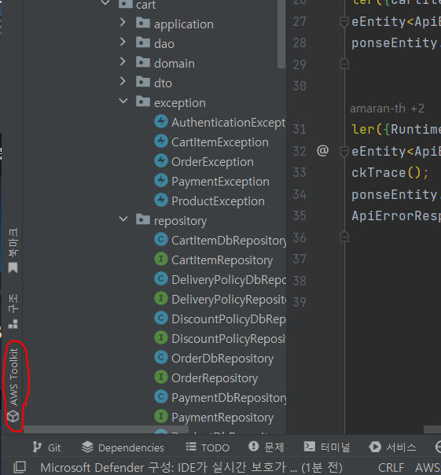
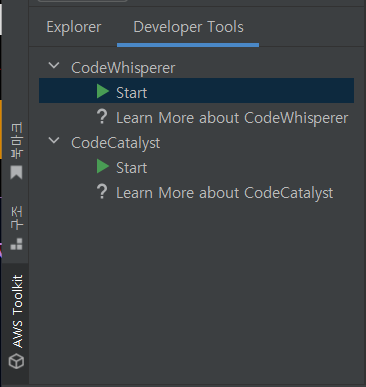
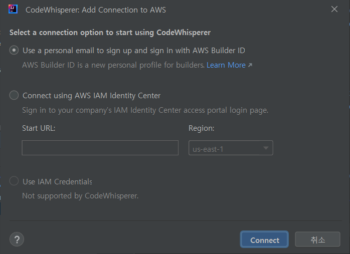
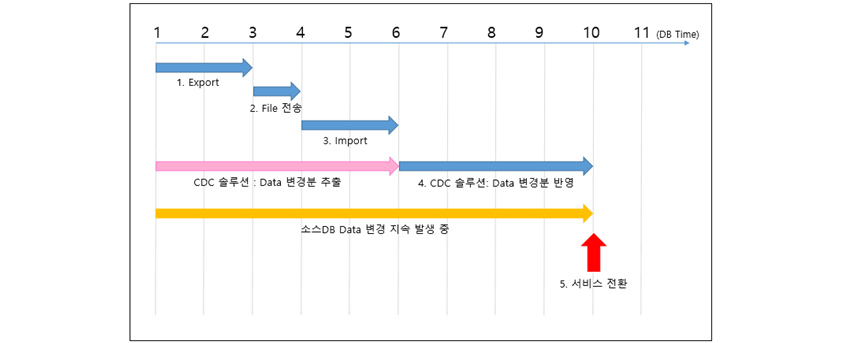
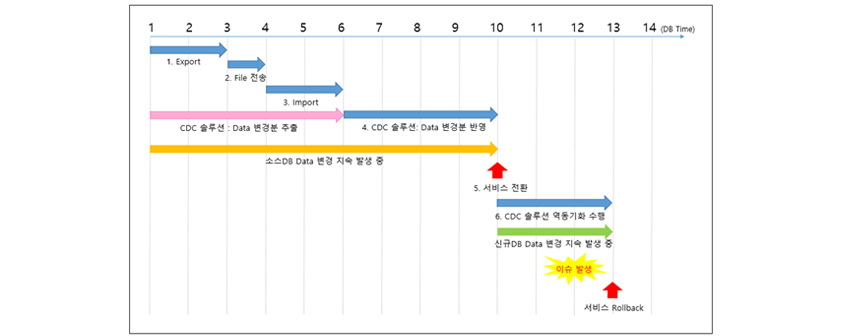
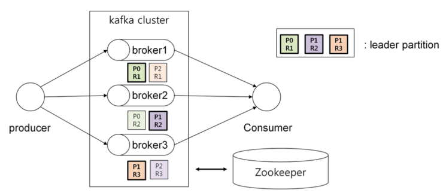

## 코드 리뷰

---

### 장바구니(협업) 미션 2단계

https://github.com/woowacourse/jwp-shopping-order/pull/48

- 외래키 관계가 있는 테이블의 경우 삭제 시나리오를 고려하는 것이 좋다.
  - 예시) cart_item이 product_id를 외래키로 가지고 있기 때문에, product를 삭제할 때 멤버 중 한명이라도 장바구니에 해당 product를 가지고 있는 상태라면 기본적으로 product 삭제가 불가하다.
    ⇒이럴 땐 product 삭제 요청 시 product를 삭제하기 전에 해당 product를 가지는 cart_item들을 모두 삭제하는 등의 추가 작업을 해야 한다.
- 일반적으로 @Transactional 처리는 Controller가 아닌 Service 단에서 한다.
  - 컨트롤러는 요청/응답을 처리하고 비즈니스 로직 자체는 서비스 계층에 있기 때문에 서비스에 트랜잭션을 거는 것이 일반적.
    ⇒여러 서비스를 호출하는 경우엔 어떻게 db 작업을 롤백하나?
- test에서는 Fixture 객체를 사용하는 경우 Test 클래스의 필드로 정의한 객체와 Fixture 객체의 혼동을 줄이기 위해 필드 객체에 this를 명시해주는 것이 좋은 것 같다.
- 질의응답

<aside>

❓ Q. DB에 저장해야 할 정보의 기준적용할 할인 정책에 대한 정보만 저장되어 있어도 서버에서는 할인금액, 할인 금액이 차감된 금액, 할인과 배송비가 모두 적용된 금액을 모두 계산할 수 있습니다. 그런데 페어의 의견으로는, 서버가 아닌 외부 서비스에서 해당 데이터를 조회하고자 하는 경우(통계 데이터를 산출하는 등)를 생각하면 계산 과정에서 도출된 값들을 모두 DB에 저장하는 편이 좋을 것 같다고 하였습니다.

> 서버에서 바로 계산을 해도 되고, db에 저장을 할 수도 있습니다 맞습니다.
>
> 현재 미션에서 생각해본다면 저는 **서버에서 계산**을 할 것 같습니다. 우선 통계에 필요한 데이터가 현재 db 테이블 컬럼으로 만들어두신 할인금액 등에 대한 정보를 벗어난 다른 값들이면 결국에 백서버에서 계산을 하든 아니면 다른 쪽에서 계산을 하든 결국 계산이 필요합니다. 이를 위해 **db 컬럼을 계속해서 추가하는 것은 비효율적**이겠구요. 그리고 주문 생성 시에 계산 후 db에 저장을 하게 된다면 사용자 입장에서 주문이 성공적으로 되었는지에 대한 확인시간이 길어지게 될 것입니다. 만약 이렇게 하고 싶으시다면 계산쪽은 비동기로 진행되게끔 하면 좋을 것 같네요.
>
> 미션을 떠나서 현업이라 생각한다면, 이것저것 통계에 쓰이고 여러 연산 값들이 필요하다면 저는 이 정보들을 주문이 생성되는 시점에 **필요한 기초값들을 es에 저장**할 것 같습니다. 더 고도화시켜본다면 주문생성은 주문생성에 관한 로직만 두고, 주문 db에 데이터가 추가될 때 cdc를 이용해서 카프카 토픽에 넣고 이를 컨슘하는 스트림 모듈을 만들어서 es에 인덱스하게끔 할 것 같네요. 현재 단계에서는 크게 생각안하셔도 되는 내용이긴합니다... !

</aside>

## 자잘한 기술부채

---

### ✅cmder, wsl2

윈도우 환경에서 Linux 명령어를 사용할 수 있게 해주는 프로그램

\*지금은 gitbash를 사용하고 있어서 굳이 깔진 않기로 했다

### ✅프로젝트 시각화를 위한 다이어그램 그리기

DB 다이어그램

[A Free Database Designer for Developers and Analysts](http://dbdiagram.io/)

시퀀스 다이어그램, 클래스 다이어그램

[mermaid](https://amaran-th.github.io/%EC%A3%BC%EC%A0%80%EB%A6%AC%EC%A3%BC%EC%A0%80%EB%A6%AC/[Markdown]%20mermaid%EB%A1%9C%20UML%20%EB%A7%8C%EB%93%A4%EA%B8%B0/) 사용

### ✅Code Whisperer(코드 위스퍼)

AWS에서 출시한 AI 보조 코딩도구.

Github Copilot과 달리 (2023/06/03 기준) 베타버전이기 때문에 무료로 이용할 수 있다.

- 사용 방법(IntelliJ 기준)

  1. AWS Toolkit 플러그인을 설치한다.

     

  2. IDE 화면에서 좌측 하단에 위치한 `AWS Toolkit`을 클릭해 창을 연다.

     

  3. Developer Tools 탭에서 CodeWhisper의 Start를 클릭한다.

     

  4. Connect using AWS IAM Identity Center를 선택하고 AWS에서 발급받은 코드를 입력한다.

     [코드 위스퍼 신청 링크](https://aws.amazon.com/ko/codewhisperer/)

     

### ✅LocalDateTime 직렬화/역직렬화

Spring Boot `1.5` 버전에서는 SpringBootStartWeb이 jackson-databind를 직접 의존하고 있었지만, `2.0` 버전부터는 JSON 입출력과 관련된 라이브러리들을 모두 포함하고 있는 sprinng-boot-starter-json 라이브러리가 생겼고, SpringBootStartWeb는 이 spring-boot-starter-json을 의존하게 되었다.

이 때 라이브러리에 포함된 모듈들(jackson-datatype-jdk8 및 jackson-datatype-jsr310)은 자바 8로 넘어오며 추가된 데이터 타입(LocalDateTime 등)을 지원해주기 떄문에, 별도의 처리 과정 없이 해당 데이터 타입들도 사용할 수 있게 되었다.

<aside>

⚠️ `Json ↔ 객체`의 파싱은 가능하나 `문자열 → LocalDateTime`의 변환은 안되는 듯 하다. 이 경우 `@DateTimeFormat` 어노테이션을 사용하여 해결할 수 있다

---

예시)

`@RequestParam`으로 LocalDateTime 타입의 데이터를 받아오는 경우, Stirng에서 LocalDateTime으로 변환(역직렬화)하기 위해 `@DateTimeFormat` 어노테이션을 사용해야 한다.

```java
@GetMapping("/event")
public ResponseEntity<String> getParam(@RequestParam @DateTimeFormat(pattern = "yyyy-MM-dd HH:mm:ss") LocalDateTime currentDate) {
  log.info("currentDate = {} ", currentDate);
  return ResponseEntity.ok("SUCCESS");
}
```

</aside>

Spring Boot `2.0` 이전까지는 Java 8버전 이후 추가된 데이터 타입인 LocalDateTime을 사용하기 위해 다음과 같은 직렬화/역직렬화 과정이 필요했다.

- `@JsonSerialize`, `@JsonDeserialize` 어노테이션

  : DTO 객체에 LocalDateTime 타입이 있을 때 아래처럼 `@JsonSerialize`, `@JsonDeserialize` 어노테이션을 기입해주어야 오류가 발생하지 않는다.

  ```java
  @Getter
  @Setter
  @MappedSuperclass
  @EntityListeners(value = {AuditingEntityListener.class})
  public abstract class BaseEntity implements Serializable {

      @CreatedDate
      @JsonSerialize(using = LocalDateTimeSerializer.class)
      @JsonDeserialize(using = LocalDateTimeDeserializer.class)
      @Column(name = "created_at", updatable = false)
      private LocalDateTime createdAt;

      @LastModifiedDate
      @JsonSerialize(using = LocalDateTimeSerializer.class)
      @JsonDeserialize(using = LocalDateTimeDeserializer.class)
      @Column(name = "updated_at", updatable = true)
      private LocalDateTime updatedAt;
  }
  ```

[SpringBoot의 JSON 직렬화시 날짜 처리](https://shanepark.tistory.com/364)

### ✅assertSoftly

Junit5에서 제공하는 검증 메서드이다.

기본적으로 여러 Assertion을 실행시킬 수 있다. 중간에 실패한 테스트가 있어도 나머지 테스트를 모두 실행하며, 실패한 모든 테스트 코드의 예상값, 실제값을 출력한다.

assertAll과 달리 실패한 코드의 라인 위치까지 보여주기 때문에 디버깅하기 좀 더 유용하다.

- 사용 예시
  ```java
  assertSoftly(softly->{
  		softly.assertThat(actual).isEqualTo(15);
  		softly.assertThat(actual).isEqualTo(20);
      softly.assertThat(actual).isEqualTo(15);
      softly.assertThat(actual).isEqualTo(10);
  });
  ```

### ✅semantic versioning

여러 사람에게 사용되는 패키지가 새롭게 업데이트될 때, 소프트웨어의 변화는 그에 의존하는 다른 소프트웨어에 크고 작은 장애를 유발할 수 있기 때문에 기존의 것과 새로운 변화를 구분할 필요성이 생겼다.

패키지의 변화를 구분하기 위해 version이라는 체계를 만들어 관리하기 시작하였다.

버전 명을 작성하는 기준이 소프트웨어마다 제각각이어서 이를 통일하기 위해 Github의 공동 창업자 Tom Preston-Werner가 Semantic Versioning이라는 체계를 발표하였다.

- 다음은 Sementic Versioning의 스펙을 정리한 것이다.

  - Semantic Versioning을 쓰는 소프트웨어는 반드시 공개 API를 정의해야 하고, 이 API는 코드 자체에 정의되어 있거나 명시적으로 문서화되어 있어야 한다.
  - 일반 버전 명은 `X.Y.Z`의 형식이어야 하며, X, Y, Z 각각은 음이 아닌 정수이다.
    - X : 주요한 버전(하위호환되지 않는 변화가 추가될 때 올라간다)
    - Y : 작은 버전(새로운 기능이 추가되었지만 기존의 공개 API가 하위호환되고 있을 때 올라간다)
    - Z : 패치 버전(버그 수정 시 숫자가 올라간다)
      각 요소는 1씩 차례로 증가해야 한다.(예 : 1.9.0 → 1.10.0 → 1.11.0)
  - 주요 버전 숫자가 올라갈 때, 작은 버전 숫자와 패치 버전 숫자는 0으로 재설정되어야 한다. 작은 버전 숫자가 올라갈 때, 패치 버전 숫자는 0으로 재설정되어야 한다.
  - 버전 명이 주어진 패키지가 한번 공개되면, 해당 버전의 내용은 절대 수정되어선 안된다. 어떤 수정도 반드시 새로운 버전으로 공개되어야 한다.
  - 버전 1.0.0은 공개 API를 정의한다. 이 공개 이후의 버전 숫자가 바뀌는 방법은 공개 API와 변경 방법에 따라 결정된다.
  - …

[Semantic Versioning 소개](https://spoqa.github.io/2012/12/18/semantic-versioning.html)

### ✅cdc

- 데이터 마이그레이션이란?

  : 운영중인 DB를 변경해야 할 때, 기존 DB에 저장되어 있던 데이터를 신규 DB로 옮기는 것.

- 전통적인 데이터 마이그레이션 방법 - Import/Export

  DBMS 제품이 지원하는 유틸리티를 활용해 Export를 수행하는 시점을 기준으로 데이터를 추출하여 파일로 저장하고, 해당 파일을 새 DB에 Import한다.

  - 문제점
    - 다운 타임(Down Time)으로 인한 서비스 중단
    - 롤백 : 마이그레이션 후 서비스를 운영하던 중 문제점이 발견되어 롤백을 수행해야 할때, 마이그레이션 이후 반영된 데이터를 선별하고 역방향 마이그레이션을 수행하는 것이 불가능하다. 때문에 새 DB에서 기존 DB로 전체 데이터를 마이그레이션해야하며, 서비스가 지연된다.

- CDC를 활용한 마이그레이션

  - CDC(Change Data Capture) : 소스 DB의 로그 파일을 분석해 변경된 데이터를 추출하는 기술.
  - CDC를 이용해 변경된 데이터만 타깃 DB에 반영하는 솔루션을 CDC 솔루션이라고 한다.

    사용자가 특정 데이터의 변경을 요청하는 쿼리를 수행하면 데이터 변경과 동시에 그 이력이 로그 파일에 저장된다. DB에 장에가 발생하여 데이터가 깨진 경우 로그파일에 기록된 데이터 변경 내역을 이용해 데이터를 복구할 수 있다.

  - 장점
    - CDC 솔루션을 활용해 **실시간에** 가깝게 데이터 동기화(무중단 마이그레이션)가 가능하다.
      
    - 신속한 롤백이 가능하다.
      

[무중단 데이터 마이그레이션을 위한 필수 솔루션, CDC[Capture Data Change] | 인사이트리포트 | 삼성SDS](https://www.samsungsds.com/kr/insights/migration_cdc.html)

### ✅카프카 토픽

- 개념

  - Apache Kafka : 분산 스트리밍 플랫폼. 데이터 파이프라인을 만들 때 주로 사용되는 오픈소스 솔루션.
  - 비교(쇼핑몰 예시)

    - 기존 방식

      사용자가 찜, 장바구니 등의 이벤트를 일으키면 그 결과가 쇼핑몰 RDB에 저장된다. 그 뒤 해당 결과를 조회하는 쿼리를 날려 이벤트의 결과를 확인한다.
      이벤트가 발생하고 그 결과가 DB에 저장되고 나서야 사용자는 이벤트가 발생했음을 알 수 있다.
      ⇒이벤트를 즉시 캐치할 수 없다.

    - REST API + DB CRUD 방식

      : API가 DB의 상태를 변경하고 DB가 업데이트되면 필요한 곳으로 outbound 이벤트를 발생시킨다.
      실제 서비스에서는 굉장히 많은 이벤트가 발생하기 때문에 성능적으로 한계가 있다.

    이벤트 캐치에서 가장 중요한 것은 **고객이 발생시켜 input으로 들어오는 이벤트와 output으로 나와 개발자가 확인하는 이벤트 간의 정합성**이다.

    - 카프카의 방식

      데이터 스트림에서 전송한다(push)는 개념이 아니라 컨슈머가 데이터를 가져가는(pull) 방식을 사용한다.⇒ 속도와 편의성을 중시한 방식

- 특징
  - 대용량 실시간 로그 처리에 특화
  - **분산&복제**가 쉽다.
  - 메세지를 일정 기간동안(default 7일) 파일 시스템에 저장⇒영속성 보장
  - consumer가 broker로부터 직접 메세지를 가져간다.(Pull)
- Kafka 용어
  - Events : 과거에 일어난 사실. 불변 데이터
  - Streams : 이벤트 스트림은 관련된 이벤트들을 뜻한다.
  - Topics : 카프카에서 이벤트 스트림이 저장되는 단위. 파일 시스템의 디렉터리와 비슷한 개념.



- 구성 요소
  - kafka 클러스터 : 메세지(=이벤트)들을 저장
    - broker(=kafka server)를 여러 개 띄울 수 있다.
    - broker : 카프카 클라이언트와 데이터를 주고받기 위해 사용되는 주체. 데이터를 분산 저장하여 장애가 발생하더라도 안전하게 사용할 수 있도록 도와주는 애플리케이션. 카프카 클러스터로 묶인 브로커들은 프로듀서가 보낸 데이터를 안전하게 분산 저장하고 복제하는 역할을 수행한다.
  - zookeeper 클러스터 : kafka 클러스터들을 관리한다.
  - producer : 메세지를 kafka에 넣는다.
  - consumer : 메세지를 kafka에서 읽는다.

[Kafka 기본 개념 (토픽, 파티션, 성능, 고가용성, 프로듀서, 컨슈머)](https://sjh836.tistory.com/186)

[[kafka] 1 카프카 개요](https://eprj453.github.io/kafka/2022/03/11/Kafka-1-카프카-개요/)
