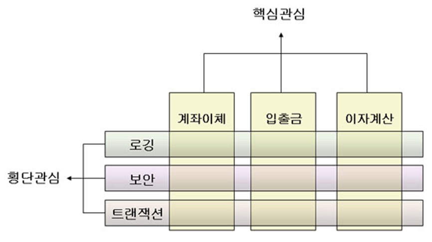
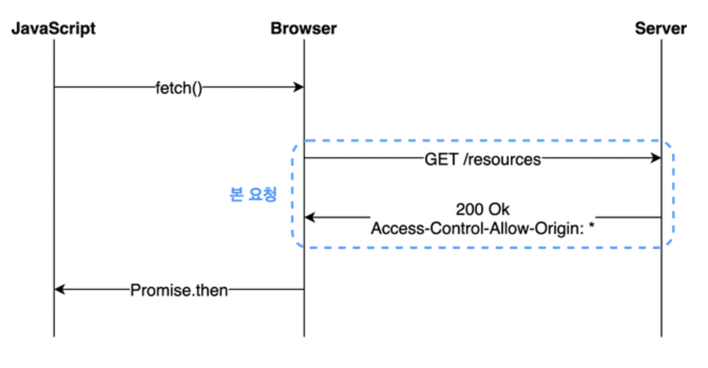
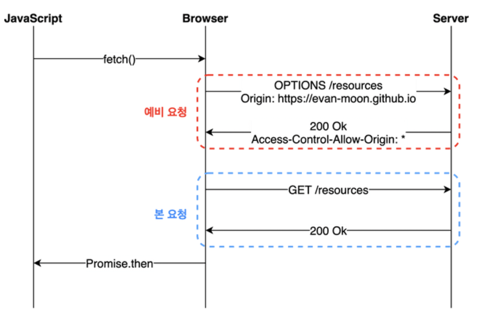

## 코드 리뷰

---

### 장바구니(협업) 미션 2단계(2)

- **es(Elastic Search)를 사용하는 이유**

  : 통계 정보를 DB에 저장할 때, 필요한 정보를 위해 새로운 컬럼이 추가될 수도 있다. 이 경우 효율적인 조회를 위해 인덱스를 걸 수 있는데, 인덱스를 걸면 DML 작업 시 성능상 이슈가 발생할 수 있다.

  es는 내부적으로 역색인이 되어있기 때문에 모든 컬럼에 대해 빠르게 조회가 가능하다. 집계 기능이 제공되기 떄문에 통계를 내기에도 편하고, 키바나와 연동하여 대시보드를 이용해 시각화하기에도 좋다.

  로그 정보를 es에 색인하여 이용하기도 한다.

- **백엔드 개발자의 입장에서 클라이언트 담당자들과 대화하고 조율하는 과정에서는 어떤 것에 초점을 맞추어야 원활한 소통을 할 수 있을까?**

  대개 API 명세에 대한 이야기를 나누게 될텐데, 어떤 정보가 필요하다고 할 때 해당 정보가 정확히 어떤 파트에서 사용되는지를 확실하게 알고 있는 것이 중요하다.

  일반적으로 기획서가 나온 뒤 어느정도 개발이 진행된 시점에서 명세를 맞추기 때문에 클라이언트 담당자들과의 대화에 초점을 맞추기 이전에 기획 요구사항에 대한 꼼꼼한 파악이 더 중요하다.

- **지금 시점(레벨2 방학을 앞둔 상황)에서 미리 공부해두면 좋을 기술적/비즈니스적 스킬**

  JPA가 제한 사항이 아니라면 공부해보는 게 좋을 것.

  일정 관리에 유념할 것.

- **백엔드 개발자들과의 협업 과정에서, 분업 중 공통 설계에 이상이 생기면 어떻게 해결하는 것이 좋은가?**

  보통은 설계에 수정사항이 생기면 해당 기획에 대해 함께 의논했던 동료들과 회의를 하여 바로잡고 다시 진행한다.

  한 명이 한 가지 피쳐만 잡고 있는 것이 아니므로, 팀원 중 한 명이 의논된 설계로 수정 작업을 하고 있을 동안 다른 일을 하고 있으면 된다.

- **클라이언트가 잘못된 url에 접근할 경우 개발자가 지정한 포맷과 다른 형식의 404 오류가 발생하는데, 일관성 유지를 위해 @GetMappint(”\*”)을 사용하여 404 에러를 핸들링해도 괜찮은가?**

  NoHandlerFoundException을 ExceptionHandler에서 잡아 핸들링하게 해도 좋을 듯 하다.

- 필드 객체에 대해 this 키워드를 사용하는 것

  생성자에서와 같이 중복된 이름의 파라미터가 들어오는 경우가 아니라면 굳이 붙이지 않아도 된다.

  내 생각: Test 코드에서 Fixture 객체를 가져다 쓸 때, 필드로 선언한 객체와 public static으로 선언된 fixture 객체를 구분하기 위해 this 객체를 사용할 수 있을 것 같다.

## 자잘한 기술부채

---

### ✅횡단 관심사? 종단 관심사?

관련 키워드 - AOP(관점 지향 프로그래밍)

- 종단 관심사 : 핵심 로직. 모듈 별로 다르게 나타나는 부분
- 횡단 관심사 : 주변 로직. 다수의 모듈에 **공통적**으로 나타나는 부분.
  

### ✅Json 직렬화/역직렬화

- 직렬화(Serialization)

  : 객체에 저장된 데이터를 I/O 스트림에 출력하기 위해 연속적인 데이터로 변환하는 것.(객체⇒데이터)

- 역직렬화

  : I/O 스트림에서 데이터를 읽어서(입력) 객체를 만드는 것.(데이터⇒객체)

직렬화/역직렬화는 서드 파티(네트워크, 파일 등)에서 자바 객체를 사용하기 위해 필요한 변환 과정이다.

Json 직렬화/역직렬화를 할 땐 Jackson이라는 라이브러리를 사용한다.

- @JsonAnyGetter

  : Map 필드를 다루는 데 유연성을 제공한다.
  Map 형식의 필드를 가지고 있는 Member 클래스를 예시로 들어보겠다.

  ```java
  public class Member {
      public String name;
      private Map<String, String> properties;

      public Member(String name) {
          this.name = name;
      }

      @JsonAnyGetter
      public Map<String, String> getProperties() {
          return properties;
      }

      public void add(String attr, String val) {
          this.properties.put(attr, val);
      }
  }
  ```

  `getProperties()` 메서드에 붙어있는 `@JsonAnyGetter` 어노테이션 덕분에 `getProperties()` 메서드가 반환하는 Map 객체는 Json String 형식으로 변환된다.

- 직렬화 예시 코드

  ```java
  import org.codehaus.jackson.map.ObjectMapper;

  List<Member> memberList = new ArrayList<>();
  memberList.add(new Member("Kate", 30, "1234"));
  memberList.add(new Member("Jason", 23, "5678"));
  memberList.add(new Member("Aaron", 35, "9012"));

  ObjectMapper mapper = new ObjectMapper();

  // object to json
  mapper.configure(MapperFeature.PROPAGATE_TRANSIENT_MARKER, true);
  mapper.writeValue(new File("test.json"), memberList);
  ```

- 역직렬화 예시 코드

  ```java
  ObjectMapper mapper = new ObjectMapper();

  // json to object
  mapper.configure(MapperFeature.PROPAGATE_TRANSIENT_MARKER, true);
  mapper.writeValue(new File("test.json"), memberList);
  System.out.println(mapper.readValue(new File("test.json"), new ArrayList<Member>().getClass()));
  ```

스프링에서는 @RequestBody, @ResponseBody 어노테이션이 자동으로 객체를 Json으로 직렬화/역직렬화 해준다.

### ✅CORS Preflight Request

CORS의 동작원리는 크게 다음 3개의 요청으로 설명할 수 있다.

- Simple Request : 단순 요청
- Preflight Request : 예비 요청
- Credential Request : 인증된 요청
- Simple Request

  : 특정 조건 하에서 예비 요청 없이 바로 요청을 보내는 방법

  서버에 바로 본 요청을 보낸 후 서버가 응답 헤더에 `Access-Controll-Allow-Origin` 값 등을 붙여서 보내주면 브라우저가 CORS 정책 위반 여부를 검사한다.
  

  - 조건 : `GET`, `HEAD` 요청 등

- Preflight Request

  : 지금 보내는 요청이 유효한지 확인하기 위해 `OPTIONS` 메서드로 예비 요청을 보내는 방법.

  

  - 조건 : Content-Type이 다음과 같은 `GET`, `HEAD`, `POST` 요청 등
    - `application/x-www-form-urlencoded`
    - `multipart/form-data`
    - `text/plain`

- Credential Request

  : CORS는 기본적으로 쿠키를 요청으로 보낼 수 없게 막고 있다. 요청이 credentials 모드이고, 응답 헤더에 `Access-Control-Allow-Credentials: true`가 설정되어 있다면 쿠키를 보낼 수 있다.
  
  Preflight Request의 경우에도 마찬가지로 응답 헤더에 `Access-Controll-Allow-Credentials: true` 설정이 포함되어 있어야 쿠키를 포함한 다음 요청이 정상적으로 동작한다.

[CORS의 기본 개념과 동작 방식(부제: Preflight 요청이란?)](https://velog.io/@wjdwl002/CORS의-기본-개념과-동작-방식부제-Preflight-요청이란)

[교차 출처 리소스 공유 (CORS) - HTTP | MDN](https://developer.mozilla.org/ko/docs/Web/HTTP/CORS)

### ✅PUT, PATCH(멱등성)

- 멱등성 : 연산을 여러 번 하더라도 결과가 달라지지 않는 성질. API 요청에서 멱등성을 보장하면 같은 요청이 여러 번 일어나더라도 항상 첫 번째 요청과 같은 결과가 돌아온다.
- PUT : 자원 전체를 교체한다.
  - 자원이 존재하지 않는 경우 POST와 같은 동작을 하고 201 응답을 보낸다.
  - 멱등성을 가진다.(어떤 상황에도 리소스는 같은 값이 되므로)
  - 예 ) 좋아요/싫어요 기능
- PATCH : 자원의 일부분만을 교체한다.
  - 자원이 존재하지 않는 경우 오류를 반환한다.
  - 설계에 따라 멱등성을 가질 수도, 가지지 않을 수도 있다.
    - 멱등성을 가지는 경우 : `{ name : “kim” }` ⇒ name을 kim으로 변경한다.
    - 멱등성을 가지는 경우 : `{ operation : “add”, age : 10 }` ⇒ 호출 시마다 age를 10씩 늘린다.
  - 예 ) 제품 폼 데이터

[자원을 수정하는 HTTP 메서드 - PUT vs PATCH](https://tecoble.techcourse.co.kr/post/2020-08-17-put-vs-patch/)

[Patch 메서드가 멱등이 아닌 이유 - 인프런 | 질문 & 답변](https://www.inflearn.com/questions/110644/patch-메서드가-멱등이-아닌-이유)

### ✅필드 주입을 지양해야 하는 이유

코드가 간결해진다는 장점이 있지만, 다음과 같은 단점이 있다.

- 외부에서 수정이 불가하다.

  ⇒테스트 코드를 작성할 때 객체를 수정할 수 없다.

- Spring과 같이 의존성 주입을 지원하는 프레임워크가 있어야 사용할 수 있다.
- final 키워드를 통한 필드 선언이 불가하기 때문에 객체가 mutable해진다.

[[Spring] 생성자 주입을 사용해야 하는 이유](https://programforlife.tistory.com/111)

### ✅서비스와 레파지토리의 차이점

- 서비스는 DB에 접근하는 코드는 레파지토리에 위임하고, 비즈니스 로직을 도메인에 위임한다.(=비즈니스 로직을 수행한다.)
- 레파지토리는 DB에 접근하는 메서드들을 사용하기 위한 인터페이스. DB에 접근하는 모든 코드가 모여있다.

### ✅안티 패턴(Anti-pattern)

: 실제로 많이 사용되는 패턴이지만 비효율적이거나 비생산적인 패턴.

ex)

- if-else로 처리할 수 있는 간단한 로직을 예외로 처리하는 것
- 매직넘버(직접 숫자가 입력된 하드코딩된 값)
- …

### ✅자바 Synchronized 키워드

멀티 스레드 환경에서 여러 개의 스레드가 한 개의 자원을 사용하고자 할 때 동시에 접근하지 못하도록 막는 것을 **스레드 동기화**라고 한다.

공유 데이터가 사용되어 동기화가 필요한 부분을 **임계 영역**이라고 부르며, 이 임계 영역에 synchronized 키워드를 사용하면 여러 스레드가 동시에 접근하는 것을 막을 수 있다.

synchronized로 지정된 임계 영역은 한 스레드가 이 영역의 코드를 실행 중일 때 lock이 걸리면서 다른 스레드가 접근할 수 없게 된다. 해당 스레드가 임계 영역의 코드를 벗어나게 되면 unlock 상태가 되어 대기하고 있던 다른 스레드가 이 임계 영역에 접근할 수 있게 된다.

남용하면 프로그램의 성능 저하를 유발할 수 있다.

- 메서드에 사용하는 경우
  : 메서드 전체를 임계 영역으로 설정할 수 있다.
  ```java
  public synchronized void method(){ /*...*/ }
  ```
- 참조 변수에 사용하는 경우(동기화 블럭)
  ```java
  private Object obj = new Object();
  public void exampleMethod(){
  		synchronized(obj){ /*...*/ }
  }
  ```

[[Java] 자바 - Synchronized 스레드 동기화 개념 및 사용예제](https://kadosholy.tistory.com/123)
