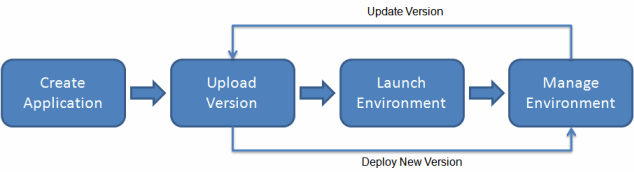

# 기술부채

### ✅무결성과 정합성

- 데이터 무결성(Data Integrity) - 데이터 값이 정확한 상태
  - 무결성이 훼손된 예시
    - Order 테이블에서 Customer Id가 모두 -1이고, Customer 테이블에도 -1의 Id를 갖는 고객이 존재한다.
    - 하지만 Customer Id는 반드시 1 이상의 값을 가지고 있어야 한다.
      ⇒데이터 정합성은 만족하지만 무결성은 훼손된 사례
- 데이터 정합성(Data Consistency) - 어떤 데이터들이 값이 서로 일치하는 상태
  - 정합성이 훼손된 예시
    - 앞선 예시에서 Order 테이블의 Customer Id를 -1에서 2로 변경했지만, Customer 테이블의 같은 고객의 id는 변경되지 않은 경우.

[무결성과 정합성이란 무엇인가?](https://velog.io/@yangsijun528/무결성과-정합성이란-무엇인가)

### ✅EB(Elastic Beanstalk)

: AWS 클라우드에서 애플리케이션을 신속하게 배포하고 관리할 수 있는 서비스.

Amazon EC2를 이용한 작업도 충분히 효율적이지만, 사용할 서버, 플랫폼, 인터프리터 등을 결정하고 설치하는 작업이 필요하다.

EB는 애플리케이션을 업로드하기만 하면 용량 프로비저닝, 로드밸런싱, 조정, 모니터링 등의 작업을 자동으로 처리해준다.

- EB의 워크플로우
  
  개발자가 EB에 개발한 코드를 업로드하면, EB는 자동으로 필요한 AWS 리소스를 생성하고 애플리케이션을 실행한다. 이렇게 해서 개발자는 환경을 직접 관리하고 애플리케이션의 새로운 버전을 배포할 수 있다.

EB console, AWS CLI를 통해 상호작용할 수 있다.

- 간단 사용법
  웹 애플리케이션을 배포하는 작업에서는 Eb CLI라는 EB 전용 CLI를 사용한다.

  **[EB CLI 설치 - AWS Elastic Beanstalk](https://docs.aws.amazon.com/ko_kr/elasticbeanstalk/latest/dg/eb-cli3-install.html)**

  EB CLI로 접속한 후, 배포하고자 하는 프로젝트 폴더로 이동한 후 다음 명령어를 통해 EB 환경을 초기화한다.

  ```bash
  eb init
  ```

  여기서 리전, 애플리케이션 이름, 플랫폼, EC2의 SSH 연결 여부 등을 설정해준다.
  이후 다음 명령어를 통해 EB 환경을 생성하고 애플리케이션을 실행한다.

  ```bash
  eb create [환경 이름]
  ```

[AWS Elastic Beanstalk을 사용해서 웹 애플리케이션 배포하기 | DevelopersIO](https://dev.classmethod.jp/articles/deploy-express-application-to-elastic-beanstalk/)

[2. Github Action & AWS Beanstalk 배포하기 - profile=local로 배포하기](https://jojoldu.tistory.com/549)
