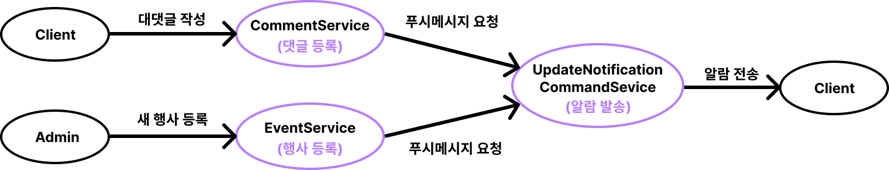
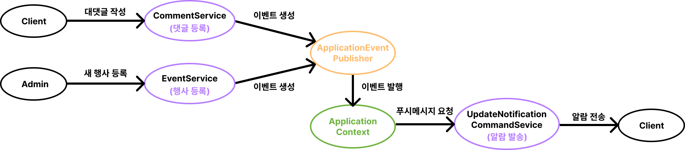

## 자잘한 기술부채

---

### ✅Batch Insert

batch insert란, 여러 개의 SQL Statement를 하나의 구문으로 처리하는 것을 의미한다.

- 본래라면 한 SQL 구문 당 하나의 트랜잭션이 할당되지만, Batch Insert으로 처리하면 여러 SQL Statement가 하나의 트랜잭션으로 묶이게 된다.
- 대량의 데이터를 Insert/Delete해야 하는 상황에서 쿼리 처리 성능을 향상시킬 수 있다.
- 설정 방법

  ```sql
  spring:
      jpa:
          database: mysql
          properties:
              hibernate.jdbc.batch_size: 50
              hibernate.order_inserts: true
              hibernate.order_updates: true
              hibernate.dialect: org.hibernate.dialect.MySQL5InnoDBDialect
              hibernate.show_sql: true
  ```

  - `hibernate.jdbc.batch_size` : Batch Insert의 Size를 지정한다. 이 값에 따라 한번에 Insert되는 Row의 개수가 결정된다.
  - `hibernate.order_updates, hibernate.order_inserts` : 같은 구문끼리 정렬을 한 뒤 구문을 실행하도록 하는 옵션이다.

- 동작 원리
  - java의 addBatch는 하나의 SQL 구문이 등록되면 그 복사본을 만든다.
  - 이후 작성되는 구문들은 해당 복사본 구문을 커밋될 때까지 재사용한다.
- Entity Key 생성 전략을 IDENTITY로 하면 batch 옵션이 동작하지 않는다.
  - 쿼리가 수행된 후에 값을 얻을 수 있기 때문에, 한꺼번에 값을 보내는 batch insert가 불가하다.
  - 때문에 Spring Data JDBC를 사용하거나, Spring Data JPA에서 Entity Key 생성 전략을 SEQUENCE로 사용하는 것이 권장된다.

[spring data jpa batch insert 정리](https://velog.io/@rainmaker007/spring-data-jpa-batch-insert-정리)

### ✅@EventListener

- EventListener을 사용하기 전
  
  유저가 대댓글을 작성하면 댓글 작성자에게 알람이 간다. 관리자가 행사를 새로 등록하면, 해당 행사의 태그를 관심등록한 사용자에게 알람이 간다.
  이 동작을 UpdateNotificationCommandService에서 처리한다.
- EventListener를 사용한 후
  

Event를 사용하는 주된 이유는 **서비스 간의 의존성을 줄이기 위함**이다.

Spring Event는 크게 **Event Clsss**와 이벤트를 발행하는 **Event Publisher**, 이벤트를 받아들이는 **Event Listener** 3가지 요소로 구성된다.

- Event Class : 이벤트를 처리하는 데 필요한 데이터를 가지고 있다.

  예시 이미지에는 없지만 CommentService, EventService가 생성하는 UpdateNotificationEvent라는 도메인 객체가 이에 해당한다.

  ```java
  @Getter
  public class UpdateNotificationEvent {

    private final Long receiverId;
    private final Long redirectId;
    private final String updateNotificationType;
    private final LocalDateTime createdAt;

    public UpdateNotificationEvent(
        final Long receiverId,
        final Long redirectId,
        final String updateNotificationType
    ) {
      this.receiverId = receiverId;
      this.redirectId = redirectId;
      this.updateNotificationType = updateNotificationType;
      this.createdAt = LocalDateTime.now();
    }
  }
  ```

- Event Publisher : ApplicationEventPublisher 빈을 주입하고 publishEvent() 메서드를 통해 생성된 이벤트 객체를 넣어주면 된다.

  예시에서 CommentService, EventService가 이에 해당한다.

  ```java
  @Slf4j
  @Service
  public class CommentService {

      ApplicationEventPublisher publisher;

  		...

      public void create(/* 생략 */) {
          ...
          publisher.publishEvent(new UpdateNotificationEvent(/* ... */));
      }
  }
  ```

- Event Listener : 발생한 이벤트를 캐치해서 @EventListener 어노테이션으로 정의한 메서드를 호출할 수 있다.

  예시에서는 UpdateNotificationCommandService가 이에 해당한다.

  ```java
  @Service
  @RequiredArgsConstructor
  public class UpdateNotificationCommandService {

    private final UpdateNotificationRepository updateNotificationRepository;
    private final FirebaseCloudMessageClient firebaseCloudMessageClient;

    @EventListener
    public void createUpdateNotification(final UpdateNotificationEvent updateNotificationEvent) {
      /** 사용자에게 푸시 알람 보내는 코드 **/
    }
  }
  ```

스프링 이벤트는 기본적으로 동기 방식으로 동작하기 때문에, 비동기로 처리하게 하면 성능을 높일 수 있다.

```java
@EnableAsync
@SpringBootApplication
public class EmmSaleApplication {

	public static void main(String[] args) {
		SpringApplication.run(EmmSaleApplication.class, args);
	}
}
```

```java
@Service
@RequiredArgsConstructor
public class UpdateNotificationCommandService {

  private final UpdateNotificationRepository updateNotificationRepository;
  private final FirebaseCloudMessageClient firebaseCloudMessageClient;

	@Async
  @EventListener
  public void createUpdateNotification(final UpdateNotificationEvent updateNotificationEvent) {
    /** 사용자에게 푸시 알람 보내는 코드 **/
  }
}
```

`@EnableAsync` 어노테이션을 통해 비동기를 사용하겠다고 선언하고, 비동기로 동작하고자 하는 메서드에 `@Async` 어노테이션을 설정해주면 된다.

[spring 이벤트 사용하기(event publisher, event listener)](https://wildeveloperetrain.tistory.com/217)
