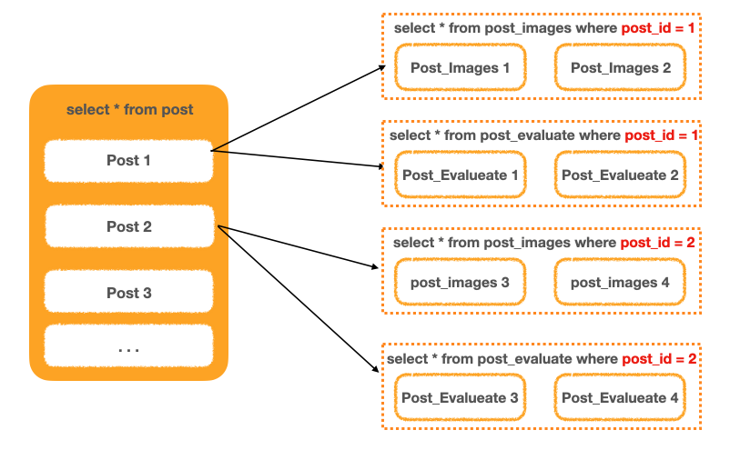
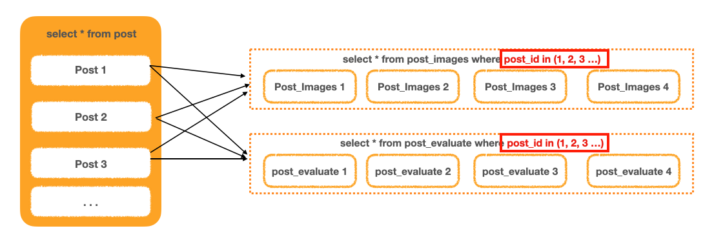

## 자잘한 기술부채

---

### ✅JPQL로 Join을 할 때 Distinct 처리는 어떻게 되는가?

ManyToMany 관계 또는 Collection 필드를 Join하면 **중복 데이터가 발생**한다.

DB 관점에서 중복 데이터는 존재하지 않지만, JPA의 관점에서는 중복 객체가 발생한다.

JPA는 distinct 쿼리가 포함된 JPQL을 실행시키면 같은 식별자를 바라보고 있는 **Entity**를 대상으로 중복 제거를 해준다. 즉, Row를 기준으로 중복을 검사하는 DB와 달리 객체의 중복을 검사하기 때문에 중복된 객체를 가지는 데이터를 제거해준다.

[JPA) fetch join과 distinct](https://velog.io/@nestour95/JPA-fetch-join과-distinct)

[32. JPQL - Collection Fetch Join과 Distinct](https://devraphy.tistory.com/602)

### ✅MultipleBagFetchException 해결

중첩 Fetch Join으로 인해 발생하는 예외

2개 이상의 OneToMany 자식 테이블에 Fetch Join을 사용했을 때 발생한다.

- JPA의 Fetch Join의 특징
  - OneToOne, ManyToOne은 몇 개든 중첩해서 Fetch Join 할 수 있다.
  - ManyToMany, OneToMany는 1개만 사용할 수 있다.
- 예외 해결 방법
  - 자식 테이블 하나만 Fetch Join을 걸고, 나머지는 Lazy Loading으로 처리되게 한다.
  - Fetch Join을 나누어서 실행한 후 조합하기
  - Hibernate `default_batch_fetch_size` 활용
    전)
    
    후)
    
    ```yaml
    jpa:
    	show-sql:
    		properties:
    			hibernate.default_batch_fetch_size=1000
    ```

[MultipleBagFetchException 발생시 해결 방법](https://jojoldu.tistory.com/457)

[[JPA] Fetch Join 할 때 MultipleBagFetchException 해결하는 법](https://devlog-wjdrbs96.tistory.com/421)

### ✅@Modifying

@Query 어노테이션으로 JPQL을 작성할 때 DML문을 작성하는 경우 @Modifying을 붙여야 한다.

@Query로 정의된 벌크 연산 JPQL은 영속성 컨텍스트를 거쳐 쓰기 지연 SQL로 동작하지 않고 바로 Database로 질의하는 식으로 동작한다. 때문에 벌크 연산을 실행할 1차 캐시와 실제 DB의 데이터 싱크가 맞지 않는 상황이 생길 수 있다.

[Spring Data JPA @Modifying 알아보기](https://joojimin.tistory.com/71)
