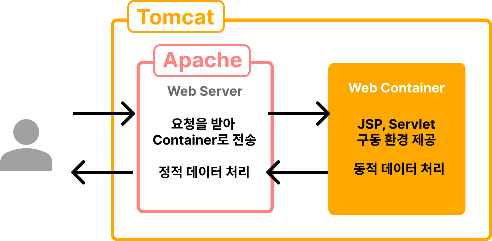

## 코드 리뷰

---

### 톰캣 만들기 1, 2단계
- 코드에서 if-else if가 반복되면 다형성을 활용해서 리팩토링해보자.
- 작업 목록의 항목 당 하나의 커밋을 만든다고 생각하며 커밋을 잘게 쪼개는 것이 좋다.

## 자잘한 기술부채

---

### ✅ Tomcat

Tomcat은 Http 서버와 서블릿 컨테이너의 역할을 한다.

- Apache Tomcat(아파치 톰캣)
    - 아파치와 톰캣은 어떤 기능을 하고, 무슨 차이가 있을까?
    - 아파치 : 아파치 소프트웨어 재단의 오픈소스 프로젝트(**웹 서버**)이며, 클라이언트 요청이 왔을 때만 응답하는 **정적 웹 페이지**에 사용된다.
        - 80번 포트로 클라이언트 요청이 왔을 때만 응답한다.
    - 톰캣 : 웹서버에 동적인 웹을 만들기 위한 웹 컨테이너(서블릿 컨테이너)를 결합한 것. JSP, 서블릿을 처리하고 HTTP 요청을 수신하고 응답한다.
        - 8080 포트로 처리한다.
    
    톰캣이 아파치의 기능 일부를 가져와서 제공해주는 형태이기 때문에, 아파치와 톰캣을 합쳐서 부른다. ⇒WAS(Web Application Server)
    
- 웹 서버와 WAS 차이점
    - Web Server: html, 이미지 요청 등 정적 데이터 요청을 처리하는데 빠르다.
    - WAS: 서블릿, jsp 등 비즈니스 로직을 수행하는데 적합하다.

[[Apache Tomcat] 아파치 톰캣이란 ?](https://byul91oh.tistory.com/65)

[[TOMCAT] 🐱 아파치 톰캣 개념 구성  & 설정 💯 정리](https://inpa.tistory.com/entry/TOMCAT-⚙️-설치-설정-정리)

### ✅ Location 헤더

HTTP 응답 헤더의 Location 속성은 리다이렉트할 url을 명시한다.

응답의 상태 코드가 201 또는 3XX일 때 사용할 수 있다.

Location에 설정해준 url 주소로 리다이렉트한다.

브라우저는 201 또는 3XX 상태 코드의 응답을 받으면, Location에 명시된 url을 기존 url에 붙인 URL에 fetch 요청을 보낸다.