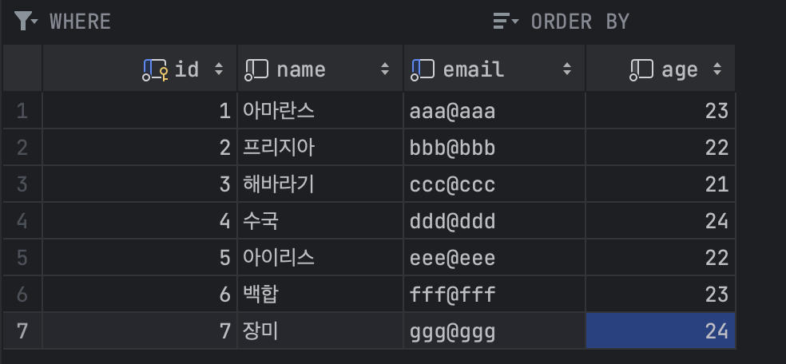
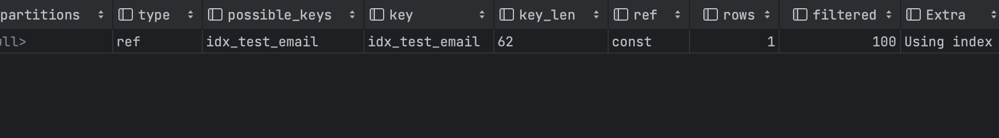
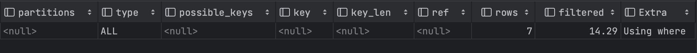
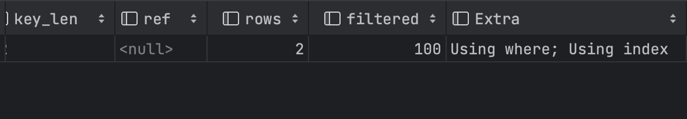

## 코드 리뷰

---

### Tomcat 만들기 3, 4단계

- 상수의 정의
    
    ```java
    private SessionManager() {
      }
        private static final SessionManager INSTANCE = new SessionManager();
    	...
    }
    ```
    
    상수를 표기할 땐 `UPPER_SNAKE_CASE`를 사용한다.
    
    상수는 내용이 거의 불변이고 메서드에 감지할 수 있는 부작용이 없는 정적 최종 필드입니다. 
    
    ex) 원시값, 문자열, 불변 값 클래스, null
    
    **인스턴스의 관찰 가능한 상태 중 하나라도 변경될 수 있다면 상수가 아니다.**
    
- Map 객체를 사용할 때, 예외처리를 하는 경우 getOrDefault() 메서드를 고려해보라.
    
    ```java
    public Session findSession(final String id) {
            if (id == null) {
                return null;
            }
            return SESSIONS.get(id);
    }
    ```
    
- 스레드 풀의 객체 타입으로 클래스 ThreadPoolExecutor보다는 인터페이스 ExecutorService를 사용하라.
- 스레드 풀을 생성할 때 ThreadPoolExecutor의 생성자를 사용하기 보단 Executors의 정적 팩토리 메서드를 사용해라.
    - 상황에 따라 세부설정을 하는 것도 좋지만 자바가 제공하는 기능을 활용하는 편이 의도를 더 쉽게 전달할 수 있다.
    - keepAliveTime의 값은 어느정도가 적당할까?
        
        적절한 keepAliveTime은 여러 요인에 따라 달라질 수 있는데, 그 기준은 크게 다음과 같은 3가지를 들 수 있다.
        
        1. 작업의 종류와 특성
            
            작업이 CPU 바운드인 경우 keepAliveTime을 짧게 설정하고, 작업이 I/O 바운드인 경우 더 길게 설정해서 스레드를 오랫동안 유지하도록 한다.
            
        2. 요구되는 응답 시간의 길이
            
            작업이 빠른 응답속도를 요구하는 경우에는 짧게, 상대적으로 긴 응답시간을 허용하는 경우 더 길게.
            
        3. 시스템 리소스 제약
            
            시스템이 많은 수의 스레드를 동시에 유지할 수 있는 경우에는 짧게, 스레드 수에 제한이 있는 경우 더 길게 설정해서 스레드를 오래 유지한다.
            
        
        ⇒웹 서버의 경우 일반적으로 5분에서 2시간 정도로 설정한다.
        
        [Phind: AI Search Engine and Pair Programmer](https://www.phind.com/search?cache=si09u7cnb3iolooqdvf6x6nm)
        
- BufferedReader는 close()를 호출하지 않아도 문제가 없다.
    - BufferReader 객체는 GC가 자동으로 해제해주기 때문에 직접 닫아주지 않아도 된다.
        
        직접 닫아줄 경우, [이런 문제](https://velog.io/@yeezze/BufferedReader%EB%A5%BC-%EB%8B%AB%EC%95%84%EB%B3%BC%EA%B9%8C)가 생길 수도 있다.
        
    - 그렇지만 GC가 언제 동작할지 알 수 없기 때문에, close()를 직접 명시해주는 것이 좋다.
- Objects.requireNonNull(response)를 사용하기 보단, response 객체가 null이 나올 수 없도록 코드를 작성하라. null을 허용하는 코드를 작성하면 협업하는 다른 개발자도 null을 의식하게 되고 null을 방어하는 불필요한 코드가 쌓이게 된다.
    
    +) 실수로 작성 안하면 NPE가 생길 수도 있음.
    
    ⇒ 메서드에서 null을 반환하는 일이 없도록 만들라.
    
- 객체지향 생활체조 규칙 4: 한 줄에 점을 하나만 찍는다.
    
    ```java
    outputStream.write(Objects.requireNonNull(response).toString().getBytes());
    ```
    
- HttpRequest 객체를 생성할 때, 외부에서 start line, header, body 객체를 만들어서 넘겨주기보단 HttpRequest 내부에서 처리하는것이 좋아보인다. startline, header, body 객체는 HttpRequest와 강하게 연관되어 있기 때문에 굳이 외부에서 만들어서 넘겨줄 이유가 없고, 테스트 하기도 어렵게 만드는 구조가 된다.
    
    ```java
    private HttpRequest parseHttpRequest(final BufferedReader bufferedReader) throws IOException {
    		final HttpRequestStartLine startLine = extractStartLine(bufferedReader);
        if (startLine == null) {
          throw new IllegalArgumentException("로그인 정보가 입력되지 않았습니다.");
    	            return null;
    		}
    	  final HttpRequestHeader httpRequestHeaders = extractHeader(bufferedReader);
    	  final HttpRequestBody httpRequestBody = extractBody(httpRequestHeaders.getContentLength(), bufferedReader);
        return new HttpRequest(startLine, httpRequestHeaders, httpRequestBody);
    }
    ```
    
- reader를 통해 읽은 문자열을 읽고 파싱하는 작업은 Http11Processor보다 HttpRequestHeader에서 처리하는 게 더 적절한 것 같다.
- Controller의 응답(HttpResponse)을 service() 파라미터로 넣어라.
- 입력 파라미터가 너무 길어지는 경우 한 줄에 길게 늘어뜨리지 말고 엔터로 줄바꿈해 의미를 구분할 수 있게 하라.
    
    ```java
    List.of(new LoginGetController(), new LoginPostController(), new RegisterGetController(), new RegisterPostController(), new DefaultGetController());
    ```
    
- 2뎁스를 1뎁스로 만들어라.⇒적절히 메서드를 분리해서 가독성을 높이기
- [메서드 명명] 파일을 불러오는 메서드의 경우 동사로 get보다는 read가 적절해보임.
- if절 조건이 너무 복잡할 경우 읽기 쉽게 적절히 메서드로 분리해라.
- 컨트롤러 공통으로 들어가는 코드를 보면, 생성자에 필수적으로 들어가는 파라미터와 옵션으로 들어가는 파라미터가 있어 매번 클라이언트에서 어떤 파라미터를 전달해야 할지 신경 써야 한다.
    
    ⇒ 빌더패턴을 활용해 그때 그때 필요한 파라미터만 클라이언트측에서 입력할 수 있게 함. 
    
    ```java
    responseHeader = new HttpResponseHeader(
                        getContentType(request.getAccept(), request.getPath()),String.valueOf(0),
    										"/index.html", setCookie);
    ```
    
- http와 관련된 처리는 각 객체에서 처리하도록 만들어야 비즈니스 로직에 집중할 수 있다. 지금 코드는 http 처리와 비즈니스 로직이 섞여 있다.
    - HTTP 서버에서 요청을 받는 책임은 Request, 응답을 반환하는 책임은 Response 객체에서 처리하도록 한다.

## 자잘한 기술부채

---

### ✅ Non-Blocking

동기/비동기는 요청한 작업의 완료 여부에 초점을 맞춰 **작업을 순차적으로 수행할지 아닌지**에 대한 개념이고, 블로킹/논블로킹은 **현재 작업이 block(차단/대기)되느냐 아니냐**에 따라 다른 작업을 수행할 수 있는지에 대한 개념이다.

동기/비동기가 전체적인 작업에 대한 순차적인 흐름 유무라면, 블로킹/논블로킹은 전체적인 작업의 흐름 자체를 막느냐/막지 않느냐로 볼 수 있다.

예시로 파일을 읽는 작업을 할 때 블로킹 방식으로 읽으면 파일을 다 읽을 때까지 대기하고, 논 블로킹 방식으로 읽으면 파일을 다 읽지 않아도 다른 작업을 할 수 있다.

실무에서는 이러한 특징 때문에 비동기와 논블로킹을 혼용하여 사용하곤 하지만, 엄연히 나타내는 의미는 다르다. 

[Blocking, Non-blocking, Sync, Async 의 차이](https://jh-7.tistory.com/25)

[](https://inpa.tistory.com/entry/👩‍💻-동기비동기-블로킹논블로킹-개념-정리)

### ✅L4/L7 로드밸런서, HAProxy, AWS ELB

- **L4/L7 로드밸런서**
    
    로드밸런서란 트래픽을 받아 여러 대의 서버에 분산시키는 하드웨어/소프트웨어를 의미한다.
    
    로드밸런서는 OSI 7계층을 기준으로 L4계층(전송 계층)의 로드밸런서와 L7 계층(어플리케이션 계층)의 로드밸런서로 구분할 수 있다.
    
    - L4 로드 밸런서는 IP/Port를 기준으로 스케줄링 알고리즘을 통해 부하를 분산한다.
    - L7 로드밸런서는 IP, Port 외에도 URI, Payload, Http Header, Cookie 등의 내용을 기준으로 부하를 분산한다. 때문에 콘텐츠 기반 스위칭이라고도 한다.
    
    L4 로드밸런서가 단지 부하를 분산시키는 역할만을 한다면, L7 로드밸런서는 요청의 세부적인 사항을 두고 서버를 좀더 디테일한 기준으로 나누어 부하를 분산할 수 있다.
    
    L7 로드밸런서는 데이터 분석/처리가 가능하기 때문에, 악의적인 컨텐츠를 감지해 차단할 수 있다는 장점이 있고 자원소모가 크다는 단점이 있다.
    
- **AWS ELB**
    
    AWS ELB(Elastic Load Balancer)에는 크게 3가지 로드 밸런서가 있는데, Application Load Balancer(ALB), Network Load Balancer(NLB), Classic Load Balancer(CLB)이다.
    
    ALB는 L7 로드밸런서, NLB는 L4 로드밸런서에 해당한다.
    
- **HAProxy**
    
    : 기존의 하드웨어 스위치를 대체하는 소프트웨어 로드밸런서. 오픈소스 로드 밸런싱의 표준 중 하나이며, 다양한 리눅스 버전에서 사용할 수 있다.
    
    HAProxy는 기본적으로 리버스 프록시 형태로 동작한다.
    
    설치가 쉽고 빠르기 때문에 서비스 이중화를 구성하는데 주로 사용한다.
    

[[HAProxy]HAProxy 란?](https://leffept.tistory.com/309)

[L4 / L7 로드밸런서 차이 (Load balancer)](https://jaehoney.tistory.com/73)

### ✅ Nginx keep-alive 설정

Nginx의 Keep-Alive는 클라이언트의 연결 요청을 처리한 후 바로 연결을 끊는 것이 아니라, 연결을 끊지 않고 일정 시간 대기하는 시간을 의미한다.

keep alive를 지정해주면 클라이언트의 요청이 여러 번 있을 때 클라이언트가 한 번 TCP 세션을 연결하면 그 후 Keep Alive 시간동안 동일한 세션으로 데이터를 계속 주고받을 수 있게 된다.

⇒ 불필요하게 일일이 TCP 세션 연결을 하지 않아도 되고, 더 빠르게 통신할 수 있게 된다.

[[Nginx] Upstream 서버의 KeepAlive 주기를 조정하여 불필요한 TCP-handshake 과정 제거하기](https://velog.io/@msung99/ㄴㄴㄴ)

### ✅ OOM

Out Of Memory Error, 메모리 부족으로 인해 발생하는 에러.

### ✅ 롤링 배포

무중단 배포 전략의 일종. 사용중인 인스턴스 내에서 새 버전의 인스턴스로 점진적으로 교체하는 배포방식.

- 장점
    - 롤백이 쉽다.
    - 인스턴스를 추가적으로 늘릴 필요가 없다.
    - 관리가 간편하다.
- 단점
    - 배포 중 인스턴스의 수가 감소되므로 사용중인 인스턴스에 트래픽이 몰릴 수 있다.
    - 배포 진행 과정에서 구버전과 신버전이 공존하기 때문에 호환성 문제가 발생할 수 있다.(사용자들이 균일한 서비스를 받지 못한다.)

### ✅ CQRS(Command and Query Responsibility Segregation)

: 데이터 저장소로부터의 읽기와 업데이트 작업을 분리하는 패턴.

어플리케이션의 성능, 확장성, 보안성을 증대시킬 수 있다.

- 로직 상에서 읽기와 쓰기를 분리하는 방법
    
    어플리케이션 구현 시 Command 서비스와 Query 서비스를 분리한다.
    
- 물리적으로 분리하는 방법
    - 읽기 DB와 쓰기 DB를 분리한다. 다른 DB 스키마를 사용하게 하거나, 아예 다른 타입의 DB를 사용하는 방법이 있다.(쓰기는 RDBMS, 읽기는 NoSql)
    - 읽기 DB와 쓰기 DB가 분리되는 경우 두 DB 간 데이터를 동기화시키는 작업이 매우 중요하다.
        - 일반적으로 쓰기 모델이 DB에 수정사항이 발생할 때마다 이벤트를 발행함으로써 이루어진다. 이 **DB 업데이트와 이벤트 발행은 반드시 하나의 트랜잭션 안에서 이루어져야 한다.**
        - 보통 읽기 저장소가 쓰기 저장소에 비해 더 많은 부하를 받는다.
- CQRS의 장점
    - 독립적인 스케일링 - 읽기/쓰기 각각에 대해 독립적으로 스케일링하는 것이 가능하다.
    - 최적화된 데이터 스키마 - 저장소 목적(쓰기/읽기)에 최적화된 스키마를 사용
    - 보안 - 읽기/쓰기를 분리함으로써 보안 관리가 용이해진다.
    - 관심사 분리 - 시스템의 유지보수를 더 쉽고 유연하게 해준다. 대부분의 복잡한 비즈니스 로직은 쓰기 모델에 들어가고 상대적으로 읽기 모델은 간단해진다.

[몽고디비와 mysql을 연결할 수 있을까요? - 인프런 | 질문 & 답변](https://www.inflearn.com/questions/271602/몽고디비와-mysql을-연결할-수-있을까요)

[The Master-Slave Database Concept For Beginners - DataDrivenInvestor](https://www.datadriveninvestor.com/2020/05/28/the-master-slave-database-concept-for-beginners/)

[CQRS란 무엇인가?](https://mslim8803.tistory.com/73)

### ✅ Redis 캐시

Redis를 캐시로서 사용하는 것을 의미한다.

Redis는 key-value 구조의 비정형 데이터(NoSQL)를 저장하고 관리하기 위한 오픈 소스 기반의 DBMS이다.

- 특징
    - In-Memory 데이터 저장소이며, 디스크 대신 메모리를 데이터 저장소로 활용한다.
    - 다양한 자료구조를 지원한다.
- 캐시를 적용하면 좋은 데이터
    - 자주 접근하는 데이터
    - 처리할 때 복잡한 로직이 요구되는 데이터.
    - 자주 변경되지 않는 데이터
        - 자주 변경되는 데이터에 캐싱을 적용하면 데이터 정합성 문제가 발생한다.

[[Redis] Redis 캐시(Cache)를 적용해 조회 성능 개선하기](https://seungjjun.tistory.com/246)

### ✅ 커버링 인덱스

인덱스는 데이터를 효율적으로 탐색하는 방법

MySQL의 경우, 인덱스 안에 있는 데이터를 사용할 수 있는데, 이를 잘 활용하면 실제 메모리에 저장된 데이터(테이블)에 접근하지 않고도 데이터를 얻어올 수 있다.

- **커버링 인덱스** - 쿼리를 충족하는 데 필요한 모든 데이터를 가진 인덱스
    
     쿼리문에서 SELECT / WHERE / GROUP BY / ORDER BY 등에 활용되는 모든 컬럼이 인덱스의 구성 요소인 경우, 해당 인덱스를 커버링 인덱스라고 한다.
    
    쉽게 말해서 인덱스에 존재하는 컬럼 값으로만 쿼리를 완성하는 것을 의미한다.
    
    커버링 인덱스를 잘 사용하면 대용량 데이터 처리에서의 조회 성능을 상당히 높일 수 있다.
    

조회 쿼리가 커버링 인덱스를 사용했는지 여부는 `EXPLAIN` 키워드를 통해 실행계획을 확인함으로써 알 수 있다.

실행 계획의 `extra` 컬럼에 `Using index`가 포함되어 있는 경우, 이는 커버링 인덱스를 활용한 것이다.

예제 )

1. Select + Where 조합

test 데이터를 만들고, email에 대해 인덱스를 만들어준다.

```sql
create table test (
    id bigint primary key auto_increment,
    name varchar(20) not null,
    email varchar(20) not null,
    age int not null
);

create index `idx_test_email` ON `test` (email);
```

테이블에 다음과 같이 데이터를 입력한다.



where절에 email을 사용한 경우:

```sql
explain
select email
from test
where email = 'ddd@ddd';
```



where절에 name을 사용한 경우:

```sql
explain
select name
from test
where name = '수국';
```



1. Where + Group By 조합

Group By의 경우, 아래와 같은 조합에서 인덱스가 적용된다.

- 인덱스 컬럼과 Group By에 명시하는 컬럼의 순서가 동일할 것.
- 인덱스 컬럼 중 뒤에 있는 컬럼은 Group By에 명시하지 않을 것.
- 인덱스 컬럼 중 앞에 있는 컬럼은 Group By에 명시할 것.
- 인덱스에 없는 컬럼을 Group By에 명시하지 않을 것.

```sql
--- 인덱스가 (a, b, c)인 경우

GROUP BY b              --- 인덱스 적용 X
GROUP BY b, a           --- 인덱스 적용 X
GROUP BY a, c, b        --- 인덱스 적용 X

GROUP BY a              --- 인덱스 적용 O
GROUP BY a, b           --- 인덱스 적용 O
GROUP BY a, b, c        --- 인덱스 적용 O

GROUP BY b, c           --- 인덱스 적용 X

GROUP BY a, b, c, d     --- 인덱스 적용 X
```

```sql
create index `idx_test_name_id_email` ON `test` (name, id, email);

explain
select id, name, email
from test
where name like '아%'
group by id, email;
```



[커버링 인덱스](https://tecoble.techcourse.co.kr/post/2021-10-12-covering-index/)