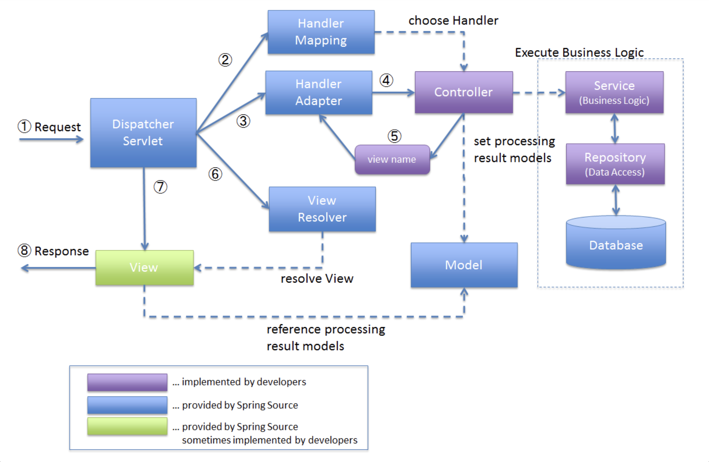

## 코드 리뷰

---

### @MVC 구현하기 미션 1단계

- 매번 `handler.getDeclaringClass().newInstance()`로 Controller 객체를 생성하는 것보다 Controller 객체를 인스턴스 변수로 지정해주는 편이 효율적일 것 같다.
    
    ```java
    public class HandlerExecution {
    
        private final Method handler;
    
        public HandlerExecution(final Method handler) {
            this.handler = handler;
        }
    
        public ModelAndView handle(final HttpServletRequest request, final HttpServletResponse response)
                throws InstantiationException, IllegalAccessException, InvocationTargetException {
            return (ModelAndView) handler.invoke(handler.getDeclaringClass().newInstance(), request, response);
        }
    }
    ```
    
    여기서 HandlerExecution 객체는 Map<HandlerKey, HandlerExecution> 맵에 저장되는데, 이 코드의 경우 컨트롤러의 handle 메서드가 호출될 때마다 컨트롤러 객체를 생성하게 되므로 오버헤드가 발생한다. 반면 HandlerExecution 클래스의 인스턴스 변수로 지정해주면 처음 Map을 초기화할 때만 컨트롤러 객체를 생성해주면 되므로 좀 더 효율적이라고 할 수 있다.
    
    ```java
    public class HandlerExecution {
    
        private final Method handler;
        private final Object controller;
    
        public HandlerExecution(final Method handler, final Object controller) {
            this.handler = handler;
            this.controller = controller;
        }
    
        public ModelAndView handle(final HttpServletRequest request, final HttpServletResponse response)
                throws IllegalAccessException, InvocationTargetException {
            return (ModelAndView) handler.invoke(controller, request, response);
        }
    }
    ```
    
- 정의된 RequestMapping의 Target이 @target({ElementType.METHOD, **ElementType.Type**})으로 정의되어 있는 것으로 보아, @RequestMapping 어노테이션을 클래스 단에서도 사용할 수 있다. 현재 코드는 메서드에 붙은 @RequestMapping만 체크하고 있으니 @RequestMapping이 붙은 클래스의 메서드들도 체크하게 하면 좋을 것 같다.
- 여러번 사용되는 메서드의 경우 static import를 해도 좋을 것 같다.
    
    ```java
    BDDMockito.given(request.getAttribute("id")).willReturn("gugu");
    BDDMockito.given(request.getRequestURI()).willReturn("/get-test");
    BDDMockito.given(request.getMethod()).willReturn("GET");
    ```
    

### @MVC 구현하기 미션 2단계

- List<HandlerMapping> handlerMappings를 일급 컬렉션으로 정의하기
    - 클래스의 멤버 변수로 정의된 컬렉션 객체는 일급 컬렉션으로
    
    ```java
    public class DispatcherServlet extends HttpServlet {
    
        private static final long serialVersionUID = 1L;
        private static final Logger log = LoggerFactory.getLogger(DispatcherServlet.class);
    
        private List<HandlerMapping> handlerMappings;
    		...
    }
    ```
    
- Handler에서 ModelAndView를 반환하게 한 이유?
    1. 실제 스프링 MVC 구조에서도 DispatcherServlet에서 호출하는 handle() 메서드도 ModelAndView 객체를 반환하고 있어서
    2. String과 ModelAndView 중, ModelAndView가 이후 로직에서 좀 더 처리하기 쉽게 가공된 데이터라고 생각해서
    
    ```java
    @Controller
    public class RegisterController {
    
        @RequestMapping(value = "/register", method = RequestMethod.POST)
        public ModelAndView register(final HttpServletRequest req, final HttpServletResponse res) throws Exception {
            final var user = new User(2,
                    req.getParameter("account"),
                    req.getParameter("password"),
                    req.getParameter("email"));
            InMemoryUserRepository.save(user);
    
            return new ModelAndView(new JspView("redirect:/index.jsp"));
    		}
    }
    ```
    
- Spring 실제 구현에서는 HandlerMapping 클래스의 역할은 Handler를 "만들어"주기 보다는, "선택"하는 역할인 것으로 보인다. Spring의 동작 흐름을 더 잘 이해하기 위해 "선택"하는 방법으로 수정해보는건 어떤지?
    
    
    
- Handler를 추상화시켜줌으로써 HandlerAdapter의 역할을 Handler 스스로 할 수 있게 된 것 같다.실제 스프링 구조를 인지하기 위해 HandlerAdapter 클래스를 만들어보는 것은 어떤지?

## 자잘한 기술부채

---

### ✅ @Target 어노테이션

: 어노테이션을 사용할 대상을 지정하는 데 사용하는 메타 어노테이션이다.

<aside>
💡 **메타 어노테이션(Meta Annotation)**

---

어노테이션에 붙이는 어노테이션.

어노테이션 자체에 대해 정의하기 위해 사용한다.

</aside>

- 사용법
    - @Target 어노테이션에서 지정할 수 있는 옵션과 대상의 타입은 다음과 같다.
    
    | Target 어노테이션 옵션 | 대상 타입 |
    | --- | --- |
    | ElementType.ANNOTATION_TYPE | 어노테이션 |
    | ElementType.CONSTRUCTION | 생성자 |
    | ElementType.FIELD | 필드(멤버변수, Enum 상수) |
    | ElementType.LOCALVARIABLE | 지역 변수 |
    | ElementType.METHOD | 메서드 |
    | ElementType.PACKAGE | 패키지 |
    | ElementType.PARAMETER | 매개변수(파라미터) |
    | ElementType.TYPE | 타입(클래스, 인터페이스, Enum) |
    | ElementType.TYPE_PARAMETER | 타입 매개변수(제네릭 등) |
    | ElementType.TYPE_USE | 타입이 사용되는 모든 대상 |
- 예제
    
    ```java
    import java.lang.annotation.Target;
    import java.lang.annotation.ElementType.*;
    
    @Target({FIELD, TYPE})
    public @interface CustomAnnotation {
    }
    ```
    
    위와 같은 사용자 정의 어노테이션이 있을 때, @CustomAnnotation 어노테이션은 클래스 자체(+인터페이스, Enum)에 붙일 수도 있고, 클래스의 멤버변수에 붙일 수도 있다.
    
    ```java
    @CustomAnnotation
    class Main {
        @CustomAnnotation
        int num;
    }
    ```