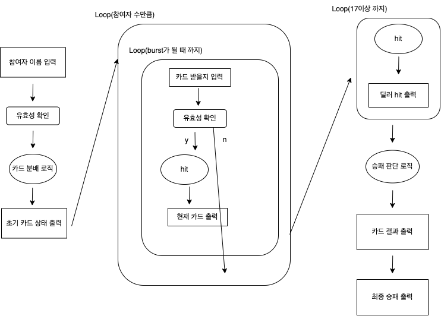

## ✨LOG

- [문자열] 강의를 들었다.
- 새로운 페어와 **블랙잭 1단계 미션**을 구현했다.
- 레벨마다 진행하는 **글쓰기 미션**에 대한 안내를 받았다.
- [제네릭] 강의를 들었다.
- **제네릭 미니 미션**을 구현하였다.
- 디자인 패턴 - 템플릿 메소드 패턴에 대해 공부했다.

## ✨배운 점&궁금한 점

- [String Pool과 StringBuilder](https://amaran-th.github.io/%EC%9A%B0%ED%85%8C%EC%BD%94%205%EA%B8%B0/[Java]%20String%20Pool%EA%B3%BC%20StringBuilder/)
- [Template Method 패턴](https://amaran-th.github.io/%EC%9A%B0%ED%85%8C%EC%BD%94%205%EA%B8%B0/[%EB%94%94%EC%9E%90%EC%9D%B8%20%ED%8C%A8%ED%84%B4]%20Template%20Method%20Pattern/)
- [제네릭이란?](<https://amaran-th.github.io/%EC%9A%B0%ED%85%8C%EC%BD%94%205%EA%B8%B0/[Java]%20%EC%A0%9C%EB%84%A4%EB%A6%AD(Generic)/>)
- static 초기화 블럭 사용법
- `@ParameterizedTest`를 사용한 null/empty 유효성 검증
- stream()의 groupingBy 메서드

## ✨느낀점

### 블랙잭 미션

이번 미션에서는 페어 분과 기능 목록을 정리하는 데 많은 시간을 들였는데, 시간이 꽤 오래 걸리긴 했어도 그만큼 요구 사항에 대해 충분히 고민해보고 구현에 들어갈 수 있어서 좋았던 것 같다.

이번에 내 친한 크루의 전 페어의 전 페어로부터 전파된 README.md 파일의 양식을 이번 미션에서 적용해보았는데, 도메인 모델의 명칭을 표로 정리해 놓으니 한 눈에 보기 좋고 소통하기도 편리해서 좋았다. 아래 링크를 걸어 놨으니 궁금하다면 구경해보길 바란다.

[미션 레파지토리](https://github.com/amaran-th/java-blackjack/tree/step1/docs)

또, 이번 미션을 함께한 페어분의 제안으로 미션 프로그램의 흐름도를 만들어보았는데, 흐름이 한 눈에 보이니 프로그램의 구조를 설계하는 데 큰 도움이 되었다. 흐름도를 만드는 데 시간이 많이 걸리긴 하지만 한 번 만들어두면 미션 내내 유용하게 사용되므로 시간적 여유가 있다면 만들어보는 걸 추천한다.

### 사담

우테코는 10개월의 교육기간 중 지각 횟수가 9번이 되면 원칙적으로 제적 처리가 된다. 난 원래가 수면 패턴이 불규칙적이라서 지각이 잦은 편인데, 이번 주에 이틀 연속으로 늦잠을 자는 바람에 지하철 환승역에서 전력질주하고, 택시타고 하느라 유독 정신이 없었다. 다행히 아슬아슬하게 지각은 면했지만 다음날 근육통 때문에 종일 몸이 쑤셔서 고생 좀 했다.

고작 그거 뛰었다고 근육통이 오는 거 보면 심각한 운동 부족임이 틀림없다. 요즘 음료 뚜껑을 딸 때 손에 힘이 안 들어가는 것도 그렇고 몸이 예전 같지가 않은 것 같다.

취미 운동을 해야 하나…
