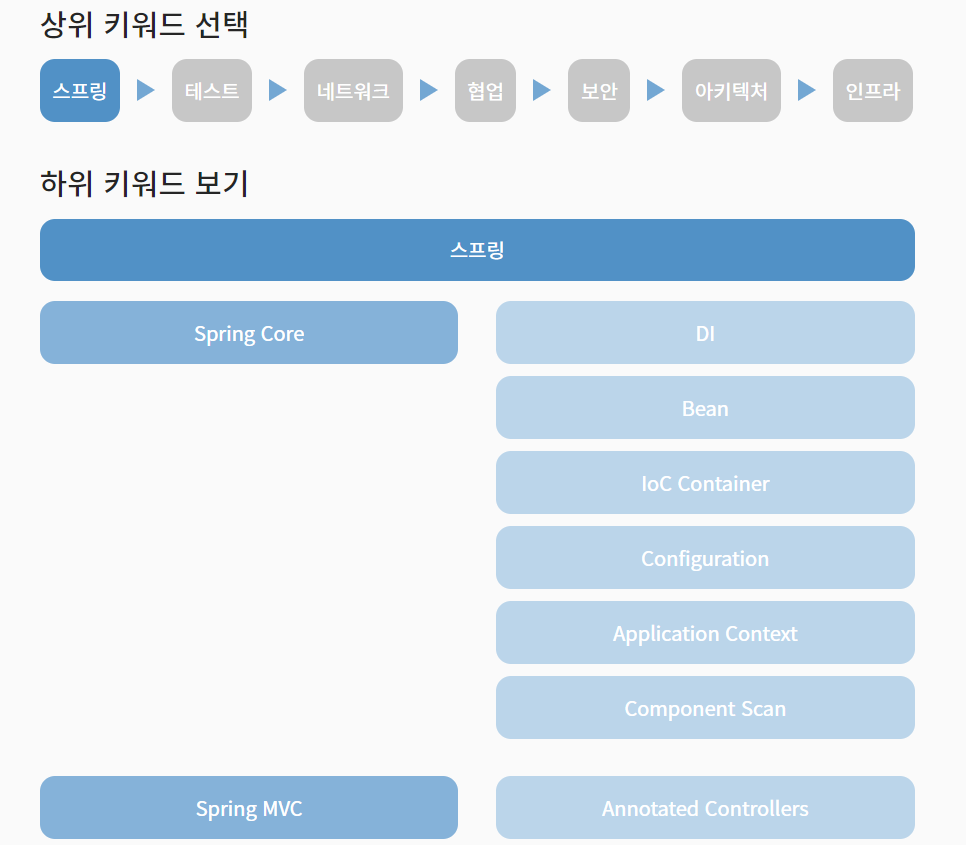

## ✨LOG

- Spring MVC 학습테스트를 진행했다.

  [GitHub - next-step/spring-learning-test at mvc](https://github.com/next-step/spring-learning-test/tree/mvc)

- 레벨2 - 웹 자동차 경주 미션 1단계를 완료했다.

  [https://github.com/woowacourse/jwp-racingcar/pull/31](https://github.com/woowacourse/jwp-racingcar/pull/31)

- 블로그에 목차 UI를 추가했다.

## ✨배운 점&궁금한 점

- [이번 주차 기술 부채](https://amaran-th.github.io/%EC%9A%B0%ED%85%8C%EC%BD%94%205%EA%B8%B0/[%EA%B8%B0%EC%88%A0%EB%B6%80%EC%B1%84]%20%EC%9A%B0%ED%85%8C%EC%BD%94%205%EA%B8%B0%20%EB%A0%88%EB%B2%A82%20-%201%EC%A3%BC%EC%B0%A8/)
- [로드맵] [IoC Container](https://amaran-th.github.io/Spring/[Spring]%20IoC%20Container/)

## ✨느낀점

### 공부계획

1레벨 때 PROLOG에 업로드되어 있는 학습로그를 매주 2개씩 골라서 공부하기로 했었는데, 매번 선택되는 주제가 중구난방이고 스케줄이 조금 빡빡하다는 생각이 들어서 2레벨부터는 우테코의 학습 보조 플랫폼 PROLOG에 제시되어 있는 로드맵을 중심으로 공부를 해볼까 한다. 주에 한두 개씩 잡고 공부해보면 좋을 것 같다.

### 블로그 기능 추가

드디어 블로그 목차 UI를 만들었다!

이제 게시글마다 일일이 목차를 만들어주지 않아도 자동으로 목차 항목이 추출되고 링크가 생성된다.

다음은 utterence로 댓글 기능을 추가해보려고 한다.

블로그 UI를 고치거나 새 기능을 추가하는 건 복잡하고 새로 알아야 할 것도 많아서 골치아프지만 한번 손대기 시작하면 그만큼 오기가 생겨서 도중에 멈출 수가 없다. 다 만들어두면 뿌듯하기도 하고. 그래도 프론트 배워둔 게 빛을 발하는구나 싶기도 하다.

워낙 삽질을 많이 하기도 했고 심각하게 스파게티 코드인지라 만드는 과정은 따로 기록하지 못했다.

그래도 밑에 참고했던 게시글을 첨부했으니 혹시 궁금한 분은 참고하길 바란다.

[Gatsby Blog에 목차 추가하기](https://soopdop.github.io/2020/12/03/add-table-of-content-gatsby/)
