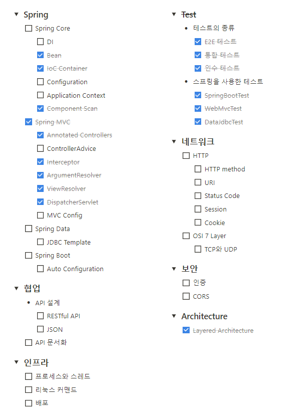

## ✨LOG

- 5/15(월)
  - 근로 회의를 했다.
  - 발표 스터디에 참여했다.
- 5/16(화)
  - 대학 친구들과 키글챌(키퍼 주 1회 글쓰기 챌린지)이라는 글쓰기 챌린지를 시작했다.
- 5/17(수)
  - 데일리 코치 리사와 면담을 했다.
  - [근로] 업무 활동을 했다.
- 5/18(목)
  - 테코톡을 들었다.
  - 지하철 미션 2단계를 구현했다.
- 5/19(금)
  - `테스트(ATDD)` 강의를 들었다.
  - 레벨 2 글쓰기 미션의 초안을 작성했다.
  - 근로 업무를 수행했다.
    - 메서드 2개의 테스트코드를 작성했다.

## ✨배운 점&궁금한 점

- [로드맵] [Dispatcher Servlet](https://amaran-th.github.io/Spring/[Spring]%20Dispatcher%20Servlet/)에 대해 공부하였다.

- [Mockito의 verify() 사용법](<https://amaran-th.github.io/Java/[Mockito]%20verify()%EB%A1%9C%20%ED%96%89%EC%9C%84%20%EA%B2%80%EC%A6%9D%ED%95%98%EA%B8%B0/>)에 대해 정리해보았다.
- [HTTP 상태코드의 종류](https://amaran-th.github.io/%EC%A3%BC%EC%A0%80%EB%A6%AC%EC%A3%BC%EC%A0%80%EB%A6%AC/HTTP%20%EC%83%81%ED%83%9C%EC%BD%94%EB%93%9C%20%EC%A0%81%EC%A0%88%ED%95%98%EA%B2%8C%20%EC%82%AC%EC%9A%A9%ED%95%98%EA%B8%B0/)를 간단히 정리했다.
- [로드맵] [View Resolver](https://amaran-th.github.io/Spring/[Spring]%20View%20Resolver/)에 대해 알아보았다.
- [로드맵] [Spring Web MVC 구조](https://amaran-th.github.io/Spring/[Spring]%20Spring%20Web%20MVC/)에 대해 정리해보았다.
- 미션에서 사용한 [jgrapht 라이브러리의 사용법](https://amaran-th.github.io/Java/[Java]%20jgrapht%20%EC%82%AC%EC%9A%A9%EB%B2%95/)에 대해 정리하였다.

## ✨느낀점

### 로드맵 진행 상황

2레벨을 시작하고, Prolog에 등록되어 있는 로드맵을 참고해서 로드맵 주제를 하나씩 공부하기 시작했는데, 벌써 이만큼이나 정리를 끝냈다.

정리한 주제를 완벽히 이해했다고는 못하겠지만… 그래도 이렇게 진행된 걸 보니 뿌듯하다.

주제 하나 하나가 깊이 파고들면 정말 방대한 양을 가지고 있어서, 일단은 나에게 당장 필요하다고 생각되는 내용만 골라서 공부했다. 그래서 추후 더 공부하면서 정리한 내용을 조금씩 보완해갈 생각이다.

\*로드맵에 관련된 게시글은 [`로드맵`](https://amaran-th.github.io/tags/%EB%A1%9C%EB%93%9C%EB%A7%B5/) 태그로 묶어놓았으니, 혹~시나 궁금하신 분들은 해당 태그의 게시물 목록을 찾아보시길 바랍니다.
