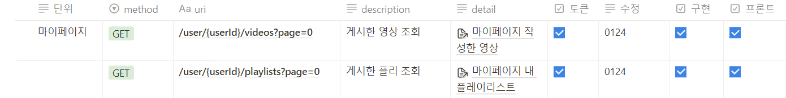
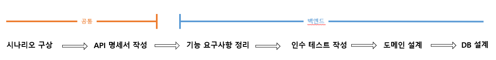

## ✨LOG

- 5/30(화)
  - 장바구니 협업 미션 2단계를 진행하였다.
- 5/31(수)
  - [근로] 현재까지의 업무 상황을 브리핑하였다.
  - 장바구니(협업) 미션 2단계를 진행했다.
- 6/1(목)
  - 장바구니(협업) 미션 2단계를 진행했다.
- 6/2(금)
  - 장바구니(협업) 미션 2단계를 진행했다.
  - 팀 회고를 진행했다.

## ✨배운 점&궁금한 점

- [RESTDocs의 사용법](https://amaran-th.github.io/Spring/%5BSpring%5D%20RESTDocs%EB%A1%9C%20API%20%EB%AA%85%EC%84%B8%EC%84%9C%20%EB%A7%8C%EB%93%A4%EA%B8%B0/)을 이해하고 정리하였다.
- [Github Actions를 사용한 CI/CD 방법](https://amaran-th.github.io/%EC%9D%B8%ED%94%84%EB%9D%BC/%5BSpring%5D%20Spring%20%ED%94%84%EB%A1%9C%EC%A0%9D%ED%8A%B8%20CICD%20%EC%A0%81%EC%9A%A9%ED%95%98%EA%B8%B0/)을 정리했다.
- [요구 공학 프로세스](https://amaran-th.github.io/%EC%86%8C%ED%94%84%ED%8A%B8%EC%9B%A8%EC%96%B4%20%EC%84%A4%EA%B3%84/%EC%9A%94%EA%B5%AC%20%EA%B3%B5%ED%95%99%20%ED%94%84%EB%A1%9C%EC%84%B8%EC%8A%A4/)에 대해 정리했다.

- [로드맵][프로세스와 스레드](https://amaran-th.github.io/Java/[OS]%20%ED%94%84%EB%A1%9C%EC%84%B8%EC%8A%A4%EC%99%80%20%EC%8A%A4%EB%A0%88%EB%93%9C/)에 대해 공부했다.

## ✨느낀점

### 프론트엔드에게 좋은 명세서란?

이번에 프론트엔드 페어와 협업 미션을 진행하면서, 프론트엔드에서 이해하기 쉬운, 작업하기 편리한 명세를 작성하는 방법에 대해 고민해보게 되었다.

훗날 백엔드 개발자로 취직을 하게 되면 프론트엔드 개발자와 직접 소통하는 일이 많아질테니 원활한 공동 작업을 위해 소프트 스킬을 갈고 닦아야겠다는 생각이 들었다.

나는 프론트엔드 담당으로서 백엔드 팀과 협업했던 경험이 있다. 그 당시의 경험과 이번 협업 미션에서 경험에 기반하여 지금의 내가 생각하는 좋은 API 명세서의 특징은 다음과 같다.

1. (당연하지만)시나리오를 철저히 지켜야 한다.

   사전에 협의된 시나리오와 동일한 기능을 해야 한다. 수정해야 할 사항이 생길 경우 반드시 메신저 또는 회의를 통해 다른 직군 팀에게 사전 고지가 되어야 한다.

2. API가 계층적으로 분류되어 있어야 한다.

   위키처럼 계층적 구조로 구성하면 필요한 API를 찾기 쉬워진다. 이를 위해 API들의 계층 구조를 사전 기획 단계에서 결정하면 좋다.

3. API들의 정보를 개괄적으로 파악할 수 있는 시각화 자료(표 같은)가 있으면 좋다.

   Token을 요구하는지 여부, 현재 개발 진행도 등을 한 눈에 볼 수 있도록 정리된 표가 있으면 파악하기가 좋다.

   

   (내가 직접 만든 것은 아니고 다른 우테코 크루가 만든 양식이다!)

### 이상적인 협업 프로세스는?

API 명세서를 작성하기 이전에 프로젝트의 요구사항을 정의하기 위해 시나리오를 구상해야 한다고 생각한다.

이번 협업 미션에서의 프로젝트 진행 순서를 조금 다듬어서 정리해보면 다음과 같았다.

\*여기서 공통은 프론트엔드와 함께 결정해야 하는 내용이다.

이 중 DB 설계는 도메인과 기능 구현을 모두 끝낸 후 해도 괜찮았다. (Simple Repository로 Fake Repository를 만들어 기능을 구현한 뒤 DB Repository로 갈아끼우는 식으로) 오히려 DB를 분리해서 생각하니 핵심 로직 개발에 집중할 수 있어서 좋았던 것 같다.

사실상 시나리오는 프론트엔드 미션의 요구사항으로 이미 정해져 있어서 API 명세서 작성부터 했다.

확실히 실제 사용자(고객) 입장에서 구상된 시나리오가 있으니 어떤 데이터가 필요할지, 어떤 동작(기능)이 필요할지가 명확해져서 API 명세를 짜기 수월했다.

API 명세를 먼저 짜니 코드 레벨에서 기능 요구사항을 정리하기도 편했고.

이런 과정은 이전에 소프트웨어 공학이라는 전공 수업에서 배웠던 요구 공학 프로세스에 기반하고 있는 것 같은데, 확실히 직접 경험해보니 그 장점을 그대로 느낄 수 있어서 좋았다.

좋은 개발자가 되려면 역시 프로젝트 단위의 협업 프로세스에도 익숙해지는 것이 좋을 것이다.

마침 최근 ‘스크럼’이라는 도서를 구입했었는데, 이번 방학에 읽어보면서 협업 프로세스를 학습해보려고 한다.

### ‘소통’을 잘 하려면?

- **모두가 알 수 있는 용어로 대화하는 것.**
  프론트엔드/백엔드 직군에 상관없이 모두가 이해할 수 있는 용어를 사용해 시나리오를 정립한다.
  평소엔 같은 직군의 개발자하고만 소통을 하다보니 다른 분야의 개발자, 내지는 일반인들은 내가 알고 있는 것에 비해 어느정도의 배경지식을 가지고 있는지 가늠하기가 어려웠다.
  이래서 시나리오에 기반해서 요구사항을 짜는 것인가보다.

### 갈등을 피하는 방법?

- **배려하기**
  우리 팀은 모두가 서로를 배려하는 분위기였어서 갈등 없이 훈훈하게 마무리되었지만, 들려오는 이야기를 보면 그렇지 않았던 팀들도 꽤 있었던 듯 하다.
  개발자들은 대부분 자신만의 고집이 있기 마련이다. 이번 협업 미션을 하면서, 협업을 할 때는 그 고집을 잠시 접어두고 수용적이고 겸손한 태도로 임하는 것이 핵심인 것 같다는 생각이 들었다.
- **친해지기**
  나는 낯가림이 심해서 초면에 눈치를 많이 보는 편인데, 그래서 이번에도 미션 초반에 소통에 조금 소극적이었다. 하지만 프론트엔드 팀에서 먼저 활발하게 소통해주셔서 금새 친해질 수 있었고 소통도 편한 분위기에서 더 활발하게 할 수 있었던 것 같다. 무엇보다 미션이 재밌게 느껴졌다.
  레벨 3에서 팀에 배정되게 되면 제일 먼저 식사라도 함께 하자고 제안해봐야겠다.

### 문서화를 습관화하자

프로젝트 규모가 커짐에 따라 모든 세부 사항을 머릿속에 완벽하게 넣어둘 순 없어서 이미 결정된 사항을 번복하고, 잊어버린 내용을 복기하는 데 시간을 쓰곤 했다. 무엇보다 이런 규모에서 내용을 팀원들 모두가 동일하게 이해하고 기억하고 있기란 불가능에 가깝기 때문에 틈틈이 설계 사항을 팀원들과 동기화하는 과정에서도 시간과 체력이 많이 소요되어서, 문서화의 필요성을 몸소 절감했다.

이런 불편을 느끼면서, 미션 진행 과정에서 설계/구현 과정에서 결정된 사항을 틈틈히 메모하고 어느정도 윤곽이 잡히면 한 눈에 알아보기 쉽도록 다이어그램으로 도식화를 했다. 확실히 각자의 머리를 믿는 것보다 안정적이고 작업 시간도 훨씬 절약할 수 있었던 것 같다.

앞으로는 작업 중 생긴 의문점과 결정된 내용이 휘발되지 않게 틈틈이 기록하고 정리해봐야겠다.

### 반성과 다짐

나는 사실 내가 같이 일하기 좋은 페어는 아니라고 생각한다. 그 이유 중 하나가 바로 굳이 지금 하지 않아도 될 내용을 언급해서 흐름을 끊게 되는 일이 잦다는 것이다.

예를 들면 어떤 기능이 동작하는 로직을 짜고 있을 때, 이 기능의 이러이러한 예외 상황도 있겠다, (현재 요구사항에 없은 케이스를 생각하고)확장성을 위해 추상화를 하는 게 좋을 것 같다 등 지금 당장 직면한 문제와 조금 거리가 있는 주제를 꺼내는 식이다.

예시에서 예외케이스들은 기능 구현이 완료된 후 한번에 모아서 얘기해도 될 문제고, 과하게 확장성을 고려하는 것은 설계의 방향을 흐트러뜨리고 요구사항에 없는 내용에 너무 치중하게 되기 때문에 프로젝트 진행을 저해한다.

생각해보면 정말 간단하게 해결할 수 있을 문제인데, 쉽사리 고칠 수 없었던 이유는 막상 목구멍까지 올라오면 말을 해야하는 사항인지, 나중에 얘기해도 괜찮은 사항인지 판단하기가 어려워서였다. 내 나름의 판단 기준이 없었기 때문인 것도 같다.

그래서 이번 기회에 나만의 기준을 정립하기 위해 규칙을 생각해봤다.

1. 특정 기능에 대해 한창 논의가 진행중일 때, 지금 당장 말하지 않아도 문제가 없을 내용은 따로 기록해뒀다가 나중에 얘기한다.
2. 어디까지 확장성을 생각할지 범위를 기획/설계 단계에서 규정해두고 그 이상은 고려하지 않기로 한다.
3. 현재 진행 상황이 얼마나 촉박한지를 고려하고, 내가 내는 의견으로 인해 얼마나 시간이 지연될지를 먼저 생각한다.

사실 팀 회고 때 이 점 때문에 스스로가 아쉬웠고, 팀에게 미안했다는 얘기를 했었는데, 페어가 예외 케이스처럼 추후 고려해야하는 사항을 잘 떠올리는 것이 (절제만 된다면)오히려 내 강점이 될 수 있다고 복돋아주어서 너무 고마웠다.😢

이전부터 내가 회의를 진행하면 자꾸 논점에서 벗어나게 되어서 회의 시간이 길어지곤 했는데, 이 문제와 같은 맥락에서 발생한 문제였던 것 같다.

앞으로는 이 규칙들을 지키면서 좀 더 팀에 도움이 되는 사람이 되고 싶다.
