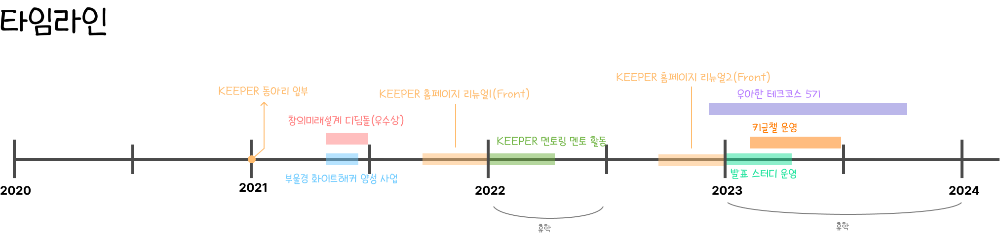

## ✨LOG

- **8/13(일)**
  - 행사의 관심 태그 CRD 기능 PR을 머지했다.
  - 책 스크럼을 읽고 내용을 요약하여 작성하였다.
  - 홍실이 정리해준 모니터링 관련 정리 문서를 읽었다.
  - 지난 근로 시간에 알게 된 EntityGraph라는 기능에 대해 정리했다.
  - 이번 방학 계획을 세웠다.
- **8/14(월)**
  - 신고 기능의 수정된 요구사항을 반영하고 다시 PR을 올렸다.
  - 우테코 수료 이후의 계획을 세웠다.
    - 수료 이후부터 졸업까지의 대략적인 목표와 스케줄을 정리했다.
  - 인프콘에서 듣고 싶은 세션을 정리했다.
  - 인프런에서 워니님의 이력서 강의를 구매했다.
- **8/15(화)**
  - 인프콘을 다녀왔다.
- **8/16(수)**

  - 프로젝트 마무리 작업을 했다.
    - 신고기능 PR을 머지했다.
    - 반환되는 날짜 데이터의 포맷을 하나로 통일했다.
    - 사용자 프로필 조회 시 Github Username을 조회할 수 있도록 값을 추가하여 PR을 올린 후 머지했다.
  - 프로젝트 소개글 쓰기 미션을 최종 제출했다.

    https://github.com/woowacourse/woowa-writing-5/pull/374

  - [근로] 퀴즈 목록 및 단건 조회 시 퀴즈별 학습 여부를 포함해서 반환하도록 구현하고 PR을 올렸다.

- **8/17(목)**
  - 론칭 페스티벌 발표 자료 초안을 제작했다.
  - 레벨3 요구사항 체크리스트를 모두 정리해서 제출하였다.
  - 나만의 타임라인을 만들어보았다.
    
- **8/18(금)**
  - 론칭 페스티벌 5분 스피치를 위한 발표자료를 완성했다.
  - 론칭 페스티벌 부스를 운영했다.
  - 방학식을 했다.
- **8/19(토)**
  - 노션의 페이지 구조를 전체적으로 개편했다.
  - 워니님의 강의를 들었다.

## ✨ 공부한 것

- [스크럼 방법론](https://amaran-th.github.io/%EC%A3%BC%EC%A0%80%EB%A6%AC%EC%A3%BC%EC%A0%80%EB%A6%AC/%EC%8A%A4%ED%81%AC%EB%9F%BC/)에 대해 정리했다.
- [[JPA] 고급매핑 방법](https://amaran-th.github.io/Spring/[JPA]%20%EA%B3%A0%EA%B8%89%20%EB%A7%A4%ED%95%91/)에 대해 정리했다.
- [JPA의 EntityGraph의 개념](https://amaran-th.github.io/Spring/[JPA]%20EntityGraph/)에 대해 이해하고 정리하였다.
