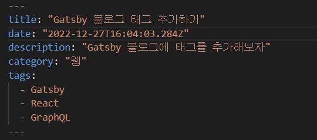
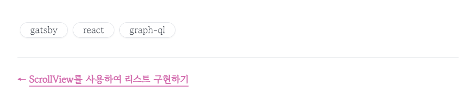
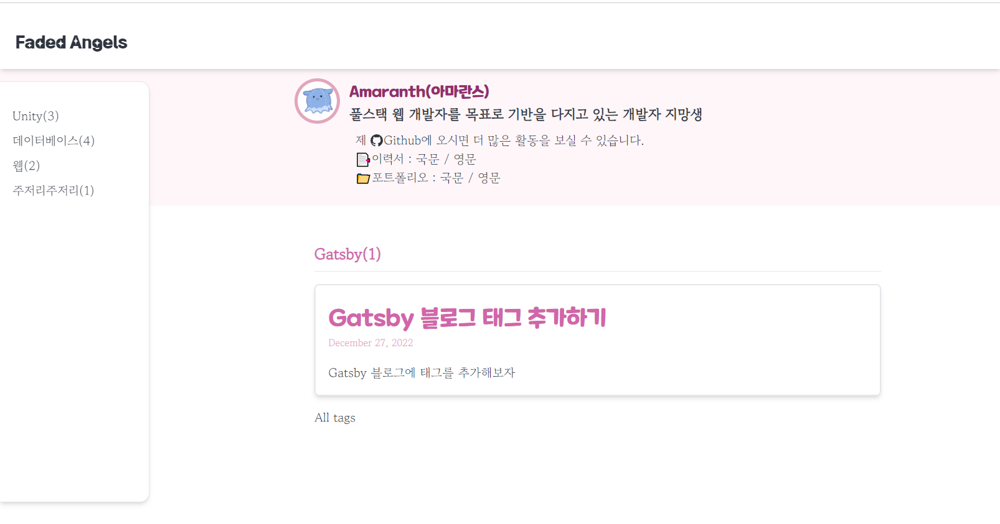
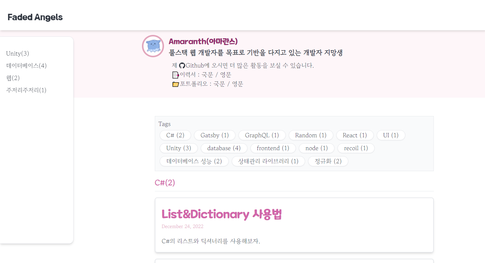

### 1. 포스트에 태그 추가하기

태그를 넣고자 하는 포스트의 index.md 헤더에 tags라는 메타 데이터를 추가한다.


### 2. GraphQL 쿼리 수정

`/src/templates/blog-post.js`의 하단에 위치한 GraphQL 쿼리에 다음과 같이 tags를 추가해준다.

```csharp
export const pageQuery = graphql`
  query BlogPostBySlug(
    $id: String!
    $previousPostId: String
    $nextPostId: String
  ) {
    site {
      siteMetadata {
        title
        author {
          name
        }
      }
    }
    ...
    markdownRemark(id: { eq: $id }) {
      id
      excerpt(pruneLength: 160)
      html
      frontmatter {
        title
        date(formatString: "YYYY년 MM월 DD일")
        description
        tags
      }
    }
    ...
  }
`
```

### 3. kebabcase 모듈 설치&태그 리스트 생성

태그 'tag test'를 클릭하면 `/tags/tag-test`로 이동하는 기능을 만들기 위해 문자열의 공백을 -(하이픈)으로 변환해주는 모듈 kebabcase를 설치한다.

```
💡 npm install lodash.kebabcase
```

설치 후 `blog-post.js` 상단에 해당 모듈을 import하고 post.frontmatter.tags를 참조하여 태그 리스트를 만들어준다.

```javascript
import * as React from "react"
import { Link, useStaticQuery, graphql } from "gatsby"
import kebabCase from "lodash.kebabcase"
...
```

```javascript
...
<section
    className="mark_down p-4  rounded-md"
    dangerouslySetInnerHTML={{ __html: post.html }}
    itemProp="articleBody"
/>

<div className="tags">
  <ul>
    {post.frontmatter.tags
      ? post.frontmatter.tags.map(tag => (
        <Link
          key={kebabCase(tag)}
          to={`/tags/${kebabCase(tag)}`}
          className="rounded-full border shadow-sm px-4 m-1 bg-white hover:bg-slate-100"
        >
          {kebabCase(tag)}
        </Link>
      ))
      : null}
  </ul>
</div>
<hr />
...
```

아래와 같이 세 개의 태그가 리스트로 구현된 것을 확인할 수 있다.


### 4. 태그 별 포스트 목록 페이지 생성

태그를 클릭하면 나타날 태그 페이지를 생성한다.
페이지의 생성은 `/gatsby-node.js`가 담당하는데, 이 파일은 GraphQL로 마크다운 파일들을 읽어 포스트들을 순회하며 페이지를 생성한다.

- 해야 할 일들 :
  - kebabcase 변환을 위한 모듈을 추가한다.
  - GraphQL로 tags를 받아온다.
  - tag template를 참고하여 tag 별 페이지를 제작한다.

```javascript
const kebabCase = require(`lodash.kebabcase`) // 1. kebabcase 모듈을 import한다.
...
exports.createPages = async ({ graphql, actions, reporter }) => {
  ...
  const result = await graphql(`
    {
      allMarkdownRemark(sort: { frontmatter: { date: ASC } }, limit: 1000) {
        nodes {
          id
          fields {
            slug
          }
        }
      }
      tagList: allMarkdownRemark {  // 2. GraphGL로 tag 리스트를 정의한다.
        group(field: frontmatter___tags) {
          fieldValue
          totalCount
        }
      }
      categoryList: allMarkdownRemark {
        group(field: frontmatter___category) {
          fieldValue
          totalCount
        }
      }
    }
  `)
  ...
  const tagPosts = path.resolve("./src/templates/tag-posts.js")

  // 3. GraphGL로부터 tag 리스트 데이터를 가져온다.
  const tags = result.data.tagList.group
  // 4. tag마다 하나의 페이지를 만든다.
  tags.forEach(tag => {
    createPage({
      path: `/tags/` + kebabCase(tag.fieldValue) + `/`,
      component: tagPosts,
      context: { tag: tag.fieldValue },
    })
  })
}
```

그 다음 tag 별 게시글 목록을 보여줄 페이지 템플릿을 `/src/templates/tag-posts.js`에 작성한다.

```javascript
import * as React from "react"
import { Link, graphql } from "gatsby"

import Bio from "../components/bio"
import Layout from "../components/layout"
import Seo from "../components/seo"
import GatsbyImage from "gatsby-image"
import "../tailwind.css"

const Tags = ({ pageContext, data, location }) => {
  const siteTitle = data.site.siteMetadata?.title || `Title`
  const posts = data.allMarkdownRemark.nodes
  const categories = data.categoryList.group
  const { tag } = pageContext
  return (
    <Layout location={location} title={siteTitle} categories={categories}>
      <Seo title={`태그 [${tag}]의 게시글 목록`} />
      <span className="text-main text-xl font-bold ">
        {tag}({posts.length})
      </span>
      <hr className="my-2" />
      <ol style={{ listStyle: `none` }}>
        {posts.map(post => {
          const title = post?.frontmatter?.title || post?.fields?.slug
          const thumbnailImg =
            post?.frontmatter.thumbnailImg?.childImageSharp.fluid
          return (
            <Link to={post?.fields.slug} itemProp="url">
              <li
                key={post?.fields.slug}
                className="flex justify-between justify-items-center border-2 rounded-md shadow-md p-4 my-4 hover:bg-slate-100"
              >
                <article
                  className=""
                  itemScope
                  itemType="http://schema.org/Article"
                >
                  <header className="mb-4">
                    <h2 className="mt-2 text-main text-3xl font-title">
                      <span itemProp="headline">{title}</span>
                    </h2>
                    <small className="text-sub">{post?.frontmatter.date}</small>
                  </header>
                  <section>
                    <p
                      className="mb-0"
                      dangerouslySetInnerHTML={{
                        __html: post?.frontmatter.description || post?.excerpt,
                      }}
                      itemProp="description"
                    />
                  </section>
                </article>
                {thumbnailImg ? (
                  <div className="min-w-[5rem] max-w-[20rem] w-[150px] h-[150px]">
                    <GatsbyImage
                      fluid={thumbnailImg}
                      className="rounded-xl h-full w-full"
                    />
                  </div>
                ) : (
                  ""
                )}
              </li>
            </Link>
          )
        })}
      </ol>
      <Link to="/tags">All tags</Link>
    </Layout>
  )
}

export default Tags

export const pageQuery = graphql`
  query ($tag: String) {
    site {
      siteMetadata {
        title
      }
    }
    categoryList: allMarkdownRemark {
      group(field: frontmatter___category) {
        fieldValue
        totalCount
      }
    }
    allMarkdownRemark(
      sort: { frontmatter: { date: DESC } }
      filter: { frontmatter: { tags: { in: [$tag] } } }
    ) {
      group(field: frontmatter___category) {
        fieldValue
        totalCount
      }
      nodes {
        excerpt
        fields {
          slug
        }
        frontmatter {
          date(formatString: "MMMM DD, YYYY")
          title
          description
          thumbnailImg {
            childImageSharp {
              fluid(maxWidth: 800) {
                ...GatsbyImageSharpFluid
              }
            }
          }
          category
          tags
        }
      }
    }
  }
`
```



### 5. tag 전체 목록 보여주기

태그 별 게시글 목록 페이지에서 다른 모든 태그들의 목록을 볼 수 있도록 /tag-posts.js 파일에 다음과 같은 코드를 추가한다.

먼저 하단의 GraphGL 코드에 다음과 같이 tagList를 정의한다.

```javascript
export const pageQuery = graphql`
  query ($tag: String) {
    site {
      siteMetadata {
        title
      }
    }
    ...
    // tag 목록을 GraphGL에서 정의
    tagList: allMarkdownRemark {
      group(field: frontmatter___tags) {
        fieldValue
        totalCount
      }
    }
    allMarkdownRemark(
      sort: { frontmatter: { date: DESC } }
      filter: { frontmatter: { tags: { in: [$tag] } } }
    ) {
      group(field: frontmatter___category) {
        fieldValue
        totalCount
      }
    ...
```

그 다음 GraphGL에서 정의한 tagList를 불러와 display한다.

```javascript
const Tags = ({ pageContext, data, location }) => {
  ...
  const tags = data.tagList.group
  ....
<div className="border bg-gray-50 p-2 mb-4">
        <h1>Tags</h1>
        <ul className="flex flex-wrap">
          {tags.map(tag => (
            <Link
              to={`/tags/${kebabCase(tag.fieldValue)}/`}
              className="rounded-full border shadow-sm px-4 m-1 bg-white hover:bg-slate-100"
            >
              {tag.fieldValue} ({tag.totalCount})
            </Link>
          ))}
        </ul>
      </div>
```


