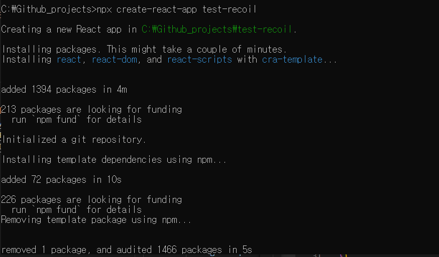
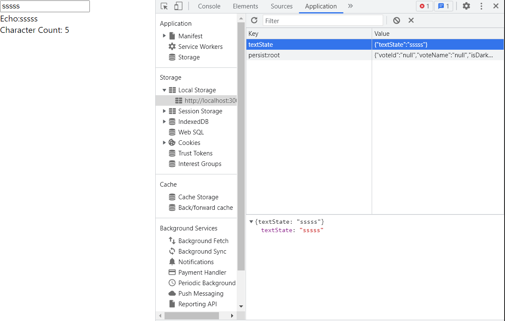

### React 프로젝트 생성하기

제일 먼저 recoil을 사용하게 될 프로젝트를 생성해줍니다.

```
npx create-react-app [프로젝트명]
```



### Recoil 기본 - 문자열 카운터 예제

1. recoil 설치하기
   터미널에서 다음 명령어를 입력하여 recoil 패키지를 설치합니다.

```
npm install recoil
```

2. &lt;RecoilRoot&gt; 태그
   가장 상위 컴포넌트인 App.jsx에 다음과 같이 &lt;RecoilRoot&gt; 태그로 컴포넌트를 둘러싸줍니다.

⭐CharacterCounter 컴포넌트는 이 다음 문단에서 만들 컴포넌트입니다.

```javascript
//App.jsx
import { RecoilRoot } from "recoil"

import CharacterCounter from "./CharacterCounter"

function App() {
  return (
    <RecoilRoot>
      <CharacterCounter />
    </RecoilRoot>
  )
}

export default App
```

3. CharacterCounter 컴포넌트

컴포넌트의 기본 뼈대는 다음과 같습니다. 상태 관리를 위해 recoil에서 몇몇 속성을 import하였습니다.

&lt;TextInput/&gt;과 &lt;CharacterCount/&gt;는 뒤에서 구현할 것입니다.

```javascript
//CharacterCounter.jsx
import React from "react"
import { atom, selector, useRecoilState, useRecoilValue } from "recoil"

const CharacterCounter = () => {
  return (
    <div>
      <TextInput />
      <CharacterCount />
    </div>
  )
}
export default CharacterCounter
```

- atom

atom이란 recoil에서 전역상태의 데이터를 저장하는 기본 단위입다.

동일한 atom을 사용하는 컴포넌트는 해당 atom의 data, 즉 상태를 공유합니다.
key 속성의 값은 전역 상태의 이름을 의미합니다.

```javascript
const textState = atom({
  key: "textState", //전역 상태의 이름
  default: [],
})
```

- atom의 사용 - useRecoilState()

react의 useState 함수와 동일하게 사용할 수 있습니다.

+추가 : 위 속성을 별개의 값으로 추출할 수 있다.

useRecoilValue : atom의 값을 불러온다.

useSetRecoilValue : atom의 값을 설정한다.

```javascript
const TextInput = () => {
  const [text, setText] = useRecoilState(textState) //전역 상태를 읽고 수정한다
  const onChange = e => {
    setText(e.target.value)
  }
  return (
    <div>
      <input type="text" value={text} onChange={onChange} />
      <br />
      Echo:{text}
    </div>
  )
}
```

- selector
  atom의 state로부터 파생되는 데이터를 저장할 수 있게 해줍니다.

selector를 사용하면 최소한의 상태집합만 atom에 저장하고, state로부터 파생된 데이터(ex : text의 길이, 숫자의 짝/홀수 여부)는 selector에 명시한 함수를 통해 추출함으로서 불필요한 상태의 보존을 방지할 수 있습니다.

```javascript
const charCountState = selector({
  key: "charCountState",
  get: ({ get }) => {
    const text = get(textState)
    return text.length
  },
})

const CharacterCount = () => {
  const count = useRecoilValue(charCountState) //charCountState 값을 읽는다.
  return <>Character Count: {count}</>
}
```

### local storage에 상태 저장하기

이렇게 생성된 전역변수는 웹 페이지를 새로고침할 경우 초기화됩니다. 만약 새로고침 하더라도 설정된 전역변수 값을 유지하고자 한다면, 브라우저의 local storage에 값을 저장하여 불러오게 하면 됩니다.

터미널에서 다음 명령어를 입력하여 recoil-persist 패키지를 설치합니다.

```
npm install recoil-persist
```

```javascript
import { recoilPersist } from "recoil-persist"

const { persistAtom } = recoilPersist({ key: "textState" }) //local storage에 해당 값을 저장하고 불러올 수 있도록 설정
const textState = atom({
  key: "textState", //전역 상태의 이름
  default: [],
  effects_UNSTABLE: [persistAtom], //recoil-persist 적용
})
```



<nav> 참고 게시글

- [Recoil 시작하기](https://recoiljs.org/ko/docs/introduction/getting-started/)

- [Recoil-persist로 state를 localstorage로 저장하기](https://velog.io/@tchaikovsky/Recoil-persist%EB%A1%9C-state%EB%A5%BC-localstorage%EB%A1%9C-%EC%A0%80%EC%9E%A5%ED%95%98%EA%B8%B0)

</nav>
