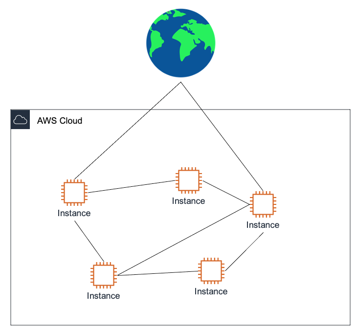
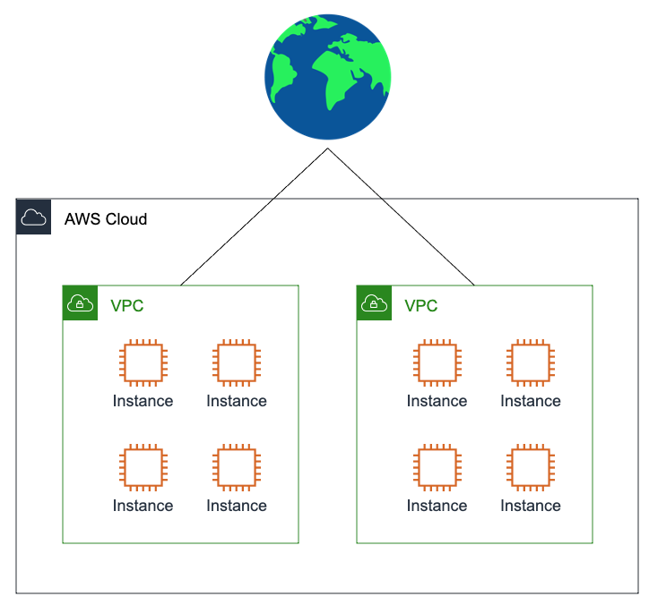
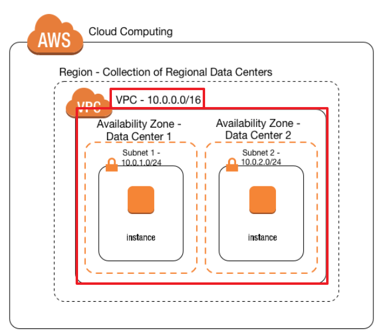
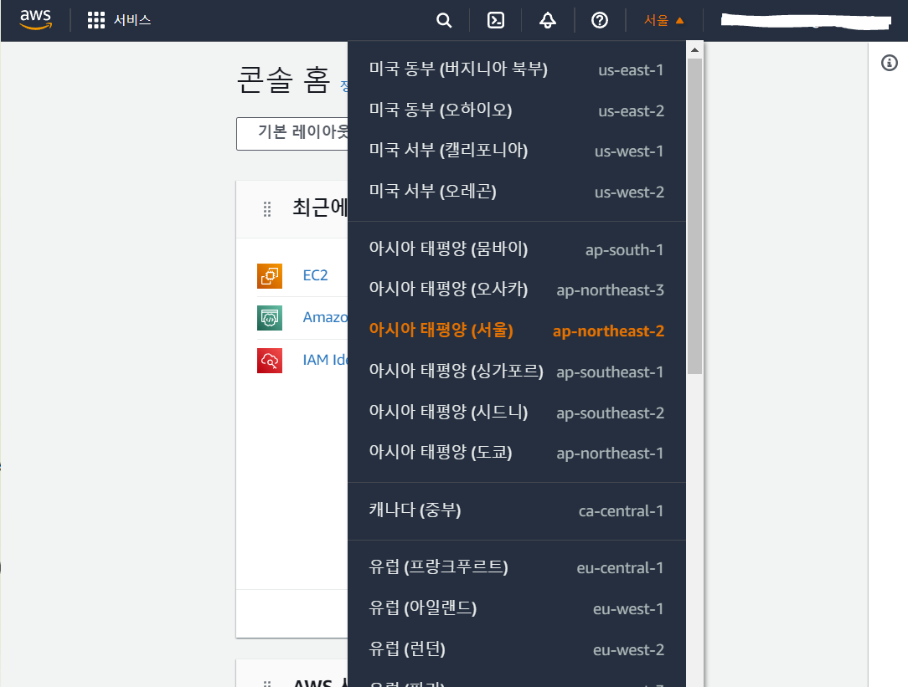
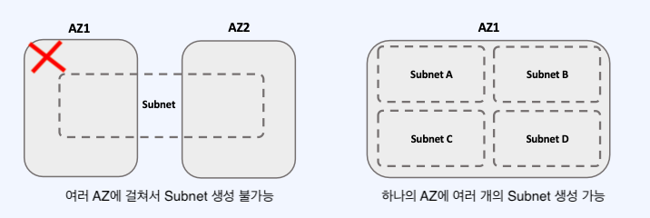
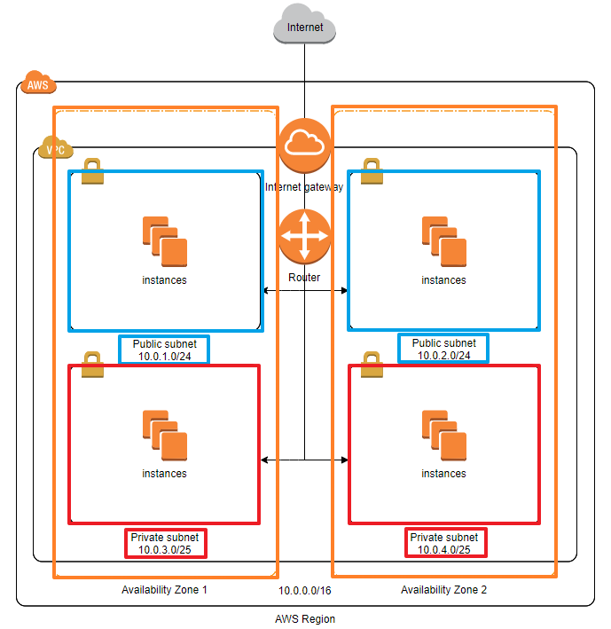

## VPC 개념

---

: 사용자가 정의하는 aws 계정 사용자 전용의 **가상 네트워크**를 의미한다.

사용자는 원하는 대로 IP 주소 범위를 선택하고 서브넷 생성, 라우팅 테이블 및 네트워크 게이트웨이 구성 등 가상 네트워크 환경을 구성해 VPC를 생성할 수 있다.

VPC 도입 전, AWS의 EC2 네트워크는 여러 사용자의 인스턴스들이 거미줄처럼 얽혀있어 복잡도가 높았다.

하지만 VPC가 도입된 후 인스턴스들이 VPC에 속하게 되면서 네트워크를 구분할 수 있고, VPC 별로 필요한 설정(보안 등)을 적용해서 인스턴스에 네트워크 설정을 적용할 수 있게 되었다.
| VPC 도입 전 | VPC 도입 후 |
| --- | --- |
|  |  |

## AWS Cloud 구조

---

AWS의 클라우드 구조는 아래와 같이 구성되어 있다.



이해를 위해 용어를 간단히 정리하면서 가보자.

- **Availability Zone(AZ, 가용 영역)**

  : 일반적으로 IDC(인터넷 데이터 센터) 하나에 해당한다. 엄밀히 말하면 AZ가 한 개 이상의 IDC를 가지고 있을 수 있다는 것이 더 정확한 표현이다.

  각 AZ는 Region 내에서 물리적으로 격리되어 있기 때문에 독립된 장애 영역으로 설계되어 있다. 시스템은 여러 가용 영역에 걸쳐 확장할 수 있다.(분산 시스템)

- **Region(리전)**

  : AZ의 집합으로, 일반적으로 국가 단위로 존재한다. AWS 웹페이지의 상단바에서 설정할 수 있다.
  
  Region은 2개 이상의 AZ로 구성된다.

  Region에 데이터를 저장하는 경우, 해당 Region 내에서만 데이터가 복제되고, AWS는 Region 외부로 데이터를 이동시켜주지 않는다. 때문에 여러 Region에 걸쳐 데이터를 이동시키는 것은 사용자의 몫이다.

## VPC

---

VPC(Virtual Private Cloud)는 앞서 설명한 AWS 클라우드 구성 요소 중 Region에 상응하는 규모의 네트워크이다. 이 말은 VPC=Region이라는 의미는 아니고, 여러 개의 AZ를 포함할 수 있다는 관점에서 그렇게 표현한 것이다.

VPC는 독립된 하나의 네트워크를 구성하기 위한 가장 큰 단위이고, 다른 VPC와 **논리적으로** 분리되어 있다.

### IP 대역

VPC는 다음과 같은 사설 IP 대역에 맞추어 설계해야 한다.

```sql
10.0.0.0 - 10.255.255.255 (10/8 prefix)
172.16.0.0 - 172.31.255.255 (172.16/12 prefix)
192.168.0.0 - 192.168.255.255 (192.168/16 prefix)
```

한 Region에 VPC를 여러 개 생성하는 경우 서로의 IP는 겹치면 안된다.(생성은 되지만 DNS IP가 분별하지 못한다.)

<aside>

⚠️ 규정된 사설 IP 범위와 달리 aws에서는 **/16~/28 bit**의 서브넷 마스크만을 허용한다.

AWS VPC를 생성할 수 있는 가장 큰 대역은 /16이고 가장 작은 대역은 /28이므로, 이 범위 내에서만 CIDR을 설정해야 한다.

</aside>

한 번 설정한 VPC의 IP 대역은 수정할 수 없고, 각각의 VPC는 독립적이어서 기본적으로는 서로 통신할 수 없다.

⇒ **VPC 피어링(peering) 서비스**를 통해 VPC 간의 트래픽을 라우팅할 수 있다.

### 서브넷

: VPC의 IP 대역을 나누어 실제로 리소스가 배치되는 **물리적인 주소 범위**

VPC가 논리적인 범위라면, 서브넷은 VPC 안에서 실제로 리소스가 생성될 수 있는 네트워크 영역이다. 실제로 EC2, RDS같은 리소스(인스턴스)를 생성할 수 있다.

하나의 VPC는 N개의 서브넷을 가질 수 있고, 하나의 서브넷은 하나의 AZ에만 생성할 수 있다.



서브넷도 vpc처럼 CIDR 범위는 /16(65536개)~/28(16개)을 사용할 수 있고, VPC CIDR 블록 범위에 속하는 CIDR 블록을 지정할 수 있다.

서브넷은 간단히 말해 VPC IP 영역을 잘게 쪼갠 것이기 때문에, 당연히 VPC보다 대역폭이 낮아야 한다.

<aside>

💡 AWS가 관리용으로 사용하는 IP가 **예약 주소**로 설정되어 있기 때문에 아래 IP들은 사용자가 사용할 수 없다.

| 10.0.0.0   | 네트워크 주소 (Network ID)                                                                                                                                     |
| ---------- | -------------------------------------------------------------------------------------------------------------------------------------------------------------- |
| 10.0.0.1   | AWS에서 VPC 라우터용으로 예약 (Default Gateway)                                                                                                                |
| 10.0.0.2   | DNS 서버 주소DNS 서버의 IP 주소는 기본 VPC 네트워크 범위에 2를 더한 주소이다.CIDR 블록이 여러 개인 VPC의 경우, DNS 서버의 IP 주소가 기본 CIDR에 위치하게 된다. |
| 10.0.0.3   | AWS에서 앞으로 사용하려고 예약한 주소                                                                                                                          |
| 10.0.0.255 | 네트워크 브로드캐스트 주소                                                                                                                                     |

</aside>

서브넷은 다시 **Public subnet**과 **Private subnet**으로 나뉠 수 있다.

- **Public subnet** : 인터넷에 접근 가능한 서브넷(VPC 외부/내부와 통신)
- **Private subnet** : 인터넷에 접근 불가능한 서브넷(VPC 내부에서만 통신)

  ⇒보안을 위해 private subnet에 민감한 정보를 저장하는 식으로 설계하는 편.

## 예제

---

여기까지 정리된 내용을 간단히 예시를 들어서 알아보자.



먼저 VPC를 구성하면서 IP 대역을 **10.0.0.0/16**으로 설정하였다.

해당 VPC가 AZ를 2개 가지고 있다고 하자.

여기서 AZ1과 AZ2는 각각 Public 서브넷과 Private 서브넷을 1개씩 가지고 있다.

public 서브넷인 10.0.1.0/24와 10.0.2.0/24는 다수의 EC2 인스턴스를 할당받아야 하기 때문에 IP 주소가 많이 필요해서 CIDR 값을 낮게 주었다.(/24⇒256개)

반면 private 서브넷인 10.0.3.0/25과 10.0.4.0/25은 RDS(데이터베이스)와 같은 소수의 서비스 인스턴스를 할당 받을 예정이기 때문에 IP 주소가 많이 필요하지 않아 CIDR 값을 높게 주었다.(/25 ⇒ IP 주소 128개)

정리하면 VPC는 10.0.0.0/16의 IP 대역을 할당 받고,

내부의 public subnet은 10.0.1.0/24, 10.0.2.0/24의 IP 대역을,

private subnet은 10.0.3.0/25, 10.0.4.0/25의 IP 대역을 할당 받은 구성이다.

이렇게 사용자의 필요에 따라 원하는 대로 네트워크를 구성할 수 있다는 것이 VPC의 핵심이다.

## 마무리

---

이 외에도 VPC를 구성하는 요소에는 라우팅 테이블이 있는데, 이는 다음에 기회가 되면 알아보도록 하자.

## 참고 자료

---

[[AWS] 📚 VPC 개념 & 사용 - 인프라 구축 [Subnet / Routing / Internet Gateway]](https://inpa.tistory.com/entry/AWS-📚-VPC-사용-서브넷-인터넷-게이트웨이-NAT-보안그룹-NACL-Bastion-Host)

[[소개][초보자를 위한 AWS 웹구축] 0. 웹서버 아키텍처 소개](https://tech.cloud.nongshim.co.kr/2018/10/11/초보자를-위한-aws-웹구축-웹서버-아키텍처-소개/)
