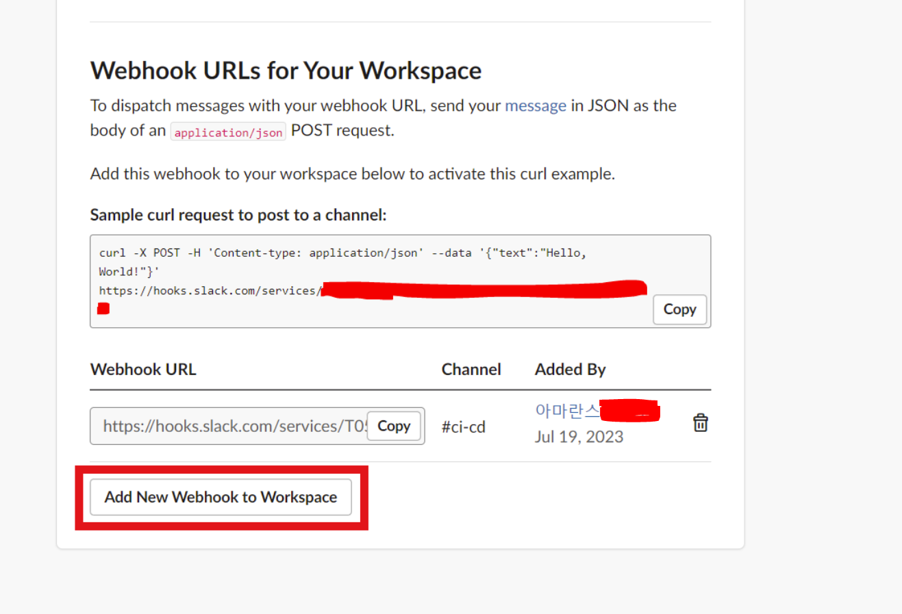

이번에 Github Actions로 자동배포를 구현했는데, 여기에 배포 결과를 슬랙으로 보내주는 시스템을 추가적으로 구축해보았다.

다음 글을 참고하면서 진행하였다.

[Github Action Slack 연동 Notification (깃허브 액션 슬랙)](https://alisyabob.tistory.com/486)

## 1. 슬랙 앱 생성 및 설정

다음 링크에 접속하여 ‘Create New App’을 클릭하고 ‘From Scratch’를 선택한다.

[슬랙 앱](https://api.slack.com/apps)

App Name에는 만드려는 슬랙 앱의 이름을 입력하고, "Pick a workspace to develop your app in”에서 앱과 연동할 워크스페이스를 선택한다.

그 다음 나오는 화면에서, Add features and functionality에 ‘Incoming Webhooks’를 선택해준다.


그 다음으로 나오는 화면에서, Active Incoming Web hooks를 On으로 활성화해준다.


그 다음 스크롤을 내리면 다음과 같은 화면이 뜨는데, Add New Webhook to Workspace를 클릭하여 앱을 연동할 채널(=알람을 보낼 채널)을 설정한다.




<aside>
⚠️ 만약 여기서 ‘[어플 이름] 앱을 설치할 봇 사용자가 없습니다’라는 문구가 뜬다면, 다음 링크를 참고해서 해결할 수 있다.

[[slackbot] 설치할 봇 사용자가 없습니다](https://velog.io/@dulcis-hortus/slackbot-설치할-봇-사용자가-없습니다)


‘**Edit**’을 클릭해 앱 사용자(실제 슬랙에 알람을 보내는 주체)를 설정해준다.


</aside>

그렇게 하면 다음과 같이 Webhook Url이 생성된다. 이 URL을 복사해둔다.


## 2. Github Secret 추가

Github Repository의 **Setting>Secrets and variables>Actions**로 들어가 `New repository secret` 버튼을 클릭한다.


복사한 url을 입력하고 secret을 저장한다.


## 3. Github Actions 스크립트 파일 수정

이제 Github Actions 스크립트 파일(yml)에 다음 내용을 추가해준다.

```sql
- name: send slack message
	uses: 8398a7/action-slack@v3
	with:
    mention: 'here'
    if_mention: failure
    status: ${{ job.status }}
    fields: workflow,job,commit,message,ref,author,took
  env:
    SLACK_WEBHOOK_URL: ${{ secrets.SLACK_WEBHOOK_URL }}
  if: always()
```

- job의 실행 결과(status)가 실패(failure)라면 연동된 채널에 `@here`로 멘션을 보낸다.
- 메세지에 표시되는 필드는 workflow, job, commit(커밋 식별자), message(커밋 메세지), ref(브랜치), author(커밋 작성자), took(소요 시간)이다.
- status가 success가 아닐 때에도 동작한다.(=슬랙에 알람을 보낸다.)
- SLACK_WEBHOOK_URL의 값으로 Github secrets에 저장한 SLACK_WEBHOOK_URL 시크릿 키 값을 준다.

## 참고 자료

---

https://github.com/8398a7/action-slack

[General use case - action-slack](https://action-slack.netlify.app/usecase/01-general/)

[Fields - action-slack](https://action-slack.netlify.app/usage/fields/)
