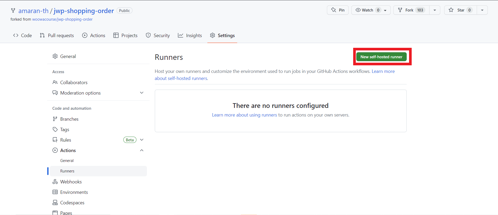
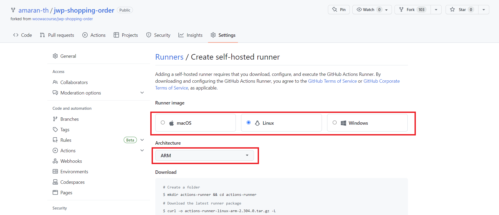
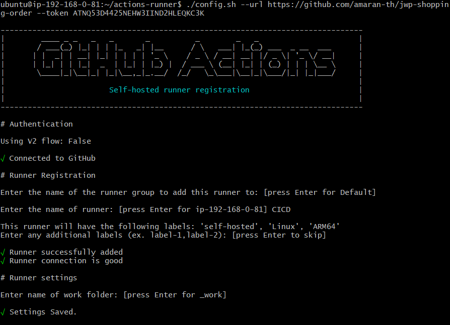
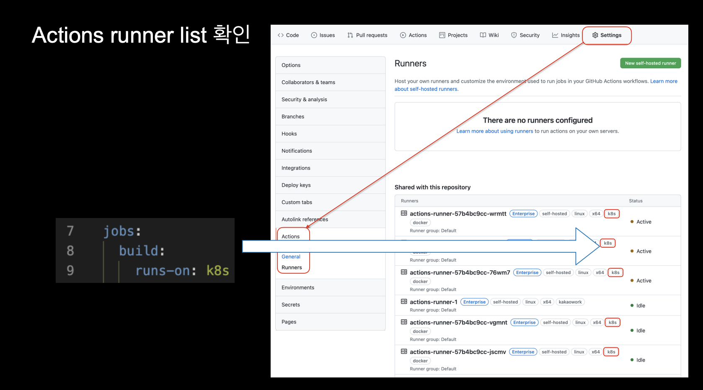
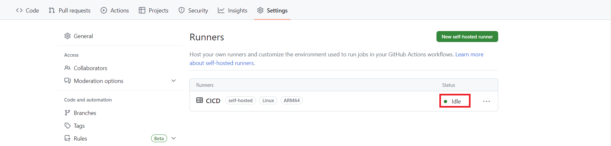
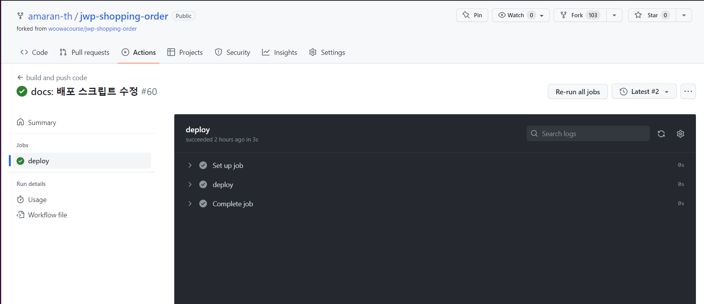

## 서론

---

Github Actions를 사용하면 사용자가 yml 파일로 작성한 워크플로우는 일반적으로 Github Actions의 가상머신 환경(Github-hosted runners)에서 실행된다.

외부 서버에서 리소스를 빌려 작업을 수행하기 때문에 권한 문제나 배포 작업에서 서버에 보안이 걸려있는 경우 사용하는 데 일부 제약이 생긴다.

이런 경우 Self-hosted Runner를 사용하는 것이 권장된다.

## Self-hosted Runner

---

: 사용자가 지정한 로컬 컴퓨팅 자원(=서버)에서 워크플로우를 실행할 수 있도록 Github가 제공하는서비스이다.

사용 방법은 다음과 같다.

- Github Actions 설정에서 Runner 생성/등록
- 사용하고자 하는 환경(주로 서버 컴퓨터)에 self-hosted-runner 어플리케이션 설치
- yml 스크립트 파일에서 job 실행 환경을 등록한 Runner로 설정

### Github Actions 설정에서 Runner 생성/등록

먼저 CI/CD를 구축할 레파지토리의 설정에 들어가서 `Actions>Runners>New self-hosted-runner`를 클릭한다.



그럼 다음과 같이 Runner를 설치할 환경의 운영체제와 아키텍처를 선택하는 옵션이 나온다.

배포에 사용된 EC2 인스턴스는 Ubuntu, ARM64이므로 그렇게 설정해주었다.



그럼 바로 아래에 운영체제&아키텍쳐에 맞는 셋팅 스크립트가 생성되는데, 이를 그대로 Runner를 설치하고자 하는 환경의 터미널에 입력하면 된다.

### 사용하고자 하는 환경(주로 서버 컴퓨터)에 self-hosted-runner 어플리케이션 설치

- `Download`
  서버에 actions runner를 설치한다.

```bash
# Create a folder
$ mkdir actions-runner && cd actions-runner
# Download the latest runner package
$ curl -o actions-runner-linux-arm64-2.304.0.tar.gz -L https://github.com/actions/runner/releases/download/v2.304.0/actions-runner-linux-arm64-2.304.0.tar.gz
# Optional: Validate the hash
$ echo "34c49bd0e294ab{중략}b704697724b31c6  actions-runner-linux-arm64-2.304.0.tar.gz" | shasum -a 256 -c
# Extract the installer
$ tar xzf ./actions-runner-linux-arm64-2.304.0.tar.gz
```

- `Configure`

```bash
# Create the runner and start the configuration experience
$ ./config.sh --url https://github.com/amaran-th/jwp-shopping-order --token {토큰값}
# Last step, run it!
$ ./run.sh
```

여기서 첫 줄의 커맨드(./config.sh)를 실행하면 아래와 같은 설정 콘솔이 뜬다.



총 4개의 입력 옵션이 뜨는데, 순서대로 나열하면 다음과 같다.

1. **Group**

   : Runner를 묶을 Group을 지정해줄 수 있다.

   나는 별도로 설정해주지 않았다.

   사용해보지 않아서 잘은 모르겠지만 여러 대의 Runner를 사용하는 경우, Group 별 접근 권한을 설정해주거나 사용 대상을 지정할 수 있는 듯 하다.

2. **Runner의 이름(필수 정보)**

   : Runner의 이름이다. 나는 간단하게 CICD라고 지어줬다.

3. **추가할 라벨**(yml 스크립트의 `runs-on` 속성 값으로 설정해줄 식별자)

   : 만약 여러 개의 Runner를 사용하는 경우, 각 Runner들을 식별할 수 있도록 라벨을 달아줄 수 있다. 나는 별도로 추가해주지 않았다.

   

   Kakao 기술 블로그 글에 따르면, 위와 같이 yml 스크립트에 라벨을 설정해주면 해당 라벨을 가지고 있는 Runner들 중 사용 가능한(Idle 상태) Runner를 실행하게 된다고 한다.

   여러 대의 서버를 사용해야 하는 경우 사용하기 용이해보인다.

4. **workflow가 실행될 기준 디렉토리**(default는 actions-runner/\_work)

   : 나는 Default로 설정했다.

여기까지 설정해주면 Runner 구성 설정이 완료된다.

`./run.sh`를 실행하면 서버 인스턴스가 Github Action가 감지하는 트리거(브랜치 push 등)를 listen하는 상태가 된다.


터미널을 종료하더라도 Runner 프로세스가 백그라운드에서 실행될 수 있도록 `nohup`, `&` 옵션을 추가해준다.

```powershell
nohup ./run.sh &
```



여기까지 해주고 Github의 setting화면으로 돌아가면, Github Runner가 정상적으로 등록된 것을 확인할 수 있다.

State가 Idle로 표시된다면 성공적으로 실행중인 것이다.

- State 종류
  - `Offline` : 서버에 설치는 되었으나 listen 상태가 아님.
  - `Idle` : 서버에 설치되었고 listen 상태임.
  - `Active` : 서버에 설치되었고 workflow가 실행 중임.

만약 더 이상 Runner가 필요 없을 경우, 다음 명령어로 서버에서 제거할 수 있다.(runner 관련 설치 파일들은 그대로 남는다.)

```powershell
./config.sh remove --token {token}
```

### yml 스크립트 파일에서 job 실행 환경을 등록한 Runner로 설정

- `Using your self-hosted runner`

```bash
# Use this YAML in your workflow file for each job
runs-on: self-hosted
```

runs-on은 workflow(정확히는 job)를 실행할 Runner를 설정하는 옵션이다. 이곳에는 Runner에 설정된 라벨을 입력할 수 있다.

self-hosted runner를 사용할 수 있도록 yml 파일을 다음과 같이 수정해주었다.

```yaml
name: build and push code
on:
  push:
    branches: ["ci_test2"]
jobs:
  deploy:
    runs-on: self-hosted
    steps:
      - name: deploy
        run: |
          chmod +x ~/deploy.sh
          sudo ~/deploy.sh
```

이렇게 하면 `ci_test2` 브랜치에 Push 이벤트가 발생할 때마다 서버 인스턴스의 `deploy.sh` 쉘 스크립트가 실행된다.



## 참고 자료

[github Actions 만으로 지속적 배포(CD) 못하나?](https://velog.io/@bjk1649/github-Action-만으로-지속적-배포CD-못하나)

[Github Actions - 1. self-hosted runner](https://velog.io/@zuckerfrei/Github-Actions-1.-self-hosted-runner)

[카카오엔터프라이즈가 GitHub Actions를 사용하는 이유](https://tech.kakao.com/2022/05/06/github-actions/)
