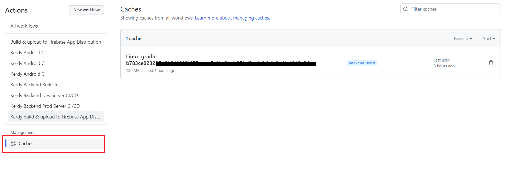

## 개요

---

이번에 프로젝트의 운영 서버를 새로 구축하면서, 인프라 구조에 큰 변화가 있었다.

기존의 인프라 구조는 이렇게 2개의 서버를 사용하고 있었는데,


새로 운영 서버를 추가하고, 스프링 부트 어플리케이션과 Dev 서버의 DB를 도커를 이용해 띄우게 되었다.


도커를 사용하게 된 이유는 [이전 게시글](https://amaran-th.github.io/%EC%A3%BC%EC%A0%80%EB%A6%AC%EC%A3%BC%EC%A0%80%EB%A6%AC/Kerdy%20%ED%94%84%EB%A1%9C%EC%A0%9D%ED%8A%B8%EC%9D%98%20%EC%9D%B8%ED%94%84%EB%9D%BC%EC%97%90%20%EB%8C%80%ED%95%9C%20%EB%85%BC%EC%9D%98/)을 참조하길 바란다.

도커를 활용해 서버를 띄우는 과정은 다음과 같은 흐름으로 진행한다.

1. 스프링 부트 어플리케이션을 개발한다.
2. 어플리케이션을 빌드해서 jar 파일을 얻는다.
3. 이 jar 파일을 배포하는 커맨드를 포함한 도커 이미지를 구축하고, 이를 Docker Hub에 푸시한다.
4. 서버에서 해당 이미지를 풀을 받는다.
5. 도커 컨테이너를 실행하면 결과적으로 서버에서 우리의 jar 파일이 배포된다.

우리는 프로젝트 코드가 갱신될 때마다 Github Actions을 통해 2번부터의 과정을 모두 자동으로 처리하고자 했다.

도커를 다뤄본 경험이 많이 없던 터라, 이참에 제대로 공부하고 싶어 도커의 개념부터 배포 스크립트는 어떻게 작성했는지까지 쭉 정리해보았다.

## Docker(도커)

---

: **컨테이너 기반의 오픈소스 가상화 플랫폼**이다.

도커는 실행환경을 **컨테이너**라는 개념으로 추상화하여 동일한 인터페이스를 제공함으로써, 프로젝트마다 동일한 작업을 반복하지 않고 실행 환경을 간단히 셋팅할 수 있게 해준다.

- **도커 호스트(Docker Host)** : 컨테이너가 설치된 운영체제.(로컬 컴퓨터, 서버 등)
- **컨테이너(Container)** : 호스트에서 실행되는 격리된 각각의 실행 환경. 도커 이미지를 실행하는 프로세스를 의미하며, 도커 이미지의 인스턴스라고 할 수 있다.
- **도커 이미지(Docker image)** : Docker 컨테이너 안에서 구축한 환경을 스냅샷으로 찍어둔 불변(immutable) 파일.

컨테이너와 호스트는 모두 독립적인 실행환경이기 때문에 **각자 독립적인 포트와 파일 시스템**을 가지고 있다.


우리 프로젝트에서는 dev 서버, prod 서버가 각각의 도커 호스트가 된다.

Dev 서버를 봤을때, Dev 서버에는 2개의 도커 컨테이너가 실행되고 있으며, 각 컨테이너는 Spring Application과 MySQL이 이미지로 구성되어 동작하게 된다.

### 도커 동작 메커니즘


- VMware, VirtualBox와 같은 가상머신은 호스트 OS 위에 **게스트 OS 전체를 가상화**하는 방식
  ⇒ 여러 종류의 OS를 가상화할 수 있고, 사용법이 간단하지만 무겁고 느리기 때문에 운영 환경에서 사용하기 어렵다.
- Docker는 **프로세스를 격리**하여 동작하는 방식.
  ⇒ 이 프로세스(컨테이너)는 도커 호스트의 CPU와 메모리를 필요한 만큼만 사용하기 때문에 성능적 손실이 거의 없다. 여러 개의 컨테이너를 실행하더라도 서로 영향을 미치지 않고 독립적으로 실행된다.

### **Dockerfile**

: 컨테이너 구동에 필요한 환경 정보를 저장하는 파일. Dockerfile을 빌드함으로써 하나의 이미지(image)를 만들 수 있다.

- 이 이미지만 있다면 다른 컴퓨터에서도 똑같은 환경을 띄울 수 있다.
- Dockerfile의 동작 프로세스
  1. 프로젝트 최상위 디렉터리에 Dockerfile을 생성한다.
  2. Docker는 이 Dockerfile에 나열된 명령문을 차례로 수행하며 이미지를 빌드한다.
  3. 하나의 Docker 이미지는 base 이미지부터 시작해서 기존 이미지 위에 새로운 이미지를 중첩해 여러 단계의 이미지 층을 쌓아가며 만들어진다.
- Docker File 명령어 정리
  | <명령어> | <용도> |
  | ---------- | ------------------------------------------------------------------------------- |
  | FROM | 생성할 이미지의 베이스가 될 이미지 |
  | WORKDIR | 명령어를 실행할 작업 디렉터리를 설정한다. |
  | RUN | 이미지 빌드 시 내부적으로 실행할 커맨드 |
  | ENTRYPOINT | 이미지 실행 시 항상 실행되야 하는 커맨드 설정 |
  | CMD | 이미지가 실행될 때마다 실행할 명령어. Dockerfile 내에서 한 번만 사용할 수 있다. |
  | EXPOSE | 이미지에서 노출할 포트 및 프로토콜 설정 |
  | COPY/ADD | 이미지의 파일 시스템으로 파일 또는 디렉터리 복사 |
  | ENV | 환경 변수 설정 |
  | ARG | 빌드 시 넘어올 수 있는 인자 설정 |

  작성 예시)

  ```docker
  FROM openjdk:11 as build
  ARG JAR_FILE=build/libs/*.jar
  COPY ${JAR_FILE} kerdy.jar
  ENTRYPOINT ["java","-Dspring.profiles.active=prod","-jar","/kerdy.jar"]
  ```

  **FROM** : openjdk:11 이미지에서 레이어를 생성한다.

  **ARG** : 변수 선언

  **COPY** : 실행할 jar 파일을 도커 컨테이너 내부에 kerdy.jar이라는 이름으로 복사한다.

  **ENTRYPOINT** : 컨테이너가 실행될 때 `java -Dspring.profiles.active=prod -jar /kerdy.jar` 명령을 실행한다.

- Dockerfile로 이미지 빌드하기(CLI)
  ```bash
  docker build -t {이미지명}:{버전} {경로}
  ```
  -t 옵션 : 생성할 이미지의 이름을 설정
  마지막 경로 `./`는 Dockerfile이 저장된 경로를 의미한다.
  예시) `docker build -t mybuild:0.0 ./`
  - Github Actions에서는 이 명령어를 대체할 수 있는 별도의 Action을 제공하고 있다.
    ⇒ `docker/build-push-action@v4`

### **docker-compose.yml**

: 여러 개의 컨테이너로 구성된 애플리케이션을 관리하기 위한 파일.

파일은 다음의 4가지 요소로 구성된다.

- `version` : docker compose의 버전을 기재한다.
- `services` : 컨테이너를 정의한다.(컨테이너의 집합체를 service라고 함)
- `image` : 사용할 이미지를 지정한다.
- `volumes` : 스토리지 볼륨을 지정한다.
- `networks` : 접속할 네트워크를 지정한다.
- `posrts` : 포트를 설정한다.
- `environment` : 환경변수를 설정한다.
- `depends_on` : 다른 서비스에 대한 의존관계를 정의한다.(컨테이너의 생성 순서나 연동 여부를 정의)
- `restart` : 컨테이너 종료 시 재시작 여부를 설정한다.

```yaml
version: "3" # 버전 지정

services: # 컨테이너 설정
  db:
    images: mysql:5.7 # 컨테이너에서 사용하는 base image 지정
    restart: always # 컨테이너 다운 시 재시작하라는 명령어
    volumes: # -v 옵션과 동일
      - ./mysqldata:/var/lib/mysql
    environment: # 컨테이너 안의 환경변수 설정
      - MYSQL_ROOT_PASSWORD=password
      - MYSQL_DATABASE=mydb
    ports: # -p 옵션과 동일
      - "3306:3306"
```

- **docker-compose.yml 실행 관련 명령어**

  \*docker-compose.yml 파일이 위치한 디렉토리에서 실행해야 한다.

  - `docker-compose up` : 서비스와 관련된 컨테이너를 생성하고 실행시킨다.
  - `docker-compose down` : 서비스와 관련된 컨테이너를 중단하고 제거한다.
  - `docker-compose start/stop/restart` : 서비스 관련 컨테이너를 실행/중단/재시작
  - `docker-compose kill` : 실행중인 컨테이너에 SIGKH 시그널을 보내 강제 종료
  - `docker-compose pause/unpause` : 컨테이너 정지/재가동

### 도커 명령어

1. 현재 도커 호스트에서 다운받은 이미지들을 조회

   ```bash
   docker images
   ```

2. 도커 이미지 pull

   ```bash
   docker image pull <레파지토리명>:[<태그명>]
   ```

3. 도커 이미지 삭제

   \*현재 실행중인 이미지는 삭제할 수 없다.

   ```bash
   docker image rm <image ID>
   ```

4. 모든 도커 이미지 삭제

   ```bash
   docker rmi $(docker images -q) -f
   ```

5. 도커 컨테이너 생성 및 실행

   ```bash
   docker run <옵션> <이미지 식별자> <명령어> <인자>
   ```

   - 옵션
     - -i : 사용자가 입출력을 할 수 있는 상태
     - -t : 가상 터미널 환경을 에뮬레이션하겠다는 말
     - -d : 컨테이너를 백그라운드로 실행해 프로세스가 끝나도 유지되도록 한다.
     - --name : 컨테이너에 이름을 부여하고 그 이름으로 컨테이너를 식별할 수 있다.
       ```bash
       docker run <옵션> --name <컨테이너이름:test> <이미지 Repository>
       ```
     - -e : 환경 변수 설정
     - -p : 호스트와 컨테이너 간의 포트를 배포/바인드한다.
       ```bash
       docker run -p 80:3306 --name test ubuntu:latest
       ```
       도커 호스트의 80번으로 들어온 신호를 컨테이너의 3306번 포트로 연결해준다는 의미(포트포워딩)
       
     - -v : 호스트와 컨테이너 간의 볼륨을 설정한다.
     - -rm : 컨테이너를 일회성으로 실행한다.(컨테이너가 종료될 때 컨테이너와 관련된 리소스를 모두 제거)

6. 도커 컨테이너 생성

   ```bash
   docker create <옵션> --name <컨테이너이름:test> <이미지 Repository>
   ```

7. 컨테이너 접속

   ```bash
   docker exec -it <컨테이너이름> /bin/bash
   ```

8. 컨테이너 빠져나오기

   1. 컨테이너를 종료하면서 빠져나오기

      ```bash
      exit 또는 ctrl+D
      ```

   2. 컨테이너를 실행 상태를 유지하면서 빠져나오기

      ```bash
      ctrl+P 입력 후 Q 입력
      ```

9. 컨테이너 실행/종료

   1. 실행

      ```bash
      docker start <컨테이너 이름>
      ```

   2. 종료

      ```bash
      docker stop <컨테이너 이름>
      ```

10. 실행중인 컨테이너 목록 조회

    ```bash
    docker ps
    ```

11. 컨테이너 삭제

    ```bash
    docker rm <컨테이너 이름>
    ```

## 사전 작업

---

배포 스크립트를 작성하기 전 몇 가지 사전 작업이 필요하다.

1. 서버에 Docker가 설치되어 있어야 한다.
2. MySQL 연동과 관련한 셋팅이 완료되어야 한다.
3. (우리 프로젝트는 민감 정보의 보호 수단으로 서브모듈을 사용하기 때문에) 서브모듈이 준비되어 있어야 한다.
4. Docker Hub 사용자 계정이 필요하다.
5. 이미지를 빌드할 Dockerfile을 작성해주어야 한다.

   Prod 서버, Dev 서버 별로 사용할 프로필이 다르기 때문에, 2개의 도커 파일을 만들고 배포스크립트마다 다른 도커파일을 사용하게 하였다.

   그 중 Dockerfile-prod 파일의 내용은 다음과 같다.

   ```docker
   FROM openjdk:11 as build
   ARG JAR_FILE=build/libs/*.jar
   COPY ${JAR_FILE} kerdy.jar
   ENTRYPOINT ["java","-Dspring.profiles.active=prod","-jar","/kerdy.jar"]
   ```

## 배포 스크립트 해석

---

### 배포 스크립트 전문

Spring Jar 파일을 도커 이미지로 배포하기 위해 사용한 배포 스크립트는 다음과 같다.

```yaml
name: Kerdy Backend Prod Server CI/CD

on:
  workflow_dispatch:

jobs:
  build:
		name: 빌드
    runs-on: ubuntu-22.04
    defaults:
      run:
        working-directory: backend/emm-sale
    services:
      mysql:
        image: mysql:8.0.28
        env:
          MYSQL_USER: user
          MYSQL_PASSWORD: password
          MYSQL_ROOT_PASSWORD: 1234
          MYSQL_DATABASE: kerdy
        ports:
          - 3306:3306
        options: --health-cmd="mysqladmin ping" --health-interval=10s --health-timeout=5s --health-retries=3

    steps:
      - name: workflow_dispatch에서 지정한 branch로 checkout
        uses: actions/checkout@v3
        with:
          token: ${{ secrets.SUBMODULE_TOKEN }}
          submodules: true

      - name: JDK 11로 설정
        uses: actions/setup-java@v3
        with:
          java-version: 11
          distribution: 'corretto'

      - name: Gradle에 실행 권한 부여
        run: chmod +x gradlew

      - name: Actions/Caches에 Gradle 라이브러리 캐싱
        id: cache-gradle
        uses: actions/cache@v3
        with:
          path: ~/.gradle/caches
          key: ${{ runner.os }}-gradle-${{ hashFiles('**/*.gradle') }}
          restore-keys: ${{ runner.os }}-gradle-

      - name: gradle 빌드
        run: ./gradlew build && ./gradlew build

      - name: 도커 빌더 생성 및 부팅
        uses: docker/setup-buildx-action@v2

      - name: 도커 허브에 로그인
        uses: docker/login-action@v2
        with:
          username: ${{ secrets.DOCKERHUB_USERNAME }}
          password: ${{ secrets.DOCKERHUB_TOKEN }}

      - name: 도커 이미지 빌드 및 푸시
        uses: docker/build-push-action@v4
        with:
          context: backend/emm-sale
          file: backend/emm-sale/Dockerfile-prod
          platforms: linux/arm64/v8
          push: true
          tags: ${{ secrets.DOCKERHUB_USERNAME }}/kerdy:latest

  deploy:
    needs: build
    name: 배포
    runs-on: [ self-hosted, label-prod ]
    steps:
      - name: 도커 실행
        run: |
          docker stop kerdy && docker rm kerdy && docker rmi ${{ secrets.DOCKERHUB_USERNAME }}/kerdy
          docker run -d -p 8080:8080 --name kerdy ${{ secrets.DOCKERHUB_USERNAME }}/kerdy

	- name: 슬랙 메시지 보내기
        uses: 8398a7/action-slack@v3
        with:
          mention: 'here'
          if_mention: failure
          status: ${{ job.status }}
          fields: workflow,job,commit,message,ref,author,took
        env:
          SLACK_WEBHOOK_URL: ${{ secrets.SLACK_WEBHOOK_URL }}
        if: always()
```

### 1. 기본 설정

```yaml
name: Kerdy Backend Prod Server CI/CD # (1)

on:
  workflow_dispatch: # (2)
```

1. 워크플로우 명칭 설정

   여기서 설정한 이름이 워크플로우 목록에서 표시되는 이름이 된다.

   

2. Actions 탭에서 워크플로우를 수동으로 실행할 수 있도록 설정

   

### 2. build 작업

- **job 관련 설정**
  ```yaml
  jobs:
    build:
  		name: 빌드
      runs-on: ubuntu-22.04    # (1)
      defaults:
        run:
          working-directory: backend/emm-sale    # (2)
      services:
        mysql:    # (3)
          image: mysql:8.0.28
          env:
            MYSQL_USER: user
            MYSQL_PASSWORD: password
            MYSQL_ROOT_PASSWORD: 1234
            MYSQL_DATABASE: kerdy
          ports:
            - 3306:3306
          options: --health-cmd="mysqladmin ping" --health-interval=10s --health-timeout=5s --health-retries=3    # (4)
  ```
  1. job 실행 환경을 Github 클라우드 서버로 설정(ubuntu-22.04 환경)
  2. 작업을 실행할 기준 디렉토리 경로를 backend/emm-sale로 설정
  3. 빌드 테스트를 위한 MySQL 환경을 설정
  4. mysql이 제대로 동작하는지 확인하기 위한 커맨드
- **프로젝트 빌드 & jar 파일 생성**

  ```yaml
  steps:
    - name: workflow_dispatch에서 지정한 branch로 checkout
      uses: actions/checkout@v3 # (1)
      with:
        token: ${{ secrets.SUBMODULE_TOKEN }} # (2)
        submodules: true # (3)

    - name: JDK 11로 설정
      uses: actions/setup-java@v3
      with:
        java-version: 11
        distribution: "corretto"

    - name: Gradle에 실행 권한 부여
      run: chmod +x gradlew

    - name: Actions/Caches에 Gradle 라이브러리 캐싱 # (4)
      id: cache-gradle
      uses: actions/cache@v3
      with:
        path: ~/.gradle/caches
        key: ${{ runner.os }}-gradle-${{ hashFiles('**/*.gradle') }}
        restore-keys: ${{ runner.os }}-gradle-

    - name: gradle 빌드 # (5)
      run: ./gradlew build && ./gradlew build
  ```

  1. workflow_dispatch에서 지정해준 브랜치로 체크아웃한다.

     

  2. 서브 모듈을 사용하기 위한 액세스 토큰
  3. 서브 모듈 사용 여부

     ⇒ [서브 모듈 관련 글](https://amaran-th.github.io/Github/[Github]%20Submodule%EB%A1%9C%20%EB%AF%BC%EA%B0%90%20%EC%A0%95%EB%B3%B4%20%EA%B4%80%EB%A6%AC%ED%95%98%EA%B8%B0/)

  4. Actions에 빌드 시 필요한 라이브러리 데이터를 캐싱

     캐싱한 데이터는 Github Actions에서 전역적으로 관리되며, 다음과 같이 Actions/Caches 탭에서 확인할 수 있다.

     

  5. 자바 프로젝트 빌드

     아직 원인을 찾지 못했지만, gradle 빌드 시 1번만 빌드하는 경우 RestDocs의 index.html의 업데이트가 반영되지 않는 문제가 있어 2번 빌드하도록 했다.

- **dockerfile을 사용해 docker 이미지를 빌드한 뒤 DockerHub로 푸시**

  ```yaml
        - name: 도커 빌더 생성 및 부팅    # (1)
          uses: docker/setup-buildx-action@v2

        - name: 도커 허브에 로그인    # (2)
          uses: docker/login-action@v2
          with:
            username: ${{ secrets.DOCKERHUB_USERNAME }}
            password: ${{ secrets.DOCKERHUB_TOKEN }}

        - name: 도커 이미지 빌드 및 푸시    # (3)
          uses: docker/build-push-action@v4
          with:
            context: backend/emm-sale    # (3-1)
            file: backend/emm-sale/Dockerfile-prod    # (3-2)
  					platforms: /linux/arm64/v8    # (3-3)
            push: true    # (3-4)
            tags: ${{ secrets.DOCKERHUB_USERNAME }}/kerdy:latest    # (3-5)
  ```

  1. 도커 빌더를 생성하고 부팅한다.
  2. DockerHub 계정의 유저명과 Access Token을 Github Actions Secret으로 등록하고, 해당 데이터를 사용해 도커 허브에 로그인한다.
  3. 도커 이미지를 빌드한다.

     3-1. 특정 경로에 위치한 파일(build’s context)

     3-2. 빌드 시 사용할 Dockerfile의 위치 지정

     3-3. docker image의 실행 환경을 설정하는 옵션으로, 도커 호스트(우리의 배포 서버)의 운영체제와 맞춰주어야 한다.

     3-4. 빌드 후 이미지를 Docker Hub repository에 push한다는 뜻.

     3-5. 이미지의 태그를 정의한다.(유저명/레포명:버전)

### 3. deploy 작업

- **도커 컨테이너 실행**

  ```yaml
  deploy:
    needs: build # (1)
    name: deploy
    runs-on: [self-hosted, label-prod] # (2)
    steps:
      - name: 도커 실행
        run: | # (3)
          docker stop kerdy && docker rm kerdy && docker rmi ${{ secrets.DOCKERHUB_USERNAME }}/kerdy
          docker run -d -p 8080:8080 --name kerdy ${{ secrets.DOCKERHUB_USERNAME }}/kerdy
  ```

  1. build 작업이 선행된 후 해당 job(deploy)을 실행한다는 의미이다.
  2. self-hosted, label-prod 라벨을 가진 러너에서 작업을 수행한다는 의미이다.

     

  3. 도커 실행 중지 및 컨테이너 삭제 후 컨테이너 실행

     <aside>

     💡 풀받은 이미지가 없을 때 컨테이너를 실행시키면 자동으로 풀이 받아와진다.

     </aside>

     <aside>

     💡 유저 그룹에 docker 권한이 있기 때문에 sudo 없이도 실행할 수 있다.

     </aside>

- **워크플로우 실행 결과를 슬랙으로 전송**
  ```yaml
  			- name: 슬랙 메시지 보내기
          uses: 8398a7/action-slack@v3
          with:
            mention: 'here'
            if_mention: failure
            status: ${{ job.status }}
            fields: workflow,job,commit,message,ref,author,took
          env:
            SLACK_WEBHOOK_URL: ${{ secrets.SLACK_WEBHOOK_URL }}
          if: always()
  ```

## 참고 자료

---

[[Docker] 도커란? / Docker + GitHub action을 이용한 자동배포 해보기](https://velog.io/@ssssujini99/Docker-도커란-Docker-GitHub-action을-이용한-자동배포-해보기)

[dockerFile과 docker-compose.yml 의 차이점](https://velog.io/@s2moon98/dockerFile과-docker-compose.yml-의-차이점)

[[Docker] Docker Compose의 개념, 사용법, 명령어 정리](https://devzzi.tistory.com/76)

[[Docker] 도커 명령어 정리](https://narup.tistory.com/198)

[docker run 커맨드 사용법](https://www.daleseo.com/docker-run/)

[15. [Docker] 도커에서 Container 포트와 Host 포트의 개념](https://blog.naver.com/alice_k106/220278762795)
