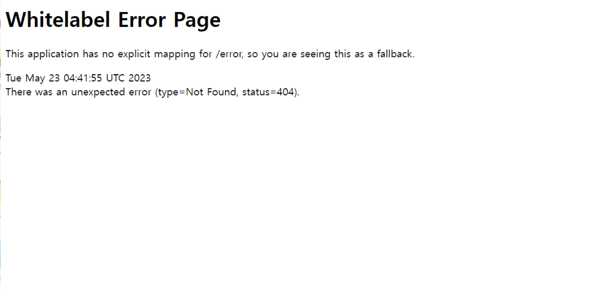

<aside>
⚠️ EC2 셋팅 과정은 민감 정보가 노출될 위험이 있어 블로깅하지 않을 계획이다.

</aside>

## 배포하기

### 1. AWS EC2 접속

<aside>
⚠️ 윈도우의 경우, putty 또는 git bash 등을 활용해 리눅스 환경을 준비한다.

</aside>

```bash
chmod 400 [pem파일명]
ssh -i [pem파일명] ubuntu@[SERVER_IP]
```

server ip는 aws의 인스턴스 정보에서 찾을 수 있다.

### 1 - 2. ssh 접속을 간편하게 하는 방법

scp 명령어를 사용해 일일이 ip 주소를 입력하지 않고 서버에 접속할 수 있다.

```java
vim ~/.ssh/config
```

- config 파일
  ```java
  Host [HOST_NAME]
        Hostname [SERVER_IP]
        User ubuntu
        IdentityFile [pem 파일명]
  ```
  이렇게 설정해주면 설정해준 호스트 이름으로 간편하게 서버에 접속할 수 있다.

```java
ssh [HOST_NAME]
```

만일 서버에 파일을 전송하고 싶은 경우, 다음과 같은 커맨드를 입력하면 된다.

```java
scp deploy.sh [HOST_NAME]:~
```

지정한 서버의 루트 경로(~)에 deploy.sh 파일을 전송한다.

### 2. 자바 설치

```bash
wget -O- https://apt.corretto.aws/corretto.key | sudo apt-key add -
sudo add-apt-repository 'deb https://apt.corretto.aws stable main'
sudo apt-get update; sudo apt-get install -y java-11-amazon-corretto-jdk
```

### 3. 서버 실행

<aside>
⚠️ jwp-shopping-order는 배포에 사용된 프로젝트 폴더 이름이다.

</aside>

```bash
git clone https://github.com/woowacourse/jwp-shopping-order
cd jwp-shopping-order
./gradlew bootJar
cd build/libs
```

```bash
java –jar jwp-shopping-order.jar &
nohup java -jar jwp-shopping-order.jar &
```

- `nohub` : 터미널이 종료된 후에도 프로그램을 실행해야 할 때 사용한다. 로그아웃 후에도 작동됨
- `&` : 사용자가 터미널을 다른 작업에 사용해야 할 때(멀티태스킹) 사용한다. 현재 세션에서만 동작



public ip 주소로 접속하면 위와 같이 서버에 정상적으로 접속되는 것을 확인할 수 있다.(404 에러만 안 뜨면 된다!!)

### 4. 서버 중단하기

```bash
ps -ef | grep 'java'    #현재 실행중인 java 관련 process의 id를 찾는다.
kill -9 [process id]
```

## 배포 스크립트 작성하기

[참고 링크](https://www.shellscript.sh/first.html)

최초 배포 시 수동으로 자바 설치 & Git Clone을 수행한다.

<aside>
💡 shell script에서 분기 처리를 통해 해당 셋팅 과정도 자동화시킬 수 있다.

</aside>

상시 배포를 편리하게 실행하기 위해 Shell 파일을 작성한다.

- deploy.sh

  ```bash
  #!/bin/sh

  port=`lsof -i :8080 -t` # 8080 포트에서 실행중인 프로세스의 process id를 가지고 온다.

  kill -9 $port # 서버 프로세스를 중단한다.
  cd ~/jwp-shopping-order # 경로 이동
  git pull origin amaran-th # 원격 레파지토리로부터 git pull을 받는다.
  ./gradlew bootJar # 프로젝트 빌드
  cd build/libs # 경로 이동
  nohup java -jar jwp-shopping-order.jar > ~/log.out & # 서버를 실행시키고 로그를 log.out 파일에 저장한다.

  ```

쉘 스크립트 실행

```bash
chmod +x deploy.sh    # deploy.sh에 파일 실행 권한 부여
./deploy.sh    # 쉘 스크립트 실행
```
