## CI/CD란?

---

지속적 통합(Continuous Integration)과 지속적 배포(Continuous Deployment)의 약자

코드 변경 사항을 **자동으로 빌드, 테스트 및 배포**하는 자동화 프로세스를 일컫는다.

### 장점

- 개발 속도를 높일 수 있다.
- 안정성을 확보할 수 있다.

### 예시

대표적인 CI/CD 툴로 Jenkins, Tekton Pipelines, Github Actions 등이 있다.

이 중에서 Github에서 제공하는 **Github Action**을 활용해 Github Repository에서 Push, Pull 등 이벤트가 감지될 때마다 프로젝트를 자동으로 빌드하고 배포하는 프로세스를 구성해보자.

## Spring 프로젝트에 CI/CD 적용하기

---

실무에서의 복잡한 설정들을 제외하고, 간단히 Gihub 레파지토리에 커밋&푸시가 이루어지면 jar 파일을 빌드 하고 배포하는 동작을 자동화시켜보자.

\*현재 우테코에서 진행중에 있는 장바구니 협업 미션 레포를 가지고 포스팅을 이어나가 보겠다.

https://github.com/amaran-th/jwp-shopping-order

### Github Actions의 구성 요소

먼저 Github Actions에서 사용되는 용어를 알아보자.

1. **Workflow**

   레포에 추가할 수 있는 **일련의 자동화된 커맨드 집합**.

   하나 이상의 Job으로 구성되어 있고 빌드, 테스트, 배포 등 각각의 역할에 맞는 workflow를 추가할 수 있으며 `.github/workflows` 디렉토리에 YAML 형식으로 저장한다.

2. **Event**

   Workflow를 실행시키는 Push, Pull Request, Commit 등의 특정 행위를 의미한다.

3. **Job**

   같은 Runner에서 실행되는 여러 step들의 집합을 의미한다.

   기본적으로 하나의 Workflow 내의 여러 job들은 독립적으로 실행되지만 필요에 따라 의존 관계를 설정하여 순서를 지정해줄 수 있다.

4. **Step**

   커맨드를 실행할 수 있는 각각의 Task. Shell 커맨드가 될 수도 있고, 하나의 Action이 될 수 있다. 하나의 Job 내에서 각각의 Step은 다양한 Task로 인해 생성된 데이터를 공유할 수 있다.

5. **Action**

   Job을 만들기 위해 Step을 결합한 독립적인 커맨드. 재사용이 가능한 Workflow의 가장 작은 단위 블럭.

6. **Runner**

   Github Actions Workflow 내에 있는 Job을 실행시키기 위한 애플리케이션.

   Github에서 호스팅하는 가상 환경에서 실행할 수 있다.

### 기준 구성 파일 찾기

CI/CD를 도입하려는 레포의 Actions 창으로 이동한다.

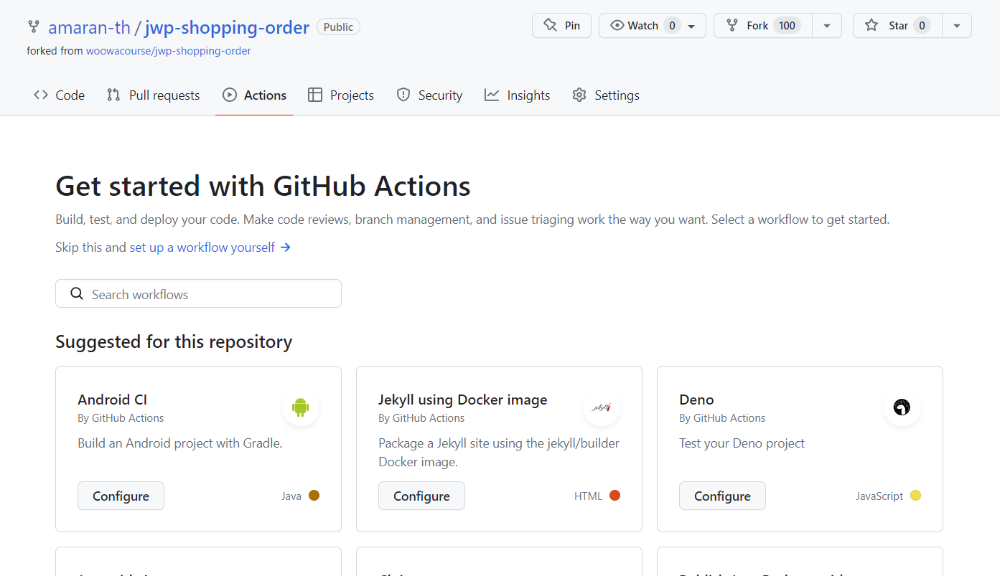

검색창에 java를 입력하면, 다음과 같이 `Java with Gradle`이라는 workflow를 찾을 수 있다.

`Configure` 버튼을 눌러 구성 파일을 확인해보자.

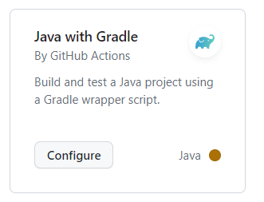

다음과 같이 바로 사용 가능한 스크립트가 작성되어 있는 것을 확인할 수 있다.

### 구성 파일(.yml) 분석

작성되어 있는 yml 파일을 한 줄씩 분석해보면 다음과 같다.

```yaml
// Actions 탭에 나타날 Workflow의 이름이다.(필수 옵션은 아님)
name: Java CI with Gradle

on:
	// Workflow이 실행되기 위한 조건(트리거)이다.
  //이 경우 main 브랜치에 push, pull request가 일어났을 때 해당 Action이 실행된다.
	push:
    branches: [ "main" ]
  pull_request:
    branches: [ "main" ]
	// 사용자가 Actions 탭에서 Workflow를 직접 실행시킬 수 있다.
	workflow_dispatch:

jobs:  // 해당 Workflow의 Job 목록
  build:  // Job의 이름(build라는 이름으로 Job이 표시된다.

    runs-on: ubuntu-latest  // Runner가 실행되는 환경을 정의한다.

    steps:  // build job 내의 step 목록
		// Action을 불러올 수 있다.
		// checkout Action을 통해 레포를 다운받은 폴더로 이동
    - uses: actions/checkout@v3
		//여기서 실행될 커맨드에 대한 설명. Workflow에 표시된다.
    - name: Set up JDK 11
			// setup-java Action을 통해 java 11을 설치한다.
      uses: actions/setup-java@v3
      with:
        java-version: '11'
        distribution: 'temurin'
    - name: Build with Gradle
      uses: gradle/gradle-build-action@67421db6bd0bf253fb4bd25b31ebb98943c375e1
      with:
        arguments: build
```

<aside>
💡 yml은 파이썬처럼 들여쓰기 규칙이 엄격한 형식이기 때문에 작성 시 주의해야 한다.

</aside>

### Action 실행 확인

Action이 동작하는지 확인하기 위해 우측 상단의 `Commit changes…` 버튼을 클릭하여 해당 스크립트를 레포에 커밋한다.

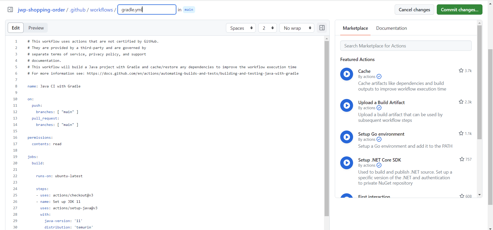

<aside>
💡 'on:' 커맨드로 감지하는 브랜치와 해당 파일이 등록되어 있는 브랜치가 동일해야 해당 브랜치에 대해 이벤트가 발생했을 때 Action이 실행된다.

</aside>

그 후 Actions 창으로 이동하면 아래와 같이 등록된 Workflow가 바로 실행되는 것을 확인할 수 있다.

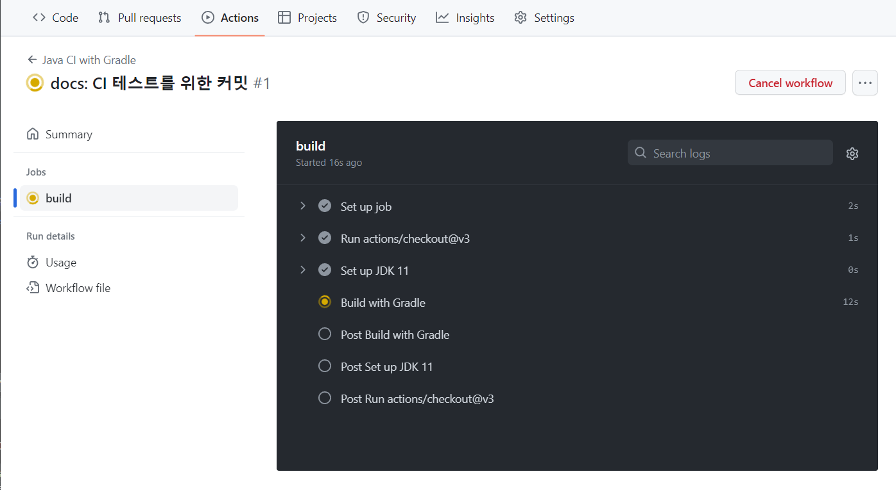

### Secret Data 저장하기

Action Runner가 프로젝트를 배포할 서버에 접속하려면 key 파일(.pem 등)과 사용자의 이름, 서버의 주소가 필요하다.

이런 정보를 공개적인 곳에 노출시킬 수 없으므로, Github에서 제공되는 `Actions secrets and variables` 저장소를 활용한다.

`Settings>Security>Secrets and variables>Actions`로 이동하면 다음과 같이 Actions에서 사용할 수 있는 레포지토리 시크릿을 등록할 수 있는 페이지가 나온다.

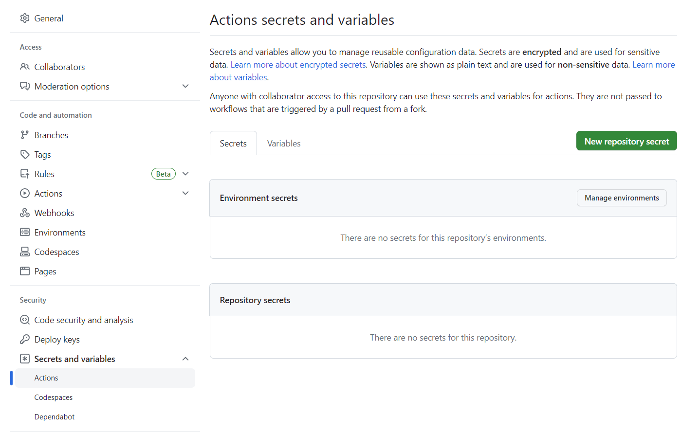

`New repository secret` 버튼을 눌러 비밀키를 등록해준다.

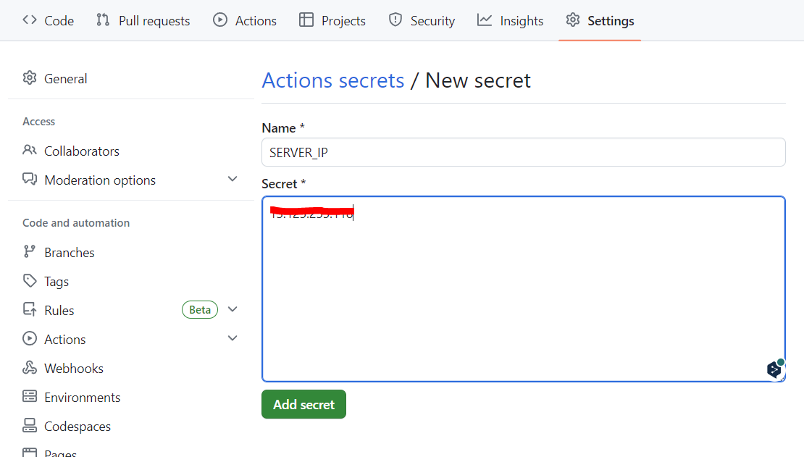

Name(=변수 명)과 Secret(=값)을 작성해준 뒤 `Add secret`을 누르면 키가 추가된다.

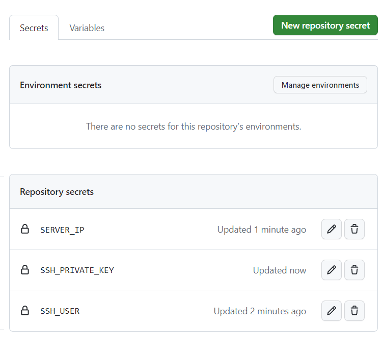

이렇게 필요한 정보들을 secret으로 등록하였다.

yml 스크립트에서 `${{ secret.[KEY 이름] }}` 으로 해당 secret value에 접근할 수 있다.

ex) `${{ secret.SERVER_IP }}`, `${{ secret.SSH_USER }}`

### 스크립트 수정

```yaml
...
jobs:
  build:
    runs-on: ubuntu-latest
    steps:
      - uses: actions/checkout@v3
      - name: Set up JDK 11
        uses: actions/setup-java@v3
        with:
          java-version: '11'
          distribution: 'temurin'
      - name: Build with Gradle
        uses: gradle/gradle-build-action@67421db6bd0bf253fb4bd25b31ebb98943c375e1
        with:
          arguments: build
      - name: Upload artifact
				// 빌드 산출물(jar 파일)을 cicdsample이라는 이름으로 업로드한다.
        uses: actions/upload-artifact@v2
        with:
          name: cicdsample
          path: build/libs/*.jar

  deploy:
    needs: build    // build job이 완료된 후에 해당 job을 실행한다.
    runs-on: ubuntu-latest
    steps:
      - name: Download artifact    // 업로드했던 cicdsample artifact를 다운로드한다.
        uses: actions/download-artifact@v2
        with:
          name: cicdsample
      - name: Setup SSH    // 서버에 접속하기 위해 SSH를 설치한다.
        uses: webfactory/ssh-agent@v0.5.4
        with:
					// 서버 접속을 위한 ssh 키를 Github secret에서 불러온다.
          ssh-private-key: ${{ secrets.SSH_PRIVATE_KEY }}
      - name: Add remote server to known hosts
        run: |
          mkdir -p ~/.ssh
          ssh-keyscan ${{ secrets.SERVER_IP }} >> ~/.ssh/known_hosts
      - name: SCP transfer
				// scp로 jar 파일을 서버의 cicd 경로로 전송한다.
        run: scp *.jar ${{ secrets.SSH_USER }}@${{ secrets.SERVER_IP }}:~/cicd
      - name: Execute remote commands
				// 서버의 jar 파일을 배포한다.
        run: |
          ssh -v ${{ secrets.SSH_USER }}@${{ secrets.SERVER_IP }} "sudo fuser -k 8080/tcp || true"
          ssh -v ${{ secrets.SSH_USER }}@${{ secrets.SERVER_IP }} "sudo nohup /home/shane/.sdkman/candidates/java/current/bin/java -jar ~/cicd/*.jar  > ~/cicd/nohup.log 2>&1 &"
```

위 스크립트는 프로젝트를 빌드하고 생성한 jar 파일을 배포 서버에 업로드하고, 배포서버에서는 이미 실행중인 프로젝트를 종료시킨 뒤 새로운 프로젝트를 nohup으로 실행시킨다.

후술할 문제로 인해 필자는 해당 방법으로 배포를 하진 못했다.

## 보안 그룹 이슈

---

우테코에서 제공해준 서버는 보안 그룹 설정때문에 Github Action Runner가 서버에 접근하는 것이 불가능하다.(scp 커맨드 사용 불가)

이런 경우 해결 방법은 크게 2가지가 있는데 다음과 같다.

- Github Action Runner를 서버에 설치한다.
- 빌드까지만 Github Action에서 수행하고 배포는 서버에서 Shell Script를 실행해 수행한다.

### 서버에 Github Action Runner 설치 - Self-hosted Runner

**Self-hosted Runner**란 GIthub action이 사용자가 지정한 PC 또는 서버에서 동작할 수 있도록 제공되는 기능이다.

Agent가 GIthub 서버로 직접 접근하는 형태

- 설치하기
  runner 압축파일을 다운로드&압축해제 후 `run.sh`를 실행하면 runner가 동작한다.

  ```bash
  mkdir actions-runner && cd actions-runner
  curl -o actions-runner-osx-x64-2.293.0.tar.gz -L https://github.com/actions/runner/releases/download/v2.293.0/actions-runner-osx-x64-2.293.0.tar.gz
  tar xzf ./actions-runner-osx-x64-2.293.0.tar.gz
  cd actions-runner

  ./run.sh
  ```

`run.sh`를 실행하면 interactive-shell로 Action Runner를 연동하는 몇가지 설정을 진행한다. 모두 완료하면 Github Repository에서 해당 runner를 확인할 수 있게 된다.

- 장점
  - 개인 환경을 public IP로 노출할 필요가 없다.
- 단점
  - 용량이 크다.

<aside>
⚠️ 저는 해당 방법을 실제로 사용해보진 않았으며, 이런 방법이 있다는 것만 알아주시면 될 듯합니다.

</aside>

### 빌드만 Github Action으로 수행 후 서버에서 직접 배포

`deploy`라는 브랜치에 빌드 결과물(jar 파일)을 푸시하고, 서버의 Shell Script에서 `deploy` 브랜치를 clone(or pull)한 뒤 배포하는 방법이다.

이 방법으로 보안 그룹 이슈 없이 jar 파일만 서버에 전송할 수 있다.

이 과정을 위한 사전 작업은 다음과 같다.

1. **deploy 브랜치로 이동 후 `.gitignore` 파일에서 /build를 지워준다.**

   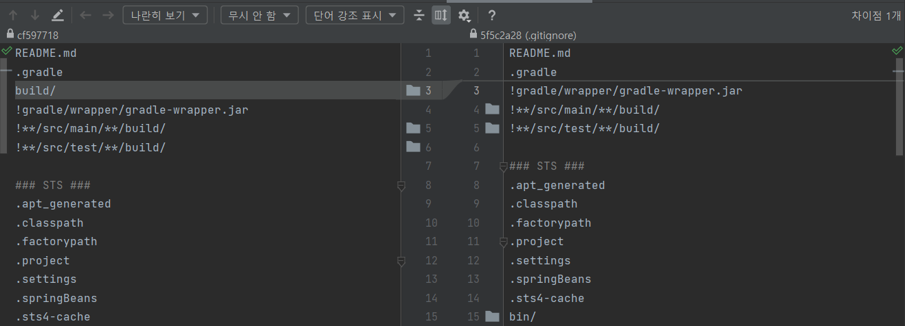

2. **`.gitignore`과 `.github` 폴더를 제외한 모든 파일을 제거한다.**

   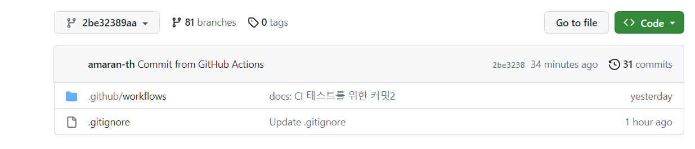

3. **Github Token 발급 받기**

   repository에 접근해야 하기 때문에 Github Token을 발급 받아야 한다.

   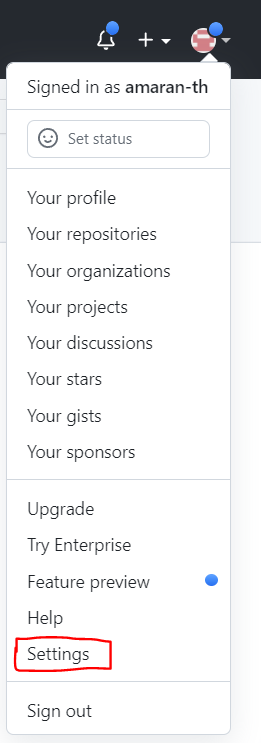

   위와 같이 Profile을 클릭하여 `Settings` 버튼을 클릭한다.

   `Developer settings>Personal access tokens>Tokens(classic)`으로 들어간 뒤, `Generate new token` 버튼을 클릭한다.

   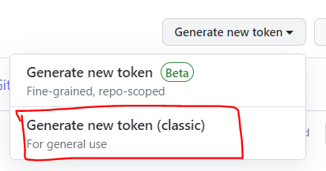

   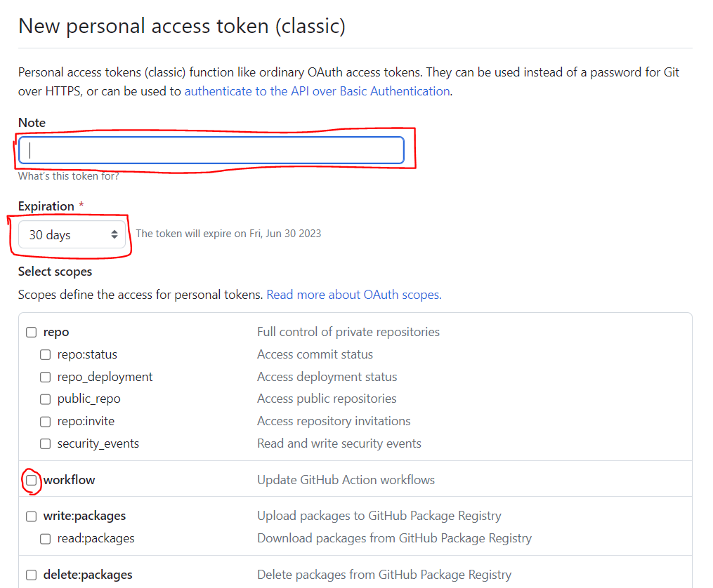

   토큰의 이름, 유효기간을 설정한 뒤 workflow 권한을 체크한 뒤 `Generate token` 버튼을 클릭해 토큰을 생성한다.

   그 다음 페이지에서 나오는 토큰을 복사해두고, 앞에서 [Secret Data 저장하기] 목차에서 했던 대로 `Actions secrets and variables` 에 등록해둔다.

   나는 `ACCESS_TOKEN`이라는 key로 등록하였다.

   <aside>
   ⚠️ 만약 workflow 실행 도중 `remote: Permission to git denied to github-actions[bot].` 라는 오류가 발생한다면, 레포의 Setting 탭으로 들어간 후 `Actions>General` 탭으로 들어가 다음 설정을 <b>Read and write permissions</b>에 체크해준 뒤 다시 시도해보자.

   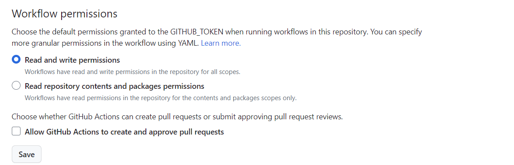

   </aside>

4. **스크립트 작성**

   배포할 브랜치(여기서는 테스트를 위해 `main`(또는 `develop`)을 곧장 사용하지 않고 `ci_test`라는 브랜치 만들어 사용하였다.)에 등록할 yml 파일은 다음과 같다.

   ```yaml
   name: build and push code
   on:
     push:
       branches: [ "ci_test" ]
   jobs:
     git-push:
       name: build and push
       runs-on: ubuntu-latest
       steps:
         - uses: actions/checkout@v3
         - uses: actions/setup-java@v3
           with:
             java-version: 11
             distribution: temurin
         - name: Setup Gradle
           uses: gradle/gradle-build-action@v2

         - name: Execute Gradle build
           run: ./gradlew bootJar

         - name: Checkout deploy branch
           uses: actions/checkout@v3
           with:
             clean: false    // 변경사항을 그대로 유지한 채
             ref: "deploy"   // 'deploy' 브랜치로 checkout
         - name: Add & Commit
           uses: EndBug/add-and-commit@v4.4.0
           with:
             add: 'build/libs'   // build/libs 경로의 변경사항을
             ref: "deploy"       // 'deploy' 브랜치로 커밋
           env:
             GITHUB_TOKEN: ${{ secrets.ACCESS_TOKEN }}
         - name: Push commit
           uses: ad-m/github-push-action@master
           with:
             github_token: ${{ secrets.ACCESS_TOKEN }}
             directory: "build/libs"    // build/libs 경로의 커밋을
             branch: "deploy"           // 'deploy' 브랜치로 푸시
             force: true
   ```

5. **서버에서 실행할 Shell Script 작성**

   `deploy` 브랜치에 올라와 있는 빌드 결과물을 풀 받고 jar파일을 배포한다.

   - 프로젝트 레포 클론
     ```bash
     git clone https://github.com/amaran-th/jwp-shopping-order.git
     ```
   - `deploy.sh` 파일 작성

     ```bash
     #!/bin/sh

     port=`lsof -i :8080 -t`

     kill -9 $port
     cd ~/jwp-shopping-order
     git checkout deploy
     git pull origin deploy
     cd build/libs
     nohup java -jar jwp-shopping-order.jar > ~/log.out &
     ```

   - deploy.sh 실행(root 디렉토리에서)
     ```bash
     ./deploy.sh
     ```

[이전 포스팅](https://amaran-th.github.io/%EC%9D%B8%ED%94%84%EB%9D%BC/[Linux]%20%EC%84%9C%EB%B2%84%EC%97%90%20%ED%94%84%EB%A1%9C%EC%A0%9D%ED%8A%B8%20%EB%B0%B0%ED%8F%AC%20&%20%EB%B0%B0%ED%8F%AC%20%EC%8A%A4%ED%81%AC%EB%A6%BD%ED%8A%B8%20%EC%9E%91%EC%84%B1%ED%95%98%EA%B8%B0/)을 보고 왔다면 다음과 같은 의문이 들 수도 있다.

> 이 방법은 git push를 한 후에 개발자가 서버에서 직접 쉘 스크립트를 실행시켜주어야 하는데, 굳이 Github Actions를 사용하지 않고 쉘 스크립트만을 사용해 서버에서 빌드&배포를 하는 방법이 더 간단한 것이 아닌가?

이 방법으로 빌드&배포 프로세스를 구축하면 서버에 빌드 결과물(jar 파일)만을 업로드하기 때문에 서버의 용량을 크게 절약할 수 있다.

즉 이 방법을 통해 빌드에 필요한 서버 용량 문제와 Github Actions 사용 시 보안 그룹 이슈 모두를 해결할 수 있다.

## 참고 자료

---

[Github Action을 활용한 SpringBoot 프로젝트 CI/CD](https://shanepark.tistory.com/465)

[GitHub Actions를 이용한 CI/CD 구축하기](https://ji5485.github.io/post/2021-06-06/build-ci-cd-pipeline-using-github-actions/)

[Github Actions으로 배포 자동화하기 : NHN Cloud Meetup](https://meetup.nhncloud.com/posts/286)
