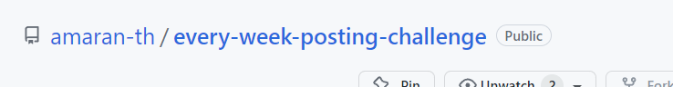
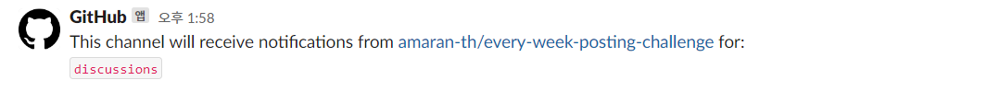
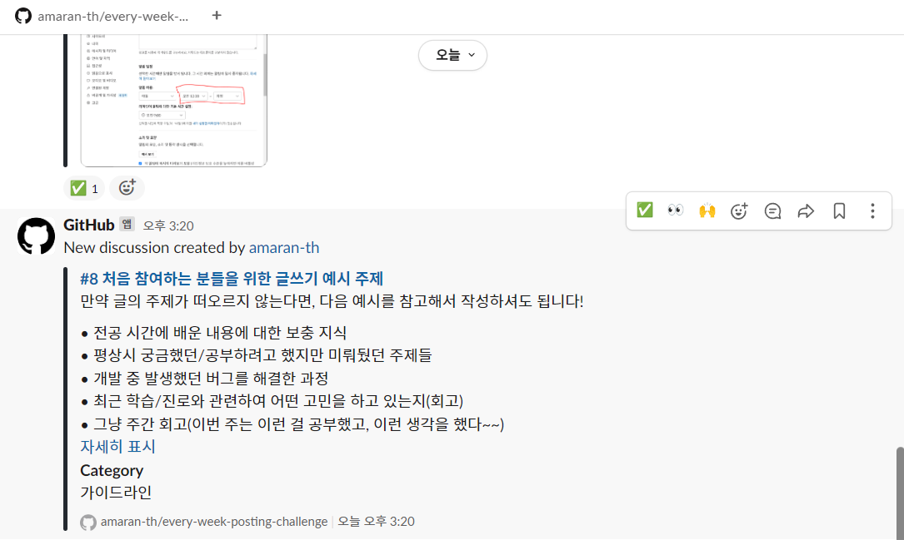
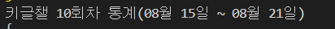
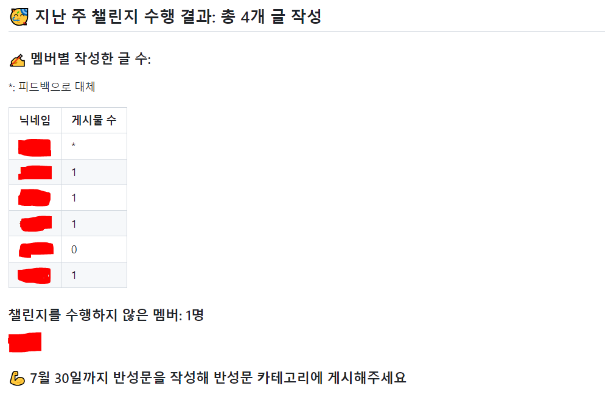
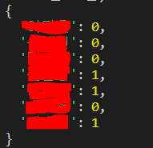
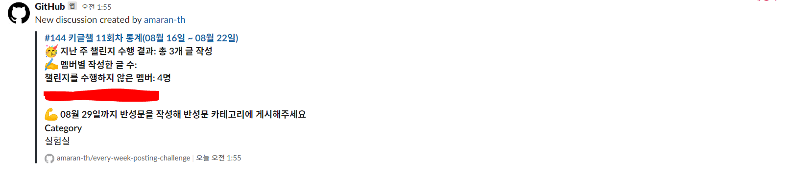

## 0. 서론

---

내가 우아한 테크코스에서 참여하고 있는 꾸글쓰(꾸준히 글쓰기 모임)에서는 크루들이 디스커션을 올릴 때마다 알람이 오고, 매주 글을 작성하지 않은 크루들을 찾아 알려주는 등 편리한 기능이 몇가지 마련되어 있다. 덕분에 글 쓰기를 잊어버리지 않고 꾸준히 참여할 수 있었다.

그러다가 이번에 친구들과 비슷한 걸 하게 되어서, 에코에게 방법을 전수받아 그 기능들을 직접 구현해보고, 그 과정을 문서화해보았다.

도움을 준 에코에게 감사 인사를 남긴다.

## 1. 새 글 알림 받기

---

### 사전 작업

1. Slack 워크스페이스에 Github 앱을 설치한다.
2. Github 계정에 Slack 앱을 설치한다.

### 과정

알람을 수신하고자 하는 채널에 다음 명령어를 입력한다.

```
/github subscribe 계정명/레포명 discussions
```



이걸 그대로 입력해주면 된다.



이렇게 되면 성공.

<aside>
💡 만약, 디스커션의 특정 카테고리에 대해서만 알람을 받고 싶다면 다음과 같이 설정하면 된다.

```
/github subscribe 계정명/레포명 discussions:{category:"카테고리1", "카테고리명2"}
```

</aside>

이제 discussion에 새 글이 올라올 때마다 사진처럼 채널에 디스커션 정보가 올라오게 된다.



## 2. 주간 통계를 디스커션에 업로드하기

---

에코의 경우 파이썬으로 구현했는데, 나는 자바스크립트가 더 익숙한데다 괜히 도전 정신이 생겨서 색다르게 자바스크립트로 구현해보았다.

먼저 Github에서 제공해주는 GraphQL API를 호출해서 Github 디스커션에 글을 게시할 수 있는데, GraphQL에 대해 잘 모르는 관계로 정확히 뭐하는 녀석인지 알아보았다.

[Using the GraphQL API for Discussions - GitHub Docs](https://docs.github.com/en/graphql/guides/using-the-graphql-api-for-discussions)

### GraphQL

: 페이스북(Meta)에서 만든 쿼리 언어.

SQL과의 차이는, SQL은 **데이터베이스** 시스템에 저장된 데이터를 효율적으로 가져오기 위한 목적으로 설계된 반면, GraphQL은 **웹 클라이언트가 서버로부터** 데이터를 효율적으로 가져오기 위한 목적으로 설계되었다는 것이다.

활용 측면에서는 SQL은 주로 **백엔드 시스템**에서 작성되고 호출되는 반면 GraphQL은 **클라이언트 시스템**에서 작성하고 호출한다.

```sql
SELECT plot_id, species_id, sex, weight, ROUND(weight / 1000.0, 2) FROM surveys;
```

```graphql
{
  hero {
    name
    friends {
      name
    }
  }
}
```

클라이언트에서 GraphQL 문장을 사용해 서버로부터 데이터를 요청할 수 있다는 점에서, GraphQL은 API라고 볼 수도 있는데 그럼 REST API와의 차이는 뭘까?

- **REST API와 GraphQL의 차이**

  REST API는 URL, METHOD를 조합한 다양한 Endpoint가 존재할 수 있지만, GraphQL은 단 하나의 Endpoint만 존재한다.

  그리고 GraphQL API에서는 불러오는 데이터의 종류를 쿼리 조합을 통해서 결정한다.

  REST API에서는 각 Endpoint마다 데이터베이스 SQL 쿼리가 달라지지만, GraphQL API는 GraphQL 스키마에 따라 데이터베이스 SQL 쿼리가 달라질 수 있다.
  

- 그 외 특징
  - GraphQL의 요청 쿼리문과 응답 데이터의 형식은 거의 일치한다.
  - GraphQL은 간단히 스키마+리졸버로 구성된다. 스키마 안에 변수나 함수를 정의하고, 리졸버에서 함수를 구현하면 된다.
- 스키마/타입
  ```graphql
  type Character {
    name: String!
    appearsIn: [Episode!]!
  }
  ```
  - 오브젝트 타입 : Character
  - 필드 : name, appearsIn
  - 스칼라 타입 : String, ID, Int 등
  - 느낌표(!) : 필수 값을 의미(non-nullable)
  - 대괄호([, ]) : 배열을 의미(array)
- 리졸버(resolver)
  - GraphQL에서 데이터를 가져오는 구체적인 과정은 리졸버가 담당하는데, 이를 프로그래머가 직접 구현해주어야 한다.
  - gql 쿼리에서는 각각의 필드마다 함수가 하나씩 존재 한다고 생각하면 된다. 이 함수는 해당 필드의 데이터를 반환하며, 이러한 각각의 함수를 리졸버(resolver)라고 한다.
    리졸버는 연쇄적으로 호출된다.

이렇게 대략적으로 GraphQL의 개념에 대해 알아봤다.

그럼 이제 JavaScript에서 GraphQL을 사용하는 방법을 알아보자.

### JavaScript에서 GraphQL 사용하기

먼저 Repository에 요청을 보낼 수 있는 권한이 필요하기 때문에, **Github Personal Tocken을 발급**받는다.

[토큰 발급 링크](https://github.com/settings/tokens/)

그 후 graphql을 사용하기 위한 **패키지를 설치**해준다.

```bash
npm install @octokit/graphql
```

GraphQL의 사용법을 익히기 위해 다음과 같은 코드를 작성해주었다.

- test/test_graphql.js

```bash
const { graphql } = require('@octokit/graphql')

async function repo() {
  const mytoken = [Github Personal 토큰]
  const { repository, viewer } = await graphql(    `
      {
        repository(owner: "amaran-th", name: "every-week-posting-challenge") {
          discussions(first: 10) {
            totalCount
						edges {
              node {
                id
                title
                createdAt
                url
                author {
                  login
                  avatarUrl
                }
              }
            }
          }
        }
        viewer {
          login
        }
      }
    `,
    {
      headers: {
        authorization: `token ${mytoken}`,
      },
    }
  )
  console.log(
    repository.discussions.totalCount,
    repository.discussions.edges,
    viewer
  )
}

repo()
```

그리고 터미널에 다음 명령어를 입력해서 스크립트를 실행시킨다.

```bash
node test/test_graphql.js
```

그럼 지정한 Github Repository(amaran-th/every-week-posting-challenge)로부터 상위 10개의 Discussion 정보를 불러올 수 있다.

Github 공식 문서에 나와있는 Discussion 정보를 불러오기 위한 기본적인 GraphQL 쿼리 양식은 다음과 같다.

```graphql
query {
  repository(owner: "github", name: "some-repo") {
    discussions(first: 10) {
      # type: DiscussionConnection
      totalCount # Int!
      pageInfo {
        # type: PageInfo (from the public schema)
        startCursor
        endCursor
        hasNextPage
        hasPreviousPage
      }

      edges {
        # type: DiscussionEdge
        cursor
        node {
          # type: Discussion
          id
        }
      }

      nodes {
        # type: Discussion
        id
      }
    }
  }
}
```

Github에서 제공하는 GraphQL API에서, Discussion type에 대한 스키마는 다음과 같다.

[Using the GraphQL API for Discussions - GitHub Docs](https://docs.github.com/en/graphql/guides/using-the-graphql-api-for-discussions)

```graphql
type Discussion implements Comment & Deletable & Lockable & Node & Reactable & RepositoryNode & Subscribable & Updatable {
  activeLockReason: LockReason
  answer: DiscussionComment
  answerChosenAt: DateTime
  answerChosenBy: Actor
  author: Actor
  authorAssociation: CommentAuthorAssociation!
  body: String!
  bodyHTML: HTML!
  bodyText: String!
  section: "지식 공유" 
category: DiscussionCategory!
  comments(
    after: String
    before: String
    first: Int
    last: Int
  ): DiscussionCommentConnection!
  createdAt: DateTime!
  createdViaEmail: Boolean!
  databaseId: Int
  editor: Actor
  id: ID!
  includesCreatedEdit: Boolean!
  lastEditedAt: DateTime
  locked: Boolean!
  number: Int!
  publishedAt: DateTime
  reactionGroups: [ReactionGroup!]
  reactions(
    after: String
    before: String
    content: ReactionContent
    first: Int
    last: Int
    orderBy: ReactionOrder
  ): ReactionConnection!
  repository: Repository!
  resourcePath: URI!
  title: String!
  updatedAt: DateTime!
  url: URI!
  userContentEdits(
    after: String
    before: String
    first: Int
    last: Int
  ): UserContentEditConnection
  viewerCanDelete: Boolean!
  viewerCanReact: Boolean!
  viewerCanSubscribe: Boolean!
  viewerCanUpdate: Boolean!
  viewerDidAuthor: Boolean!
  viewerSubscription: SubscriptionState
}
```

<aside>
💡 여기서 사용된 edges와 node에 대해서 찾아보니, 어떤 데이터의 리스트가 있을 때, 각 데이터를 node, 두 node를 연결하는 관계를 edge라고 한다고 한다.

일단은 데이터의 리스트를 불러오기 위한 포맷으로 이해했다.

</aside>

원하는 데이터를 불러올 수 있다는 것을 확인했으니, 이제 주간 통계 게시물의 양식을 구성해보자.

### Title 구성

`키글챌 OO회차 통계(OO월 OO일 ~ OO월 OO일)` 이라는 형식으로 통계 디스커션의 Title을 구성하려 한다.

제일 먼저 graphql.js 파일에 디스커션 목록을 불러오는 함수를 작성해주었다.

- `every_week_posting_challenge/graphql.js`

  ```jsx
  const { graphql } = require('@octokit/graphql')

  exports.getDiscussions = async function getDiscussions() {
    const mytoken = { Github 토큰 값 }
    return await graphql(
      `
        {
          repository(owner: "amaran-th", name: "every-week-posting-challenge") {
            discussions(first: 100) {
              totalCount
              edges {
                node {
                  id
                  title
                  createdAt
                  url
                  author {
                    login
                    avatarUrl
                  }
                  category {
                    name
                  }
                }
              }
            }
          }
          viewer {
            login
          }
        }
      `,
      {
        headers: {
          authorization: `token ${mytoken}`,
        },
      }
    )
  }
  ```

Github Token과 같이 민감한 정보를 .env 파일에 숨겨주기 위해 dotenv 라이브러리를 설치해준다.

```bash
npm install --save-dev dotenv
```

- `.env`
  ```bash
  GITHUB_TOKEN='깃허브 토큰 값'
  ```
- `every_week_posting_challenge/graphql.js`

  ```jsx
  ...
  require('dotenv/config')

  exports.getDiscussions = async function getDiscussions() {
    const mytoken = process.env.GITHUB_TOKEN
  	...
  }
  ```

그 다음, 현재 날짜와 일주일 전의 날짜를 선언한다. 혹시모를 TimeZone 이슈를 대비해 moment-timezone 라이브러리를 사용했다.

- `every_week_posting_challenge/notify.js`

  ```jsx
  const { getDiscussions } = require("./graphql")
  const moment = require("moment")
  require("moment-timezone")

  moment.tz.setDefault("Asia/Seoul")

  async function repo() {
    const { repository, viewer } = await getDiscussions()
    const now = moment()
    const last_week = now.clone().subtract(7, "d")
  }

  repo()
  ```

오늘이 몇 번째 회차인지를 알기 위해 주간 통계 카테고리의 디스커션 개수(notificationCount)를 구한다.

- `every_week_posting_challenge/graphql.js`

```jsx
exports.getNotifyDiscussions = async function getNotifyDiscussions() {
  const mytoken = process.env.GITHUB_TOKEN
  return await graphql(
    `
      {
        repository(owner: "amaran-th", name: "every-week-posting-challenge") {
          discussions(first: 100, categoryId: "DIC_kwDOJjgAhs4CWp1V") {
            totalCount
          }
        }
        viewer {
          login
        }
      }
    `,
    {
      headers: {
        authorization: `token ${mytoken}`,
      },
    }
  )
}
```

```jsx
	const { repository } = await getNotifyDiscussions()
  const notificationCount = repository.discussions.totalCount
}

```

지금까지 얻은 정보로 notify 디스커션의 제목(title)을 구성한다.

```jsx
	const { repository, viewer } = await getDiscussions()
  const now = moment()
  const last_week = now.clone().subtract(7, 'd')

  const resultTitle = makeTitle(repository, last_week, now)
...
}

function makeTitle(repository, last_week, now) {
  const notificationCount = repository.discussions.edges.filter(edge => {
    return edge.node.category.name === '주간 통계'
  }).length
  const yesterday = now.clone().subtract(1, 'd')

  return `키글챌 ${notificationCount + 1}회차 통계(
    ${last_week.format('MM월 DD일')} ~
    ${yesterday.format('MM월 DD일')})`
}
```



### 디스커션 Content 구성

기존에 게시했던 주간 통계 디스커션 내용의 양식은 다음과 같다.



한 주간 작성된 게시글의 개수, 멤버 별 작성된 게시글 개수, 챌린지를 수행하지 않은 멤버 수와 이름들, 반성문 마감 일자 이렇게 크게 4가지 정보를 필요로 한다.

1. 한 주간 작성된 게시글의 개수(thisWeekDiscussionCount)

   - `every_week_posting_challenge/notify.js`

     ```jsx
     const moment = require("moment")
     require("moment-timezone")
     const { getDiscussions } = require("./graphql")

     moment.tz.setDefault("Asia/Seoul")

     async function repo() {
       const { repository, viewer } = await getDiscussions()
       const now = moment()
       const last_week = now.clone().subtract(7, "d")

       const filteredDiscussions = filterThisWeekDiscussion(
         repository,
         last_week
       )
       const thisWeekDiscussionCount = filteredDiscussions.length
     }

     function filterThisWeekDiscussion(repository, last_week) {
       return repository.discussions.edges.filter(edge => {
         return (
           moment(edge.node.createdAt) > last_week &&
           edge.node.category.name !== "6. 반성문" &&
           edge.node.category.name !== "주간 통계"
         )
       })
     }

     repo()
     ```

     반성문을 제외하고 카운트해야 하므로, 카테고리와 디스커션 생성 일자를 기준으로 필터링한다.

2. 멤버 별 작성된 게시글 개수(result)

   - `every_week_posting_challenge/data.js`

     members는 모든 참여자들의 키로 Github username을, 값으로 한글 실명을 가지고 있는 객체이고, activeMembers는 휴면 멤버를 제외한 실제 활동 멤버들의 Github username 리스트이다.

     ```jsx
     exports.members = {
     		'example1': '김길동',
     		'example2': '박길동',
     		'example3': '이길동',
     		'example4': '장길동',
     		'example5': '최길동',
     		'example6': '송길동',
     		'example7': '백길동',
     ]

     exports.activeMembers = [
       'example1',
       'example2',
       'example3',
       'example4',
       'example5',
     ]
     ```

   - `every_week_posting_challenge/notify.js`

     ```jsx
     	...
     	const filteredDiscussions = filterThisWeekDiscussion(repository, last_week)
     	let result = makeResult(filteredDiscussions)
     	...
     }

     function makeResult(filteredDiscussions) {
       let result = {}
       Object.keys(members)
         .filter(member =>
           activeMembers.find(activeMember => activeMember === member)
         )
         .map(member => {
           result[members[member]] = 0
         })
       filteredDiscussions.map(edge => {
         result[members[edge.node.author.login]]++
       })
       return result
     }
     ```

     

3. 챌린지를 수행하지 않은 멤버 정보(notPostingMembers)

   - `every_week_posting_challenge/notify.js`

     ```jsx
     	...
     	let result = makeResult(filteredDiscussions)
       let notPostingMembers = makeNotPostingMembers(result)
       let notPostMembersText = notPostingMembers.join(', ')
     	let notPostMembersCount = notPostingMembers.length
     }

     function makeNotPostingMembers(result) {
       let notPostingMembers = []
       activeMembers.map(activeMember => {
         if (result[members[activeMember]] === 0)
           notPostingMembers.push(members[activeMember])
       })
       return notPostingMembers
     }
     ```

4. 반성문 마감 일자

   그냥 now에 6일을 더해주면 된다.(실제 계산은 now에 7일만큼 더한 날짜이다.)

이렇게 얻은 데이터를 기반으로 디스커션의 content를 작성해보자.

- `every_week_posting_challenge/notify.js`

  ```jsx
  function makeContent(
    thisWeekDiscussionCount,
    result,
    notPostingMembers,
    apology_deadline
  ) {
    const resultText = ""
    Object.keys(result).map(name => {
      resultText += `| ${name} | ${result[name]} |\n  `
    })
    const notPostMembersText = notPostingMembers.join(", ")
    const notPostMembersCount = notPostingMembers.length
    return `
    ## 🥳 지난 주 챌린지 수행 결과: 총 ${thisWeekDiscussionCount}개 글 작성
  
    ### ✍️ 멤버별 작성한 글 수:
    
    | 닉네임 | 게시물 수 |
    | -------- | ---------- |
    ${resultText}
    
    ### 챌린지를 수행하지 않은 멤버: ${notPostMembersCount}명
    ${notPostMembersText}
    
    ### 💪 ${apology_deadline.format(
      "MM월 DD일"
    )}까지 반성문을 작성해 반성문 카테고리에 게시해주세요`
  }
  ```

### 디스커션 작성

- `every_week_posting_challenge/graphql.js`
  mutation 쿼리를 요청하는 함수를 작성한다.
  ```jsx
  exports.createDiscussion = async function createDiscussion(title, body) {
    return await graphql(
      `mutation {
              createDiscussion(input: {repositoryId: "R_kgDOJjgAhg", categoryId: "DIC_kwDOJjgAhs4CWgj1", body: "${body}", title: "${title}"}) {
                  discussion {
                    id
                  }
                }
          }
        `,
      {
        headers: {
          authorization: `token ${process.env.GITHUB_TOKEN}`,
        },
      }
    )
  }
  ```
- `every_week_posting_challenge/notify.js`

  createDiscussion을 호출하면 원하는 양식으로 디스커션이 업로드된 것을 확인할 수 있다.

  ```jsx
  const {
    getDiscussions,
    getNotifyDiscussions,
    createDiscussion,
  } = require('./graphql')
  	...
  	await createDiscussion(resultTitle, resultContent)
      .then(() => {
        console.log('통계가 성공적으로 업로드되었습니다.')
      })
      .catch(e => {
        console.log('문제가 발생했습니다.')
      })
    return { repository, viewer }
  }
  ```



## 3. Github Actions를 사용한 주간 통계 자동 업로드

큰 상관은 없지만 편의성을 위해 `npm run notify` 명령어로 스크립트를 실행할 수 있도록 설정해주었다.

- `package.json`
  ```json
  ...
  "scripts": {
      "notify": "node every_week_posting_challenge/notify.js"
    },
  ...
  ```
- `.github/workflows/weekly_challenge_uploader.yml`

  ```yaml
  name: 키글챌 주간 통계 자동 업로더

  on:
    schedule:
      - cron: "1 15 * * 0" # 매주 월요일 00시마다 실행
    workflow_dispatch:

  jobs:
    build:
      runs-on: ubuntu-latest

      steps:
        - name: Checkout
          uses: actions/checkout@v3

        - name: Node.js
          uses: actions/setup-node@v3
          with:
            node-version: 18.x
        - name: Install Dependencies
          run: npm install
        - name: echo env
          env:
            GITHUB_TOKEN: ${{ secrets.USER_TOKEN }}
          run: echo "GITHUB_TOKEN=${GITHUB_TOKEN}" >> $GITHUB_ENV
        - name: Notify
          run: npm run notify
  ```

## 참고 자료

---

[Github GraphQL API로 Live Data 받아오기](https://velog.io/@ray/Github-GraphQL-API로-Live-Data-받아오기)

[GraphQL 개념잡기](https://tech.kakao.com/2019/08/01/graphql-basic/)

[](https://velog.io/@sisofiy626/JavaScript-dotenv-라이브러리를-통해-API-값을-숨겨보자)
