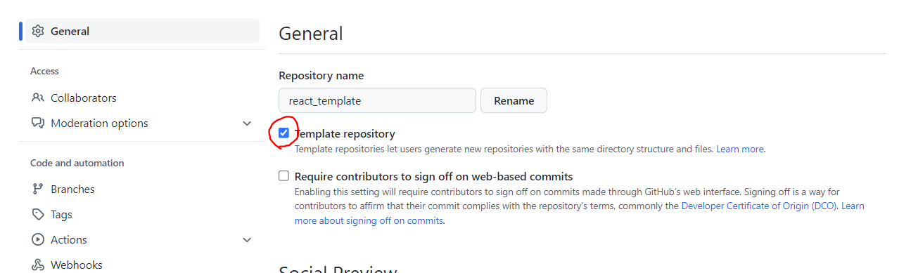

### 들어가며

나는 프론트엔드 프로젝트를 시작할 때 비슷한 초기설정을 가지고 시작하는데, 매번 일일이 패키지를 설치하고 설정파일을 만들어주는 건 꽤 귀찮은 일이었다.

그러다가 최근 Github에서 Template Repository라는 기능을 제공한다는 것을 알게 됐고, 매번 새로 초기설정을 해줄 필요 없이 미리 만들어둔 template를 가져와서 사용하면 정말 편하겠다는 생각이 들어 만들어보았다.

### Template Repository 만들기

1. Github 저장소 생성 및 초기설정
2. 저장소의 Setting 화면에서 template repository 설정을 체크해준다.
   

### 내 Template Repository 소개

[react_template/README.md at main · amaran-th/react_template](https://github.com/amaran-th/react_template/blob/main/README.md)

내가 만든 template repository의 설정은 다음과 같다.

- tailwindcss 및 prettier-plugin-tailwindcss
  - css 프레임워크로 tailwindcss를 자주 사용하기 때문에, 해당 프레임워크와 tailwindcss 스타일을 정렬해주는 패키지를 설치해주었다.
- material-tailwind/react
  - material tailwind가 제공하는 ui도 자주 사용하기 때문에 추가해주었다.
- react-icons
  - 많은 react icon을 사용할 수 있어 추가하였다.
- App.jsx에 Router 설정
- MainLayout 컴포넌트 제작
- 메인 화면에 보일 Home 컴포넌트 제작

README.md 문서는 추후 수정할 예정이다.
 
 

- 참고 게시글
  - [깃허브 템플릿 저장소 만들기](https://chinsun9.github.io/2021/07/17/github-template-repo/)
