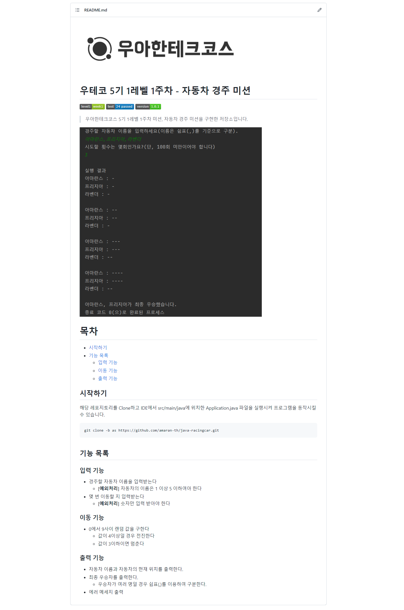

### 들어가며

지난 학기 수강했던 교필 과목을 통해 README 파일의 중요성을 알고는 있었지만 실제로 작성하는 것은 계속 미루고 있었는데, 이번 우테코를 기회로 삼아 깃헙 레파지토리를 소개하는 README 파일을 작성해보기로 하였다.

제일 먼저 우테코에서 가장 먼저 진행한 미션 - 자동차 경주 미션에 대한 레파지토리를 소개하는 README 파일을 작성해보고자 한다.

### README 파일 작성

지난 학기 수강했던 작문 수업에서 README 파일 작성 방식을 다룬 적이 있다. 수업에서 받은 가이드는 다음과 같다.

- 제목
- 소개
- 설치
- 실행
- 라이선스

이 가이드와 글 하단에 첨부한 게시글을 참고하여 다음과 같은 양식을 따르기로 하였다.

```
[ 기본 정보 ]
	대표 이미지
	제목
	뱃지
	프로젝트 간략 설명
	목차

[ 상세 정보 ]
	제목
	간략 설명
	코드스니핏 or 표 or ul
```

1. 기본 정보

   대표 이미지로는 우테코 미션이라는 것을 나타내기 위해 우테코 로고를 넣어주었다.

   버전, 테스팅 정보를 뱃지를 사용해서 추가해주었다.

   뱃지는 shilds.io에서 제공하는 기능으로, 다음과 같은 형식을 사용해 만들 수 있다.

   ```
   https://img.shields.io/badge/{라벨명}-{값}-{색상}.svg
   ```

2. 추가 정보

   오퍼레이션 GIF는 있으면 좋겠지만, 이번 미션에서는 생략했다.

   다음으로 목차를 작성해주고 각 단락의 링크를 걸어주었다.

3. 상세 정보

   시작하기 단락에는 해당 프로그램을 실행하는 방법을 작성하였다.

### 결과물

[미션 레파지토리](https://github.com/amaran-th/java-racingcar)

```


# 우테코 5기 1레벨 1주차 - 자동차 경주 미션


> 우아한테크코스 5기 1레벨 1주차 미션, 자동차 경주 미션을 구현한 저장소입니다.


# 목차
- [시작하기](#시작하기)
- [기능 목록](#기능-목록)
  - [입력 기능](#입력-기능)
  - [이동 기능](#이동-기능)
  - [출력 기능](#출력-기능)


## 시작하기
해당 레포지토리를 Clone하고 IDE에서 src/main/java에 위치한 Application.java 파일을 실행시켜 프로그램을 동작시킬 수 있습니다.

git clone -b as https://github.com/amaran-th/java-racingcar.git

## 기능 목록
### 입력 기능
- 경주할 자동차 이름을 입력받는다
    - **[예외처리]** 자동차의 이름은 1 이상 5 이하여아 한다
- 몇 번 이동할 지 입력받는다
    - **[예외처리]** 숫자만 입력 받아야 한다
### 이동 기능
- 0에서 9사이 랜덤 값을 구한다
    - 값이 4이상일 경우 전진한다
    - 값이 3이하이면 멈춘다
### 출력 기능
- 자동차 이름과 자동차의 현재 위치를 출력한다.
- 최종 우승자를 출력한다.
    - 우승자가 여러 명일 경우 쉼표(,)를 이용하여 구분한다.
- 에러 메세지 출력

```



<nav> 참고 게시글

- [우아한테크코스 4기 프리코스 후기 (4) - README.md 작성 (markdown)](https://creampuffy.tistory.com/132)

</nav>
