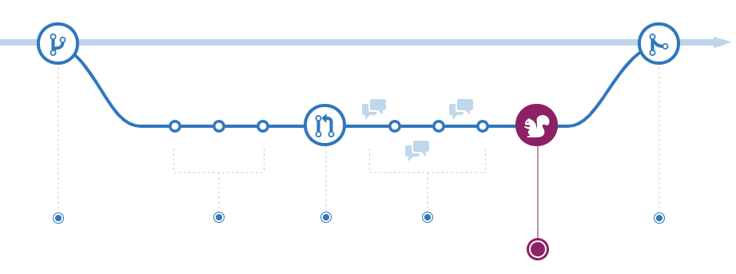

요즘 우테코에서 진행하고 있는 프로젝트에서 이번 주말동안 각자 Git 브랜치 전략과 Commit 타입을 공부해오기로 했다.

그래서 Git Branch 전략은 무엇이고 어떤 종류가 있는지 한 번 정리해보기로 했다.

<aside>

💡 이 외에도 Project, Github Wiki, 이슈 템플릿/PR 템플릿 등 Git을 효율적으로 관리하기 위한 여러가지 방법이 있지만 이건 다음에 기회가 된다면 다루어 보도록 하겠다.

</aside>

## Git 브랜치 전략

---

프로젝트를 시작할 때, 1인 개발이 아니라면 하나의 레파지토리를 여러 명이서 관리하게 된다.

별도의 Git 브랜치 전략을 정하지 않은 채 개발을 하게 되면, 여러 개발자들이 브랜치를 생성하고 병합하는 과정에서 충돌이 자주 발생하고 프로젝트의 개발 상황을 한눈에 파악하기 어려워질 수 있다.

그래서 브랜치를 효과적으로 관리하기 위해 팀 내에서 프로젝트를 시작하기 전 브랜치 관리 방법(work-flow)를 세우는데, 이를 **Git Branch 전략**이라고 한다.

자주 사용되는 브랜치 전략으로 **Git Flow**, **Github Flow**, **Gitlab Flow**가 있다.

이제부터 차례대로 알아보도록 하자.

<aside>
⚠️ 팀 내 Issue 생성, PR 머지 등과 관련된 규칙은 Git 브랜치 전략과 별개의 논점이기 때문에 따로 다루지 않았다.

</aside>

## Git Flow

---

크게 **Main 브랜치, Develop 브랜치, Supporting 브랜치**로 구분하여 브랜치를 관리한다. Main 브랜치와 Develop 브랜치는 항시 유지되는 브랜치이며, Supporting 브랜치는 merge되면 사라지는 보조 브랜치이다.

이 중 Supporting 브랜치는 **Feature 브랜치, Release 브랜치, Hotfix 브랜치**로 한 번 더 분류된다.

- Main
- Develop
- Supporting
  - Feature
  - Release
  - Hotfix

| 브랜치        | 설명                                                                                                                                                                                                                                                                                                                                                                                                                                                                                   |
| ------------- | -------------------------------------------------------------------------------------------------------------------------------------------------------------------------------------------------------------------------------------------------------------------------------------------------------------------------------------------------------------------------------------------------------------------------------------------------------------------------------------- |
| **`Main`**    | **출시 가능한 프로덕션 코드**. 개발 프로세스 전반에 걸쳐 유지된다. 배포된 버전을 Tag를 이용해 표시.                                                                                                                                                                                                                                                                                                                                                                                    |
| **`Develop`** | **다음 버전 개발**을 위한 코드. 개발이 완료되면(+문제가 없음이 확인되면) Main 브랜치로 머지된다.                                                                                                                                                                                                                                                                                                                                                                                       |
| **`Feature`** | **하나의 기능을 개발**하기 위한 브랜치. Develop 브랜치에서 생성하고, 기능 개발이 완료되면 다시 Develop 브랜치로 머지된 후 삭제된다.  - 머지 시 Fast-Forward가 아닌 Merge Commit을 생성하여 머지를 해주어야 히스토리가 기능 단위로 묶이게 된다.  - 일반적으로 `feature/branch-name`과 같은 형태로 네이밍한다.                                                                                                                                                                   |
| **`Release`** | 소프트웨어 **배포**를 준비하기 위한 브랜치이다. Develop 브랜치에서 생성하며, 배포 준비 후 Main과 Deveop 브랜치 둘 다에 머지한다.(이 때 Main 브랜치에는 태그를 이용하여 버전을 표시한다.)  - 버전 이름 등의 소소한 데이터를 수정하거나 배포 전 사소한 버그를 수정하기 위해 사용한다.  - Release 브랜치를 따로 운용함으로써 배포 업무와 관련 없는 팀원들은 병렬적으로 Feature 브랜치에서 이어서 기능을 개발할 수 있다. - 일반적으로 `release/v1.1`과 같은 형태로 네이밍한다. |
| **`Hotfix`**  | **이미 배포된 버전에 문제가 발생했을 때 문제를 해결**하기 위한 브랜치이다. Main 브랜치에서 생성하고, 문제 해결이 완료되면 Main과 Develop 브랜치 둘 다에 머지한다. - 핫픽스 업무와 관련 없는 팀원들은 병렬적으로 Feature 브랜치에서 이어서 기능을 개발할 수 있다.  - 일반적으로 `hotfix/v1.1`과 같은 형태로 네이밍한다.                                                                                                                                                         |

### Git Flow의 흐름

실제 Git Flow 브랜치 전략의 흐름을 크게 3가지 경우로 정리하면 다음과 같다.

- 항시 운용되는 Main, Develop 브랜치가 존재한다. 이 때 Develop 브랜치는 Main 브랜치로부터 생성된 브랜치이다.

1. **기능 개발**
   - 새로운 기능을 구현하기 위해 Develop 브랜치로부터 Feature 브랜치를 생성한다.(’피처를 딴다’고 표현함)
   - Feature 브랜치에서 기능을 개발한다.
   - Feature 브랜치의 기능 구현이 완료되면 Develop 브랜치에 병합하기 위한 PR을 작성한다.
   - PR에 문제가 없다면(테스트가 모두 성공하고, 누락된 기능이 없다면) PR을 병합(머지)하고 Feature 브랜치를 삭제한다.
2. **라이브 서버로 배포**
   - Develop 브랜치에 Feature 브랜치(들)이 병합되었다면, QA를 위해 Develop 브랜치로부터 Release 브랜치를 생성한다.
   - Release 브랜치에서 추가된 기능(들)에 대해 코드 충돌이 없고, 문제가 없다면(=QA 테스트를 통과했다면) Release 브랜치를 Develop, Main 브랜치에 병합한다.
3. **배포 후 발생한 오류 대처**
   - 만약 Main 브랜치에서 버그가 발견된다면, Main 브랜치에서 Hotfix 브랜치를 생성한다.
   - 버그를 해결하고 Hotfix 브랜치를 Develop, Main 브랜치에 병합한다.

### 강점

- 많은 회사와 팀에서 기본으로 사용하고 있는 전략이다.
- 운영 환경(Production) 배포 브랜치와 개발 환경(Develop) 배포 브랜치를 명시적으로 분리하기 때문에, 운영 환경에 어떤 코드 베이스가 배포 되어 있는지를 한 눈에 확인할 수 있다.(버전 관리의 용이성)

### 약점

- 복잡하다.

### Git Flow가 적합한 상황

- **모바일 어플리케이션**과 같이 **명시적으로 버전을 관리**해야 하는 소프트웨어
- 즉 1개월 이상의 긴 호흡으로 개발하여 주기적으로 배포, QA 테스트, Hotfix를 수행할 수 있는 여력이 있는 팀이다.
  ⇒우아한 형제들의 안드로이드 앱 개발팀도 Git-Flow를 사용하고 있다. - [관련 게시글](https://techblog.woowahan.com/2553/)

## Github Flow

---

Git Flow에 비해 굉장히 간단한 구조이다.

Github 환경에서 사용하기 적합하며, 자동화(CI/CD)를 적극적으로 활용한다는 것이 특징이다.

크게 **Main 브랜치와 Topic 브랜치(Feature라고도 함)** 로 구분하여 관리된다.

| 브랜치      | 설명                                                                                                                                                          |
| ----------- | ------------------------------------------------------------------------------------------------------------------------------------------------------------- |
| **`Main`**  | Git Flow의 Main 브랜치와 동일하다.  - 항상 Stable한 상태여야 한다. ⇒Main 브랜치의 **모든 커밋은 빌드가 되고 테스트를 통과해야 한다.**                 |
| **`Topic`** | **새로운 기능을 개발**하기 위한 브랜치이다. Main 브랜치에서 생성하며, Git Flow의 Feature 브랜치와 동일한 역할을 한다. Hotfix 작업도 해당 브랜치에서 진행한다. |

기능을 명확하게 설명할 수 있도록 네이밍한다.
자동화된 CI 빌드를 통과하면 Main 브랜치에 머지할 수 있다. |

### Github Flow의 흐름

- 항시 운용되는 Main 브랜치가 존재한다.
- Main 브랜치에서 새로운 브랜치를 생성한다.

    <aside>

  ⚠️ 이 때, 기능 개발, 버그 픽스 등의 체계적인 분류 없이 브랜치 하나에 의존하게 되기 때문에 **브랜치 이름을 통해 의도를 명확하게** 드러내는 것이 중요하다.

    </aside>

- 생성한 브랜치에서 개발을 진행한다. 이 때, 커밋은 수시로 원격 브랜치에 Push해준다.

    <aside>

  ⚠️ 앞서 언급한 것과 같은 이유로 가능한 **커밋 메시지를 명확하게** 작성하는 것이 좋다.

    </aside>

- 개발이 완료되면 Main 브랜치에 병합하기 위한 PR을 생성한다.
- PR에 대한 코드리뷰 또는 리뷰가 완료되면 테스트 환경에 배포해 문제가 발생하는지 테스트한다.
- 테스트가 완료되면 즉시 Main 브랜치에 머지한다.
- **이후 배포 과정은 자동으로 이루어진다.(CD)**

### 강점

- 단순하다.

### 약점

- 체계적인 버전 관리가 어렵다.

### Github Flow가 적합한 상황

- **웹 어플리케이션**과 같이 롤백되는 경우가 거의 없고, 지속적으로 제공(CD)되기 때문에 여러 버전의 소프트웨어를 지원할 필요가 없는 서비스
- Release를 위한 절차가 매우 적기 때문에 **잦은 기능 수정과 배포**가 있는 소규모 애자일 조직

## Gitlab Flow

---

Github Flow가 너무 간단해서 배포, 릴리즈 등 조금 복잡한 이슈를 보완하기 위해 등장한 전략.

크게 **Main 브랜치, Feature 브랜치, Production 브랜치**로 구분하여 관리된다.

**이슈 트래킹**을 연동해 프로세스를 단순화한다.

⇒merge request를 통해 승인이 되는 이슈만 머지하도록 하는 것이 핵심.

| 브랜치                          | 설명                                                                                                                                                                                                                                         |
| ------------------------------- | -------------------------------------------------------------------------------------------------------------------------------------------------------------------------------------------------------------------------------------------- |
| **`Main`**                      | **개발** 브랜치. Git Flow의 Develop 브랜치와 같다. Production 브랜치에서 생성하며 Feature 브랜치에서 병합된 기능에 대해 테스트가 완료되면 Production 브랜치로 머지한다. - 만약 Staging 단계를 원한다면 Pre-Production 브랜치로 머지한다. |
| **`Feature`**                   | **새로운 기능을 개발**하기 위한 브랜치이다. Main 브랜치에서 생성하며, 기능 구현이 완료되면 Main 브랜치로 머지한다. - 기능 구현이 완료되면 merge request를 보내고, 팀원 간의 협의가 완료되면 머지한다.                                    |
| **`Production`**                | **배포** 브랜치. Git Flow의 Main 브랜치와 같다. - 테스트가 끝난 기능을 배포한다.                                                                                                                                                         |
| **`Pre-Production`** (Optional) | Production 브랜치에 머지하기 전, 변경사항을 **테스트 서버에 배포하여 통합 테스트**를 진행하기 위한 브랜치                                                                                                                                    |

### 특징

Git Flow처럼 복잡하지 않으면서 Github Flow처럼 너무 단순하지 않아 비교적 적용이 쉬우면서도 원활한 운영이 가능하다.

## 3줄 요약

1. 버전 관리가 필요한 모바일 어플리케이션은 Git-Flow, 단일 릴리즈 버전으로 충분한 웹 어플리케이션은 Github-Flow
2. Gitlab-Flow는 Git-Flow와 Github-Flow의 절충안 같은 전략.
3. 정답은 없으며, 제품과 팀의 특성을 고려해 적합한 Git 브랜치 전략을 선택하는 것이 좋다.

## 참고 자료

---

[[GIT] 📈 깃 브랜치 전략 정리 - Github Flow / Git Flow](https://inpa.tistory.com/entry/GIT-⚡️-github-flow-git-flow-📈-브랜치-전략#github_flow_vs_git_flow)

[Git 브랜치 전략 (feat. Git Flow, Github Flow)](https://hudi.blog/git-branch-strategy/)

[git 브랜치 전략에 대해서](https://tecoble.techcourse.co.kr/post/2021-07-15-git-branch/)

[[Git] 브랜치 전략 - GitLab Flow](https://brownbears.tistory.com/605)
