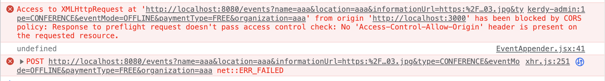

## 서론

---

Kerdy는 관리자가 직접 입력하는 데이터가 가장 중요한 서비스이기 때문에, 이러한 작업을 편리하게 해줄 관리자 페이지의 역할이 중요하다고 판단했다. 팀원 중 리액트를 다룰 줄 아는 사람이 나뿐이었기 때문에, 내가 관리자 페이지 개발을 담당하게 되었다.

## 문제

---

관리자 페이지는 1차적으로 제작을 완료해 핵심적인 기능은 모두 연동이 된 상태였다.

이번에 이미지 파일을 직접 저장하는 방식을 도입해 행사 정보를 추가하는 기능도 변경되었기 때문에, 관리자 페이지의 UI와 일부 로직에 대한 수정작업을 진행했다.

당시 변경된 API 포맷은 다음과 같았다.

```java
@PostMapping
@ResponseStatus(HttpStatus.CREATED)
public EventDetailResponse addEvent(@Valid final EventDetailRequest request) {
    return eventService.addEvent(request, LocalDate.now());
}
```

그리고 EventDetailRequest는 다음과 같이 행사 정보에 해당하는 데이터들과 이미지 리스트 데이터를 가지고 있는 DTO 객체로 정의되어 있었다.

```java
@RequiredArgsConstructor
@Getter
@Setter
public class EventDetailRequest {

  private static final String DATE_TIME_FORMAT = "yyyy:MM:dd:HH:mm:ss";

  @NotBlank(message = "행사의 이름을 입력해 주세요.")
  private final String name;
  @NotBlank(message = "행사의 장소를 입력해 주세요.")
  private final String location;
	...
  private final List<MultipartFile> images;

```

때문에, 프론트단에서는 images를 제외한 데이터를 **쿼리 스트링**으로 보내주고, images를 **form data** 형식으로 보내주어야 했다.

그래서 이 API에 요청을 보내는 Javascript 코드(feat. axios)를 다음과 같이 작성했다.

```jsx
async function addEvent({ newData, newTags, type, images }) {
  const formData = new FormData();
  formData.append(`images`, images);

  const options = {
    method: "POST",
    url: API_URL + "/events",
		params: {
			name: newData.name,
	    location: newData.location,
	    ...
	    organization: newData.organization,
		},
    data: formData
  };
  try {
    console.log(options)
    const response = await axios(options);
    return response.data;
  } catch (error) {
    alert(error.response?.data?.message);
    return error.response?.data;
  }
}
```

그런데 데이터를 채워넣고 요청을 직접 보내보니 다음과 같이 CORS 문제가 터졌다.



관리자 페이지 1차 제작 당시 CORS 문제를 이미 해결했던 터라 매우 당황스러웠다.

오류 메시지를 검색창에 검색해봐도, CORS 문제를 경험해본 주변 백엔드 크루들에게 물어봐도 원인을 알 수가 없었다.

그렇게 CORS 관련 설정을 뒤지면서 3시간 동안 삽질을 거듭하다가, ‘**서버의 CORS 설정이 문제가 아니라, 프론트의 데이터 포맷이 문제인 것이 아닐까?**’라는 생각이 들 즈음, 나와 비슷한 문제를 겪었던 팀을 만나게 되었다.

그 팀에서도 나와 비슷하게 이미지를 등록하는 기능을 구현할 때 CORS 문제가 발생했었는데, 원인은 프론트엔드에서의 실수였다고 한다.

내 코드를 보니 역시나 프론트엔드 코드에 문제가 있었는데, form 데이터에 여러 개의 이미지 리스트를 넣을 때는 반복문을 사용해야 한다고 한다. 코드로 설명하면 다음과 같다. 

```jsx
async function addEvent({ newData, newTags, type, images }) {
  const formData = new FormData();

	// foamData.append(`images`, images);  (X)
  
	Array.from(images).forEach((image) => {
    formData.append(`images`, image);
  })

```

하지만 입력 형식을 올바르게 고쳐봤음에도, CORS 에러는 사라지지 않았다.

이제 내가 프론트엔드 코드를 잘못 작성하고 있었음을 확인했으니, 내가 작성한 코드에 대한 검수를 받기 위해 프론트엔드 크루를 찾아 도움을 요청하였다.

이 과정에서도 명확한 원인을 파악할 수가 없었는데, CORS 에러 메시지만으로는 알 수 있는 정보가 너무 적었을 뿐더러 문제 원인이 될 만한 변수가 너무 많았기 때문이었다.

그래서 차라리 이미 기능 구현에 성공한 팀의 코드를 참고하는 것이 더 빠른 방법일 거라 생각해서, 찾아갔던 팀에 양해를 구하고 프로젝트의 프론트엔드 코드와 백엔드 코드를 직접 보게 되었다.

그 팀에서 구현한 포맷을 보니, 백엔드에서 이미지 파일 데이터와 나머지 데이터들을 각각 따로 `@RequestMultipart`로 받고 있었다. 이것이 큰 차이가 아닐까 생각해 다음과 같이 백엔드 API 포맷을 수정하였다.

EventDetailRequest 객체에 포함되어 있던 images 데이터를 밖으로 꺼내준 것이다.

```java
@PostMapping(consumes = MediaType.MULTIPART_FORM_DATA_VALUE)
  @ResponseStatus(HttpStatus.CREATED)
  public EventDetailResponse addEvent(@RequestPart @Valid final EventDetailRequest request,
      @RequestPart List<MultipartFile> images) {
    return eventService.addEvent(request, images, LocalDate.now());
  }
```

JavaScript 코드도 다음과 같이 수정해주었다.

```jsx
async function addEvent({ newData, newTags, type, images }) {
  const formData = new FormData();
  const request = {
    name: newData.name,
    location: newData.location,
    ...
    organization: newData.organization,
  };
  formData.append(`request`, request)
  Array.from(images).forEach((image) => {
    formData.append(`images`, image);
  })
  const options = {
    method: "POST",
    url: API_URL + "/events",
    data: formData
  };
  try {
    console.log(options)
    const response = await axios(options);
    return response.data;
  } catch (error) {
    alert(error.response?.data?.message);
    return error.response?.data;
  }
}
```

그랬더니 이번에는 `Content type 'application/octet-stream' not supported`라는 에러가 발생했다.

여전히 에러가 발생했지만, 오랫동안 삽질하던 CORS 에러에서 벗어나 다른 에러 메시지를 만나게 되니 얼마나 반가웠는지 모른다…

찾아보니 관련 레퍼런스도 많이 나왔다.

저렇게 form data로 object 형식의 데이터를 넣어줄 때는, 백엔드에서 JSON 객체로 매핑할 수 있도록 해주어야 한다고 한다.

다음과 같이 JavaScript 코드를 수정해주니 마침내 정상적으로 API 호출이 되는 것을 확인할 수 있었다.

```jsx
async function addEvent({ newData, newTags, type, images }) {
  const formData = new FormData();
  const request = {
    name: newData.name,
    location: newData.location,
    ...
    organization: newData.organization,
  };
  formData.append(`request`, new Blob([JSON.stringify(request)], { type: "application/json" }))
  Array.from(images).forEach((image) => {
    formData.append(`images`, image);
  })
  const options = {
    method: "POST",
    url: API_URL + "/events",
    data: formData
  };
  try {
    console.log(options)
    const response = await axios(options);
    return response.data;
  } catch (error) {
    alert(error.response?.data?.message);
    return error.response?.data;
  }
}
```

## 결론

---

혹여나 나중에 또 파일 데이터를 다루게 되었을 때 같은 문제를 겪을 수 있다고 생각해 기록으로 남기게 되었다. 처음에는 삽질을 한 시간이 아깝게 느껴졌지만 백엔드 ↔ 프론트 사이에서 발생하는 매핑 문제를 깊이 팔 수 있어서 꽤 좋은 경험이었던 것 같기도 하다. 내 경험상 이런 데이터 매핑 문제가 발생하면 백엔드와 프론트엔드 중 어느 쪽에 문제가 있는지 파악하기도 힘들고, 서로 긴밀한 소통을 해야 하는 상황이 되곤 했다. 그렇기에 이런 경험과 지식이 쌓이면 앞으로도 프론트엔드와 협업할 때 문제 해결에 큰 도움이 될 수 있지 않을까 싶다.

## 참고 자료

---

[Spring Controller에서 MultipartFile, Dto를 함께 요청하기](https://velog.io/@songs4805/Spring-Controller에서-MultipartFile-Dto를-함께-요청하기)

[Spring Boot | multipart/form-data 파일 업로드 ( + React , Axios, REST API, multiple files)](https://gaemi606.tistory.com/entry/Spring-Boot-multipartform-data-파일-업로드-React-Axios-REST-API)