<nav>

목차

- 들어가며
- 소개
- 개발환경 설정
  - IntelliJ
  - VSCode
- 사용법
  - 플로우 차트
  - 클래스 다이어그램

</nav>

## 들어가며

---

이번 주차 우테코 미션에서 페어 분의 제안으로 프로그램의 동작 과정을 시각화한 플로우차트를 만들어보았는데, 리뷰어님께서 플로우차트를 그리는 데 mermaid라는 플러그인을 사용해보는 것은 어떻겠냐 제안을 해주셨다. 그리고 마침 같은 코스의 크루분이 mermaid의 사용법을 발표하셔서 유용한 툴인 것 같아 한 번 사용해보기로 하였다.

이 글은 사용 방법을 숙지하기 위해 공부 목적으로 작성하는 글이다.

## 소개

---

mermaid는 시각화 다이어그램(UML)을 그릴 수 있는 언어이다. markdown에 포함하여 사용할 수 있으며, 다음과 같이 노드와 화살표를 사용하여 다이어그램을 그리는 것이 가능하다.

````markdown
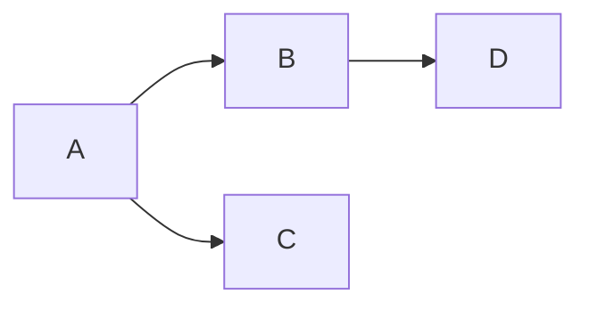
````

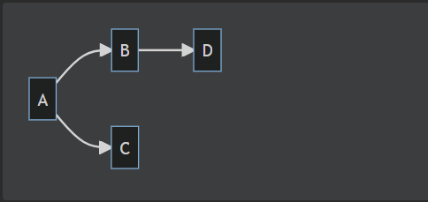

## 개발환경 설정

---

### IntelliJ

먼저 `도움말>정보` 로 들어가 설치된 IntelliJ의 버전을 확인한다.

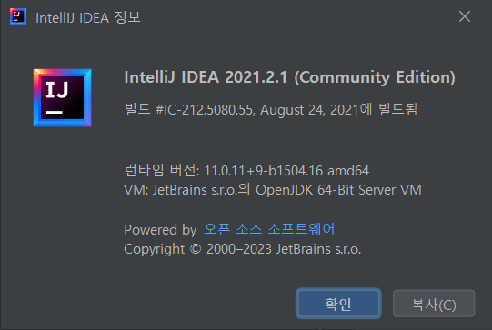

1. **버전이 2022.3.3 이상인 경우**

`파일>설정> Plugin > Marketplace`로 들어가 Mermaid를 검색하고 설치해준다.

2. **버전이 2022.2.3 미만인 경우**

`파일>설정`으로 들어가 🔍검색창에 **Markdown**을 검색한다.

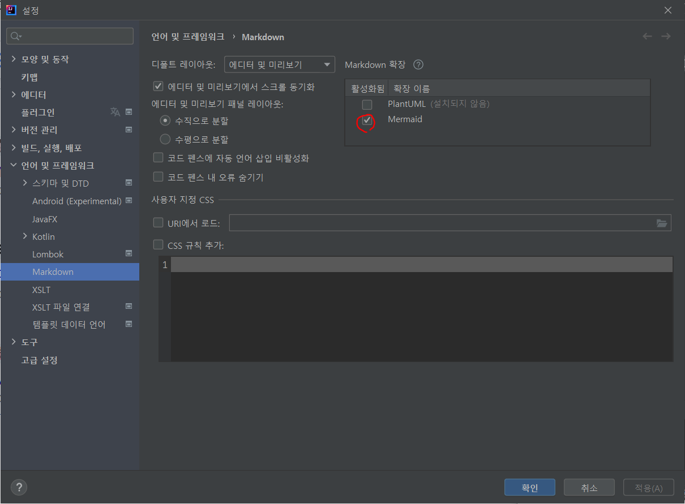

`언어 및 프레임워크>Markdown`으로 들어간 후 Markdown 확장에서 Mermaid에 체크하여 확장 프로그램을 설치해준다.

### VSCode

Plugin 창으로 들어가 mermaid를 검색하고 Markdown Preview Mermaid Support 플러그인을 설치해준다.

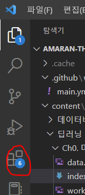

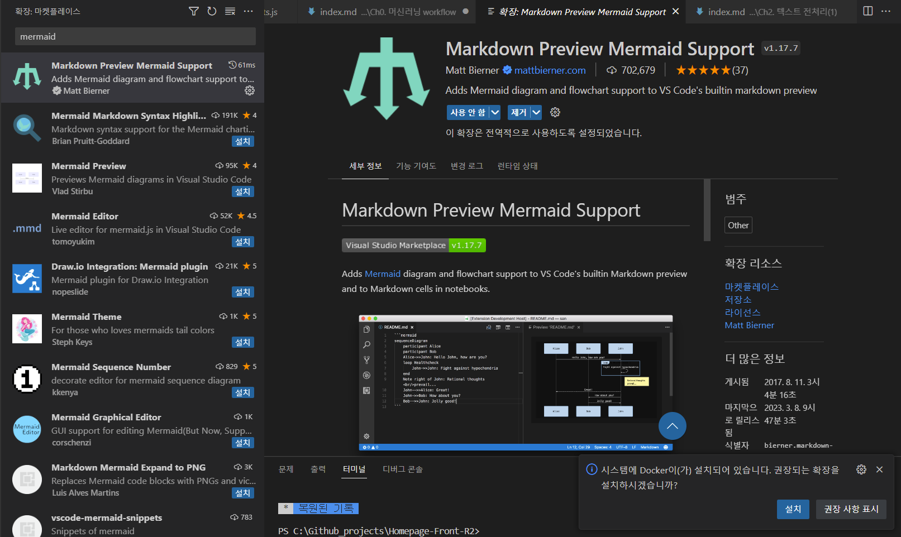

## 사용법

---

````markdown
```mermaid
다이어그램의 종류 이름
	세부 코드 작성
```
````

1. MarkDown 문법에서는 코드 블럭 코드```(백틱 3개)를 사용하여 외부 코드를 첨부할 수 있는데, 코드블럭 시작점에 mermaid라고 지정해준다.
2. 코드 첫 줄에 작성하고자 하는 UML의 종류를 작성해준다.
   - 플로우 차트(`flowchart`)
   - 클래스 다이어그램(`classDiagram`)
   - 시퀀스 다이어그램(`sequenceDiagram`)
   - …

- **그 외 공통 기능**

  - 주석 : `%%` 를 사용한다.

    ````markdown
    ```mermaid
    classDiagram
    %% This whole line is a comment classDiagram class Shape <<interface>>
    class Shape{
        <<interface>>
        noOfVertices
        draw()
    }
    ```
    ````

### 플로우 차트(흐름도)

- UML 작성 방향

  ````markdown
  ```mermaid
  flowchart LR
  	...
  ```
  ````

  예시에서 `flowchart` 키워드 우측의 키워드 `LR`은 **플로우 차트의 작성 방향**을 의미한다.

  - `LR` : Left→Right(좌측에서 우측으로)
  - `RL` : Right→Left(우측에서 좌측으로)
  - `TD`, `TB` : Top→Down(상단에서 하단으로)
  - `BT` : Bottom→Top(하단에서 상단으로)

- 노드 표현

  노드 1개는 `노드식별자[노드이름]` 로 표현 가능하다.(노드 이름을 작성하지 않을 경우 노드 식별자로 표현됨)

  - 괄호에 따른 노드 모양

    ````markdown
    ```mermaid
    flowchart LR
     A[밥을 먹었다]
     B(물을 마셨다)
     C{간식을 먹었다}
    ```
    ````

    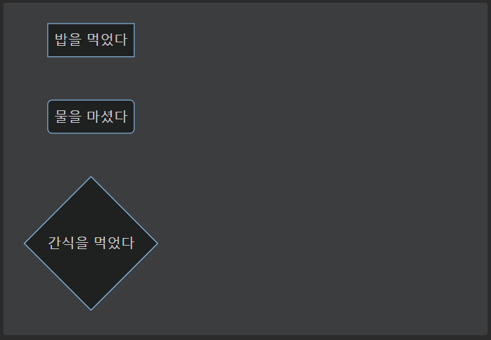

- 화살표

  화살표는 다음과 같은 양식이 존재한다. 상황에 맞게 사용하면 된다.

  ````markdown
  ```mermaid
  flowchart LR
  		 A --> B
  		 C --- D
  		 E -- 텍스트입니다 --- F ---| 텍스트입니다2 | G
  		 H -->| 텍스트 | I -- 텍스트 --> J
  		 K -.-> L -. 텍스트 .-> M
  		 N ==> O == 텍스트 ==> P
  		 Q --o R
  		 S --x T
  		 U <--> V o--o W x--x X
  ```
  ````

  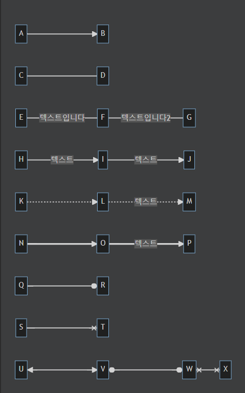

- Subgraph 만들기

  흐름도를 세분화할 때 용이하다.

  ````markdown
  ```mermaid
  flowchart TB
      c1-->a2
      subgraph one
      a1-->a2
      end
      subgraph two
      b1-->b2
      end
      subgraph three
      c1-->c2
      end
  ```
  ````

  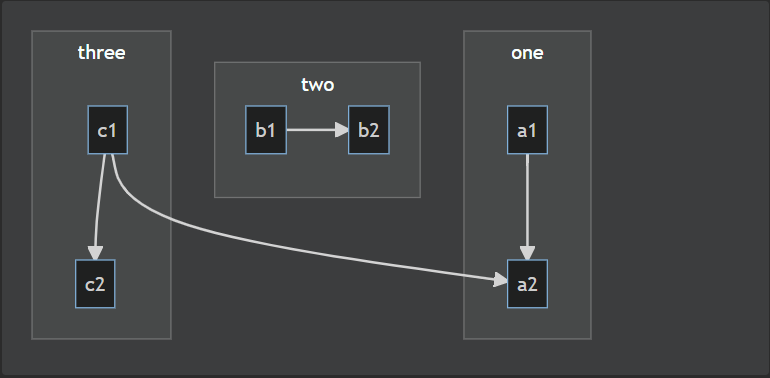

### 클래스 다이어그램

- 클래스 내 속성과 메서드를 표현할 때

  클래스 블럭을 만들고 안에 요소를 넣으면 클래스의 속성 공간에 들어가고, 뒤에 ()을 붙여주면 메소드 공간에 들어간다.

  ````markdown
  ```mermaid
  class A{
  	variable1
  	variable2
  	method2()
  	method2()
   ...
  }
  ```
  ````

  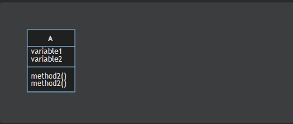

  - 여기에 자료형과 접근 제어자(-, +, #)를 표현해줄 수 있다.

    ````markdown
    ```mermaid
    classDiagram
    class Square~Shape~{
        int id
        List~int~ position
        setPoints(List~int~ points)
        getPoints() List~int~
    }

    Square : -List~string~ messages
    Square : +setMessages(List~string~ messages)
    Square : +getMessages() List~string~
    Square : +getDistanceMatrix() List~List~int~~
    ```
    ````

    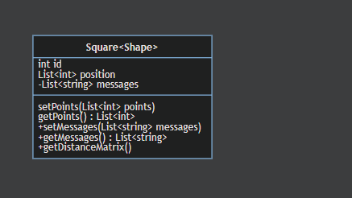

- 인터페이스/enum 표현

  ````markdown
  ```mermaid
  classDiagram
  class Shape{
      <<interface>>
      noOfVertices
      draw()
  }
  class Color{
      <<enumeration>>
      RED
      BLUE
      GREEN
      WHITE
      BLACK
  }
  ```
  ````

  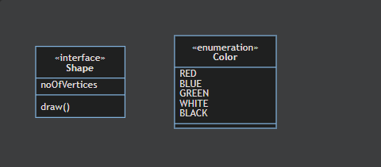

- 화살표 표현
  - 관계 유형
    - `<|` : 상속관계(Inheritance)
    - `\*` : 조합 관계(Composition)
    - `o` : 집합 관계(Aggregation)
    - `>`, `<` : 연관관계(Association)
    - `|>` : 실현관계(Realization)
  - 선 유형
    - `--` : 기본(Solid)
    - `..` : 점선(Dashed)

더 다양한 활용 방법은 아래에 첨부해둔 공식 문서를 통해 확인할 수 있다.

- 사용 예시 - 미션에 첨부한 클래스 다이어그램의 일부

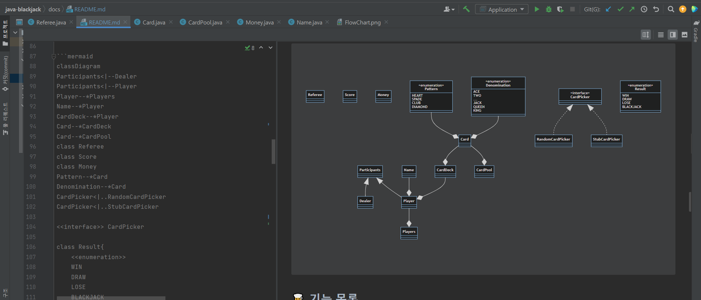

<nav>

참고 자료

- [mermaid 공식문서](https://mermaid.js.org/syntax/classDiagram.html)
- [221006_Mermaid를 이용한 Markdown 작성](https://velog.io/@brown_eyed87/221006Mermaid%EB%A5%BC-%EC%9D%B4%EC%9A%A9%ED%95%9C-Markdown-%EC%9E%91%EC%84%B1)
- [UML 클래스 관계](https://kyoun.tistory.com/100)
</nav>
