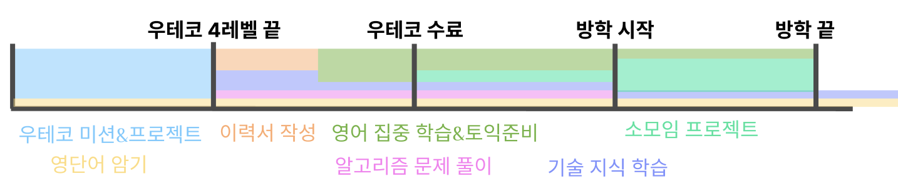

## 2023.10.13(금)

오늘 브리 코치와 두 번째 면담을 했습니다.

면담에서 크게 3가지 고민에 대해 이야기했는데요, 고민에 대해 브리로부터 어떤 해결 방안을 제시 받았고, 그에 따라 저의 생각이 어떻게 변화했는지를 이야기해보려고 합니다.

### 슬럼프에 어떻게 대처할 수 있을까

최근 3주 동안 슬럼프를 겪었습니다. 면담을 한 시점엔 이미 해소된 이후였지만, 슬럼프가 찾아올 때마다 매번 업무와 일상생활에 큰 타격을 받았고, 저 스스로도 잘 대처하지 못하는 편이라고 생각했습니다. 그래서 어떻게 하면 슬럼프를 보다 슬기롭게 대처할 수 있을지 코치님으로부터 조언을 얻고 싶었습니다.

사실... 생각해보면 웃기지만 이 문제를 브리 코치께 이야기하는 과정에서 저 스스로 해결책을 찾았습니다.

제가 슬럼프를 겪는 동안 증세가 어땠고, 어떻게 대처하려 했는지, 어떻게 해서 빠져나올 수 있었던 것 같은지를 차례대로 이야기하면서 정답을 저 스스로 깨닫게 됐습니다. 단지 스스로 생각을 정리할 시간이 필요한 문제였던 것 같습니다.

저는 슬럼프가 오게 되면 항상 무기력증과 우울 증세가 동반됩니다. 그래서 무엇을 하든 성취감이 들지 않고, 친구들과 수다를 떨어도 전혀 흥미를 느끼지 못하더라구요.

하루 정도 일을 하지 않고 쉬어도 상태가 나아지지 않고, 그 상황에 대해 스트레스만 쌓여갑니다.

이럴 때 저는 마인드 컨트롤로 해결하려고 했던 것 같습니다. 패배주의적이고 부정적인 생각에 빠지지 않으려 하고, 나태해지면 안된다, 이 일은 지금 꼭 해야한다고 머릿속으로 계속 되뇌였지만 큰 효과는 없었습니다.

하기 싫은 일을 억지로 하는 기분이었고, 자꾸 눕고 싶고 쉬어도 쉰 기분이 아니었죠.

그러고 나니 이건 저 스스로의 마음가짐만으로 해결될 일이 아니고, 외부의 도움을 받아야 하는 일이라는 것을 깨닫게 됐습니다.

그래서 주변 사람들에게 제 상태를 얘기하고 다녔습니다. 주변 사람들은 제가 기운을 차릴 수 있게 여러가지 방안을 제시해주었습니다. 기분전환을 위해 밖에 나가 햇빛을 맞으며 주변을 산책하고, 현재 저의 상황에 대해 너무 자책하지 말라는 분도 있었고, 육체적인 피로 문제일 수 있으니 피로회복제를 복용하거나 링겔을 맞아보라는 분도 있었습니다.
다들 바쁜 시기에 저를 위해 시간들여 도와주려 해주셔서 정말 감사한 마음이었습니다.

사실 전자의 경우 머릿속으로는 이미 알고 있던 방법이지만, 다른 사람의 입을 통해 들으니 그제서야 실천을 하게 되더라구요. 타인으로부터 도움을 받았다는데서 오는 책임감이 촉매가 되어준 것 같습니다.

이 때 정말 오랜만에 집을 환기하고, 청소를 하고, 밖에 나가 산책을 했습니다. 그 후로 컨디션이 평소대로 돌아왔습니다.

사실 직접 주변을 청소하고 몸을 움직인 일련의 행동들이 직접적인 계기가 되었다기보단, 주변에 제 상태를 이야기하기 시작한 것이 슬럼프를 극복하는 데 큰 요인이 된 것 같습니다. 실제로도 주변에 제 상태를 얘기하기 시작했을 때부터, 컨디션이 서서히 나아지기 시작했었거든요.

그래서 앞으로 슬럼프의 징조가 보이면, **주변에 적극적으로 도움을 요청**해봐야겠다고 다짐했습니다.

### 해야 할 테스크가 많을 때 어떻게 해야 효율적으로 처리할 수 있을까

저는 일의 우선순위를 정하기를 어려워해서 항상 비효율적으로 일을 처리하곤 합니다.

그래서 일이 한번에 많이 몰아치는 날에는 그야말로 패닉에 빠집니다.

그런데 하루 단위의 테스크가 아니라, 여러 개의 중/장기적인 계획(선택지)들이 떠오르면 내리 며칠을 쭉 고민하면서 스트레스를 받습니다. 이번에도 **우테코에서의 미션과 프로젝트, 취준을 위한 이력서/코테 준비, 학교 지인들과 운영하는 소모임, 영어 공부, 개인적인 기술지식 학습** 등의 우선순위와 수행 계획을 세우는 데 어려움을 겪었습니다.

그래서 이 문제에 대해 브리 코치께 조언을 구해보았습니다.

저에게 있어서는 모두 중요한 일인데, 무엇을 우선시해야 효율적으로 일을 처리할 수 있을까요?

이에 대해 브리가 공유해주신 우선순위 결정 팁은 다음과 같았습니다.

1. **내가 이루고자 하는 목표들을 생각하고, 목표 별로 테스크들을 매치시킨 후 목표의 우선순위에 따라 테스크를 나열한다.**
    
    저는 우선 개발을 잘하는 사람이 되고 싶습니다. 나아가 좋은 회사에 취업하고 싶고, 좀 더 욕심을 부리면 해외 기업에 취업을 하고 싶습니다.
    
    이렇게 나열하고 보니 영어 공부는 우선순위가 조금 뒤로 미뤄진 것 같습니다. 하지만 ‘개발을 잘하고 싶은’ 목표와 ‘좋은 회사에 취업’하는 목표는 어떻게 보면 결이 비슷하기 때문에 나머지 일들의 우선순위를 정하기엔 아직 어려운 것 같네요. 
    
2. **지금만 할 수 있는 일과 평상시에도 할 수 있는 일을 구분해보고, 지금만 할 수 있는 일에는 조금 더 중요도를 높인다.**
    
    이렇게 보면 우테코 기간에만 수행할 수 있는 미션/프로젝트의 우선순위를 조금 더 높게 잡는 게 합리적이겠네요.
    
3. **프로젝트와 같이 일정 기간 집중적으로 시간 투자를 해야 하는 일과, 하루 10분 영어공부와 같이 꾸준히 실천할 수 있는 일을 나눈다.**
    
    영어공부는 문법/독해처럼 집중적으로 시간 투자를 해야하는 영역도 있지만, 어휘/회화의 경우 꾸준히, 지속적으로 시간 투자를 해야하는 영역이기 때문에 이를 ‘영어 공부’로 퉁치지 않고 구분해서 생각하기로 했습니다.
    
    생각해보니 이렇게 꾸준히 해야하는 작업들이 있어서 우선순위를 정하기가 어려웠던 것 같아요.
    
    취준의 경우에도 단기적인 이력서 작성 작업과 꾸준한 코테 준비(알고리즘 문제풀이)로 나눌 수 있을 것 같습니다.
    
    지금은 다른 것보다 우테코 미션/프로젝트에 집중하되, 꾸준히 해야하는 영어 단어 암기와 코테 문제 풀이에도 시간을 투자해야 할 것 같습니다.
    
4. **꾸준히 해야 할 일이 많을 경우, 그 일들 안에서 퍼센테이지를 나눈다.**
    
    하지만 코테 문제 풀이는 시간적 부담이 크기 때문에, 지금은 시간 투자가 어려울 것 같네요.
    
    코테의 목표에 해당하는 취준의 경우 목표 기간이 아직 많이 남았습니다. 우테코 미션/프로젝트의 중요도를 생각했을 때, 코테 준비는 우선순위를 조금 낮춰도 될 것 같아요.
    
5. **각각의 일을 통해 내가 어떤 목표를 달성할 수 있을지 생각해보고, 완료 후 실제로 달성했는지 회고해보며 데이터를 쌓아간다.**
    
    결과적으로 저는 다음과 같은 타임라인을 계획했습니다.
    
    
    
    세부적인 테스크는 그때그때 바뀌겠지만, 전반적인 우선순위를 설정할 수 있어서 정말 도움이 많이 된 것 같습니다.
    
    또 이렇게 시각적으로 타임라인을 만드는 것도 꽤 좋은 방법인 것 같아요.
    
    이렇게 되면 방학이 끝날 때쯤엔 기업에 바로 지원할 수 있을 정도의 준비를 갖추게 될 것이고, 소모임 프로젝트를 완료해서 프로젝트 경험도 한 층 더 깊어질 것 같습니다. 토익을 잘 치루었다면 졸업 요건도 채웠을 것이고, 영어 실력 향상도 기대할 수 있겠네요.
    
    하나의 큰 분기가 끝날 때마다, 제가 원하는 것을 달성할 수 있었는지에 대한 회고를 해봐야겠습니다.