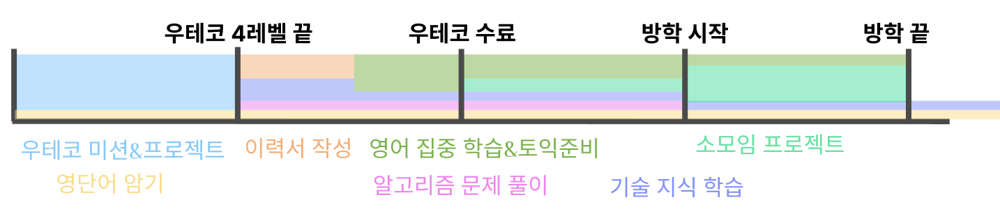

## 2023.10.29(일)

### 앞으로의 계획 세우기
드디어 우테코 레벨4가 끝났다.
급했던 일들을 모두 마무리했더니 앞으로 무엇을 해야할지 감이 잡히지 않고 붕 뜬 느낌이었다.
그래서 예전에 만들었던 타임라인을 다시 보면서 앞으로의 계획을 되새기려고 한다.

이걸 만들었을 당시의 나는 지금같은 시기에 이력서 작성과 기술지식 학습, 알고리즘 문제풀이, 영단어 암기에 시간을 투자하려고 계획했었던 것 같다.

확실히, 지금은 이력서와 자기소개서를 작성하며 지난 활동들을 정리하는 시간을 갖는 것이 좋을 것 같다. 그럼 내가 우테코를 제대로 마무리지었다는 기분도 들 것 같고.

조만간 이력서의 초안을 작성하고, 우형 양식에 맞춰 자기소개서를 작성해봐야겠다. 그 다음 인프런에서 구입했던 이력서 강의를 재차 수강하고 1차 수정을 거친 다음, 주변 크루들에게 피드백을 부탁해봐야겠다.

그 다음은 기술지식 학습인데, 이건 언제 한 번 나만의 학습 목표를 세우고 차례대로 복습을 해봐야겠다. 자바부터 스프링, DB, 인프라... 나는 아직 부족한 지식이 너무 많다.
자바와 스프링을 공부할 때는 다른 사람들의 지난 미션 PR을 살펴보면서 하려고 한다. 내가 미션 때 놓친 게 너무 많은 것 같다는 생각이 들었기 때문이다.
그리고 주제마다 책을 한 권씩 정해놓고 파보려고 한다. 이건 전에 미리 생각해두던 게 있는데, 자바는 `모던 자바인 액션`, 스프링은 영한님의 강의로 대신하고, DB는 `Real MySQL`, 인프라는 좀 더 고민해보려고 한다.(이걸 정리하면서 든 생각인데 `가상면접 사례로 배우는 대규모 시스템 설계 기초`도 괜찮을 것 같다.)

알고리즘 문제풀이는, 방금 지나가던 제이슨한테 여쭤봤는데 '알고리즘 문제를 하루에 한 개씩 풀고 30분동안 해결 방식이 떠오르지 않으면 답을 보라'고 하셨다.
이전에 우테코 크루 한 분이 알고리즘 스터디를 진행하면서 문제 세트를 여러 개 만들어두셨는데, 그 문제들을 하나씩 풀어보면서 진행하면 될 것 같다.
영어는 사실 스픽을 추가로 습관화하고 싶었는데, 지금까지는 일정상 말해보카만으로 벅차서 수행하지 못하고 있었다. 이제 좀 여유가 났으니 스픽을 시작해도 될 것 같다.

다만...이번주동안은 지금까지 밀린 기술부채를 해결하느라 바쁠 것 같아서, 기술 학습과 알고리즘 문제풀이는 다음 주부터 시작하려고 한다.

## 2023.10.30(월)

어제 생각했던 앞으로의 계획을 조금 더 보기 좋게 정리해봤다.
자격증이 추가됐다.
나 스스로에게 기술적 지식에 대한 기대가 낮아서, 한 번 확실하게 실력을 검증받을 수 있는 방식으로 학습을 해보려고 한다.

- 계획
    - 영어 - 매일 말해보카 & 스픽
    - 학습 - 밀린 기술부채 학습 및 블로그 포스팅
    - 취준 - 이력서/자기소개서 작성, 매일 한 문제씩 알고리즘 문제 풀기
    - 독서 - 매일 30분씩 비기술 서적 독서하기
- 고민 중인 것
    - sqld, aws 자격증
    - 토익 공부
    - 모던 자바인 액션

## 2023.11.02(월)

### 블로그 개편
이 날은 블로그 UI를 갈아엎는 데 대부분의 시간을 썼다. 목적에 따라 섹션을 나누니 확실히 방향성이 잡힌 느낌이다.

블로그 개선 작업은 항상 시간이 많이 들지만, 그만큼 성취감이 들어서 묘한 것 같다.

### 알고리즘 스터디 시작
친한 크루들이 알고리즘 스터디를 시작했다기에, 나도 거기에 참여하기로 했다.
처음은 쉬운 레벨의 문제부터 시작했다. 쉬운 난이도의 문제를 푸니 전보단 자신감이 붙는 것 같다. 물론 여전히 알고리즘 기법에 대해서는 잘 모르지만…

문제를 풀면서 알고리즘 개념 학습도 함께 꾸준히 해봐야겠다.

어째 점점 일일 과제가 늘어나는 느낌인데, 일단은 최대한 여유가 있을 때 모두 병행해보고, 나중에 다시 조정해봐야할 듯 싶다.