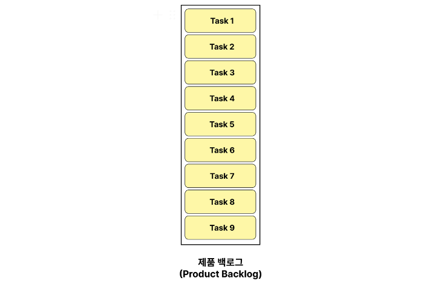
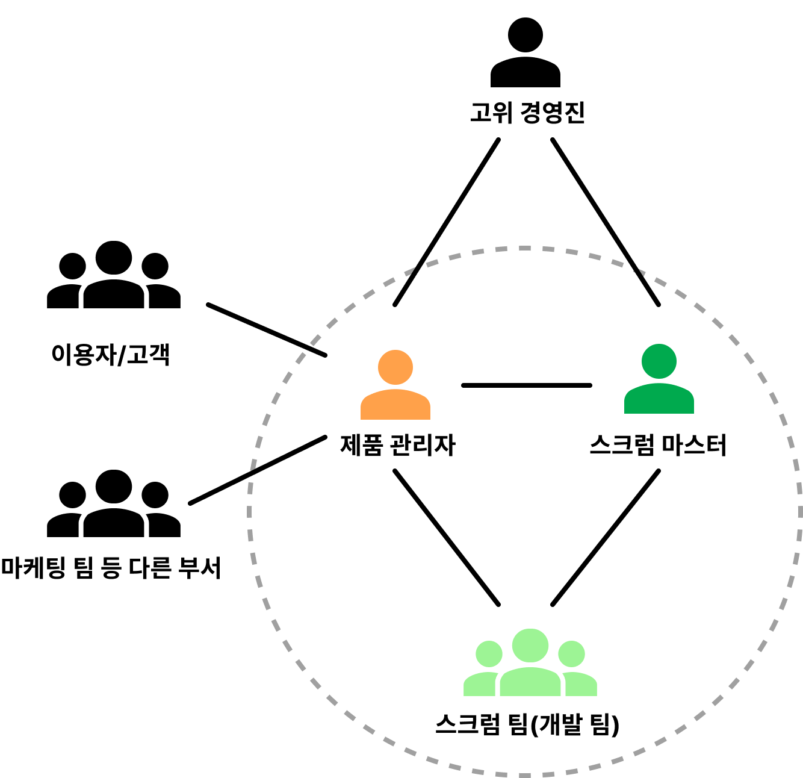
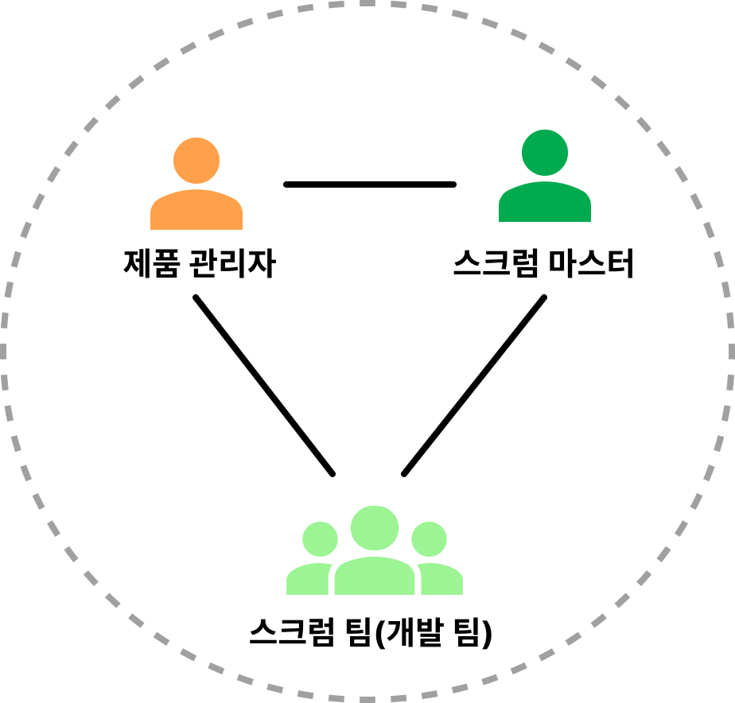
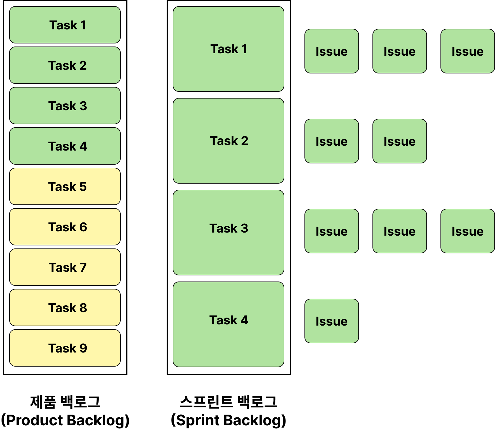
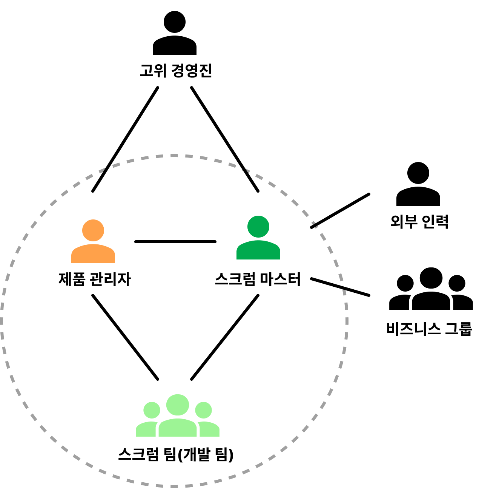
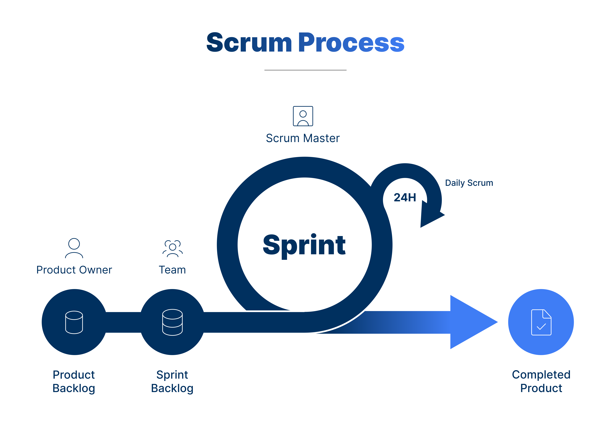

## 서론

---

다 읽고 보니 책의 출간일이 2006년이었다. 좀 오래된 책이지만, 내용은 나쁘지 않았다.

스크럼을 경험해본 적이 없는 사람이라면 책의 뒷 내용으로 갈 수록 저자가 소개하는 경험이 와닿지 않을 수 있을 것 같다.

이 책에서 소개하는 스크럼 활용 사례는 실제 회사에서 운영된 사례뿐이기 때문에, 나처럼 학생 신분이거나 단순 팀 프로젝트를 준비하는 입장이라면 스크럼의 기본적인 실천 방법이 담긴 1장~3장정도만 읽어도 충분할 것 같다.

## 스크럼이란?

---

> 스크럼(scrum)은 **프로젝트 관리를 위한 상호, 점진적 개발방법론**이며, 애자일 소프트웨어 개발 중의 하나이다. 스크럼(scrum)은 소프트웨어 개발 프로젝트를 위하여 고안되었지만, 소프트웨어 유지보수 팀이나 일반적인 프로젝트/프로그램 관리에서도 적용될 수 있다.
>
> - Wikipedia

복잡한 제품을 개발하기 위한 방법론 중 하나로, 비즈니스 요구를 충족시키는데 초점을 맞추기 위해 작은 목표를 짧은 주기로 점진적이며 경험적으로 제품을 지속적으로 개발(전달)하는 관리 기법을 의미한다.

스크럼의 핵심은 피드백을 좀 더 일찍, 좀 더 자주, 좀 더 많이, 좀 더 지속적으로 주고 받는 것에 있다.

스크럼의 구성 요소를 하나씩 설명하며 스크럼의 흐름을 따라가보겠다.

📜 **제품 백로그**

시스템이 해결해야 하는 문제 또는 시스템이 포함하고 있어야 하는 기능, 즉 프로젝트의 요구사항을 모두 나열한 목록.

제품 백로그는 프로젝트가 진행되는 과정에서 요구사항이 새로 생기거나 사라지고 변경될 수 있다.

보통 프로젝트 초기의 제품 백로그는 불완전해서 위시리스트와 별반 다를 게 없다.

제품을 개발하고 제품의 이용자, 즉 고객에 대한 이해가 깊어지면서 제품 백로그는 점점 발전해나간다.

👤 **제품 책임자**

제품 백로그를 관리하는 사람을 제품 책임자라고 한다.

제품 책임자의 주요 역할은 다음의 2가지이다.

- 제품 백로그의 우선순위를 관리한다.
  제품의 모든 요구사항은 **우선순위**에 따라 나열되는데, 이 우선순위를 부여하고 조정한다.
  프로젝트에 관여하는 모든 사람(개발 외 다른 부서의 사람들까지)들이 제품 백로그에 요구사항을 제안할 수 있지만, 오직 제품 책임자만이 제품 백로그의 요구사항들에 우선순위를 부여할 수 있다.
- 백로그의 요구사항을 개발하는 데 얼마나 걸릴지 추정한다.(일정 추정)
  이 추정치는 ‘이 기능을 이 시간 내에 반드시 개발해내야 한다’는 의미가 아니고, 스프린트를 경험적으로 구성하고 관리해나가기 위한 요소 중 하나일 뿐이다.
  이 추정치 역시 프로젝트 과정에서 요구사항에 대한 이해가 높아짐에 따라 점차 정확한 데이터가 된다.

📅 **스프린트**

스크럼에서 업무를 수행하는 최소 단위의 사이클이다.

대체로 1~2달로 잡는다.

<aside>

💡 하지만 이건 책에서 기업 내에서 진행되는 큰 규모 프로젝트를 상정해서 정한 기준이고, 대학생 팀 프로젝트 정도의 소규모 프로젝트에서는 1~2주 정도로 잡는 게 적절할 것 같다.

</aside>

매 스프린트 끝에는 새로운 기능이 추가되어 실행 가능한 제품을 완성해야 한다. 프로젝트의 아키텍처와 설계는 첫 스프린트에서 완성되지 않고, 여러 스프린트를 거쳐 서서히 완성된다.

👥 **스크럼 팀**

실제로 제품 개발을 수행하는 팀이다.

실제 기업에서는 한 개의 프로젝트를 개발하는 스크럼 팀을 여러 개로 나누어 운영할 수 있다고 한다. 이 경우 모든 스크럼 팀은 동일한 제품 백로그를 공유하며, 스크럼 팀마다 정해진 제품 증분을 개발하는 식으로 진행된다.

- 스크럼 팀은 자체적으로 스프린트 백로그를 관리한다.
- 스프린트 동안 스크럼 팀은 팀 외부로부터 어떤 방해도 받아서는 안된다.
- 팀의 크기
  7명이 이상적이라고 한다. 인원이 너무 적으면 상호작용을 통해 얻을 수 있는 양이 제한되고 생산성도 그다지 향상되지 않을 수 있다.
  반면 팀이 너무 크면 데일리 스크럼을 이끄는 것이 힘들어지고, 일이 너무 복잡해져 경험적인 프로세스를 사용하기 적합하지 않다.

📜 **스프린트 백로그**

각각의 스프린트 목표에 도달하기 위해 필요한 작업 목록을 의미한다.

👤 **스크럼 마스터**

스크럼 팀의 팀원들이 원활한 개발을 할 수 있도록 돕는 관리자이다.

스크럼 마스터의 역할은 다음과 같다.

- 스프린트 백로그를 만들고 스프린트를 계획/진행한다.
- 스프린트 기간 동안 모든 데일리 스크럼을 주관한다.
- 팀의 업무 장애 요소를 즉시 제거하고 결정이 신속하게 내려지도록 해야 한다.
- 제품 책임자와 함께 프로젝트의 진척도를 측정하고, 중요도가 낮은 백로그를 제거한다.

<aside>

💡 스크럼 마스터는 주로 팀의 리더 혹은 프로젝트 관리자(PM)가 역할을 수행한다.

</aside>

🌞 **데일리 스크럼**

스크럼 팀의 진척도를 파악하기 위해 **매일** 가지는 15분 정도의 짤막한 현황 회의.

이 회의에서 스크럼 마스터는 진행 상황을 검토하고, 제거해야 하는 장애물을 확인한다.

- 회의 내용은 크게 3가지를 공유하는 것으로 이루어진다.
  1. 지난 데일리 스크럼 이후로 무엇이 달성되었는지
  2. 다음 데일리 스크럼까지 무엇을 할 예정인지
  3. 업무에 방해가 되는 요인이 무엇이 있는지
- 데일리 스크럼은 항상 **일정한 시간과 장소**를 두고 진행하는 것이 좋다.
- 데일리 스크럼을 통해 현황을 공유한 뒤에 함께 회의해야 할 안건이 생겼다면, 데일리 스크럼을 종료한 후 **후속 회의**로 진행하는 것이 좋다.

 

💬 **스프린트 계획 회의**

스프린트를 시작하기 전, 스크럼 팀의 스프린트 목표와 스프린트 백로그를 계획하는 회의이다.

제품 책임자가 우선순위가 높은 제품 백로그 요구사항들을 공지하는 것으로 시작한다.

그리고 다음 스프린트의 목표를 선정한다. 스프린트 목표는 선정된 제품 백로그의 구현을 통해 달성되는 목표로, 제품 백로그를 바탕으로 결정된다.

그 다음, 스프린트 목표를 달성하기 위해 필요한 업무 목록(=스프린트 백로그)을 작성한다.

 

💬 **스프린트 회고 회의**

스프린트가 끝난 시점에 스프린트 기간동안 개발한 제품 증분에 대해 검토하는 회의이다.

회고를 통해 스프린트 기간동안 좋았던 점, 개선할 점을 도출한다. 여기서 [다양한 회고 기법](https://www.atlassian.com/blog/jira-software/5-fun-sprint-retrospective-ideas-templates)을 적용해볼 수 있다.

제품 관리자는 스프린트 회고 회의를 통해 팀의 성과를 파악하고 제품 백로그를 재정리한다.

제품 백로그가 안정되면 스크럼 팀은 제품 백로그에서 다음 스프린트에서 개발할 요구사항을 고른다.

이후 앞의 과정을 반복한다.

## 왜 스크럼은 왜 강력한 개발 프로세스인 것일까?

산업 현장의 공정 프로세스를 제어하는 모델을 공정 제어 모델이라고 하는데, 크게 명시적 공정 제어 모델과 경험주의적 공정 제어 모델 두 가지 접근법으로 분류할 수 있다.

**명시적 공정 제어 모델**에 따르면, 작업자들이 작업의 모든 부분을 완전히 이해하고 있어야 하고, 사전에 잘 정의된 일련의 입력이 주어지면 매번 동일한 결과물이 산출된다.

명시적인 프로세스는 제조업 현장과 같이 완료 시점마다 매번 동일한 결과물을 낼 수 있는 업무에 적합하다.

**경험주의적 공정 제어 모델**은 불완전하게 정의되어 예상 못한 결과를 만들어내는 프로세스를 빈번하게 검사하고 적응하는 방식을 통해 프로젝트를 제어하는 방법론이다. 빈번하고 직접적인 테스트, 즉각적인 수정을 요하는 업무에 적합하다.

시스템 개발은 매우 복잡하고, 예측하기 힘든 변수가 많기 때문에 빈번한 피드백을 통해 점진적으로 개선해나갈 수 있는 경험주의적 공정 제어 모델이 적합하다.

스크럼은 경험주의적인 공정 제어 모델을 바탕으로 하고 있기 때문에, 이 책의 저자는 스크럼이 매우 강력한 개발 프로세스라고 주장한다.

경험주의적이라는 특성 상 스크럼은 팀에서 발생하는 각종 변수에 유연하게 대처하고 문제를 즉각적으로 개선할 수 있는 기회를 제공한다. 데일리 스크럼을 매일매일 진행하는 것도 여기에 목적을 두고 있다.

나도 여기에 동의하는 게, 실제로 프로젝트를 운영하면 정말 많은 변수를 맞닥뜨리게 된다. 새로 도입하게 된 기술이 학습 곡선이 너무 느려서 정해진 기간을 맞추기 어려워졌다든지, 팀원의 개인 사정으로 인해 인력이 부족해진다든지, 오픈소스 API를 사용할 수 없게 되었다든지.

이런 문제를 즉각적으로 파악하고 대처할 수 있는 프로세스가 마련되어 있다면 확실히 팀의 능률과 진척도는 올라갈 것이다.

그런 의미에서 스크럼의 모든 원칙들을 철저하게 지키지 않더라도, 부분적으로나마 스크럼의 요소를 팀에 도입하는 것은 충분히 의미가 있는 시도일 것 같다.

## 참고 자료

---

[[Agile] Scrum(스크럼) 이해하기](https://medium.com/dtevangelist/scrum-dfc6523a3604)
