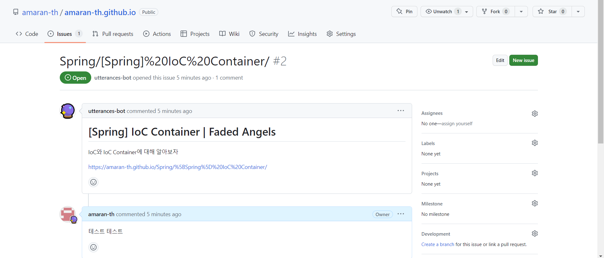

## 서론

---

### Utterance란?

: Github App으로, Github의 Issue Search API를 이용해서 페이지의 url, pathname, title에 관련된 issue 생성하고 로드해준다.

이를 이용해 블로그의 댓글 기능을 만들 수 있다.

## Utterances적용하기

---

### utterances 앱 설정하기

다음 링크에 접속해서 utterances 앱을 설치해준다.

[https://github.com/apps/utterances](https://github.com/apps/utterances)


나의 경우 앱이 이미 설치되어 있기 때문에 Install 대신 Configure라고 뜬다.


### Utterance 설정 스크립트 얻기

앱 설정을 마치고 [https://utteranc.es/](https://utteranc.es/)로 이동하면(처음 앱 설치 시 자동으로 넘어간다) 다음과 같은 설정 페이지가 뜨는데,


Repository에 이슈가 올라갈, 즉 댓글을 저장할 Github 레파지토리(나는 블로그 레파지토리를 사용했다)의 이름을 입력해주고, Blog Post↔Issue Mapping 항목은 매핑할 기준을 정하는 단계인데 나는 pathname(포스팅 경로)로 설정했다. 웬만해선 변경될 일이 없고 고유하기 때문이다.


Theme는 본인 취향껏 선택해주면 된다.

다 작성하고 나면 `<script>` 태그가 완성되는데, 보통의 웹 프로그램이라면 해당 코드를 그대로 html 코드에 붙여 넣으면 되지만 Gatsby 블로그의 경우 React를 기반으로 하기 때문에 약간의 가공이 필요하다. 이는 다음 단계에서 자세히 서술한다.

### 실제 코드에 추가하기

- 레포 최상위 루트에 `utterances.json` 추가

```jsx
{
  "origins": ["https://amaran-th.github.io"]
}
```

- Utterances 컴포넌트 만들기

앞서 복사했던 스크립트 설정을 기반으로 컴포넌트를 만들어준다.

```jsx
<script
  src="[https://utteranc.es/client.js](https://utteranc.es/client.js)"
  repo="amaran-th/amaran-th.github.io"
  issue-term="pathname"
  theme="preferred-color-scheme"
  crossorigin="anonymous"
  async
></script>
```

```jsx
import React from "react"

class Utterances extends React.Component {
  constructor(props) {
    super(props)

    this.commentsEl = React.createRef()
    this.state = { status: "pending" }
  }

  componentDidMount() {
    const scriptEl = document.createElement("script")
    scriptEl.onload = () => this.setState({ status: "success" })
    scriptEl.onerror = () => this.setState({ status: "failed" })
    scriptEl.async = true
    scriptEl.src = "https://utteranc.es/client.js"
    scriptEl.setAttribute("repo", "amaran-th/amaran-th.github.io")
    scriptEl.setAttribute("issue-term", "pathname")
    scriptEl.setAttribute("theme", "preferred-color-scheme")
    scriptEl.setAttribute("crossorigin", "anonymous")
    this.commentsEl.current.appendChild(scriptEl)
  }

  render() {
    const { status } = this.state

    return (
      <div className="comments-wrapper">
        {status === "failed" && <div>Error. Please try again.</div>}
        {status === "pending" && <div>Loading script...</div>}
        <div ref={this.commentsEl} />
      </div>
    )
  }
}

export default Utterances
```

```jsx
import Utterances from "..."

...
<Utterances />
```

다음과 같이 댓글 입력 창이 추가된 모습을 확인할 수 있다.


여기서 댓글을 입력하면



이렇게 Blog 레포에 해당 페이지에 대한 이슈가 생성되고 거기에 코멘트가 추가된다.

(아쉽게 대댓글 기능은 없는 모양이다.)

## 참고 자료

---

[[Github 블로그] utterances 으로 댓글 기능 만들기 (+ disqus 비추후기)](https://ansohxxn.github.io/blog/utterances/)

[react 환경에서 utterances를 사용해 댓글 기능 제작하기 | chanstory](https://www.chanstory.dev/blog/post/20)

[Jekyll blog에 Utterances 적용하기 - 동식이 블로그](https://dongsik93.github.io/til/2019/11/20/til-etc-utterances/)
