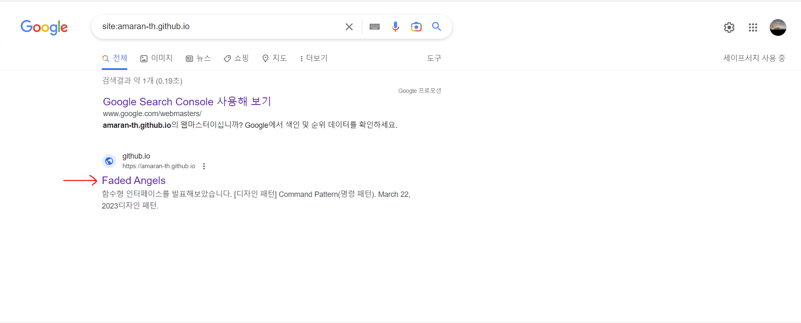

## 플러그인 설치

---

내가 만든 gatsby 블로그를 검색엔진에서 검색될 수 있도록 작업하였다.

우선 다음 패키지들을 설치해준다.

```
gatsby-plugin-sitemap
gatsby-plugin-robots-txt
gatsby-plugin-canonical-urls
```

- `gatsby-plugin-sitemap` : sitemap 작성을 도와주는 플러그인
    <aside>
    💡 sitemap이란?
    사이트의 설계도 및 지도 역할을 하는 파일로, 구글에 사이트가 검색되게 하기 위해서는 sitemap.xml 파일을 작성해서 내 사이트에 대해 알리고 구글 엔진이 크롤링하여 색인 등록이 되어야 한다.
    
    </aside>
    
    설치 후 gatsby-config.js 파일에 플러그인을 추가한다.
    
    ```jsx
    module.exports = {
      ...
      plugins:[
        ...
        'gatsby-plugin-sitemap',
      ]
    }
    ```

- `gatsby-plugin-robots-txt` : build 폴더에 자동으로 robots.txt를 만들어주는 플러그인이다.
    <aside>
    💡 robots.txt란?
    크롤러가 어디까지 크롤링을 하게 할지 크롤링 봇에게 전달할 정보를 작성하는 파일
    
    </aside>
    
    설치 후 gatsby-config.js 파일에 옵션과 함께 플러그인을 추가한다.
    
    ```jsx
    module.exports = {
      ...
      plugins: [
        ...
        {
          resolve: 'gatsby-plugin-robots-txt',
          options: {
            host: 'your blog url',
            sitemap: 'your blog url/sitemap.xml',
            policy: [{userAgent: '*', allow: '/}]
          }
        }
      ]
    }
    ```

- `gatsby-plugin-canonical-urls` : siteUrl을 설정해주기 위해 필요하다.
  ⭐여기까지 작업했다면 `블로그 url/sitemap-0.xml`로 접속했을 때 sitemap이 생성될 것이다.
  

## 구글 검색 등록(Google Search Console)

[Google Search Console](https://search.google.com/search-console/welcome?utm_source=about-page)

위 링크에 접속해서 `URL 접두어` 항목을 선택하고 블로그의 URL을 입력한다.


그럼 아래와 같은 화면이 뜰텐데, 여기서 다른 확인 방법>HTML 태그를 선택하면 나오는 `meta tag`를 복사해둔다.


`<meta name="google-site-verification" content="*고유 코드*" />`

의 형식일 것이다.

이 메타 태그를 Seo 컴포넌트의 메타 태그들이 있는 곳에 붙여넣어준다.

**src/components/seo.js**

```jsx
...
return (
    <>
      <title>{defaultTitle ? `${title} | ${defaultTitle}` : title}</title>
      <meta name="description" content={metaDescription} />
      <meta property="og:title" content={title} />
      ...
      <meta
        name="google-site-verification"
        content="고유 코드"
      />
...

```

<aside>
⚠️ 만약 사용하고 있는 템플릿에서 head 설정을 컴포넌트화 시킨 리액트 컴포넌트(Seo같은)가 구현되어있지 않다면 react-helmet 플러그인에 대해 알아보길 바란다.

</aside>

이 상태로 빌드한 뒤 확인 버튼을 클릭하면 소유권이 확인된다.


이후 앞서 확인했던 본인의 사이트맵을 추가해준다.


URL 검사를 해서 본인의 블로그 url이 등록되었는지 확인한다.


### 결과

구글 검색 창에 `site:블로그 URL`을 검색했을 때 다음과 같이 자신의 블로그가 노출된다면 성공이다.



## 참고 게시글

[https://brouk-devlog.netlify.app/react/Gatsby Blog 구글 검색 등록하기(1)/](<https://brouk-devlog.netlify.app/react/Gatsby%20Blog%20%EA%B5%AC%EA%B8%80%20%EA%B2%80%EC%83%89%20%EB%93%B1%EB%A1%9D%ED%95%98%EA%B8%B0(1)/>)

[Gatsby 블로그에 검색엔진 최적화(SEO) 하기 - 1](https://delivan.dev/web/gatsby-blog-seo-1/)

[[Gatsby] 블로그에서 대표 URL(Canonical URL) 설정하기](https://2vup.com/gatsby-canonical-url/)
