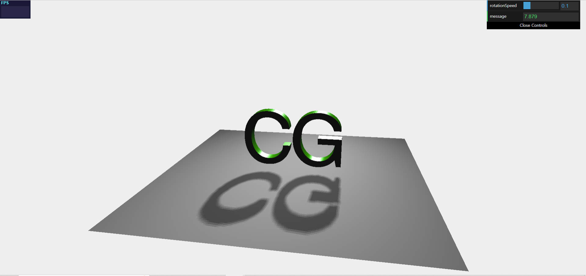

### Adding Light and Shadows

WebGL에서는 shader에서 모두 직접 구현했어야 했다.

⇒Three.js에서는 게임엔진처럼 기본적인 기능을 제공해주고 있다.

1. Scene 생성

   ```jsx
   scene = new THREE.Scene()
   ```

2. Renderer 생성

   ```jsx
   renderer = new THREE.WebGLRenderer()
   renderer.setClearColor(new THREE.Color(0xeeeeee, 1.0))
   renderer.setSize(window.innerWidth, window.innerHeight)
   renderer.shadowMapEnabled = true //그림자 설정
   ```

3. Light 생성

- Ambient Light를 생성하고 scene에 추가한다.

  - AmbientLight는 그림자를 그릴 수 없다.(사방에서 빛이 들어오는 경우이므로)

- Spot Light를 **백색광**으로 생성하고, **위치**를 설정하고(target을 설정하지 않으면 기본적으로 (0,0,0)을 향한다. **그림자**를 설정하고 **scene에 추가**한다.

  - 그림자를 생성할 수 있는 light는 대표적으로 spot light와 directional light가 있다.

  ```jsx
  // add subtle ambient lighting
  var ambientLight = new THREE.AmbientLight(0x0f0f0f)
  scene.add(ambientLight)

  // add spotlight for the shadows
  var spotLight = new THREE.SpotLight(0xffffff)
  spotLight.position.set(50, 50, 50)
  spotLight.castShadow = true //그림자 설정
  scene.add(spotLight)
  ```

4. Object 생성

   바닥이 될 plane 객체 생성 및 그림자/위치 설정 후 scene에 추가

   ```jsx
   // create the ground plane
   var planeGeometry = new THREE.PlaneGeometry(50, 50, 50, 50)
   var planeMaterial = new THREE.MeshLambertMaterial({ color: 0xffffff })
   var plane = new THREE.Mesh(planeGeometry, planeMaterial)
   plane.receiveShadow = true //그림자 설정

   // rotate and position the plane
   plane.rotation.x = -0.5 * Math.PI
   plane.position.x = 0
   plane.position.y = -7
   plane.position.z = 0
   scene.add(plane)
   ```

   대상인 CG 텍스트 오브젝트를 생성하고 그림자 설정을 해준 뒤 scene에 추가한다.

   ```jsx
   var textGeometry = new THREE.TextGeometry("CG", {
     font: "helvetiker",
     size: 10,
     height: 2,
   })
   textGeometry.center()
   var meshMaterial = new THREE.MeshPhongMaterial({
     specular: 0xffffff,
     color: 0x0eff0e,
     shininess: 30,
     metal: true,
   })
   var text = new THREE.Mesh(textGeometry, meshMaterial)
   text.castShadow = true
   scene.add(text)
   ```

   ⭐요약하면, 그림자를 렌더링하기 위해서는 광원, 그림자가 생길 평면, 그림자를 만들 대상 총 세가지 요소에 그림자 설정을 해주어야 한다.

   - `renderer.shadowMapEnabled=true;`
   - `plane.receiveShadow=true;`
   - `cube.castShadow=true;`

5. Renderer의 Output을 html 요소에 추가

   이로써 렌더링한 결과물을 웹 페이지 상에 띄울 수 있다.

   ```jsx
   // add the output of the renderer to the html element
   document.getElementById("WebGL-output").appendChild(renderer.domElement)
   ```

6. Camera 생성

   카메라 객체를 생성하고 위치 및 방향을 설정해준다.

   ```jsx
   camera = new THREE.PerspectiveCamera(
     45,
     window.innerWidth / window.innerHeight,
     0.1,
     1000
   )
   camera.position.x = 10
   camera.position.y = 20
   camera.position.z = 60
   camera.lookAt(scene.position)
   ```

### Expanding the scene with animations

- requestAnimationFrame()을 사용하여 render() 함수에 정의한 코드를 매 프레임마다 실행하도록 한다.

```jsx
function init(){
	...
	var radian = 45
	render()
  function render() {
	  radian += controls.rotationSpeed
    spotLight.position.x = 50 * Math.sqrt(2) * Math.cos(radian)
    spotLight.position.z = 50 * Math.sqrt(2) * Math.sin(radian)

    requestAnimationFrame(render)
    renderer.render(scene, camera)
  }
}
window.onload=init
```

### Adding statistics

광원의 회전 속도를 사용자가 제어할 수 있도록 하는 UI 창을 추가해보자.

- &lt;script&gt; 태그를 사용하여 html 파일에 stats.js와 dat.gui.js 스크립트를 포함시킨다.

  ```html
  <head>
    <title>Assignment02</title>
    <script type="text/javascript" src="../libs/three.js"></script>

    <script type="text/javascript" src="../libs/stats.js"></script>
    <script type="text/javascript" src="../libs/dat.gui.js"></script>
    ...
  </head>
  ```

- init() 함수 내에 통계 데이터를 초기화하는 initStats() 함수를 추가한다.

  ```jsx
  function init(){
  	var stats = initStats()
  	...
  	function initStats() {
  		//init
  		var stats = new Stats()
  		stats.setMode(0) // 0: fps, 1: ms

  		// Align top-left
  		stats.domElement.style.position = 'absolute'
  		stats.domElement.style.left = '0px'
  		stats.domElement.style.top = '0px'

  		document.getElementById('Stats-output').appendChild(stats.domElement)
  		return stats
  	}
  ```

- controls 함수에 제어하고자 하는 값의 초기 값을 셋팅
  ```jsx
  var controls = new (function () {
    this.rotationSpeed = 0.1
    this.message = "0"
  })()
  ```
- gui 함수에 gui로 설정하고자 하는 변수 값을 추가

  ```jsx
  var gui = new dat.GUI()
  gui.add(controls, "rotationSpeed", 0, 0.5)
  gui.add(controls, "message", "test").listen()
  ```

  ```jsx
  var radian = 45
  render(1)
  function render(time) {
    time *= 0.001
    var timelap = time - parseFloat(controls.message)
    if (timelap > 0.03) {
      controls.message = time.toFixed(3)
    }
    radian += controls.rotationSpeed
    spotLight.position.x = 50 * Math.sqrt(2) * Math.cos(radian)
    spotLight.position.z = 50 * Math.sqrt(2) * Math.sin(radian)

    requestAnimationFrame(render)
    renderer.render(scene, camera)
  }
  ```

  

### 전체 코드

```jsx
<!DOCTYPE html>

<html>
  <head>
    <title>Assignment02</title>
    <script type="text/javascript" src="../libs/three.js"></script>

    <script type="text/javascript" src="../libs/stats.js"></script>
    <script type="text/javascript" src="../libs/dat.gui.js"></script>
    <script
      type="text/javascript"
      src="../assets/fonts/helvetiker_regular.typeface.js"
    ></script>
    <script
      type="text/javascript"
      src="../assets/fonts/helvetiker_bold.typeface.js"
    ></script>

    <style>
      body {
        /* set margin to 0 and overflow to hidden, to go fullscreen */
        margin: 0;
        overflow: hidden;
      }
    </style>
  </head>
  <body>
    <div id="Stats-output"></div>
    <!-- Div which will hold the Output -->
    <div id="WebGL-output"></div>

    <!-- Javascript code that runs our Three.js examples -->
    <script type="text/javascript">
      var camera
      var scene
      var renderer
      // once everything is loaded, we run our Three.js stuff.
      function init() {
        var stats = initStats()

        // create a scene, that will hold all our elements such as objects, cameras and lights.
        scene = new THREE.Scene()

        // create a camera, which defines where we're looking at.
        camera = new THREE.PerspectiveCamera(
          45,
          window.innerWidth / window.innerHeight,
          0.1,
          1000
        )

        // create a render and set the size
        renderer = new THREE.WebGLRenderer()
        renderer.setClearColor(new THREE.Color(0xeeeeee, 1.0))
        renderer.setSize(window.innerWidth, window.innerHeight)
        renderer.shadowMapEnabled = true

        // add subtle ambient lighting
        var ambientLight = new THREE.AmbientLight(0x0f0f0f)
        scene.add(ambientLight)

        // add spotlight for the shadows
        var spotLight = new THREE.SpotLight(0xffffff)
        spotLight.position.set(50, 50, 50)
        spotLight.castShadow = true
        scene.add(spotLight)

        // create the ground plane
        var planeGeometry = new THREE.PlaneGeometry(50, 50, 50, 50)
        var planeMaterial = new THREE.MeshLambertMaterial({ color: 0xffffff })
        var plane = new THREE.Mesh(planeGeometry, planeMaterial)
        plane.receiveShadow = true

        // rotate and position the plane
        plane.rotation.x = -0.5 * Math.PI
        plane.position.x = 0
        plane.position.y = -7
        plane.position.z = 0
        scene.add(plane)

        // add the output of the renderer to the html element
        document.getElementById('WebGL-output').appendChild(renderer.domElement)

        // call the render function
        var step = 0

        var textGeometry = new THREE.TextGeometry('CG', {
          font: 'helvetiker',
          size: 10,
          height: 2,
        })
        textGeometry.center()
        var meshMaterial = new THREE.MeshPhongMaterial({
          specular: 0xffffff,
          color: 0x0eff0e,
          shininess: 30,
          metal: true,
        })
        var text = new THREE.Mesh(textGeometry, meshMaterial)
        text.castShadow = true
        scene.add(text)

        // position and point the camera to the center of the scene
        //씬 내에서 카메라의 위치
        camera.position.x = 10
        camera.position.y = 20
        camera.position.z = 60
        camera.lookAt(scene.position)
        var controls = new (function () {
          this.rotationSpeed = 0.1
          this.message = '0'
        })()
        var gui = new dat.GUI()
        gui.add(controls, 'rotationSpeed', 0, 0.5)
        gui.add(controls, 'message', 'test').listen()
        var radian = 45
        render(1)
        function render(time) {
          time *= 0.001
          var timelap = time - parseFloat(controls.message)
          if (timelap > 0.03) {
            controls.message = time.toFixed(3)
          }

          radian += controls.rotationSpeed
          spotLight.position.x = 50 * Math.sqrt(2) * Math.cos(radian)
          spotLight.position.z = 50 * Math.sqrt(2) * Math.sin(radian)

          requestAnimationFrame(render)
          renderer.render(scene, camera)
        }

        function initStats() {
          //init

          var stats = new Stats()
          stats.setMode(0) // 0: fps, 1: ms

          // Align top-left
          stats.domElement.style.position = 'absolute'
          stats.domElement.style.left = '0px'
          stats.domElement.style.top = '0px'

          document.getElementById('Stats-output').appendChild(stats.domElement)

          return stats
        }
      }
      function onResize() {
        camera.aspect = window.innerWidth / window.innerHeight
        camera.updateProjectionMatrix()
        renderer.setSize(window.innerWidth, window.innerHeight)
      }
      window.onload = init
      // listen to the resize events
      window.addEventListener('resize', onResize, false)
    </script>
  </body>
</html>
```
