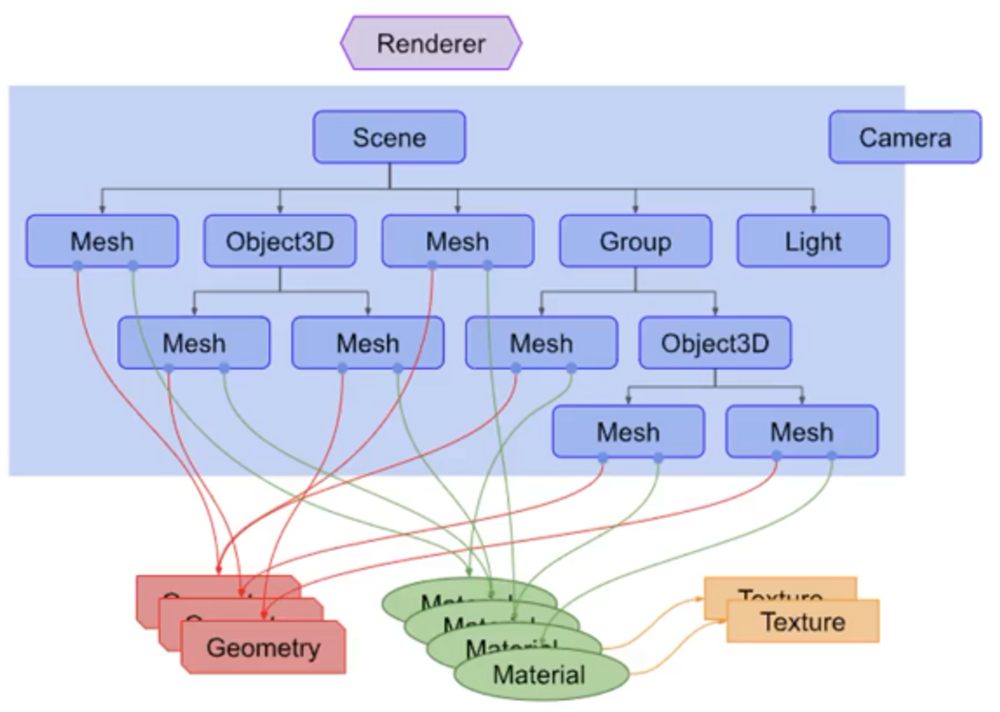
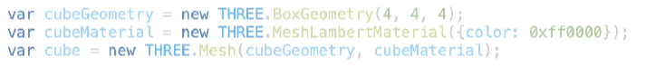
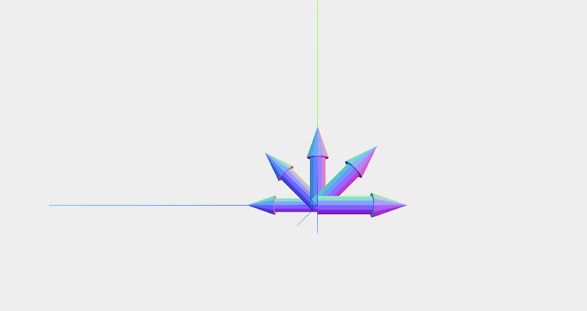

### Renderer, Scene, Camera

- Renderer
  - three.js의 주요 오브젝트
  - Scene과Camera를 Renderer로 넘기고 이것은 카메라의 frustum 내부에 포함되는3d scene의 일부분을 캔버스에 렌더링한다.



- Scene
  - 렌더링할 모든 오브젝트를 저장하고 보존하는 데 사용되는 컨테이너
- Scene Graph
  - Scene에 존재하는 오브젝트를 계층구조로 표현한 그래프.
- Camera

  - 다른 오브젝트와 달리 Scene graph에 포함되어있지 않아도 된다.
  - 다른 오브젝트의 자식으로서 존재할 수도 있다.
  - 카메라는 여러 개가 있을 수 있다.

- Others
  - Mesh : 특정 Material와 Geometry로 생성한 오브젝트
  - Geometry : vertex 정보를 가지고 있다.
  - Material : 물체 표면이 어떻게 표현될 지에 대한 정보(texture 포함)를 가지고 있으며 geometry를 그리는 데 사용된다.
    
    - BoxGeometry→vertex 정보를 가지고 있는 cube 생성
    - MeshLambertMaterial→물체 표면 속성을 설정
    - Mesh→Geometry, Material 객체를 기반으로 mesh 오브젝트 생성

### Adding Scene, Camera, Renderer

WebGL에서는 shader에서 모두 직접 구현했어야 했다.

⇒Three.js에서는 게임엔진처럼 기본적인 기능을 제공해주고 있다.

1. Scene 생성

   ```jsx
   scene = new THREE.Scene()
   ```

2. Camera 생성

   ```jsx
   var camera = new THREE.PerspectiveCamera(
     75,
     window.innerWidth / window.innerHeight,
     0.1,
     1000
   )
   // position and point the camera to the center of the scene
   camera.position.x = 20
   camera.position.y = 0
   camera.position.z = 0
   camera.lookAt(scene.position)
   ```

3. Renderer 생성

   ```jsx
   renderer = new THREE.WebGLRenderer()
   renderer.setClearColorHex()
   renderer.setClearColor(new THREE.Color(0xeeeeee))
   renderer.setSize(window.innerWidth, window.innerHeight)
   ```

4. Axes, Object 생성

   축을 생성하고 원통과 원뿔형 객체를 obj1이라는 오브젝트에 추가하여 화살표 모양의 오브젝트를 생성한다.

   ```jsx
   // show axes in the screen, X: red, Y: green, Z: blue
   var axes = new THREE.AxisHelper(20)
   scene.add(axes)

   // create an object
   var axes2 = new THREE.AxisHelper(5)
   var cylinderGeometry = new THREE.CylinderGeometry(0.5, 0.5, 3, 12)
   var cylinderMaterial = new THREE.MeshNormalMaterial({
     wireframe: false,
   })
   var cylinder = new THREE.Mesh(cylinderGeometry, cylinderMaterial)
   const geometry = new THREE.CylinderGeometry(0, 0.7, 2, 12)
   const material = new THREE.MeshNormalMaterial({ wireframe: false })
   const cone = new THREE.Mesh(geometry, material)
   var axes2 = new THREE.AxisHelper(2)
   var obj1 = axes2.clone()
   cone.position.y = 2.5
   cylinder.add(cone)
   cylinder.position.y = 1.5
   obj1.add(cylinder)
   ```

5. Object 복제

   앞서 만든 화살표 모양의 객체를 복제한 4개의 객체를 생성한 뒤 위치를 설정해준다.

   ```jsx
   // make 4 clones of the object
   var obj2 = obj1.clone()
   var obj3 = obj1.clone()
   var obj4 = obj1.clone()
   var obj5 = obj1.clone()

   // and place them along x aixs
   obj1.position.x = 1
   obj2.position.x = 2
   obj3.position.x = 3
   obj4.position.x = 4
   obj5.position.x = 5
   ```

   복제한 각 객체가 가리키는 방향이 방사형으로 보이게 하기 위해 0~180도에 대해 선형 보간을 해준다.

   ```jsx
   function interpolateAngle(S, E, C, A1, A2) {
     // S: start value
     // E: end value
     // C: current value
     // A1: start angle
     // A2: end angle
     return (A1 * (5 - C) + A2 * (C - 1)) / 4
   }
   ```

   ```jsx
   var startAngle = Math.PI / 2
   var endAngle = -Math.PI / 2

   obj1.rotation.x = startAngle
   obj5.rotation.x = endAngle

   obj2.rotation.x = interpolateAngle(
     obj1.position.x,
     obj5.position.x,
     obj2.position.x,
     obj1.rotation.x,
     obj5.rotation.x
   )
   obj3.rotation.x = interpolateAngle(
     obj1.position.x,
     obj5.position.x,
     obj3.position.x,
     obj1.rotation.x,
     obj5.rotation.x
   )
   obj4.rotation.x = interpolateAngle(
     obj1.position.x,
     obj5.position.x,
     obj4.position.x,
     obj1.rotation.x,
     obj5.rotation.x
   )
   ```

   씬에 각 객체들을 추가한다.

   ```jsx
   scene.add(obj1)
   scene.add(obj2)
   scene.add(obj3)
   scene.add(obj4)
   scene.add(obj5)
   ```

6. Renderer의 Output을 html 요소에 추가

   이로써 렌더링한 결과물을 웹 페이지 상에 띄울 수 있다.

   ```jsx
   // add the output of the renderer to the html element
   document.getElementById("WebGL-output").appendChild(renderer.domElement)
   ```

7. 렌더링

   완성된 씬과 카메라를 렌더링한다.

   ```jsx
   // render the scene
   renderer.render(scene, camera)
   ```

   

### 전체 코드

```jsx
<!DOCTYPE html>

<html>
  <head>
    <title>assignment01</title>
    <script type="text/javascript" src="../libs/three.js"></script>
    <style>
      body {
        /* set margin to 0 and overflow to hidden, to
             use the complete page */
        margin: 0;
        overflow: hidden;
      }
    </style>
  </head>
  <body>
    <!-- Div which will hold the Output -->
    <div id="WebGL-output"></div>

    <!-- Javascript code that runs our Three.js examples -->
    <script type="text/javascript">
      // once everything is loaded, we run our Three.js stuff.
      function init() {
        // create a scene, that will hold all our elements such as objects, cameras and lights.
        var scene = new THREE.Scene()

        // create a camera, which defines where we're looking at.
        var camera = new THREE.PerspectiveCamera(
          75,
          window.innerWidth / window.innerHeight,
          0.1,
          1000
        )

        // create a render and set the size
        var renderer = new THREE.WebGLRenderer()
        renderer.setClearColorHex()
        renderer.setClearColor(new THREE.Color(0xeeeeee))
        renderer.setSize(window.innerWidth, window.innerHeight)

        // show axes in the screen, X: red, Y: green, Z: blue
        var axes = new THREE.AxisHelper(20)
        scene.add(axes)

        // create an object
        var axes2 = new THREE.AxisHelper(5)
        var cylinderGeometry = new THREE.CylinderGeometry(0.5, 0.5, 3, 12)
        var cylinderMaterial = new THREE.MeshNormalMaterial({
          wireframe: false,
        })
        var cylinder = new THREE.Mesh(cylinderGeometry, cylinderMaterial)
        const geometry = new THREE.CylinderGeometry(0, 0.7, 2, 12)
        const material = new THREE.MeshNormalMaterial({ wireframe: false })
        const cone = new THREE.Mesh(geometry, material)
        var axes2 = new THREE.AxisHelper(2)
        var obj1 = axes2.clone()
        cone.position.y = 2.5
        cylinder.add(cone)
        cylinder.position.y = 1.5
        obj1.add(cylinder)

        // make 4 clones of the object
        var obj2 = obj1.clone()
        var obj3 = obj1.clone()
        var obj4 = obj1.clone()
        var obj5 = obj1.clone()

        // and place them along x aixs
        obj1.position.x = 1
        obj2.position.x = 2
        obj3.position.x = 3
        obj4.position.x = 4
        obj5.position.x = 5

        var startAngle = Math.PI / 2
        var endAngle = -Math.PI / 2

        obj1.rotation.x = startAngle
        obj5.rotation.x = endAngle

        obj2.rotation.x = interpolateAngle(
          obj1.position.x,
          obj5.position.x,
          obj2.position.x,
          obj1.rotation.x,
          obj5.rotation.x
        )
        obj3.rotation.x = interpolateAngle(
          obj1.position.x,
          obj5.position.x,
          obj3.position.x,
          obj1.rotation.x,
          obj5.rotation.x
        )
        obj4.rotation.x = interpolateAngle(
          obj1.position.x,
          obj5.position.x,
          obj4.position.x,
          obj1.rotation.x,
          obj5.rotation.x
        )

        scene.add(obj1)
        scene.add(obj2)
        scene.add(obj3)
        scene.add(obj4)
        scene.add(obj5)

        // position and point the camera to the center of the scene
        camera.position.x = 20
        camera.position.y = 0
        camera.position.z = 0
        camera.lookAt(scene.position)

        // add the output of the renderer to the html element
        document.getElementById('WebGL-output').appendChild(renderer.domElement)

        // render the scene
        renderer.render(scene, camera)
      }
      function interpolateAngle(S, E, C, A1, A2) {
        // S: start value
        // E: end value
        // C: current value
        // A1: start angle
        // A2: end angle
        return (A1 * (5 - C) + A2 * (C - 1)) / 4
      }
      window.onload = init
    </script>
  </body>
</html>
```
